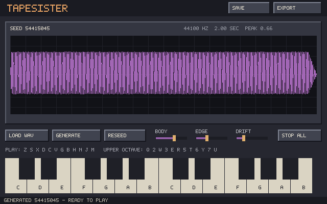

# TapeSister

TapeSister is a standalone single-sound forge. This branch begins with one visible, playable slice: generate or load a WAV, see the waveform, and audition it immediately.



## First playable slice

- deterministic built-in sound from a saved seed;
- mono PCM/float WAV loading, with multichannel files folded to mono;
- sample-centered fixed-pixel waveform display;
- two-octave computer-keyboard and onscreen-key audition;
- three deliberately broad controls: Body, Edge, and Drift;
- reliable Stop All;
- deterministic recipe save; and
- mono 16-bit WAV export.

The interface is new. FT2 and the archived prototype are reference shelves, not inherited architecture. TapeSister does not depend on or modify FT2 Tapehead Edition.

## Build on Linux

```bash
sudo apt install build-essential cmake libsdl2-dev
cmake -S . -B build -DCMAKE_BUILD_TYPE=Debug
cmake --build build -j2
ctest --test-dir build --output-on-failure
./build/tapesister
```

The small Makefile is also available:

```bash
make test
make
./tapesister
```

Pass a WAV path on the command line, drag a WAV onto the window, or click **Load WAV** and type its path.

## Play and save

- Lower octave: `Z S X D C V G B H N J M`
- Upper octave: `Q 2 W 3 E R 5 T 6 Y 7 U`
- Stop all: `Space` or `Escape`
- Load WAV path: `Ctrl+O`
- Save recipe to `tapesister-recipe.tsr`: `Ctrl+S`
- Export to `tapesister-export.wav`: `Ctrl+E`

The Save and Export buttons perform the same fixed-name operations for this first slice. Destination selection belongs to a later, separately reviewed interaction slice.
