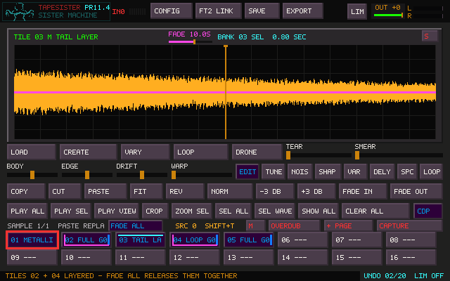
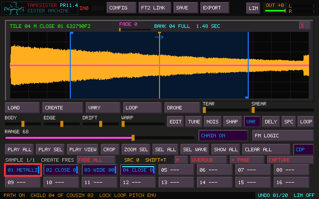
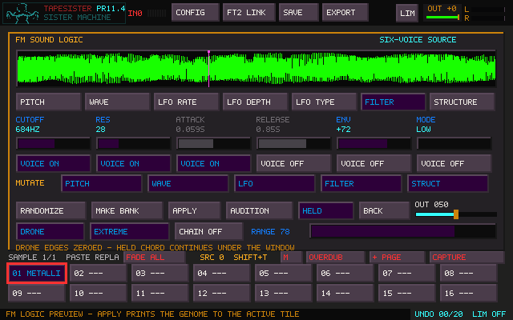
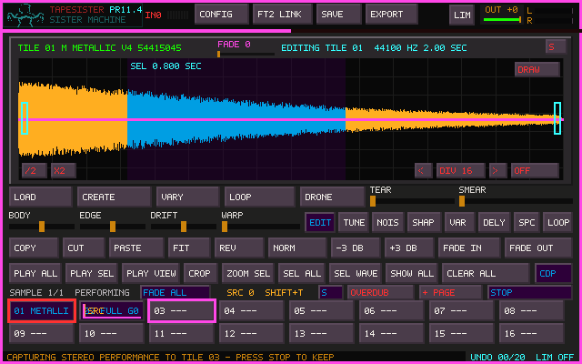
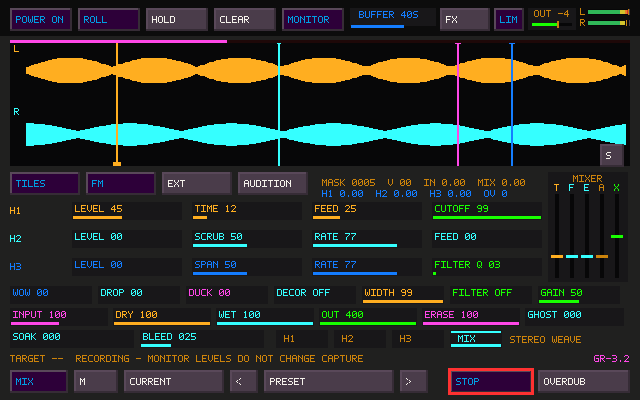
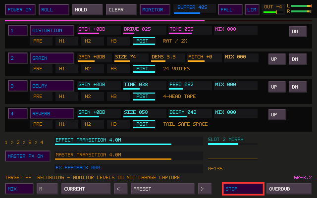
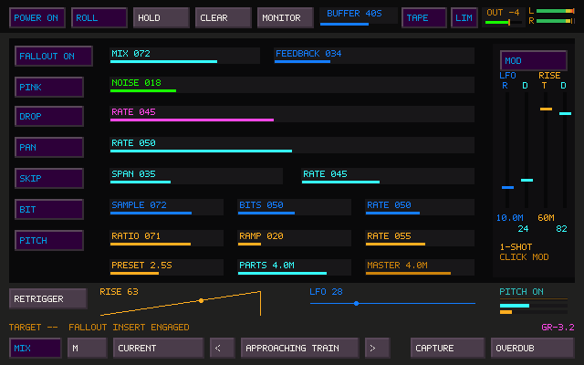
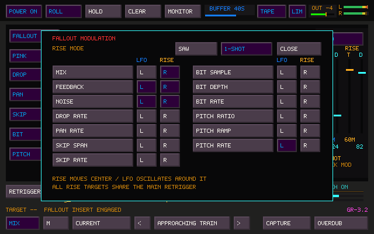
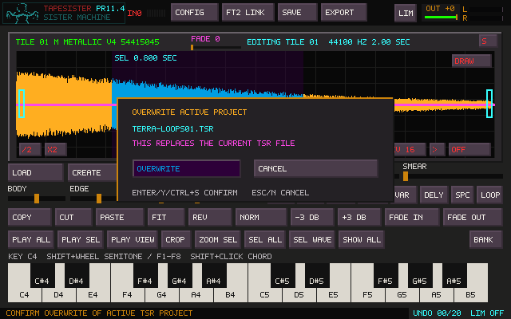

# TapeSister

TapeSister is a standalone sound-making, sample-sculpting, and performance instrument
for Windows and Linux. It combines independent sample tiles, generative six-voice FM,
waveform editing, native DSP and curated CDP8 processes, real-time recording, Sister
Machine's rolling tape memory, Fallout deterioration, and a four-slot effects pedalboard.

Its basic creative loop is simple:

> Create or load → sculpt → vary → perform → capture → repeat.



## Documentation

- [Complete User Manual](docs/USER_MANUAL.md) — workflows, every major instrument,
  recording, routing, saving, and performance techniques.
- [Quick Reference](docs/QUICK_REFERENCE.md) — keys, mouse gestures, control ranges,
  capture modes, signal placement, and file types.
- [Design Charter](DESIGN_CHARTER.md) — the principles behind the instrument.
- [Technical documentation](#technical-documentation) — architecture, exchange,
  packaging, and certification notes.

## What TapeSister contains

### Independent sample tiles

Every Sample page holds 16 complete sound objects. Each tile owns its audio, mono/stereo
shape, tuning, loop, selection, viewport, processing, protection state, and private
20-step Undo/Redo history. Add Sample pages as the collection grows.

Click an occupied tile to select and audition it. Click an empty tile to select a
destination. Double-click an empty tile to create editable silent tape.

### Create and Variation

CREATE renders a fresh deterministic six-voice FM sound. VARY answers the material that
actually exists now: after drawing, tape gestures, tuning, pasting, or other destructive
shaping, the audible waveform becomes the source of the next variation.

For a precisely timed sound:

1. Double-click an empty tile.
2. Select the desired duration in the silent canvas.
3. Press CREATE.
4. Explore VARY and its Range.
5. Press CROP when the sound is ready.

CHAIN can place successive relatives in empty tiles or advance variation stamps through
a selected timeline.



### FM Logic

FM Logic exposes the six-voice genome behind Create: pitch ratios and scales, ten
routing structures, waveform families, per-voice LFOs, filtering, interaction modes,
feedback, transient behavior, mutation permissions, Drone, and Extreme ranges.

The live preview can be played from QWERTY or MIDI before it is applied. MAKE BANK
creates a complete 16-sound family in one atomic operation.



### Waveform and transform tools

The editor includes selection-aware Copy, Cut, Paste, Fit, Crop, Reverse, Normalize,
gain, fades, canvas resizing, Draw, Drone Maker, loops, tuning, Warp, Smear, Tear,
Body, Edge, Drift, native DSP, and curated offline CDP8 processes.

Transforms render outside the audio callback and remain previews until accepted. Failed
or canceled work leaves the tile untouched.

### Performance and recording

Tiles, loops, QWERTY notes, MIDI notes, FM, and staged chords can be layered while
TapeSister records the final performance into a new tile. Shift-clicked source groups
fan notes across several tiles. Plain-clicked one-shots and loops form a separate live
performance layer.

The main and Sister Machine **M/S** buttons mirror one capture-format setting:

- **M** stores `0.5 × (L + R)` mono.
- **S** preserves stereo.



The separate REC BANK records either configured external input or the internal FM
performance bus with threshold, pre-roll, tail, and optional sequential Chain recording.
KEEP moves completed REC tiles into the Sample collection.

Every completed real-time take is also preserved as a timestamped 32-bit float WAV in
`Captures/`.

## Sister Machine

Sister Machine is a live 5–60 second rolling stereo tape memory with one moving write
head and three playback heads. It accepts selected tiles, FM, external input, and
audition/preview audio. Sources routed into Sister behave like hardware inserts: they
leave their direct path and return through Sister's DRY/WET monitor section.

Its controls include:

- Roll, Hold, Clear, and live buffer resizing;
- H1 anchored time/feedback;
- H2 and H3 movable reverse/forward-rate heads;
- Wow, Drop, Duck, decorrelation, width, and filtering;
- Input, Dry, Wet, internal Out, Erase, and Ghost Tone;
- Soak/Bleed stereo tape weave;
- source and effects-return mixers;
- isolated H1/H2/H3 or complete MIX capture;
- tile, Overdub, or long-form WAV/RF64 file destinations;
- parameter locks and named presets.

Closing the Sister window does not stop the machine. POWER is the explicit audio-engine
boundary.



## Four-slot FX pedalboard

The pedalboard holds four independent instances of Reverb, Delay, Distortion, Grain,
or Empty. Effects can be duplicated and reordered. Every slot chooses exactly one
placement:

- PRE — newly arriving material before the tape write;
- H1, H2, or H3 — one playback head and its recurrence;
- POST — after Sister MIX and Fallout.

Each slot has Mix and ±12 dB Gain. Reverb reaches approximately two-minute decay,
Delay spans about 8–2000 ms, and Grain ranges from isolated fragments to dense clouds.

Effect and Master transitions span 10 ms to 60 minutes. Live type, placement, and order
changes morph without stopping audio. FX Feedback returns the effect contribution into
the rolling write and reaches 135% for deliberately self-building structures.



## Fallout

Fallout is a stereo deterioration instrument between Sister's completed MIX and the
POST pedalboard location. Drop, Pan, Skip, Bit, Pitch, colored Noise, and Feedback can
be combined or modulated.

Its three independent transition clocks—Preset, Parts, and Master—each span 10 ms to
60 minutes. A shared sine LFO spans one cycle per hour through 10 Hz. Rise can repeat
as a saw or run once over 1 second to 4 hours. A target matrix assigns either modulator
to Mix, Feedback, Noise, and the event parameters of each deterioration process.

Those extremes are performance tools: effects can emerge across a movement, Fallout
can deteriorate an hour-long set almost imperceptibly, or a one-shot Rise can coordinate
Mix, Feedback, and Noise toward a formal climax.





## Master output and limiter

The linked-stereo limiter, final OUT fader, L/R meter, and gain-reduction readout remain
visible across the main and Sister windows. Final order is:

> TapeSister mix → limiter → OUT fader → meter and FILE OUT.

The limiter is a safety boundary for extreme synthesis and feedback. Gain should still
be managed at Sister INPUT/internal OUT, the source mixer, effect slots, and feedback
controls.

## Portable project folders

Saving `Terra Night.tsr` creates one movable `Terra Night/` folder containing:

```text
Terra Night/
├── Terra Night.tsr
├── manifest.txt
├── sister-state.ini
├── project-data/
└── samples/
```

The TSR and project data preserve complete editable state. `samples/` contains an
ordinary 16-bit PCM WAV for every occupied Sample and REC tile, with standard tuning
and loop metadata for extraction or interchange.

Move, share, or back up the complete named folder. The persistent `Captures/` archive
remains outside projects by design.



## MIDI and TapeHead status

Current MIDI support includes Note On/Off, velocity, channels 1–16 or Omni, All Notes
Off, a 64-voice sample pool, and the shared QWERTY/FM performance path. MIDI Learn and
MIDI CC mapping are planned but not currently implemented.

FT2 LINK provides atomic folder-based exchange with TapeHead. The direct live audio link
is planned separately.

## Build on Linux

Install dependencies once:

```bash
sudo apt install build-essential cmake git libsdl2-dev libasound2-dev
```

Build the application and bundled CDP8 runtime:

```bash
bash build.sh
./build-linux/tapesister
```

Plain `make` delegates to the same complete release build. Development checks remain:

```bash
make test
make stress-sister
make benchmark-sister
```

Use `--diagnostic-audio` for optional callback, device, buffer, and external-input
diagnostics.

## Build on Windows

From an MSYS2 **UCRT64** terminal with CMake, Ninja, SDL2, and the UCRT64 toolchain:

```bash
bash build.sh
```

The build stages `tapesister.exe`, SDL2, required MinGW runtime DLLs, assets, and the
pinned CDP8 programs together under `build-windows/`. Keep that portable directory
together when moving it. Set `TAPESISTER_BUILD_JOBS` to change the default two-job build.

Final one-click end-user release packaging remains a release task.

## Technical documentation

- [Realtime Capture](docs/CAPTURE_WORKFLOW.md)
- [FM Source Model](docs/FM_SOURCE_PLAN.md)
- [Native DSP Transform](docs/DSP_TRANSFORM.md)
- [Curated CDP Transform](docs/CDP_TRANSFORM.md)
- [Bundled CDP8 Runtime](docs/CDP8_RUNTIME.md)
- [FT2 Exchange](docs/FT2_EXCHANGE.md)
- [Sister Audio Buses](docs/SISTER_MACHINE_AUDIO_BUSES.md)
- [Sister Headless Engine](docs/SISTER_MACHINE_HEADLESS_ENGINE.md)
- [Sister Live Routing](docs/SISTER_MACHINE_LIVE_ROUTING.md)
- [Sister Performance State](docs/SISTER_MACHINE_PERFORMANCE_STATE.md)
- [Sister Live Buffer](docs/SISTER_MACHINE_LIVE_BUFFER_CANVAS.md)
- [Sister Soak/Bleed](docs/SISTER_MACHINE_SOAK_BLEED.md)
- [Sister Fallout](docs/SISTER_MACHINE_FALLOUT.md)
- [Sister Realtime Audit](docs/SISTER_MACHINE_PR11_REALTIME_AUDIT.md)
- [Universal TapeSister/TapeHead Palette](docs/UNIVERSAL_PALETTE.md)
- [Third-party notices](THIRD_PARTY_NOTICES.md)
