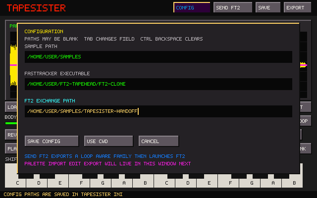

# TapeSister

TapeSister is a standalone sample-instrument forge. The current development slice adds a file-based FastTracker handoff, persistent path configuration, and sampler loop metadata to its durable Parent/Current sound model, tuning, zero-crossing editor, physical tape gestures, sample-family bank, polyphonic audition, and deterministic DSP shelf.



## Parent and Current

Every sound now has two explicit layers:

- **Parent** is the generated or imported source. Preview rendering never overwrites it.
- **Current** is the audible and exportable result after nondestructive editing and the active processing recipe are applied.

Dragging or loading a WAV makes that WAV the Parent. Every freshly generated or imported source starts with neutral processing, so Parent and Current are sample-for-sample identical until the first edit. Moving a processing control then rerenders Current from that Parent; it cannot silently return to the factory waveform.

**Generate** advances to a new Tonal, Metallic, Noise, or Pulse generator family and creates a new Parent. Each family now contains four substantially different synthesis characters plus seeded pitch, envelope, modulation, and spectral variation. **Reseed** keeps the family but chooses a different deterministic member rather than merely changing surface noise. For an imported or committed Parent, Reseed changes only stochastic processing and preserves Parent audio byte-for-byte.

**Reset** returns Current exactly to Parent and is undoable. **Commit** requires a deliberate second click (or second `Ctrl+P`), promotes Current into a new immutable Parent generation, records the previous Parent hash as its immediate ancestor, resets the processing shelf, and starts a fresh edit history.

## A/B audition and playhead

The **Parent** and **Current** buttons choose what every playback trigger auditions without changing the editing target: edits, Save, and Export always operate on Current. `Ctrl+B` toggles the same selector. Each source has its own viewport, so wheel/keyboard zoom, panning, Zoom Selection, Show All, and Play View work directly on the waveform currently displayed without disturbing the other source's view.

Play All and keyboard notes use the complete chosen source. Play Selection and Play Displayed map Current's crop-relative range back to the matching frames in Parent, so comparisons remain meaningful after cropping. Switching Parent/Current during playback preserves fractional progress through the active range instead of restarting it.

A source-colored playhead is visible only while audio is running: green identifies Parent playback and amber identifies Current playback. Space, Escape, and natural playback completion hide it.

## Zero-snapped selection and loop modes

Every mouse-created or adjusted selection endpoint snaps live to the nearest zero crossing in Current. Magenta pixels mark the visible crossings directly on the waveform. The highlight always shows the actual snapped range used by Reverse, Normalize, gain, fades, Crop, and Set Loop. Parent view maps pointer positions through Current's crop before snapping. `Ctrl+A` deliberately keeps exact sample boundaries. If a sound has no mathematical sign crossing, selection falls back deterministically to its closest-to-zero sample.

The Loop page turns the current selection into one loop, clears it, plays it continuously, selects **Forward**, **Reverse**, or **Ping-Pong** travel, and sets a 0–50 ms wrap crossfade. If no selection exists, Set Loop first selects and loops the exact whole Current. Blue boundaries and handles distinguish the loop from the purple/cyan selection; direction arrows show the active mode directly in the waveform. Either handle can be dragged live, remains zero-snapped, and automatically becomes the opposite endpoint when crossed. Computer and ordinary onscreen notes sustain the loop only while held; dragging a loop flag never releases them. Play Loop continues until Space or Escape.

Parent/Current A/B maps the same loop through the crop offset, preserves relative playback progress, and uses the same direction mode. Loop range, mode, and crossfade participate in Undo/Redo. Reset clears them and can be undone; Commit carries the completed loop onto the newly promoted Parent while clearing prior edit history.

The lower panel switches between **KEYS** and **BANK**. KEYS provides the five-voice chord/drone keyboard: Shift-click toggles latched notes, while an ordinary click clears the chord and returns to momentary audition. Sustained voices survive loop-handle changes, Current rerenders, and tuning changes.

## Pitch and tuning

The **Tune** page gives every instrument one shared pitch readout and ±100-cent audible Trim. Parent/Current A/B therefore compares the same musical mapping, while the two-octave keyboard pitches audio relative to its accepted source root instead of assuming the first C is always unity. The default root is C3 (MIDI 48), preserving the previous keyboard behavior for older WAV and TSR files. **Down** lowers both the held sound and displayed note/frequency; **Up** raises all three; moving Trim right sharpens them. TapeSister keeps the inverse sampler-unity value internally so exported WAV mapping remains correct. Shift-right-clicking an onscreen key assigns it as the source root; held and latched notes retune in place without restarting.

**Suggest Pitch** analyzes the snapped Selection first, then the Loop, then all of Current. It temporarily places the suggested mapping on the keyboard so new, held, and latched notes can audition it immediately; the Tune readout follows that preview, while saved tuning and Undo history remain untouched. A second explicit click accepts it. Escape cancels the preview and still performs Stop All; Space stops audition without discarding the preview. Quiet, noisy, or unstable material is rejected rather than forced into a misleading note. Manual tuning remains authoritative.

Root and fine tuning survive Undo/Redo, Reset, Commit, family capture, and Set Current. Each bank member carries its own mapping. Current and Family WAV exports write a standard `smpl` unity-note/pitch-fraction chunk, and WAV import reads it when present. The same chunk now carries loop start/end/type; importing the WAV restores that loop in TapeSister. TSR10 stores tuning for the live instrument and every bank member. User-captured TSP2 recipes optionally carry tuning; the eight factory recipes remain processing-only and never retune a sound unexpectedly.

## FastTracker handoff and configuration

**Config** opens one compact modal with blank-safe editable paths for the sample root, FastTracker executable, and FT2 exchange folder. The values persist in portable `tapesister.ini`; Tab or Up/Down changes field, the usual caret keys edit anywhere in a path, Ctrl+Backspace clears it, and **Use CWD** copies the current directory. The configured sample root becomes the file browser's starting directory while normal browsing still remembers later navigation.

**Send FT2** exports every occupied family slot into an automatically numbered folder under the exchange path (falling back to the sample path), then launches the configured FastTracker executable without shell interpolation. No existing handoff folder is replaced. The handoff remains deliberately file-based: TapeSister does not link against tracker state, and FT2's existing folder importer decides whether the family replaces the current instrument, fills another instrument, or becomes a launcher bank.

Every handoff WAV includes root/fine-tune metadata plus loop start, inclusive end, and standard Forward/Ping-Pong/Backward type. FT2 already reads the loop record, so forward and ping-pong family members arrive with looping enabled instead of requiring manual flags. Its current WAV loader treats the standard backward type as ping-pong; exact reverse-loop interpretation and `smpl` root-note adoption belong to the reciprocal FT2-side handoff slice. Palette import/edit/export will share the Config window in its own focused slice rather than mixing palette state into `tapesister.ini`.

## Sample-family bank

Every newly generated or imported source starts a 16-slot family with its initial Parent permanently copied into slot 1 as the immutable root. Commit can promote Current without replacing that family root. Slots 2–16 can capture three useful zero-aligned forms:

- Shift-click an empty slot to capture all of Current;
- Alt-click an empty slot to capture the active Loop, including its crossfade setting; or
- Ctrl-click an empty slot to capture the snapped Selection.

Click any slot to audition it and place that member in the waveform display; an empty slot produces silence and a blank waveform. Right-click an occupied slot 02–16 to rename it, or Shift-right-click to clear it. Slot 01 remains the fixed family root, and occupied slots must be cleared deliberately before reuse. This makes it possible to capture a small snapped selection, grow it, name the successive forms, and keep them as one related sample family.

After auditioning a filled slot, **Set Current** checks that family member out as a new clean editing base. Parent and Current become sample-for-sample identical to the selected audio, stored loop/mode/crossfade metadata follows it, and the complete family bank remains intact. Because every later render must have a stable Parent, this is a deliberate genealogy boundary: it advances the generation, records the previous Parent hash, resets DSP and edit history, and cannot be crossed with Undo. Space and Escape retain the reliable stop-all behavior formerly provided by the redundant mouse button.

The top **Export** button and `Ctrl+E` always ask whether to export the single Current WAV or the complete Family. Family export writes every occupied slot as a numbered, loop-aware WAV into a new folder named from the initial Parent. Existing folders are never silently replaced. A failed member export removes the partial files and folder. TSR10 projects embed all occupied bank audio, loop metadata, and tuning; opening TSR6 through TSR9 projects remains supported and initializes fields that did not yet exist.

## Physical tape gestures

Start any tape gesture inside the existing snapped selection. A cyan ghost waveform follows the pointer and previews the zero-crossing-aware destination before release:

- Shift + left-drag copies and mixes with the audio underneath using an equal average rather than additive gain;
- Shift + right-drag copies and overwrites the audio underneath;
- Ctrl + left-drag lifts/moves and mixes at the destination using the same equal average; and
- Ctrl + right-drag lifts/moves and overwrites at the destination.

Where source and existing audio overlap, Mix produces `(underlying + source) / 2`, avoiding the level jump and clipping caused by additive summing. Material placed beyond the existing sample keeps its source level. Move captures the entire source before clearing it, so an overlapping placement cannot corrupt itself. The lifted range remains the same duration and is filled with silence, with a roughly 1 ms protective fade at exposed edges. Dragging beyond either end grows Current with silence; the placed audio becomes the new selection and Show All reveals the expanded result. Every completed drag is one undoable operation that restores source and destination together. Later Reverse, Normalize, gain, fades, and Crop remain replayable after tape placement; Reset removes the timeline and Commit prints it into the next Parent.

## Processing recipes and shaping

The lower panel now cycles **KEYS**, **BANK**, and **RCPE**. RCPE contains eight immutable factory recipes and eight user slots. Click a filled slot to apply its processing to Current as one undoable render. Shift-click an empty user slot to capture the live processing shelf, right-click a filled user slot to rename it, and Shift-right-click to clear it. Factory recipes and their names remain immutable. Manual shelf changes remove the active-slot highlight without altering the stored recipe.

Portable `.tsp` files contain the named processing settings and, for user captures, optional tuning metadata—never Parent audio, crop, selection, loop, tape edits, or bank members—so the same treatment can be applied to unrelated sources. Factory recipes omit tuning. While RCPE is visible, Save or `Ctrl+S` writes a TSP instead of a full project. Load, drag-and-drop, and command-line opening accept TSP files, add them to the next free user slot, and apply them without replacing the instrument. Full `.tsr` projects remain the self-contained way to save a complete sound.

The **Shape** page combines a bypassable resonant Lowpass, Highpass, or Bandpass filter with a bypassable Tape, Clip, or Fold shaper. Cutoff uses logarithmic travel, while resonance, drive, and wet/dry mix expose the musically useful range. These deterministic stages live in the processing recipe and render before Delay and Space; existing ordered tape placements remain downstream. Held and latched notes are remapped across recipe application just like other Current rerenders.

## DSP shelf

The switchable Noise, Shape, Delay, and Space pages preserve the compact interface while exposing useful sound-shaping depth:

- deterministic white, pink-ish, brown-ish, and metallic noise;
- resonant lowpass, highpass, and bandpass filtering with explicit bypass;
- Tape, Clip, and Fold nonlinear shaping with drive, mix, and explicit bypass;
- mono delay with time, feedback, damping, mix, and explicit bypass;
- compact mono Schroeder-style ambience with decay, damping, mix, and explicit bypass;
- one deterministic offline render path for display, audition, export, Reset, Commit, Undo, and Redo.

Every stage is equally available to generated and imported Parents. Bypass is explicit state, not a zero-value convention.

## Editor slice

- drag across the waveform to select a range;
- mouse-wheel zoom anchored to the sample beneath the pointer;
- Shift+wheel panning, direct `=` or `+` / `-` keyboard zoom, arrow-key panning, and `0` Show All;
- Play All, Play Selection, and Play Displayed;
- Zoom Selection and Show All;
- nondestructive Crop with Parent preservation;
- selection-aware Reverse, Normalize, 3 dB Amplify Up/Down, Fade In, and Fade Out;
- Undo and Redo for processing, crop, and sample-edit operations;
- two-octave computer and onscreen keyboard audition;
- mono PCM/float WAV loading, including multichannel fold-down;
- self-contained native TSR10 project saving with embedded Parent audio, all bank slots and tuning, lineage, editor view, selection, loop mode/metadata, pre- and post-DSP edit timelines, and every DSP parameter; and
- mono 16-bit Current export with sampler-compatible root/fine-tune and loop metadata.

Sample edits run deterministically between the preserved Parent and the live DSP. With no selection they affect the whole Current; with a selection they affect only that range. Commit prints the heard result into the next Parent generation and clears both the edit stack and Undo/Redo history.

Amplify Up is deliberately bounded by hard clipping. Amplify Down attenuates the result without reconstructing clipped peaks, preserving that flattened distortion as a repeatable sculpting operation.

## File browser

Load, Save, and Export now open one shared FT2-informed browser rather than writing fixed filenames or requiring a typed path:

- Load lists WAV source files, self-contained `.tsr` projects, and portable `.tsp` processing recipes and preserves the existing instrument if any is invalid;
- Save lists directories and `.tsr` projects, or `.tsp` processing recipes while RCPE is visible;
- Export lists directories and WAV files;
- mouse wheel, draggable scrollbar, Up/Down, Page Up/Down, Home/End, and row clicking navigate long directories;
- double-click or Enter opens a directory, WAV, TSR project, or TSP recipe;
- Save and Export remember the current directory, provide filename entry with a focus-aware blinking caret, support Left/Right/Home/End navigation plus insertion, Backspace, and Delete at the caret, and append the proper extension;
- replacing an existing file requires a deliberate second Save/Export action; and
- completed Save/Export files replace their destination atomically, so a failed write does not leave a partial result.

TSR10 embeds the Parent waveform, complete sample-family bank, per-member tuning, loop directions, replayable tape-edit timeline, filter, and shaper in one portable file. TSR6 through TSR9 projects remain loadable with deterministic defaults for fields absent from those versions. TSP2 remains source-audio-independent and therefore complements rather than replaces the project format; TSP1 remains loadable as processing-only.

The browser owns all keyboard and mouse input while open. Escape or Cancel closes it without changing the sound or writing a file. WAV, TSR, and TSP files can also be dragged onto the window or passed on the command line.

The temporary colors come directly from `assets/tapehead.pal`, supplied by the user. The interface remains standalone: FT2 and the archived prototype are reference shelves, not inherited architecture, and TapeSister does not depend on or modify FT2 Tapehead Edition.

## Build on Linux

```bash
sudo apt install build-essential cmake libsdl2-dev
cmake -S . -B build -DCMAKE_BUILD_TYPE=Debug
cmake --build build -j2
ctest --test-dir build --output-on-failure
./build/tapesister
```

The small Makefile is also available:

```bash
make test
make
./tapesister
```

Pass a WAV, TSR, or TSP path on the command line, drag it onto the window, or choose it through **Load**.

## Keys and files

- Lower octave: `Z S X D C V G B H N J M`
- Upper octave: `Q 2 W 3 E R 5 T 6 Y 7 U`
- Stop all: `Space` or `Escape`
- Load browser: `Ctrl+O`
- Save browser / choose Export Current or Family: `Ctrl+S` / `Ctrl+E`
- Toggle Parent/Current audition: `Ctrl+B`
- Undo / Redo: `Ctrl+Z` / `Ctrl+Y`
- Select all: `Ctrl+A`
- Reverse / Normalize: `Ctrl+R` / `Ctrl+N`
- Fade in / Fade out: `Ctrl+I` / `Ctrl+U`
- Amplify up/down 3 dB: `Ctrl+Up` / `Ctrl+Down`
- Zoom in/out: `=` or `+` / `-`
- Pan waveform: `Left` / `Right`
- Show all: `0`
- Commit Current as Parent: `Ctrl+P` twice
- Browser navigation: `Up` / `Down`, `Page Up` / `Page Down`, `Home` / `End`
- Browser parent directory: `Backspace` while the file list is focused
- Browser confirm/cancel: `Enter` / `Escape`
- Build/toggle a five-note chord: `Shift` + onscreen-key click
- Config paths: top **Config** button
- Export family to exchange folder and launch FT2: top **Send FT2** button

Ripple cut, multiple loops, automatic loop candidates, the zero-crossing loop-maker transformation, deeper synthesis and modulation stages, recipe renaming/organization, and full genealogy/propagation remain separate, visually verified slices.
