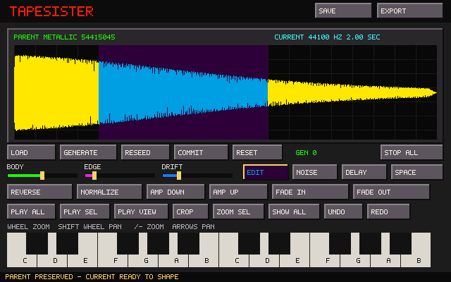

# TapeSister

TapeSister is a standalone sample-instrument forge. The current development slice joins its durable Parent/Current sound model to an undoable FT2-informed sample-edit stack, pointer-centered waveform navigation, and the deterministic DSP shelf.



## Parent and Current

Every sound now has two explicit layers:

- **Parent** is the generated or imported source. Preview rendering never overwrites it.
- **Current** is the audible and exportable result after nondestructive editing and the active processing recipe are applied.

Dragging or loading a WAV makes that WAV the Parent. Moving a processing control rerenders Current from that Parent; it cannot silently return to the factory waveform.

**Generate** advances to a new Tonal, Metallic, Noise, or Pulse generator family and creates a new Parent. **Reseed** keeps the family but creates a different generated Parent. For an imported or committed Parent, Reseed changes only stochastic processing and preserves Parent audio byte-for-byte.

**Reset** returns Current exactly to Parent and is undoable. **Commit** requires a deliberate second click (or second `Ctrl+P`), promotes Current into a new immutable Parent generation, records the previous Parent hash as its immediate ancestor, resets the processing shelf, and starts a fresh edit history.

## DSP shelf

The switchable Noise, Delay, and Space pages preserve the compact interface while exposing useful sound-shaping depth:

- deterministic white, pink-ish, brown-ish, and metallic noise;
- mono delay with time, feedback, damping, mix, and explicit bypass;
- compact mono Schroeder-style ambience with decay, damping, mix, and explicit bypass;
- one deterministic offline render path for display, audition, export, Reset, Commit, Undo, and Redo.

Every stage is equally available to generated and imported Parents. Bypass is explicit state, not a zero-value convention.

## Editor slice

- drag across the waveform to select a range;
- mouse-wheel zoom anchored to the sample beneath the pointer;
- Shift+wheel panning, direct `+`/`-` keyboard zoom, arrow-key panning, and `0` Show All;
- Play All, Play Selection, and Play Displayed;
- Zoom Selection and Show All;
- nondestructive Crop with Parent preservation;
- selection-aware Reverse, Normalize, 3 dB Amplify Up/Down, Fade In, and Fade Out;
- Undo and Redo for processing, crop, and sample-edit operations;
- two-octave computer and onscreen keyboard audition;
- mono PCM/float WAV loading, including multichannel fold-down;
- canonical schema-4 JSON recipe saving with renderer version, lineage, sample-edit stack, DSP parameters, and explicit bypass states; and
- mono 16-bit Current export.

Sample edits run deterministically between the preserved Parent and the live DSP. With no selection they affect the whole Current; with a selection they affect only that range. Commit prints the heard result into the next Parent generation and clears both the edit stack and Undo/Redo history.

The temporary colors come directly from `assets/tapehead.pal`, supplied by the user. The interface remains standalone: FT2 and the archived prototype are reference shelves, not inherited architecture, and TapeSister does not depend on or modify FT2 Tapehead Edition.

## Build on Linux

```bash
sudo apt install build-essential cmake libsdl2-dev
cmake -S . -B build -DCMAKE_BUILD_TYPE=Debug
cmake --build build -j2
ctest --test-dir build --output-on-failure
./build/tapesister
```

The small Makefile is also available:

```bash
make test
make
./tapesister
```

Pass a WAV path on the command line, drag a WAV onto the window, or click **Load** and type its path.

## Keys and files

- Lower octave: `Z S X D C V G B H N J M`
- Upper octave: `Q 2 W 3 E R 5 T 6 Y 7 U`
- Stop all: `Space` or `Escape`
- Load WAV path: `Ctrl+O`
- Undo / Redo: `Ctrl+Z` / `Ctrl+Y`
- Select all: `Ctrl+A`
- Reverse / Normalize: `Ctrl+R` / `Ctrl+N`
- Fade in / Fade out: `Ctrl+I` / `Ctrl+U`
- Amplify up/down 3 dB: `Ctrl+Up` / `Ctrl+Down`
- Zoom in/out: `+` / `-`
- Pan waveform: `Left` / `Right`
- Show all: `0`
- Commit Current as Parent: `Ctrl+P` twice
- Save recipe to `tapesister-recipe.tsr`: `Ctrl+S`
- Export Current to `tapesister-export.wav`: `Ctrl+E`

Cut/copy/paste, loop editing, deeper synthesis/filter/shaper stages, destination selection, and full genealogy/propagation remain separate, visually verified slices.
