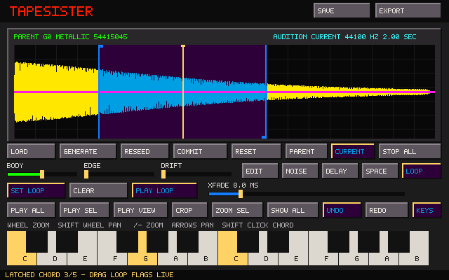

# TapeSister

TapeSister is a standalone sample-instrument forge. The current development slice joins its durable Parent/Current sound model to zero-crossing sample selection, seamless forward loops, direct A/B audition, a visible playback head, an undoable FT2-informed sample-edit stack, pointer-centered waveform navigation, and the deterministic DSP shelf.



## Parent and Current

Every sound now has two explicit layers:

- **Parent** is the generated or imported source. Preview rendering never overwrites it.
- **Current** is the audible and exportable result after nondestructive editing and the active processing recipe are applied.

Dragging or loading a WAV makes that WAV the Parent. Every freshly generated or imported source starts with neutral processing, so Parent and Current are sample-for-sample identical until the first edit. Moving a processing control then rerenders Current from that Parent; it cannot silently return to the factory waveform.

**Generate** advances to a new Tonal, Metallic, Noise, or Pulse generator family and creates a new Parent. **Reseed** keeps the family but creates a different generated Parent. For an imported or committed Parent, Reseed changes only stochastic processing and preserves Parent audio byte-for-byte.

**Reset** returns Current exactly to Parent and is undoable. **Commit** requires a deliberate second click (or second `Ctrl+P`), promotes Current into a new immutable Parent generation, records the previous Parent hash as its immediate ancestor, resets the processing shelf, and starts a fresh edit history.

## A/B audition and playhead

The **Parent** and **Current** buttons choose what every playback trigger auditions without changing the editing target: edits, Save, and Export always operate on Current. `Ctrl+B` toggles the same selector. Each source has its own viewport, so wheel/keyboard zoom, panning, Zoom Selection, Show All, and Play View work directly on the waveform currently displayed without disturbing the other source's view.

Play All and keyboard notes use the complete chosen source. Play Selection and Play Displayed map Current's crop-relative range back to the matching frames in Parent, so comparisons remain meaningful after cropping. Switching Parent/Current during playback preserves fractional progress through the active range instead of restarting it.

A source-colored playhead is visible only while audio is running: green identifies Parent playback and amber identifies Current playback. Stop All, Space, Escape, and natural playback completion hide it.

## Zero-snapped selection and forward loops

Every mouse-created or adjusted selection endpoint snaps live to the nearest zero crossing in Current. Magenta pixels mark the visible crossings directly on the waveform. The highlight always shows the actual snapped range used by Reverse, Normalize, gain, fades, Crop, and Set Loop. Parent view maps pointer positions through Current's crop before snapping. `Ctrl+A` deliberately keeps exact sample boundaries. If a sound has no mathematical sign crossing, selection falls back deterministically to its closest-to-zero sample.

The Loop page turns the current selection into one forward loop, clears it, plays it continuously, and sets a 0–50 ms wrap crossfade. Blue boundaries and handles distinguish the loop from the purple/cyan selection. Either handle can be dragged live; it remains zero-snapped and automatically becomes the opposite endpoint when crossed. Computer and ordinary onscreen notes sustain the loop only while held; dragging a loop flag never releases them. Play Loop continues until Stop All, Space, or Escape.

Parent/Current A/B maps the same loop through the crop offset and preserves relative playback progress. Loop range and crossfade participate in Undo/Redo. Reset clears them and can be undone; Commit carries the completed loop onto the newly promoted Parent while clearing prior edit history.

The small **KEYS** button shows or hides the onscreen keyboard, freeing its lower-panel area for future controls. Computer-key audition remains available in either state. The keyboard is five-voice polyphonic: Shift-click toggles notes into a latched chord/drone, Shift-clicking an active note removes it, and an ordinary onscreen-key click clears the chord and returns to momentary audition. Sustained voices survive loop-handle changes and Current rerenders, remapping to the new audio at the same relative position.

## DSP shelf

The switchable Noise, Delay, and Space pages preserve the compact interface while exposing useful sound-shaping depth:

- deterministic white, pink-ish, brown-ish, and metallic noise;
- mono delay with time, feedback, damping, mix, and explicit bypass;
- compact mono Schroeder-style ambience with decay, damping, mix, and explicit bypass;
- one deterministic offline render path for display, audition, export, Reset, Commit, Undo, and Redo.

Every stage is equally available to generated and imported Parents. Bypass is explicit state, not a zero-value convention.

## Editor slice

- drag across the waveform to select a range;
- mouse-wheel zoom anchored to the sample beneath the pointer;
- Shift+wheel panning, direct `=` or `+` / `-` keyboard zoom, arrow-key panning, and `0` Show All;
- Play All, Play Selection, and Play Displayed;
- Zoom Selection and Show All;
- nondestructive Crop with Parent preservation;
- selection-aware Reverse, Normalize, 3 dB Amplify Up/Down, Fade In, and Fade Out;
- Undo and Redo for processing, crop, and sample-edit operations;
- two-octave computer and onscreen keyboard audition;
- mono PCM/float WAV loading, including multichannel fold-down;
- self-contained native TSR6 project saving with embedded Parent audio, lineage, editor view, selection, loop metadata, sample-edit stack, and every DSP parameter; and
- mono 16-bit Current export.

Sample edits run deterministically between the preserved Parent and the live DSP. With no selection they affect the whole Current; with a selection they affect only that range. Commit prints the heard result into the next Parent generation and clears both the edit stack and Undo/Redo history.

Amplify Up is deliberately bounded by hard clipping. Amplify Down attenuates the result without reconstructing clipped peaks, preserving that flattened distortion as a repeatable sculpting operation.

## File browser

Load, Save, and Export now open one shared FT2-informed browser rather than writing fixed filenames or requiring a typed path:

- Load lists WAV source files and self-contained `.tsr` projects and preserves the existing instrument if either is invalid;
- Save lists directories and `.tsr` recipes;
- Export lists directories and WAV files;
- mouse wheel, draggable scrollbar, Up/Down, Page Up/Down, Home/End, and row clicking navigate long directories;
- double-click or Enter opens a directory, WAV, or TSR project;
- Save and Export remember the current directory, provide filename entry with a focus-aware blinking caret, and append the proper extension;
- replacing an existing file requires a deliberate second Save/Export action; and
- completed Save/Export files replace their destination atomically, so a failed write does not leave a partial result.

TSR6 embeds the Parent waveform and all reconstructive state in one portable file. Opening it restores the exact saved Parent/Current relationship rather than starting neutral. Older experimental JSON recipes did not contain Parent audio and therefore cannot reopen as self-contained projects.

The browser owns all keyboard and mouse input while open. Escape or Cancel closes it without changing the sound or writing a file. WAV and TSR files can also be dragged onto the window or passed on the command line.

The temporary colors come directly from `assets/tapehead.pal`, supplied by the user. The interface remains standalone: FT2 and the archived prototype are reference shelves, not inherited architecture, and TapeSister does not depend on or modify FT2 Tapehead Edition.

## Build on Linux

```bash
sudo apt install build-essential cmake libsdl2-dev
cmake -S . -B build -DCMAKE_BUILD_TYPE=Debug
cmake --build build -j2
ctest --test-dir build --output-on-failure
./build/tapesister
```

The small Makefile is also available:

```bash
make test
make
./tapesister
```

Pass a WAV or TSR path on the command line, drag it onto the window, or choose it through **Load**.

## Keys and files

- Lower octave: `Z S X D C V G B H N J M`
- Upper octave: `Q 2 W 3 E R 5 T 6 Y 7 U`
- Stop all: `Space` or `Escape`
- Load browser: `Ctrl+O`
- Save browser / Export browser: `Ctrl+S` / `Ctrl+E`
- Toggle Parent/Current audition: `Ctrl+B`
- Undo / Redo: `Ctrl+Z` / `Ctrl+Y`
- Select all: `Ctrl+A`
- Reverse / Normalize: `Ctrl+R` / `Ctrl+N`
- Fade in / Fade out: `Ctrl+I` / `Ctrl+U`
- Amplify up/down 3 dB: `Ctrl+Up` / `Ctrl+Down`
- Zoom in/out: `=` or `+` / `-`
- Pan waveform: `Left` / `Right`
- Show all: `0`
- Commit Current as Parent: `Ctrl+P` twice
- Browser navigation: `Up` / `Down`, `Page Up` / `Page Down`, `Home` / `End`
- Browser parent directory: `Backspace` while the file list is focused
- Browser confirm/cancel: `Enter` / `Escape`
- Build/toggle a five-note chord: `Shift` + onscreen-key click

The next architectural slice is a 16-slot sample-family bank: the initial Parent occupies the first slot, shaped Current states can be captured into later slots, and the whole family can be exported into a folder derived from the initial Parent name. Slot lineage, naming, overwrite behavior, and how sound-shaping recipes are stored will be designed together rather than hidden inside the loop editor.

Cut/copy/paste, ping-pong/reverse/multiple loops, automatic loop candidates, deeper synthesis/filter/shaper stages, expanded factory recipes, and full genealogy/propagation remain separate, visually verified slices.
