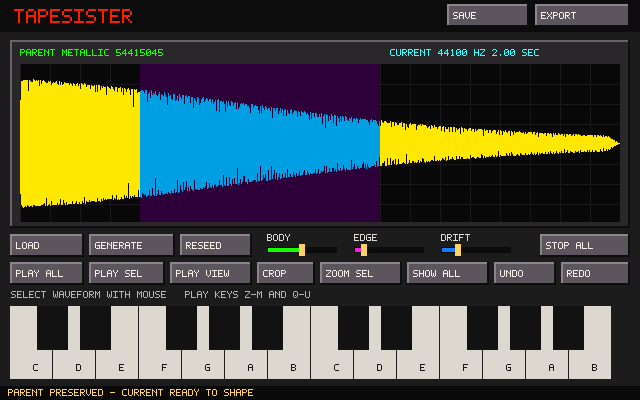

# TapeSister

TapeSister is a standalone sample-instrument forge. This draft revision establishes its first durable sound model and its first useful sample-editor slice.



## Parent and Current

Every sound now has two explicit layers:

- **Parent** is the generated or imported source. Preview rendering never overwrites it.
- **Current** is the audible and exportable result after Body, Edge, Drift, and nondestructive cropping are applied.

Dragging or loading a WAV makes that WAV the Parent. Moving a processing control rerenders Current from that Parent; it cannot silently return to the factory waveform.

**Generate** advances to a new Tonal, Metallic, Noise, or Pulse generator family and creates a new Parent. **Reseed** keeps the family but creates a different generated Parent. For an imported Parent, Reseed changes only stochastic processing and preserves the imported audio byte-for-byte.

## Editor slice

- drag across the waveform to select a range;
- Play All, Play Selection, and Play Displayed;
- Zoom Selection and Show All;
- nondestructive Crop with Parent preservation;
- Undo and Redo for processing and crop operations;
- two-octave computer and onscreen keyboard audition;
- mono PCM/float WAV loading, including multichannel fold-down;
- deterministic JSON recipe saving; and
- mono 16-bit Current export.

The temporary colors come directly from `assets/tapehead.pal`, supplied by the user. The interface remains standalone: FT2 and the archived prototype are reference shelves, not inherited architecture, and TapeSister does not depend on or modify FT2 Tapehead Edition.

## Build on Linux

```bash
sudo apt install build-essential cmake libsdl2-dev
cmake -S . -B build -DCMAKE_BUILD_TYPE=Debug
cmake --build build -j2
ctest --test-dir build --output-on-failure
./build/tapesister
```

The small Makefile is also available:

```bash
make test
make
./tapesister
```

Pass a WAV path on the command line, drag a WAV onto the window, or click **Load** and type its path.

## Keys and files

- Lower octave: `Z S X D C V G B H N J M`
- Upper octave: `Q 2 W 3 E R 5 T 6 Y 7 U`
- Stop all: `Space` or `Escape`
- Load WAV path: `Ctrl+O`
- Undo / Redo: `Ctrl+Z` / `Ctrl+Y`
- Save recipe to `tapesister-recipe.tsr`: `Ctrl+S`
- Export Current to `tapesister-export.wav`: `Ctrl+E`

Destination selection, loop editing, the larger DSP shelf, and genealogy/propagation remain separate, visually verified slices.
