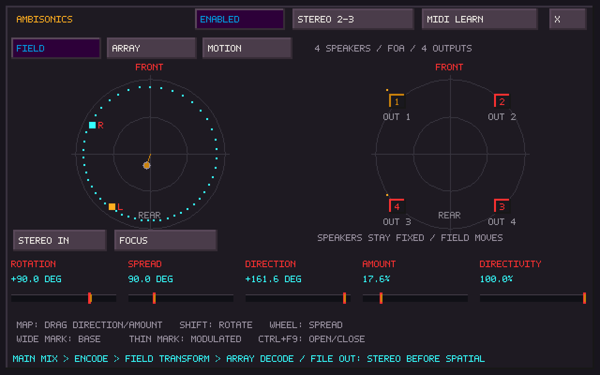
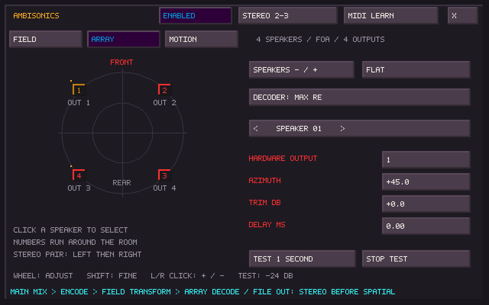
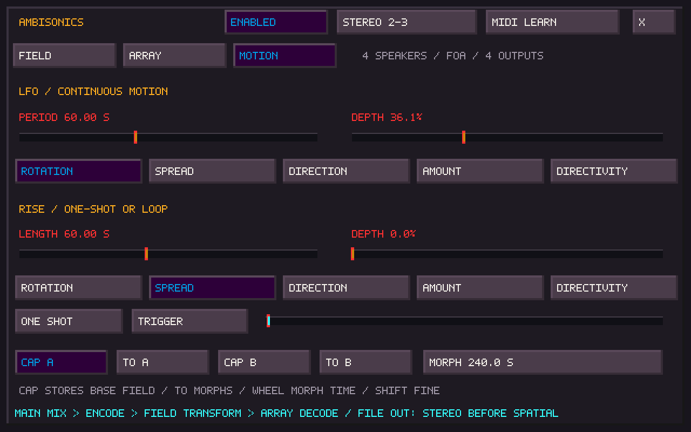

# Ambisonics output

**F9 → AMBISONICS**, or **Ctrl+F9**, opens a separate, modeless window. The
stage starts **off**. Closing its window leaves audio and modulation running.
Click the top **STEREO / ENABLED** button to bypass or engage the stage.

This is a horizontal first-order Ambisonics (FOA) output stage for the complete
TapeSister mix, including SisterTracker. The existing stereo Router, EQ, limiter
and OUT level feed an encoder, field transformation and speaker decoder. It
supports **3–16 speakers**, with an independent hardware output assignment for
each speaker. It does not require REAPER, SuperCollider or a plugin host.

## Four speakers and a MOTU M6

In **CFG → AUDIO**, select the M6's multichannel ASIO device on Windows. Open
Ambisonics → **ARRAY**, keep **4 SPEAKERS / FLAT**, then use **TEST 1 SECOND**
on each speaker to check the physical assignment. Test is a 440 Hz tone at
approximately −24 dBFS; **STOP TEST**, closing the window or leaving its focus
cancels it. The tone works with the spatial stage off.

The default assumes hardware outputs 1/2 are front L/R and 3/4 are rear L/R.
Speaker numbers instead run clockwise around the room:

| Speaker | Position | Default hardware output | Azimuth |
| --- | --- | --- | --- |
| 1 | Front left | 1 | +45° |
| 2 | Front right | 2 | −45° |
| 3 | Rear right | 4 | −135° |
| 4 | Rear left | 3 | +135° |

**STEREO n–n** selects the adjacent pair used when Ambisonics is off. The first
speaker receives the original left channel and the second receives the original
right channel. For the flat quad default:

| Stereo pair | Side of the room | Physical outputs, L then R |
| --- | --- | --- |
| 1–2 | Front | 1, 2 |
| 2–3 | Right | 2, 4 |
| 3–4 | Rear | 4, 3 |
| 4–1 | Left | 3, 1 |

Click to advance; right-click or scroll to move in either direction. These are
ordinary stereo channels: spatial rotation, width, transforms, calibration and
modulation do not alter bypassed audio. Changing the pair and engaging/bypassing
use short coefficient fades. The pair selector also chooses the fallback while
the spatial stage is enabled but unavailable.

On Linux select TapeSister's **JACK** backend and route its master playback ports
to the M6 using your JACK or PipeWire JACK patchbay. The master exposes 16 ports;
connect the four assigned ports for this setup. The dedicated stereo Insert
Send/Return ports stay separate. A visible JACK port does not prove that it is
connected to a physical speaker: check the patchbay and test tones.

## Field

The left circle shows the transformed field and encoded L/R source positions.
The right circle shows fixed speakers and their output meters. Drag inside the
left circle to change **DIRECTION** and **AMOUNT**; Shift-drag changes **ROTATION**;
the wheel changes **SPREAD**. The hollow point marks the base direction/amount;
the line and solid point show the live modulated value.

The five controls also support horizontal dragging, scroll adjustment, Shift for
fine scrolling and right-click to reset. Their wider bar mark is the base value;
the narrow mark is the live value.

| Control | Effect |
| --- | --- |
| Rotation | Rotate the encoded scene through −180° to +180° |
| Spread | Separate the stereo source directions from 0° to 360°; default 90° |
| Direction | Aim the selected field transformation |
| Amount | Move from the neutral field to maximum transformation |
| Directivity | Reduce directional components toward an omnidirectional field |

**STEREO IN / MONO** chooses two encoded sources or their mono average.
At zero spread the stereo sources coincide; at 360° they coincide behind the
listener. Opposite-polarity stereo material can cancel in MONO or at coincident
source directions.

The transformation button cycles **FOCUS, PRESS, PUSH, ZOOM**, adapted from the
Ambisonic Toolkit. They change the field toward the selected direction, with
different angular and level behavior. FOCUS includes its upstream gain
compensation; ZOOM can increase level. A linked output limiter contains spatial
peaks without independently changing valid speakers' relative levels.

## Array

Choose 3–16 speakers. **FLAT** places the front between speakers; **POINT**
places a speaker directly ahead. Changing the count creates a new regular ring
and resets its assignments/calibration. Changing FLAT/POINT resets the angles
but preserves hardware assignments, trim and delay. Lower playback before
changing count or hardware assignments; these are setup operations.

Click a speaker, or use the speaker selector, then adjust **HARDWARE OUTPUT**,
**AZIMUTH**, **TRIM DB** (−60 to +6) and **DELAY MS** (0–20). Scroll or left/right
click to adjust; Shift-scroll is finer. Output numbers are one-based; up to 64
hardware channels are addressable, subject to the active device. Front is 0°,
positive angles go left, negative angles go right.

Decoder choices are **MAX RE** (default), **IN PHASE** and **BASIC**. The horizontal
least-squares decoder accepts nonuniform azimuths as well as regular rings. Very
degenerate layouts are rejected. This is first-order reproduction with broad
spatial resolution, not a room-correction system or a guarantee of equal coverage
for every arbitrary speaker layout. Trim/delay are manual calibration aids.

Missing outputs, duplicate assignments, degenerate geometry or an output reserved
by a shared-device external Insert prevent the spatial stage from engaging. It
fades back to the selected complete stereo pair. If that pair is unavailable,
stereo falls back to hardware **1–2**. The window reports the problem. Reserved
Insert send channels remain owned by Insert, including while it is bypassed.

## Motion and MIDI

The Motion page reuses Fallout's timing curves: **LFO** periods from 0.1 seconds
to one hour, and **RISE** lengths from one second to four hours. Each has a depth
and a set of five target buttons. LFO is bipolar around the base value; Rise adds
upward from it. Angular targets wrap; other targets clamp to their control range.
Rise can run once, holding its final value, or loop. **TRIGGER** restarts Rise.

**CAP A / CAP B** store the five base field values. **TO A / TO B** morph toward
a captured endpoint over **MORPH** time (10 ms to one hour; scroll to adjust).
Rotation/direction follow the shortest arc. Editing a base value cancels a morph.
Capture stores base settings, not a momentary LFO excursion. The transform type,
input mode, speaker geometry and routing are not morphed.

**MIDI LEARN**, or Ctrl+Shift+M, can learn the five field controls, enable toggle
and Rise trigger. Select a control, then move the controller as elsewhere in
TapeSister. Normal note and transport keys remain available with this window
focused. Escape exits Learn first, then closes the window.

## Saving and recording

Project/session and configuration saves include the array, assignments, stereo
pair, calibration, field settings, modulators and captured A/B endpoints. Project
recall resets modulation phase and cancels in-flight triggers/morphs; a saved
morph recalls its destination. Older projects default to disabled, front stereo.

**FILE OUT, Mosaic OUTPUT and existing captures remain stereo before this final
speaker stage.** They do not record the speaker feeds or Ambisonic B-format.
This version encodes the complete mono/stereo mix; it does not independently
position tracker lanes or tiles, decode imported B-format files, export B-format,
provide higher orders/elevation or binaural HRTFs. Multichannel import still uses
the existing downmix behavior, so an imported B-format file is not a spatial field.

## Verification and listening checklist

Automated coverage exercises horizontal decoder reconstruction for every count
3–16 in both orientations; ATK neutral and maximum transform vectors; all four
quad stereo pairs; Insert ownership and unavailable-output fallback; bounded
transitions and modulation; delay at multiple sample rates; config/project
round trips; native window gestures/MIDI/lifecycle; and four-channel rendering
through the application's real audio callback. JACK tests exercise all 16 master
ports through its mocked ABI. Screenshots above come from the actual UI renderer.

For the M6 listening check:

1. Verify each speaker with its test tone and correct the hardware assignments.
2. Bypass and play a known stereo source on each adjacent pair.
3. Enable MONO with zero Amount; rotate a sustained source around the quad.
4. Compare the four transforms, then try a slow rotation LFO and an A/B morph.
5. Save, reopen, and check the array and stereo pair. Close the window during
   playback to confirm that audio continues.
6. Confirm FILE OUT remains stereo and that an unavailable endpoint reports
   fallback. Check Audio Health under your normal performance load.

Local validation on Linux built the application and exercised all 101 CTest
cases. After rerunning two executables whose build permissions interrupted their
first launch, 98 passed. The three remaining failures (`test_sister_source_mask`,
`test_sister_recursion`, `tapesister_canvas_tests`) reproduce at the same assertions
on unchanged merged main `3f1167a`. Feature, window/controller and 16-channel JACK
tests pass. The spatial DSP also passes AddressSanitizer/UndefinedBehaviorSanitizer,
including a regression for fractional-delay ring wrap near zero. CDP bundling and live MIDI input were disabled for this local build;
Windows/Linux release CI includes the new tests with normal packaging options.

Automated tests cannot verify physical M6 wiring, ASIO driver behavior or the
room's acoustic result. Native Windows CI and this listening check complement
the Linux software tests.

ATK provenance and license: [third_party/atk/UPSTREAM.md](../third_party/atk/UPSTREAM.md).
