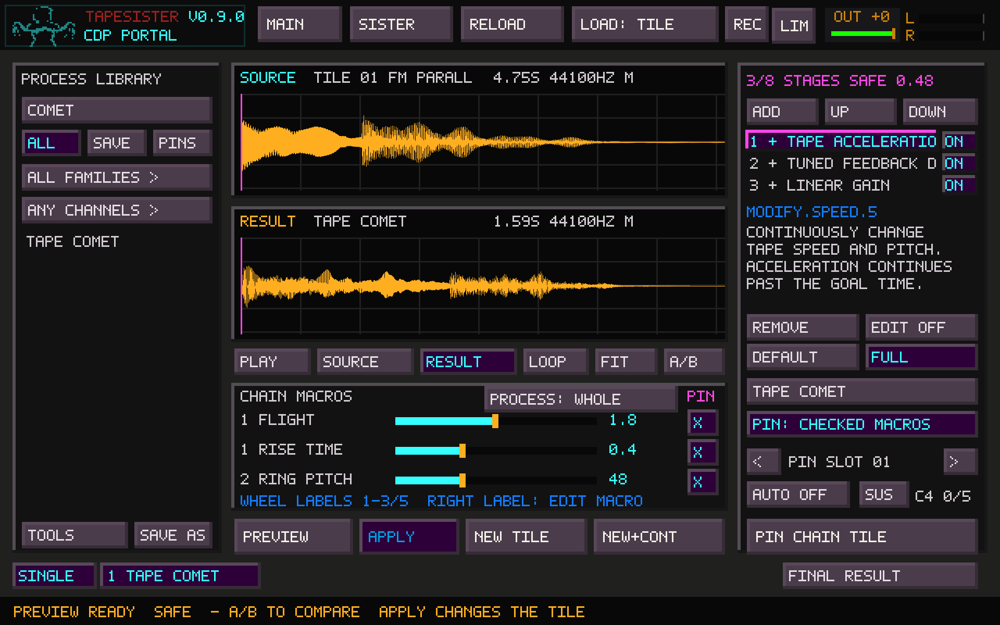
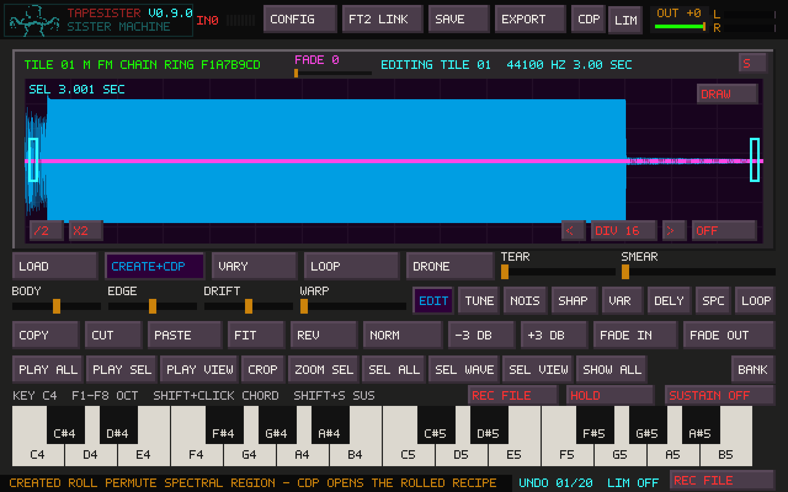

# CDP expansion and CREATE rolls

This implementation follows the [pinned CDP8 audit](CDP_REMAINING_PROCESS_AUDIT.md).
The Portal now contains **170 raw processes, 32 curated bank instruments and
11 starter chains**. **53 raw processes and seven starter chains** accept stereo.
The three [supersaw voicings](SUPERSAW.md) use existing processes to render
centered unison layers into ordinary tiles.
The 39 new raw entries expose scalar subsets of CDP modes; several were already
used inside curated instruments, so this is not a claim of 39 new DSP algorithms.

## New raw processes

| Portal name | Persistent process ID | Input |
|---|---|---|
| TAPE ACCELERATION | `modify.speed.5` | Mono / stereo |
| TRANSPOSITION STACK | `modify.stack` | Mono / stereo |
| ZIGZAG TRAVERSAL | `extend.zigzag.1` | Mono / stereo |
| DRUNK TRAVERSAL | `extend.drunk.1` | Mono / stereo |
| DRUNK WITH PAUSES | `extend.drunk.2` | Mono / stereo |
| ITERATE TO TIME | `extend.iterate.1` | Mono / stereo |
| ITERATE COPIES | `extend.iterate.2` | Mono / stereo |
| FREEZE TO TIME | `extend.freeze.1` | Mono / stereo |
| FREEZE COPIES | `extend.freeze.2` | Mono / stereo |
| BACK-TO-BACK | `extend.baktobak` | Mono / stereo |
| BOUNCING REPEATS | `bounce.bounce` | Mono / stereo |
| FAST SCAN | `dvdwind.dvdwind` | Mono / stereo |
| LOW / HIGH PASS | `filter.lohi.1` | Mono / stereo |
| TUNED FEEDBACK DELAY | `newdelay.newdelay` | Mono / stereo |
| APPEND SILENCE | `silend.silend.1` | Mono / stereo |
| SYLLABLE REPEATS | `envspeak.envspeak.1` | Mono / stereo |
| SYLLABLE REVERSE REPEAT | `envspeak.envspeak.2` | Mono / stereo |
| SYLLABLE SHRINK TAIL | `envspeak.envspeak.5` | Mono / stereo |
| SYLLABLE SHRINK HEAD | `envspeak.envspeak.6` | Mono / stereo |
| AFTER-PEAK TREMOLO | `tremenv.tremenv` | Mono / stereo |
| THRESHOLD GATE | `gate.gate.1` | Mono |
| REMOVE QUIET MATERIAL | `gate.gate.2` | Mono |
| PEAK-RESTORED CLIP | `clip.clip.1` | Mono |
| HALF-WAVE CLIP | `clip.clip.2` | Mono |
| HALF-WAVE QUIRK | `quirk.quirk.1` | Mono |
| SIGNAL QUIRK | `quirk.quirk.2` | Mono |
| SPECTRAL MAGNIFY | `spec.magnify` | Mono |
| SPECTRAL GATE | `spec.gate` | Mono |
| SPECTRAL WALK | `blur.drunk` | Mono |
| SPECTRAL SCATTER | `blur.scatter` | Mono |
| HIGH-BAND BLUR | `caltrain.caltrain` | Mono |
| TUNED SPECTRAL SUSTAIN | `superaccu.superaccu.2` | Mono |
| DECORRELATED STRETCH | `spectstr.stretch` | Mono |
| FOLD SPECTRAL REGION | `specfold.specfold.1` | Mono |
| INVERT SPECTRAL REGION | `specfold.specfold.2` | Mono |
| PERMUTE SPECTRAL REGION | `specfold.specfold.3` | Mono |
| NARROW FORMANTS | `specfnu.specfnu.1` | Mono |
| INVERT FORMANTS | `specfnu.specfnu.3` | Mono |
| ROTATE FORMANTS | `specfnu.specfnu.4` | Mono |

All new entries have descriptions, units, defaults and generated controls.
They participate in search, channel filtering, numeric entry, recipes, pins,
chains, selection processing, cancellation and the existing source/result views.
CDP binaries are unchanged at commit `28bc42c72c1a7cb0fab933acd1c433be958a787b`.
The bundled runtime closure grows from 22 to 37 executables; rebuild the bundled
runtime when upgrading. Custom external CDP folders must contain the selected
process's executable as well as any analysis/resynthesis stages.

## Native stereo policy

The 20 new stereo entries above use one interleaved CDP invocation. Native
support also extends these 20 existing entries:

- `modify.loudness.3`, `.4`: one peak measurement and one gain for the pair.
- `modify.revecho.1`: common delay timing and feedback parameters.
- `filter.variable.2`, `filter.sweeping.2`, `filter.phasing.1`, `.2`.
- `sfedit.cut.1`, `sfedit.cutend.1`, `sfedit.excise.1`.
- `extend.doublets`, `extend.loop.1`, `.2`, `.3`, `extend.scramble.1`.
- `envel.dovetail.1`, `.2`, `envel.swell`, `envel.tremolo.1`, `envel.warp.2`.

Native traversal/repetition makes one set of timing and random choices for the
stereo pair. Positive seed controls retain CDP's repeatability; modes without
an exposed seed may reroll. Channel balance tests use R = -0.25 L and a silent
right channel, covering gain, timing, polarity and channel isolation.

The original 13 independent-channel modes retain their mono reference behavior.
A mixed chain dispatches each stage separately: splitting the entire chain would
incorrectly normalize the channels independently or make separate random choices.
A chain is stereo-capable only if all enabled stages are eligible.

Native stereo output is requested as 32-bit float, checked in both channels,
then loaded. Overload, including full-scale output that may have been clipped
inside CDP filters, is rejected with **STEREO OUTPUT WOULD CLIP; LOWER INPUT OR
PROCESS GAIN**. Normalize/Force Peak may deliberately reach exactly 1.0 with a
shared gain. There is no automatic gain correction or channelwise clipping in
this new path. Input staging retains the existing PCM16 conversion. Mono and
the original split modes retain their earlier rendering behavior.

Malformed interleaving, rate changes, excessive duration and nonfinite samples
are rejected. Partial stereo frames are not silently dropped. Constrict remains
excluded after the audit found malformed stereo output and channel leakage.
Scrub, additional waveset/grain rearrangement and spatial/multichannel modes
remain deferred. Spectral analysis/resynthesis remains mono-only; two independent
analyses are not a reliable way to preserve a stereo phase relationship.

## Source-dependent limits

The controls expose bounded subsets of CDP, not every upstream parameter range.
Invalid combinations are rejected before launch where the constraint is known.

- Sources need at least 40 ms, and spectral processing also needs 2048 frames.
  The Portal remains bounded to eight million frames, including tails and any
  unprocessed material around a selection.
- Iteration/freezing to a target time and spectral/traversal walks may require
  a target at least as long as the input. A final copy or tail may extend it.
- Acceleration continues beyond its goal time. Strong deceleration can reach
  CDP's minimum read increment and stop before consuming the whole source.
- Traversal, freeze regions, splice lengths and filter edge pairs must fit one
  another and the source. The error message identifies the coupled restriction.
- Syllable tools detect amplitude gestures, not phonetic syllables. Use speech,
  singing, percussion or pulsed material. Very quiet/steady material may have too
  few peaks; lower WINDOW or choose a more articulated source. The initial skip
  count is fixed at zero in this subset because it depends on the detected peaks.
- Peak-restored Clip remains mono-only until its nonlinear level behavior has
  an explicit stereo design. Gate/Quirk variants also remain mono-only.
- Fold region/bin counts, scatter block counts and analysis windows are coupled.
  Spectral bins refer to the fixed 1024-point analysis configuration.

## Four original TapeSister instruments

These are original CDP chain designs with named, curated controls. They are
editable recipes and do not add or modify upstream DSP kernels.

| Instrument | Design | Starting material |
|---|---|---|
| TAPE COMET | Accelerating tape into a pitched feedback tail | A hit or short phrase, at least 0.8 seconds for the full macro range |
| WIRE CHOIR | Harmonically spaced transposed layers through a low-pass filter | A voice, resonant hit or sustained note |
| SYLLABLE RAIN | Shrinking envelope-segment repeats into a tuned delay | Articulated speech, singing or pulsed material |
| FORMANT LANTERN | Hold a chosen spectrum and rotate its formant envelope | A mono sound with interesting vowels or resonances |

The first three accept mono or stereo. FORMANT LANTERN is mono-only. Find them
under **CHAIN TOOLS**, edit their Macros or Full controls, then save a personal
copy. Existing factory chains and their settings are retained.



## CREATE + CDP

Left-click **CREATE** to roll fresh FM. Right-click to roll a CDP variation of
the retained clean waveform; repeated right-clicks reuse that same source.
Middle-click restores the clean waveform and cancels pending CDP. **CREATE+CDP**
marks a variation and **CDP...** marks a running worker. VARY keeps its existing path.

The first palette includes Tape Transpose, Ring Modulate, Bit + Rate Reduce,
Transposition Stack, Tuned Feedback Delay, Back-to-Back, Zigzag, Freeze Copies,
Spectral Magnify, Permute Spectral Region, Rotate Formants and Spectral Blur.
Ranges are intentionally narrower than Full controls. Regions and durations
adapt to the generated source, and ineligible choices are skipped.

All rolled parameter values and any process seed are retained in an ordinary
Portal recipe. Its description records the CDP dice seed. Click
**CDP** after completion to inspect, edit, save or pin the transformation.
Saving a recipe saves the transformation settings, not its source audio; use
REC FILE, WAV export or a project to keep the resulting sound.

The CDP part runs in the existing background worker. Right-clicking during a
render cancels it and queues the next roll. Middle-click or Escape cancels the
pending roll; middle-click also restores the clean waveform after completion.
Left-click starts fresh FM and cancels any pending CDP variation. A hot or silent
result stays available for Portal review. Later audio edits, tile/page changes
and active edit gestures prevent a late result or restore from replacing work.
Each successful apply/restore supports Undo. Whole-tile CREATE still starts a
new source/history, as ordinary CREATE already does.

Canvas selections retain the existing mono FM stamping behavior. CDP processes
the captured region; the retained clean sample includes the complete waveform,
so restoring also preserves surrounding audio and the original selection.
CDP regions need at least 100 ms. FM creation still has its existing stereo
restriction; right-click CDP can process an existing mono or stereo source.



## Existing upstream DISTSHIFT finding

The legacy factory-reference sweep exposed a separate CDP issue. Repeated
`distshift distshift 1 ... 12 4` runs on the same staged welcome audio produced
109 different PCM samples in one pair (up to roughly 0.67 full scale), while
other repeats matched. A separate 48 kHz allocator-perturbation check changed
three samples by up to 0.89 full scale; its [measurements](audits/cdp8-distshift-repeat.json)
make the allocator dependence explicit. This was reproduced by invoking the unchanged native
binary directly, outside TapeSister. In `dev/standnew/distshift.c`,
`count_wavesets` allocates space including each sign-transition sample, while
`store_wavesets` advances to the next half-wave without storing that transition
sample. The remaining array cell can be read uninitialized by `distort_shift`.

This implementation does not patch CDP or change the existing DISTSHIFT recipe.
DISTSHIFT is excluded from the new raw additions, native stereo allowlist and
CREATE palette. Its deterministic reference assertion remains strict and can
fail; it is not reclassified as an intentional random effect. The other 31
legacy instruments were checked separately. A CDP source correction and its
compatibility validation need a separate follow-up.

## Compatibility and verification

Existing process IDs, parameter ordering, mono defaults and the original four
starter recipes are retained. No recipe-format version is added. Descriptions
and macro metadata use the existing v3 format; old builds that do not know the
new process IDs cannot load collections containing those IDs. Keep a backup
when moving a collection between builds.

The audit source, probes and signal measurements remain in
`docs/audits/cdp8-*.json`. Integration validation used GCC 13.3 on Linux and the source-built runtime:

- 1,912 expansion render attempts at 44.1/48 kHz, including parameter endpoints,
  silent-left/right, anti-phase, right-dominant stereo, positive-seed repeats,
  mixed split/native normalization chains and 144 deterministic CREATE choices.
  347 coupled/source-bound or headroom rejections; zero unexpected failures.
- All 170 raw defaults plus the existing mono semantic, envelope, boundary and
  cancellation regressions passed through the native renderer.
- The original 13 stereo defaults still match separate mono reference renders.
- All eight starter-chain defaults and exposed macro endpoints passed on their
  test material at both rates. Syllable instruments used articulated material.
- Portal/controller, recipe persistence and shared keyboard/Sustain checks
  passed with AddressSanitizer and UndefinedBehaviorSanitizer. Leak detection
  was disabled because it is unavailable in this environment. CDP subprocesses
  themselves were normal native builds, not sanitizer-instrumented binaries.
- CREATE checks covered the mode switch, minimum stamp size, cancellation,
  application/Undo, stale source edits, an active edit gesture, surrounding
  stamp audio, retained recipe identity and real Portal rendering.
- All 31 other legacy bank instruments passed their applicable native reference
  and mix checks. The strict DISTSHIFT comparison remains a known upstream
  failure, described above; a clean all-32 reference sweep is not claimed.
- The standalone Linux application and all 37 CDP runtime targets built.
  Audio/focus/portable-packaging structural checks passed. The two screenshots
  above use the actual native renderer at 1920×1200, including waveform detail.

On a development machine with the normal build dependencies:

```sh
make tapesister_portal_tests tapesister_portal_expansion_tests tapesister_portal_controller_tests tapesister_keyboard_sustain_tests
TS_TEST_CDP_BIN=/path/to/CDP8/NewRelease TS_TEST_CDP_EDGES=1 ./tapesister_portal_expansion_tests
TS_TEST_CDP_BIN=/path/to/CDP8/NewRelease ./tapesister_portal_tests
TS_TEST_STEREO_BIN=/path/to/CDP8/NewRelease ./tapesister_portal_tests
TS_TEST_INSTRUMENT_BIN=/path/to/CDP8/NewRelease ./tapesister_portal_tests
SDL_VIDEODRIVER=dummy SDL_AUDIODRIVER=dummy TS_TEST_CDP_BIN=/path/to/CDP8/NewRelease ./tapesister_portal_controller_tests
SDL_VIDEODRIVER=dummy SDL_AUDIODRIVER=dummy ./tapesister_keyboard_sustain_tests
```

`TS_TEST_FACTORY_BIN` runs the legacy comparison suite; `TS_TEST_FACTORY_ONLY`
can isolate one factory ID, including the known DISTSHIFT failure. For sanitizer
builds, compile with `-fsanitize=address,undefined` and use
`ASAN_OPTIONS=detect_leaks=0` where leak checking is unavailable. Windows builds and hardware listening
remain user checks; no unrun CI or hardware result is claimed.
