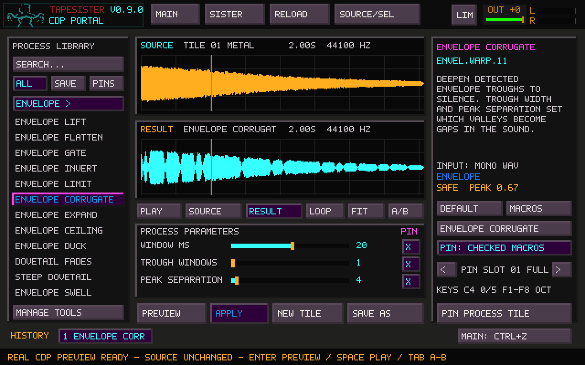
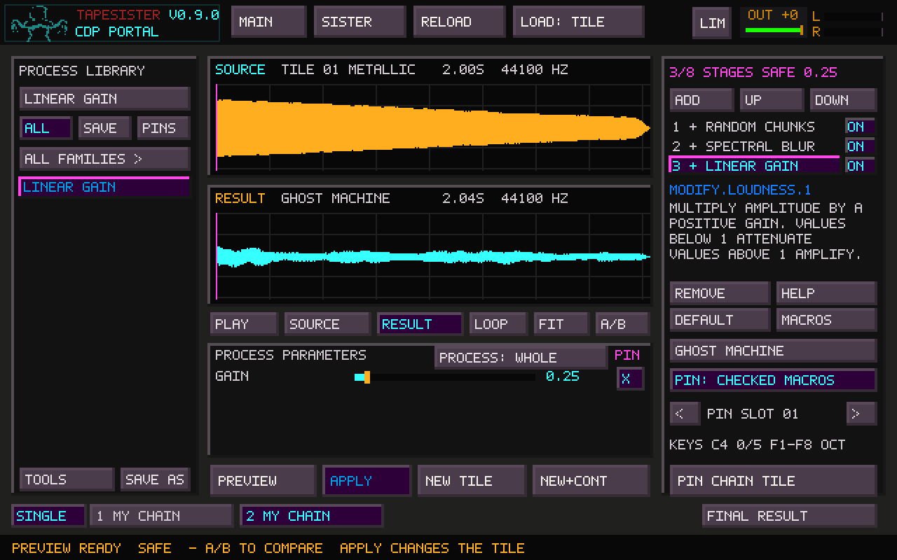
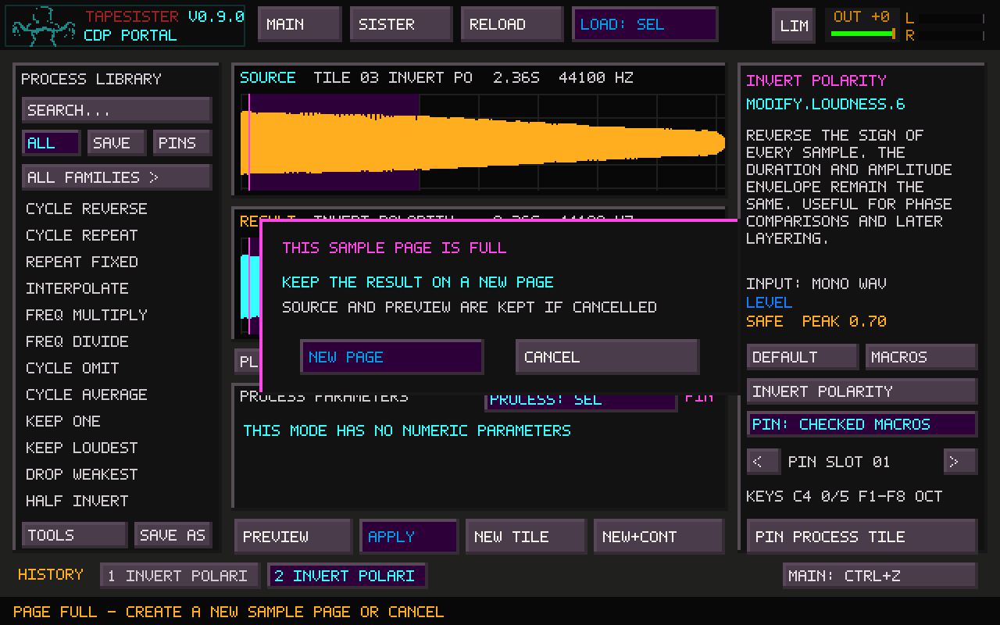
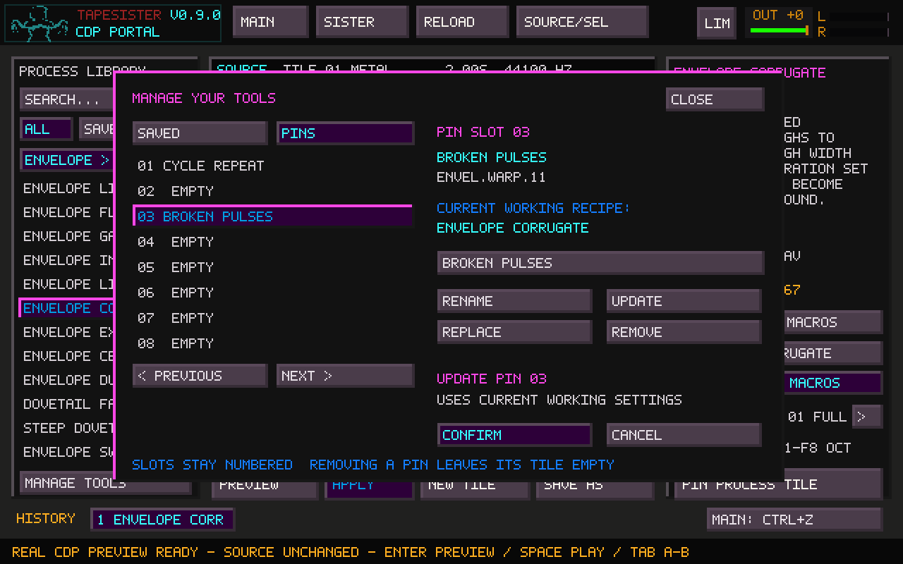
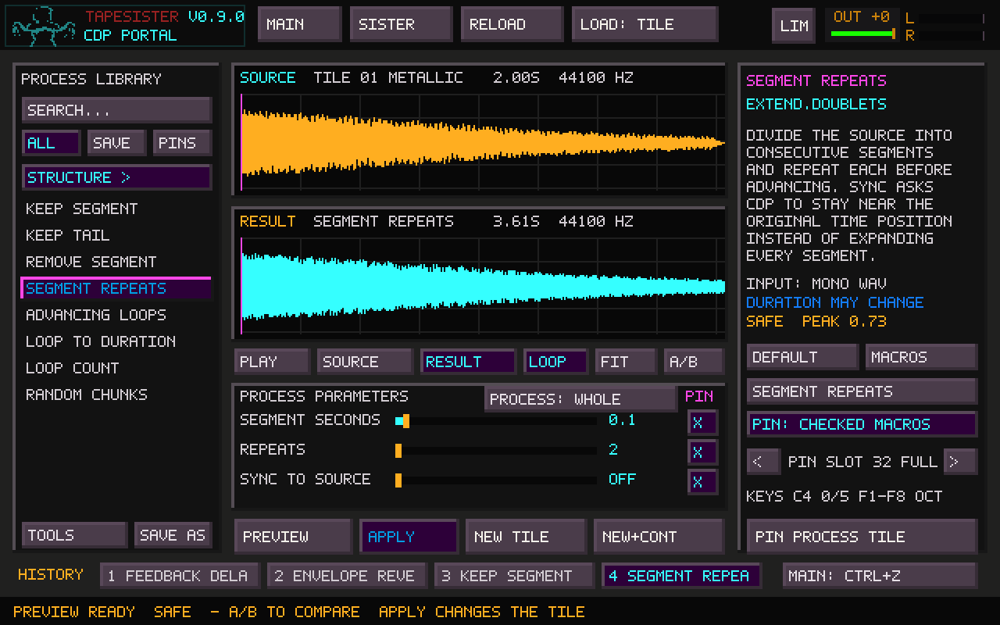
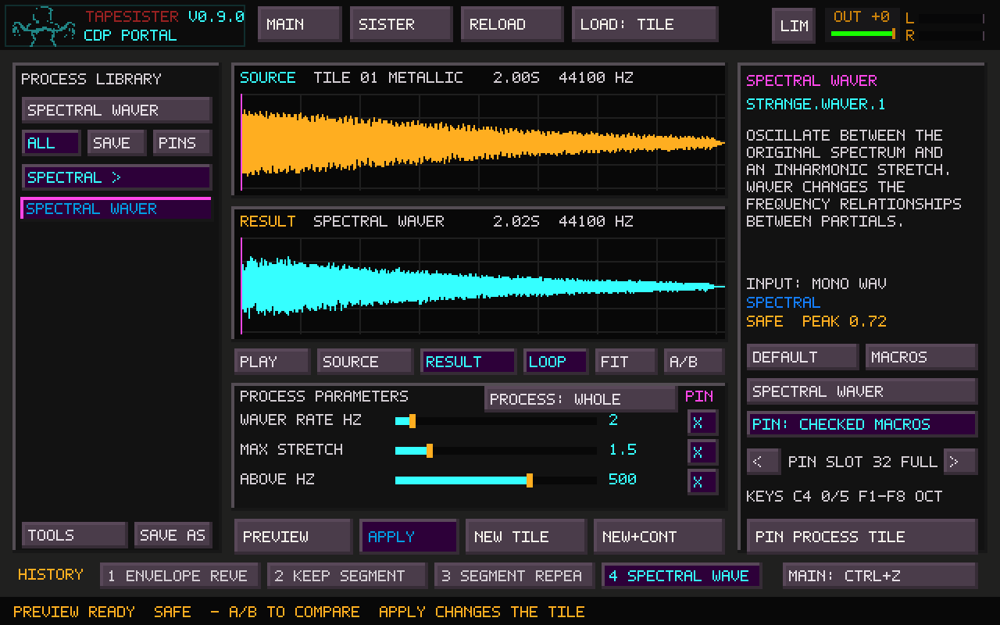

# CDP Portal — explore, chain, and save your tools



CDP Portal is the exploratory workbench inside TapeSister. The original 32
curated CDP instruments remain unchanged. The Portal uses a separate, stable-ID
process registry and separate recipe/pin storage.

## Open and explore

Load or generate a mono tile. On the CDP panel, click **PORTAL**, or press
**Ctrl+Shift+P** from the main workspace. The Portal takes an immutable snapshot
of Current (the current selection when one exists). **LOAD: TILE / LOAD: SEL** toggles
between whole-tile and main-canvas selection import; **RELOAD** refreshes the
snapshot. Failed source loading clears the previous snapshot.

The Portal exposes **131 processes across ten families**: 28 waveset, 50 spectral,
four time/tape, 13 filter, four grains, three lo-fi/modulation, five level, one
delay, 15 envelope, and eight structure processes. Search matches names, stable command IDs, descriptions, and
families. **ALL**, **SAVE**, and **PINS** switch the left browser between
processes, saved recipes, and user process pins. Scroll that column with the
mouse wheel. The family button below the tabs cycles **ALL FAMILIES**,
**WAVESET**, **SPECTRAL**, **TIME / TAPE**, **FILTER**, **GRAINS**, **LO-FI / MOD**, **LEVEL**, **DELAY**, **ENVELOPE**, and **STRUCTURE**. Family and text filters combine, including in
saved recipes and pins. Clearing the search and choosing ALL FAMILIES restores
the complete list. Filtering never renumbers stored slots.

These 131 Portal modes accept mono input only; stereo is rejected explicitly.
Multi-input/multichannel, breakpoint-file, and text-file workflows remain future
work. The factory bank retains its original 32 curated instruments.

## Reusable process chains



Click **CHAIN** at the bottom left to turn the current process into stage one.
A chain holds **one to eight stages**. The stage list replaces the explanation
area on the right; the source/result waveforms and parameter controls stay in
place. The process catalog remains at 131 modes.

1. Click **ADD**, then choose a process in the left browser. It is inserted
   after the selected stage. You can also pick a saved single-process recipe
   while ADD is armed. Click ADD again to cancel insertion.
2. Click a stage row to edit its parameters. Choosing another process from
   **ALL** replaces the selected stage unless ADD is armed. Loading a saved
   chain from SAVE/PINS loads the complete chain; chains cannot be nested.
3. **UP / DOWN** reorder the selected stage. **ON / OFF** enables or bypasses
   it without losing its settings. **REMOVE** deletes that stage from the
   working chain. At least one stage remains.
4. **PREVIEW** runs the chain. Changes invalidate that stage and the stages
   after it. Earlier compatible cached results are reused. Pressing Preview
   with unchanged controls deliberately re-renders from the selected stage,
   which lets you reroll a random process. Select stage one to rerender all.
5. A **+** beside a stage means its output is available for audition. Click
   its row, then use Play, Loop or QWERTY to hear that intermediate output.
   **FINAL RESULT** returns to the completed chain. Source/result audition
   selections remain independent, including while looping.

The selected stage's parameter checkboxes decide its exposed macro controls.
**MACROS** shows only those checked controls for the selected stage; **FULL**
shows all of its controls. Choose another stage to reach its macros. The chain
name field names the whole tool. **SAVE AS** saves every stage, its order,
bypass state and values. **PIN CHAIN TILE** saves the whole chain in a user-pin
slot. Exact pins clear exposed controls on every stage; checked-macro pins
preserve each stage's choices. The same collection manager can rename, update,
replace or remove these tools. Updating a chain keeps the saved name and copies
its complete current stage sequence. Replacing can switch a slot between a
single process and a chain.

**Apply, New Tile and New + Continue always use the final completed chain**,
including when an intermediate stage is displayed. Apply replaces the current
tile's source region and promotes the complete result. New Tile preserves the
Portal source. New + Continue makes the new tile the source. Each successful
Apply is one Undo step for the whole chain, not a separate step per stage.

With **PROCESS: SEL**, the chain processes the selected source region. Each
stage receives the processed region at its current length; the surrounding
audio remains intact. This is one processing region for the entire chain,
not a separate selection stored per stage. Changing the source selection
requires a new preview. Main-canvas selection import still works as before.
Neither processing selections nor source audio are stored in chain recipes.

The **SINGLE** button returns to single-process mode with the currently selected
stage. It clears the working chain and preview history; save a chain before
leaving it if you want to keep it. Saved chains and pins are retained. Closing
and reopening the Portal retains the working chain but reloads the source.

Intermediate caching is limited to **eight million mono frames total** (about
32 MB), separately from the existing four-result / eight-million-frame history
limit. Old intermediate audio is evicted first. Selecting an evicted stage
shows that a preview is needed; rendering restarts from the nearest compatible
cached predecessor, or from source. Cached audio is not saved to disk with the
recipe. Random stages without native seed controls can produce a new result
when rerendered; a saved chain preserves the recipe, not its audio.

A failing stage reports its number and process. No partial chain can be applied,
and cancellation discards the unfinished generation. Rendering stays off the
audio callback. Notes are detached before replacing source, stage or history
audio. Each process retains its own source-dependent bounds and timeout. Stage
boundaries use the existing CDP WAV staging format, so this does not introduce
a new high-resolution rendering path or remove per-stage quantization.

## Waveset family

Cycle Reverse, Repeat, Repeat 2, Interpolate, Multiply, Divide, Omit, Average,
and Delete modes 1–3 are joined by all eight native `distort reform` modes:

| Process | Native CDP identity | Behavior / controls |
| --- | --- | --- |
| Fixed Square | `distort.reform.1` | Fixed-level square half-cycles |
| Square Wave | `distort.reform.2` | Square half-cycles following source peaks |
| Fixed Triangle | `distort.reform.3` | Fixed-level triangular half-cycles |
| Triangle Wave | `distort.reform.4` | Triangular half-cycles following source peaks |
| Half Invert | `distort.reform.5` | Inverted half-cycles (existing process) |
| Click Stream | `distort.reform.6` | Short clicks at half-cycle boundaries |
| Sine Wave | `distort.reform.7` | Sinusoidal half-cycles following source peaks |
| Contour Exaggerate | `distort.reform.8` | Contour exponent 0.125–8; 1 is neutral |

Reform modes 1–7 have no numeric controls. Their settings can still be saved and
pinned. Fixed-level modes discard the original amplitude envelope and can be loud;
check the result peak before Apply. Waveset processing needs at least two complete
wavecycles, and group/skip controls must fit the source.

## Spectral family

| Process | Native CDP identity | Controls |
| --- | --- | --- |
| Spectral Blur | `blur.blur` | 1–4096 spectral windows, bounded by source length |
| Suppress Partials | `blur.suppress` | Remove 1–513 loudest partials per frame |
| Spectral Chorus | `blur.chorus.5` | Amplitude scatter 1–1028; frequency scatter 1–4 |
| Spectral Time | `stretch.time.1` | Duration ratio 0.25–16, bounded by Portal memory limit |
| Spectral Average | `blur.avrg` | Average over 3–511 bins, odd integers only |
| Amplitude Chorus | `blur.chorus.1` | Amplitude scatter 1–1028 |
| Frequency Chorus | `blur.chorus.2` | Frequency scatter 1–4, both directions |
| Chorus Up / Down | `blur.chorus.3` / `.4` | Frequency scatter 1–4, upward / downward |
| Amp + Chorus Up / Down | `blur.chorus.6` / `.7` | Amplitude scatter 1–1028; frequency scatter 1–4 |
| Spectral Noise | `blur.noise` | Noise amount 0–1 |
| Spectral Spread | `blur.spread` | Frequency-wise envelope bins 1–64 (`-f`); spread 0–1 (`-s`) |
| Stretch Above / Below | `stretch.spectrum.1` / `.2` | Split 500–5000 Hz, ratio 0.25–4, exponent 0.25–8, depth 0.01–1 |

Each preview automatically runs **PVOC analysis → process → PVOC synthesis**.
You bring in audio and receive audio; intermediate analysis files stay in the
isolated temporary job directory and are cleaned up afterward. This batch uses
1024-point analysis, CDP overlap setting 3, a 128-frame hop, and 513 spectral
bins. Analysis settings are fixed in these version-1 process definitions.
Sources need at least 2048 frames and 40 ms. Blur rejects window counts longer
than the source supports rather than silently changing the recipe.

Spectral Average exposes odd window counts because CDP rounds its averaging
window to an odd number internally. Dragging and wheeling preserve that constraint;
exact entry rejects even numbers. All seven chorus modes are available, with
separate amplitude and frequency controls where the native mode supports them.
A frequency ratio of one removes scatter, but native frequency modes still re-bin
partials, so they need not null against the unprocessed PVOC round trip.

Stretch Above and Stretch Below warp partial frequencies on one side of the split.
CDP rejects ratio 1 and scalar depth 0, so these are explained or excluded by the
Portal. Split and ratio must also fit the source sample rate and analysis bins;
combinations that leave no room for CDP's stretch recurrence are rejected before
analysis. This is frequency warping, distinct from Spectral Time's duration change.

These are native scalar controls. CDP can also accept breakpoint files for some
parameters; this batch does not expose that input. The time-ratio and blur caps
are Portal bounds, not claims about CDP's maximum capability.

Chorus uses randomness, so an exact pin preserves the settings rather than
guaranteeing identical audio on each render. Spectral processing can produce
HOT results or intentional silence (especially strong partial suppression).
The existing peak report and audition limiter remain available. PVOC padding
can slightly extend duration even when a process does not stretch time.

## Time / tape family

| Process | Native CDP identity | Controls |
| --- | --- | --- |
| Tape Speed | `modify.speed.1` | Speed multiplier 0.125–8 |
| Tape Transpose | `modify.speed.2` | Fractional semitone shift −36 to +36 |
| Tape Vibrato | `modify.speed.6` | Rate 0–120 Hz; depth 0–24 semitones |
| Sound Reverse | `modify.radical.1` | Whole-snapshot reversal, no numeric parameters |

These processes operate directly on the audio waveform. Speed and transposition
change pitch and duration together; vibrato continuously varies playback speed.
Compare them with Spectral Time, which changes duration while retaining pitch,
or Cycle Reverse, which reverses small groups instead of the whole sound.

This batch requires at least 40 ms of mono audio. Speed, transposition, and
depth use bounded Portal ranges within CDP's native limits. Requests whose
estimated output exceeds eight million frames are rejected before launching.
Vibrato uses a conservative estimate based on its slowest permitted speed.

## Filter family

| Process | Native CDP identity | Controls |
| --- | --- | --- |
| Notch Filter | `filter.variable.1` | Acuity, output gain, frequency, tail |
| Band Pass | `filter.variable.2` | Acuity, output gain, frequency, tail |
| Low Pass | `filter.variable.3` | Acuity, output gain, frequency, tail |
| High Pass | `filter.variable.4` | Acuity, output gain, frequency, tail |
| Sweeping Band | `filter.sweeping.2` | Acuity, output gain, low/high frequency, sweep rate, tail, start phase |
| Phasing | `filter.phasing.2` | Phasing gain, fixed delay, tail |
| Low Shelf EQ / High Shelf EQ | `filter.fixed.1` / `.2` | Boost/cut −24 to +24 dB, frequency 40–16000 Hz, tail, input gain 0.01–1 |
| Peak EQ | `filter.fixed.3` | Bandwidth 20–4000 Hz plus boost/cut, center frequency, tail, input gain |
| Sweeping Notch / Low Pass / High Pass | `filter.sweeping.1` / `.3` / `.4` | Same seven controls as Sweeping Band |
| Allpass Shift | `filter.phasing.1` | Feedback −0.95 to +0.95, delay 0.1–50 ms, tail |

Try Low Pass and High Pass on the same source to hear which layers each reveals.
Band Pass isolates a region; Notch cuts a region out. **Acuity** is CDP's native
control: smaller values make a narrower, more resonant filter. Its Portal range
is 0.05–1. Output gain is a linear multiplier from 0.01–1; resonance can still
boost the result, so watch the peak report and compare Source/Result levels.

Sweeping Band moves between **LOW HZ** and **HIGH HZ** at 0–20 cycles per second.
Low must be below High. Start phase 0 begins low, 0.5 begins high, and 1 returns
low. A zero sweep rate holds the starting position. **Wheel over the parameter
labels** to reach the remaining controls; the footer shows which controls are
visible. Wheeling a slider or number makes fine changes to that value instead.
All seven controls can be typed exactly, saved, or exposed as pin macros.

Variable and sweeping filter frequencies span 20–6000 Hz and must also fit within one sixth of the
source sample rate. This is a conservative Portal bound for CDP's state-variable
filter, whose recurrence is not stable all the way up to Nyquist. Settings are
rejected with an explanation when the source rate is too low; saved recipes are
never silently adjusted. These bounds are not CDP's full nominal parameter range.

Phasing mixes the source with a delayed allpass signal. **Phasing Gain** is its
feedback coefficient (−0.95 to +0.95), not an output-volume slider. Delay ranges
from 0.1–50 ms and must fit between one source sample and half the source duration.
This version holds the delay fixed; Sweeping Band provides automatic motion.

Allpass Shift returns the delayed allpass signal without mixing the dry source
back in. Compare it with Phasing using the same feedback and delay settings.
The three fixed EQ modes use a separate native algorithm: their frequencies must
be below source Nyquist, and Peak EQ bandwidth must stay below one quarter of the
source sample rate to avoid the native coefficient singularity. EQ input gain is
applied before the filter. These EQ limits are distinct from the state-variable
filter's rate/6 bound.

All 13 modes work directly on mono WAV audio of at least 40 ms. **TAIL SECONDS**
appends 0.01–2 seconds (default 0.25) for decay. Zero is deliberately excluded:
CDP uses it to request an automatic tail of unknown duration. The source plus
explicit tail must fit the Portal's eight-million-frame limit. The tail is part
of the rendered result when applied or copied to a new tile. No breakpoint files
are needed for this batch.

## Grains family

| Process | Native CDP identity | Controls |
| --- | --- | --- |
| Granular Pitch | `modify.brassage.1` | Semitone shift −24 to +24 |
| Granular Time | `modify.brassage.2` | Input velocity 0.125–8 |
| Grain Scramble | `modify.brassage.4` | Grain length 12–250 ms; lookback 0–2000 ms |
| Grain Density | `modify.brassage.5` | Grain overlap 0.125–2 |

These processes cut grains out of the source rather than relying on quiet gaps
to detect pre-existing grains. They work with sustained sounds, drones, and
ordinary recordings. They are offline CDP processes; their controls are separate
from the live granular pedalboard effect.

**Granular Pitch** shifts the contents of overlapping grains while keeping roughly
the same overall duration. Compare it with Tape Transpose, where pitch and duration
change together. **Granular Time** keeps pitch while changing duration, using CDP's
native **velocity** parameter: 0.5 makes roughly twice the duration; 2 makes roughly
half. Compare its grain texture with Spectral Time on a sound with clear attacks.
Zero velocity is excluded because it requires an explicit output-duration workflow.

**Grain Scramble** chooses grain material from behind the advancing source position.
Grain length controls the size of each fragment. Lookback controls how far into the
past it can reach; zero keeps the normal source progression, with grain scatter
still active. The lookback range must fit within twice the source duration, CDP's
native bound. This is backward local searching, not a full-file random permutation.

**Grain Density** changes how closely the grains sit together. Values below one
leave gaps; larger values overlap them. Try 0.25 and inspect the result waveform,
then hold a QWERTY note with Loop enabled. Compare against 2 for a denser texture.
Density changes overlap and gaps, rather than acting as a duration multiplier.

Pitch, Time, and Density use CDP's fixed 50 ms grains. All four modes use 5 ms
start/end splices and native random scatter of 0.5 of the output hop. These are
fixed settings of the selected CDP modes, not hidden adjustable Portal controls.
An exact recipe or pin preserves parameter settings, **not an identical random
render**. Overlapping grains can boost the level; check the existing peak report
and use Source/Result auditioning to compare.

Input must be mono, at least 40 ms, and long enough to supply a complete grain.
Pitching upward reads more source frames for each output grain, so it may need a
longer selection. Grain Scramble requires a grain shorter than the source, with
room for its splices. Invalid combinations report an explanation before CDP runs.
Output length is checked using CDP's rounded input/output hops, final grain, and
maximum scatter against the eight-million-frame Portal limit. Grain boundaries,
source-end handling, and scatter mean durations are approximate, including for
pitch-only processing. The slider bounds above are Portal limits within CDP's
native ranges. Breakpoint files and stereo spatialisation remain future work.

## Lo-fi / modulation family

| Process | Native CDP identity | Controls |
| --- | --- | --- |
| Bit + Rate Reduce | `modify.radical.4` | Bits 1–16; rate division 1–256 |
| Quantise | `modify.radical.7` | Bits 1–16 |
| Ring Modulate | `modify.radical.5` | Sine modulation frequency 0.1–12000 Hz, below source Nyquist |

Bit + Rate Reduce averages each group of N samples, quantises it, and holds the
value for that group. The native implementation accepts non-power-of-two division
values, including 3. A partial last group is discarded, so output can be a few
samples shorter. The WAV sample-rate tag remains unchanged. Quantise changes only
amplitude resolution with native mid-rise quantisation. Ring Modulate creates sum
and difference frequencies; try 150 Hz on a 500 Hz tone to hear 350/650 Hz sidebands.

## Level family

| Process | Native CDP identity | Controls |
| --- | --- | --- |
| Linear Gain | `modify.loudness.1` | Positive gain 0.001–4; 1 retains level |
| dB Gain | `modify.loudness.2` | −24 to +24 dB; 0 retains level |
| Raise Peak | `modify.loudness.3` | Target peak 0.01–1, above the source peak |
| Set Peak | `modify.loudness.4` | Target peak 0.01–1, above or below source peak |
| Invert Polarity | `modify.loudness.6` | No numeric controls |

The labels reflect the audited implementation: CDP's mode 3 **raises** the peak
and rejects audio already above the target. Set Peak can either amplify or
attenuate. Both reject silence and an already-matching target; the Portal checks
these cases before launching. Very quiet audio below the WAV16 staging resolution
is also rejected for peak normalisation. CDP rejects zero linear gain, so it is
excluded from the slider. This is peak scaling, not perceived-loudness measurement.

## Delay family

| Process | Native CDP identity | Controls |
| --- | --- | --- |
| Feedback Delay | `modify.revecho.1` | Delay, wet mix, feedback, tail, input gain, invert dry |

Feedback Delay uses delay 0.1–2000 ms (at least one source sample), wet mix 0–1, feedback
−0.95 to +0.95, tail 0–4 seconds, and input gain 0.01–1. Negative feedback inverts
successive repeats. CDP also applies its native feedback-dependent gain
compensation, so input gain is not a final output-volume control. Feedback Delay
can invert the dry signal for phase cancellation effects.

**Wheel over the labels** to reach tail, input gain, and dry inversion. All six
controls support exact entry, recipe saving, and pin macro mapping.

Unlike filter tails, delay tail 0 is an explicit zero-length tail. The source plus
tail must fit eight million frames. CDP's block handling may shorten the nominal
source-plus-tail length by one sample. Lo-fi, level, and delay processes require
at least 40 ms of mono input and use the existing isolated WAV processing path.


## Envelope and wavecycle expansion

The Envelope family operates directly on a mono WAV. CDP's `envel` executable
is included in the packaged runtime; an external CDP installation must also
provide it. No breakpoint file or auxiliary sound is needed for these modes.

| Process | Native ID | Main controls |
|---|---|---|
| Envelope Reverse | `envel.warp.2` | Envelope window |
| Envelope Exaggerate | `envel.warp.3` | Window, exponent |
| Envelope Lift | `envel.warp.5` | Window, lift amount |
| Envelope Flatten | `envel.warp.7` | Window, averaging windows |
| Envelope Gate | `envel.warp.8` | Window, gate, smoothing |
| Envelope Invert | `envel.warp.9` | Window, gate, mirror |
| Envelope Limit | `envel.warp.10` | Window, limit, threshold |
| Envelope Corrugate | `envel.warp.11` | Window, trough width, peak separation |
| Envelope Expand | `envel.warp.12` | Window, gate, threshold, smoothing |
| Envelope Ceiling | `envel.warp.14` | Window |
| Envelope Duck | `envel.warp.15` | Window, duck level, threshold |
| Dovetail Fades | `envel.dovetail.1` | Fade-in/out seconds and linear/exponential curves |
| Steep Dovetail | `envel.dovetail.2` | Fade-in/out seconds, doubly exponential curves |
| Envelope Swell | `envel.swell` | Peak time in seconds, linear/exponential curve |
| Tremolo | `envel.tremolo.1` | Rate Hz, depth, output gain |

**Envelope Reverse** reverses the loudness contour while the audio continues
forward. Compare it with Sound Reverse. **Corrugate** digs gaps around detected
troughs; **Ceiling** raises the contour toward its own maximum. **Expand** follows
CDP's particular mapping: levels below the gate disappear and levels above it
move upward toward the threshold. It is not a conventional downward expander.
Envelope Invert changes dynamics, not polarity. Depth zero in Tremolo preserves
the sound at its output gain.

Envelope windows range from 5–200 ms and CDP rounds them to supported sample
blocks. Short sources need at least two complete windows; averaging counts and
peak separation must fit the extracted contour. Fade durations must not overlap,
and a swell peak needs at least 5 ms on each side. Portal reports incompatible
settings before rendering. Mirror stays below 1 to avoid CDP's zero denominator;
mirror/threshold must exceed the gate, and the limit must exceed its threshold.
A gate that removes the entire contour is reported explicitly. Some other
extreme settings can also produce an effectively zero envelope; CDP's failure
is shown and cannot be applied. Envelope imposition uses CDP's native peak
scaling when necessary, so check the actual rendered result.

The Waveset family gains nine more transformations:

| Process | Native ID | Main controls |
|---|---|---|
| Cycle Rise | `distort.envel.1` | Cycle group, trough level, exponent |
| Cycle Fall | `distort.envel.2` | Cycle group, trough level, exponent |
| Cycle Trough | `distort.envel.3` | Cycle group, trough level, exponent |
| Cycle Fractal | `distort.fractal` | Scale division, copy gain, input gain |
| Strongest Cycle | `distort.replace` | Cycle group, skipped cycles |
| Cycle Telescope | `distort.telescope` | Cycle group, skipped cycles, average/longest length |
| Cycle Pitch Warp | `distort.pitch` | Octave range, cycle span, skipped cycles |
| Noise Overload | `distort.overload.1` | Clip level, pattern depth |
| Sine Overload | `distort.overload.2` | Clip level, pattern depth, pattern frequency |

Cycle group/skip must fit the source. Strongest Cycle can alter duration because
cycles have unequal lengths; Telescope contracts groups into composite cycles.
Pitch Warp and Noise Overload use native randomness: saved settings do not
promise an identical random realization. Sine Overload's pattern frequency
must remain below the source Nyquist frequency. Expansion estimates, timeouts,
output validation, and the existing eight-million-frame limit still apply.

## Preview and learn

- **PREVIEW / Enter** runs CDP in the background. The same button cancels a job.
- Drag sliders; wheel a parameter for fine increments; click its number to type
  an exact value and press Enter. Escape abandons number editing.
- **PLAY / Space** starts or stops auditioning. After completion, Space restarts.
- **SOURCE / RESULT / A/B / Tab** select or switch audition sources. Switching
  aligns elapsed time in seconds; it does not pretend unequal files have equal
  duration. An out-of-range position restarts in the destination's valid range.
- **LOOP** repeats the current audition range.
- **QWERTY notes:** the same two keyboard rows as Main play the selected
  **SOURCE** or **RESULT**, with up to five simultaneous notes. **C4 plays the
  original pitch**, C5 is an octave up. **F1–F8** select keyboard octaves
  (F5 selects C4); held notes keep their pitch when the octave changes.
  Each note starts at the selection's beginning, or the whole sound's beginning
  without a selection. It stops on key release or at the end when Loop is off.
  With Loop on, it repeats while held. Starting a note replaces ordinary Play
  auditioning; Space/Stop clears the whole preview chord.
- **A/B with held notes** preserves each note's pitch and matches elapsed source
  position, clamping to the destination selection when needed. Live loop-range
  editing also applies to all held preview notes. The playhead follows the most
  recently started active note. The KEYS line shows octave and active voice count.
- Search, name, numeric fields, and the collection manager consume typing without
  starting notes. Releasing a held key still stops its note after focus moves
  into one of these fields. Losing window focus, closing the Portal, replacing
  its source/result, and changing process settings release preview voices.
  Playing notes does not alter rendered audio or saved recipe parameters.
- Click a waveform to place its playhead; drag to select an audition range and
  move the playhead to its start; right-click clears that range.
- **Alt+wheel** over a selection expands (up) or contracts (down) the edge on
  that side of its center, using the canvas's zero-crossing steps. While looping,
  wheel resizing and dragging update the audible range without stopping or
  restarting the voice. The playhead stays where it is while inside the new
  range; otherwise it moves to the new start. Clearing the range keeps the whole
  waveform looping. Editing a stopped preview does not start playback.
- Wheel over either waveform to zoom; Shift+wheel pans; **FIT** restores both
  full views. Source and Result audition selections remain independent.
- **PROCESS: WHOLE / PROCESS: SEL**, above the parameter sliders, controls the
  render scope. WHOLE processes the full Portal source. SEL processes the region
  drawn on the Source waveform; without a source selection, Preview asks you to
  draw one. The Result waveform selection always controls auditioning only.
  To process part of a result, first use Apply or New+Cont to make it the source.
- A selection render combines the untouched source prefix, the transformed
  selection, and the untouched suffix into a complete result. Length changes
  move the suffix accordingly. Short boundary splices affect the processed
  region only. Source and Result initially highlight the corresponding regions,
  even when their lengths differ. You can then audition either independently.
- In PROCESS: SEL mode, changing or clearing the source selection invalidates
  the render and cancels an outstanding job, without interrupting a running
  audition loop. Preview again before applying. Result-selection changes do not
  invalidate the render. In WHOLE mode, both selections are audition-only.
- **APPLY** replaces the original snapshot range and promotes that result to
  the new Portal source. Choose another process and Preview immediately; no
  Reload is needed. For a main-canvas selection, the transformed region remains
  the source, with its new length; surrounding audio stays outside the operation.
  Each Apply retains its own normal tile Undo step. The old source’s preview
  history is cleared, audition returns to Source, and held notes stop before
  their audio is replaced. For a Portal selection render, the new source is the
  complete assembled result, with the transformed region selected for the next
  operation. Main-canvas selection imports continue to target their original
  region within the main tile.
- **NEW TILE** copies the result into an empty slot on the current sample page.
  A full page is reported without overwriting anything. Like the existing
  copy-to-new-tile helper, the new tile receives a whole-sample forward loop.
  **The Portal source stays unchanged**, allowing further variations from the
  same sound. The main canvas selects the new tile; Apply still checks the
  original source tile, so return to it or Reload before replacing another tile.
- **NEW+CONT** (New + Continue) keeps the complete result in an empty tile and
  promotes that tile to the Portal source. The original tile remains available.
  Repeat Preview then New+Cont to keep each successive generation. A processed
  selection follows its new boundaries into the next source.
- A full page opens **NEW PAGE / CANCEL** for both New Tile and New+Cont. Cancel
  keeps the source and ready result intact. New Page creates a sample page and
  completes the requested action; recording and page-limit restrictions are
  reported without losing the preview. If copying fails after page creation,
  the empty new page is removed and the previous page restored.
- **MAIN: CTRL+Z** returns to Main, where Ctrl+Z undoes the last tile edit.



Rendering never changes audio automatically except when explicitly invoking a
main-page process pin's left-click quick apply. Edited parameters invalidate the
result and cancel an outstanding job. Apply checks the original tile, sample
page, and audio hash; it rejects a stale result. Preview auditioning uses the
existing playback path and global output/limiter controls.

The history strip retains up to four rendered variants for the current source.
Click one to restore its settings, processing scope, and audio, including the
original selected-region boundaries. History is session-only and resets on source
reload, successful Apply, or New+Cont. Aggregate history storage is bounded to eight million mono
frames (32 MB); oldest results are evicted first. Each source and result is also
bounded to eight million frames. This permits about 181 seconds at 44.1 kHz;
choose a smaller main-canvas selection for longer recordings. Expanding
processes also preflight their output estimate. CDP timeouts remain enforced.

## Save a recipe or make an instrument

Click the name field to name a recipe. **SAVE AS**, beside **TOOLS** below the
process browser, adds its exact current
settings to the saved browser. A saved recipe contains no source audio or
source file paths, so it can be applied to a different waveform. Processing
selections are specific to the current source and are not stored in recipes.

The **PIN** checkboxes beside parameters select which controls the user-made
instrument exposes. Choose **PIN: CHECKED MACROS** or **PIN: EXACT RECIPE**,
select an empty pin slot, then click **PIN PROCESS TILE**. An exact pin fixes all
values; a macro pin exposes only the checked controls. **FULL** reveals the
underlying controls again. Macro names are the real CDP parameter names in this
first release; custom macro naming, range remapping, and multi-parameter macros
are future work.

Back on the main CDP panel, **PINS** switches between factory instruments and a
separate pair of 16-slot user-pin pages. Left-click a filled pin to render and
apply its stored settings (the Portal opens so cancellation/errors remain
visible). Middle-click to explore its exposed controls before rendering.
The factory bank and sample tiles are not overwritten by saving pins.

There are 32 saved-recipe slots and 32 process-pin slots. **SAVE AS** still adds
to an empty saved slot; pinning to an occupied slot directs you to the manager.

### Manage the collection



Click **MANAGE TOOLS** below the process list. Choose **SAVED** or **PINS**, then
a numbered destination. Wheel the list or use Previous/Next to reach all 32
slots. If you loaded a saved recipe or pin, its slot is selected initially.
The manager takes a snapshot of your current working recipe when it opens.

- **Rename:** click the name field, edit it (Ctrl+A clears it), then Rename.
  This changes only the destination's name.
- **Update:** copy current parameter values and macro choices into the selected
  slot while keeping its name. The process must match; for a different process,
  use Replace. Edit controls on the main Portal page before opening the manager.
- **Replace:** put the complete working recipe, including its name and process,
  into the selected slot. This also fills an empty slot.
- **Remove:** empty just that slot. Other slots keep their numbers; no audio or
  factory instruments are removed.

For pins, Update and Replace honor **EXACT RECIPE / CHECKED MACROS** from the
Portal page. Each action shows its destination and requires **CONFIRM**.
**CANCEL** or Escape abandons the pending action; Close returns to the Portal.
Changes are persisted before the in-memory collection is updated. If saving
fails, both the existing collection and the previous file remain intact.

`cdp-portal.recipes` is saved beside the active `tapesister.ini`, using a temporary
file and atomic replacement. It is an application-level personal collection,
not embedded in a `.tsr` project. Copy this file alongside the INI when moving
your personal configuration. Source audio, rendered history, and temporary
analysis files are not included. Collections containing chains use `TSCDPPORTAL 2`;
single-process-only collections retain version 1. This build reads both versions.
Earlier TapeSister builds cannot read version 2, so keep a copy of the collection
before going back to an older application version. Invalid/unknown-version files are rejected
transactionally rather than partially loaded.
Saving is blocked after an unsuccessful load so an unreadable existing collection
cannot be overwritten accidentally. Back up and repair that file, then restart.

## Architecture and verification

- `cdp_portal.h` / `ts_cdp_portal.c`: stable process IDs, typed parameter metadata,
  validation, shell-free command generation, recipe persistence, waveform model.
- `ts_cdp_adapter.c`: Portal and factory jobs share the isolated process runner,
  cancellation, timeout, output probing, and diagnostic/cleanup handling. Only
  compile-time registered commands enter the runner; stored recipes cannot name
  arbitrary executables, paths, or shell expressions. Existing 16-bit WAV
  staging is retained; this is not a new high-resolution import/export path.
- `ts_cdp_portal_ui.inc`: native 640×400 renderer, palette accents, bounded labels.
- `main_sdl_portal.inc`: immutable worker ownership, history, audition pointers,
  input handling, main-panel pin actions, stale apply prevention.

Registry metadata is checked against the supplied CDP8 source
(`dev/distort/ap_distort.c`, `dev/blur/ap_blur.c`, `dev/stretch/ap_stretch.c`,
`dev/modify/ap_modify.c`, `dev/modify/brapcon.c`, `dev/modify/granula1.c`,
`dev/modify/gain.c`, `dev/modify/radical.c`, `dev/modify/delay.c`,
`dev/distort/distort.c`, `dev/blur/blur.c`, `dev/stretch/stretch.c`,
`dev/filter/ap_filter.c`, `dev/filter/filters0.c`,
`dev/filter/fltpcon.c`, `dev/include/filtcon.h`, `dev/cdp2k/tklib1.c`, `dev/include/speccon.h`,
`dev/include/modicon.h`, and `dev/pv/pvoc.c`). The process/mode IDs and
names are distinct from the illustrative SCRAMBLE controls in the concept art.
`distort`, `pvoc`, `blur`, `stretch`, `modify`, and `filter` are already in the bundled runtime closure; no runtime dependency
or audio backend change is needed. No SoundThread code or descriptions are
copied into this implementation.

Tests:

```sh
make test
make tapesister_portal_controller_tests
make tapesister_preview_loop_tests
./tapesister_preview_loop_tests
TS_TEST_CDP_BIN=/absolute/path/to/cdp/bin ./tapesister_portal_tests
TS_TEST_CDP_BIN=/absolute/path/to/cdp/bin ./tapesister_portal_controller_tests
```

The core tests exercise every registered mode, recipe validation/persistence,
waveform bounds, and (with TS_TEST_CDP_BIN) real renders and cancellation.
The controller harness exercises the actual SDL application controller,
including stale page/audio rejection, apply/undo, control changes during a job,
selection boundaries, close/cancel, history eviction, pointer detachment, occupied-pin preservation,
new-tile copying, and stale-source clearing. Without TS_TEST_CDP_BIN the
controller harness prints that real-CDP checks were skipped.
The standalone preview-loop test requires SDL but no CDP installation. It covers
live Alt+wheel and drag edits, callback continuity, range clearing, tiny loops,
and stopped/non-looping behavior in Portal and mono/stereo import previews.
It also exercises native input routing (typed values, waveform drag, middle-click
pin editing, and left-click quick apply) and audition range/A-B ownership using
paused dummy SDL devices; it does not open physical audio hardware.

To render a screenshot of actual CDP output:

```sh
TS_TEST_CDP_BIN=/absolute/path/to/cdp/bin ./tapesister_portal_tests portal.ppm manager.ppm
```

### Portal selection and New + Continue verification

The controller now renders the Source waveform selection and assembles the
complete result on its background worker. Tests use a Portal selection inside
a main-canvas selection import: a real CDP time stretch changes the selected
region's length while every sample outside that region remains unchanged.
Apply, Undo/Redo, and two consecutive New+Cont generations preserve the expected
contents and select the transformed region in each new source.

Native Alt+wheel checks confirm that source-selection changes invalidate the
render without stopping a loop; result-selection changes leave the render
valid. History restores the original processing range. Changed-range jobs are
cancelled/discarded, and nonfinite audio outside the processed region is rejected.
New Tile retains the original source pointer, target, and selection scope.

The full-page prompt is tested through native mouse events: Cancel preserves
source/result, capture and page-limit failures retain the pending preview, a
failed copy rolls back the newly created page, and New Page successfully keeps
the result and promotes it when continuing. Existing controller and Portal/import
loop regressions pass. The controller also passes AddressSanitizer and
UndefinedBehaviorSanitizer, with leak detection disabled in this environment.
The process catalog remains at 88; this follow-up adds
workflow controls rather than additional CDP modes.

### Envelope expansion and successive Apply verification

This batch adds **24 processes**, bringing the Portal from 64 to **88**:
15 envelope processes and nine wavecycle processes. The runtime manifest adds
`envel` while retaining all previously bundled programs.

All 88 defaults rendered successfully with source-built CDP8. The new batch's
scalar endpoints were exercised at 44.1 and 48 kHz: source-dependent or coupled
settings were rejected by preflight, and accepted settings produced finite mono
output with clean temporary-file cleanup. Known-tone tests measured reversed,
exaggerated, lifted, gated, ceiling, and ducked contours; neutral-depth tremolo,
its expected modulation sidebands, and both dovetail fade modes also passed.

The actual SDL controller verified two consecutive Apply operations without
Reload, separate Undo steps, duration-changing selection replacement with intact
prefix/suffix audio, updated source hashes/ranges, old-history clearing, and
held-note detachment. New Tile retained the original source pointer, contents,
range, and destination identity. Existing QWERTY, A/B, cancellation, collection
management, and Portal/import live-loop checks passed. The SDL controller also
passed AddressSanitizer and UndefinedBehaviorSanitizer with leak detection
disabled because it is unsupported in this environment. Native screenshots above
show real Envelope Corrugate output. Physical-device listening and Windows
compile checks remain for the release workflow and user testing.

### Multi-family expansion verification record

This expansion adds **34 processes**, bringing the Portal from 30 to **64**:
seven waveset reform modes, 11 spectral modes, seven filters/EQs, three
lo-fi/modulation modes, five level modes, and one feedback delay. All accept one
mono sound and return one sound, using internal PVOC staging where required.

All 64 defaults rendered using the source-built CDP binaries. Scalar lower/upper
settings for the additions and existing non-waveset families rendered at 44.1 and
48 kHz. Dependent settings use valid source-aware combinations: blur windows fit
the source, sweeping low/high remain ordered, and Raise Peak uses a quiet source
so even the minimum target actually raises its peak. Filter/delay tail lengths
and the output-frame limit are checked.

Independent signal tests cover gain scaling, raise/set peak, polarity inversion,
ring-modulation sidebands, three-sample rate-reduction blocks and final truncation,
quantisation levels, square/sine harmonics, chorus pitch retention at neutral
scatter, above/below spectral warping, shelf/peak EQ boost and cut, exact impulse
delay, dry inversion, and the unmixed allpass path. Source audio remains unchanged.
Validation covers odd-only spectral windows, source Nyquist, EQ bandwidth, invalid
spectral split/ratio combinations, silence normalisation, and native rejected
zero settings. Flagged commands and a saved delay pin with sparse macros are checked.

The native SDL controller test covers all eight family categories, scrolling to
dry inversion, exact entry, a real feedback-delay preview, and odd-only averaging
through mouse drag, wheel, and rejected/accepted numeric input. Existing collection,
history, Apply, QWERTY, and live-loop tests passed. Portal core and SDL controller
code passed ASan/UBSan; the keyboard/loop harness also passed under sanitizers.
Leak detection was disabled because LeakSanitizer is unsupported here. These are
Linux source-build and dummy-device checks; Windows packaging and physical-device
listening remain native validation steps. The screenshots show real CDP output
rendered by the native 640×400 interface.

`modify revecho 2` was audited but excluded: the tested pinned runtime produced
silence for dry-only mix and identical output for different random seeds. The
source multiplies its dry path by an inversion value not initialised in that mode.
That mode needs separate runtime investigation before exposing its advertised
controls. No CDP source patch or extra runtime dependency is included in this batch.

### Grains-family verification record

All 30 process defaults and the four new modes' parameter endpoints rendered
through source-built CDP at 44.1 and 48 kHz. Steady-tone measurements verify
up/down granular transposition with approximately preserved length, and time
stretch/compression with retained pitch. Sparse-density renders contain more
measured silence than dense renders. Short-source and 22.05 kHz renders also
passed. Validation covers grain/splice fit, pitch-dependent source length,
lookback limits, finite input, positive velocity, and bounded output length.
Recipes and exact/macro pins round-trip through the existing collection format.

The actual SDL controller test selects the new family, renders Grain Density,
auditions its result as a note, saves an exact pin, and releases the note on
invalidation. Existing collection/history/apply and QWERTY/live-loop regressions
passed. Portal and controller code passed ASan/UBSan with leak detection disabled
because LeakSanitizer is unsupported here. Updated native 640×400 screenshots
show a real density render. Windows compilation and physical-device listening
remain native validation steps.

### Filter-family verification record

All 26 process defaults rendered with source-built CDP binaries. The six filter
modes passed scalar endpoint checks at 44.1 and 48 kHz, including explicit tail
lengths. Three-tone measurements distinguish notch, band-pass, low-pass, and
high-pass behavior; independent acuity/frequency corners also rendered. Sweep
rate/phase and phasing gain changes produced different audio. Validation covers
sample-rate limits, delay versus source duration, finite input, positive tails,
sweep ordering, and the aggregate output limit. Filter recipes and pin macros
round-trip through the existing collection format.

The actual SDL controller test covers reaching the new family, scrolling to
controls 5–7, exact phase entry, pin checkboxes, sparse macro mapping, and a real
sweeping-band preview. Existing collection/history/apply and QWERTY/live-loop
regressions passed. Portal and controller code passed ASan/UBSan; leak detection
was disabled because LeakSanitizer is unsupported here. The screenshots show
actual native 640×400 rendering. Windows compilation and physical-device listening
remain native validation steps.

### QWERTY / time-family verification record

The actual SDL controller/callback harness covers source/result notes, pitch
ratios and octave changes, five-note chords, key repeat, typing isolation,
releases after text/manager focus, A/B with held notes, live loop range edits,
Space, focus loss, process invalidation, and close. Preview audio uses the sample
bus; it is not classified as FM. A Current-tile sync cannot retarget the immutable
preview voices. The worker/history harness also checks notes started during a
render are detached before result storage changes.

All 20 process defaults and the four time/tape modes' scalar endpoints rendered
using source-built CDP binaries at 44.1 and 48 kHz. Duration ratios and reversed
sample ordering were checked. The Portal, controller, and keyboard/loop harnesses
passed ASan/UBSan with leak detection disabled. Core instrument, stereo note-bank,
MIDI, audio-hardening, and companion-focus regressions passed. Windows compilation
and listening through a physical audio device remain native validation steps.

### Collection / spectral verification record

The follow-up passed registry and persistence tests, actual SDL collection-manager
events, and the existing controller lifecycle suite. Checks cover duplicate names,
filtered slot identity, rename/update/replace/remove, cancellation, failed saves,
and loading the resulting collection. The previous live-preview-loop regression
also passed. Manager/controller, Portal core, and live-loop harnesses passed
AddressSanitizer/UndefinedBehaviorSanitizer with leak detection disabled because
LeakSanitizer is unsupported in this environment.

All 16 process defaults rendered using binaries built from the supplied CDP8
source. The four spectral processes also rendered at both parameter-range ends
at 44.1 and 48 kHz (blur's upper endpoint adjusted to the source-length limit).
Cancellation during the middle spectral stage and invalid final-output handling
both passed cleanup checks. Core instrument tests and audio-hardening / companion
focus structural checks passed. The images above were rendered by the native
640×400 UI with real CDP output, not a concept mockup.

### First-slice verification record

The Linux development run passed all 69 Make test executables and the four
structural/packaging checks. The 12 modes were additionally rendered using
`distort` compiled from the supplied, pinned CDP8 source. The native SDL
application compiled, and the controller harness passed both normally and
with AddressSanitizer/UndefinedBehaviorSanitizer. LeakSanitizer is unsupported
in this runner, so leak checking was disabled for that sanitizer run.

CMake, Windows packaging, and physical-device listening checks have not been
run in this environment. Before release, verify the Windows bundle and listen
to source/result A-B, selection joins, and pin quick apply on real hardware.


### Final straightforward-process batch

This batch adds **43 processes**: 35 spectral modes and eight Structure modes.
The remaining candidates and exclusions are recorded in
[the audit](CDP_SIMPLE_PROCESS_AUDIT.md). Reusable multi-process chains are now available as described above; the
individual additions can also be saved as single-process recipes or pins.

Structure provides Keep Segment, Keep Tail, Remove Segment, Segment Repeats,
Advancing Loops, Loop to Duration, Loop Count, and Random Chunks. Position controls
are seconds relative to the current Portal source. Loop length/advance and splice
controls are explicitly labelled in milliseconds. Duration-changing processes
still use the existing Apply, New Tile and New + Continue behavior.

The spectral additions provide sustain, contrast, peak focus, octave folding,
step holding, twelve filter variants, four partial-trace modes, spectral pluck,
blur-and-trace, five frequency-shift modes, three glides, two wavers and two
spectral inversions. Analysis/resynthesis remain automatic. Spectral output may
include a small PVOC tail; use the rendered duration shown in the Portal.





The runtime bundle now includes `focus`, `hilite`, `sfedit`, and `strange` in
addition to the previously bundled programs. No new project or recipe file
version is needed. Structure is appended to the family list, preserving existing
family values and process IDs.

All 131 defaults passed source-built CDP rendering. The new batch has separate
44.1/48 kHz scalar-endpoint and signal checks in
`tests/test_portal_final_batch.c`; run `tapesister_portal_final_tests` with
`TS_TEST_CDP_BIN` pointing to the CDP runtime. Known-tone checks cover spectral
filters, frequency shifts and spectral contrast; structural checks cover exact
slice contents, output durations and repeatable positive-seed scrambling.
Cancellation during the new spectral executable also checks temporary cleanup.
Source-dependent invalid ranges are rejected before rendering.

The native controller checks the new family browser, real Structure and Waver
previews, and existing collection, Apply, QWERTY, A/B and live-loop workflows.
Address/undefined-behavior checks pass; leak detection is unavailable in this
environment. Windows bundle and hardware listening checks remain before release.

### Chain verification record

The native controller renders a three-stage Random Chunks → Spectral Blur →
Linear Gain chain and compares it with the core runner. Editing the last stage
retains the earlier sample allocations and audio hashes. Intermediate QWERTY
chords, final-output application, saved macros/exact pins, manager rename,
reorder/remove/bypass, selection-only duration changes, stale-tile rejection,
Apply/Undo, later-stage failure and cancellation are covered. Eight bypass
stages verify pass-through behavior and bounded intermediate eviction.

Core recipe checks cover version-1 compatibility, mixed version-2 collections,
per-stage values/macros/bypass round trips, filtering, malformed/truncated input,
unknown versions, stage limits, nested-chain rejection and transactional load
failure. Existing Portal lifecycle and live-loop suites run alongside these
checks with AddressSanitizer and UndefinedBehaviorSanitizer. Leak detection is
unavailable in this environment. Windows packaging and real-hardware listening
remain the release checks.
