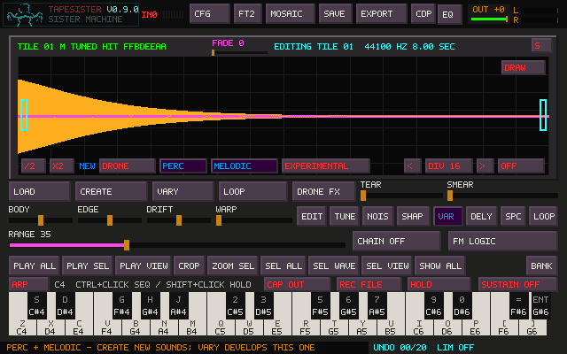
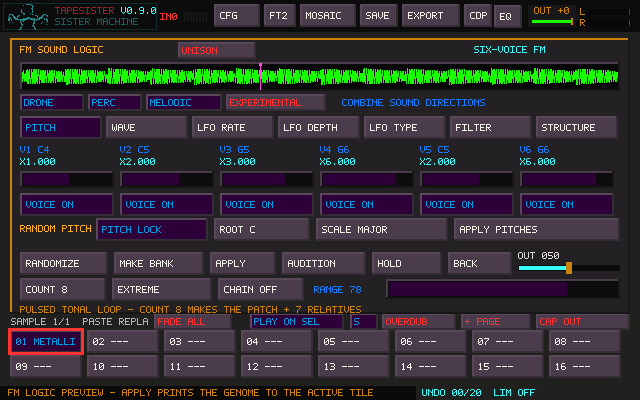

# Create sound directions

The NEW buttons directly above CREATE select its next sound direction. They are
independent toggles: choose any combination, or turn all off for the original fresh
random palette. Create continues to ignore the previous tile's patch and locks.

| Choice | Sound behavior |
| --- | --- |
| Drone | Sustained material, smooth loop boundary, automatic forward loop points |
| Perc | Kicks, snares, hats, cymbals, toms, wood-like hits, bells, digital percussion |
| Melodic | Stable central pitch, harmonic relationships, playable synth/keys material |
| Experimental | Unusual modulation, noise, irregular motion and interaction |
| Perc + Drone | Repeating strikes and decays within a continuous loop |
| Perc + Melodic | Tuned drums, mallets, plucks and FM keys |
| Drone + Melodic | Sustained tonal textures |
| All four | A tonal, pulsing loop with experimental modulation |

In FM Logic, the same four buttons shape the preview immediately; APPLY prints it
into the destination tile. Adding Perc chooses a percussion profile, and adding
Melodic establishes a tonal carrier. Other manual parameters remain editable.
Turning a direction off releases that behavior; it does not undo earlier edits.
FM button changes also become the next main Create choice. Opening a stored patch
shows that patch's directions without silently changing the main Create choice.

RANDOMIZE retains its page-protection and mutation-permission behavior. VARY retains
the stored direction and percussion family; Range controls distance. Waveform edits
continue to use the existing material-based Vary path instead of discarding edits
and restoring an old generator. Shift-CREATE still cycles basic waveforms. CDP rolls
are independent transformations of the created material, and can change its character.

COUNT chooses 1–16 total sounds, including the current patch. Wheel adjusts it;
click cycles upward and Shift-click cycles backward. MAKE BANK writes the current
patch to tile 01 and makes Count minus one relatives. CHAIN OFF derives relatives
from the anchor; CHAIN ON derives each from the previous relative. Range zero keeps
exact copies. Choose a new page or replace just the first Count positions on the
current page. Later tiles and their protection remain untouched. Protected destination
tiles block the operation. The operation retains its existing single Undo/Redo.

Percussion has separate attack, decay and pitch-sweep parameters in the saved patch.
Cymbals and bells can ring longer than hats and clicks. Perc + Drone repeats local
envelopes with a short de-click ramp before the next event. The pulse count closes
across the full sample duration; pitching the sample in the tracker also changes
its pulse rate, as with other sample loops. This is not a tempo-following sequencer.

New directed drones render a short continuation beyond the loop and crossfade it
into the beginning, preserving the full loop length. Loop metadata is attached to
whole generated tiles and follows them into TrackSister. Create stamping remains
confined to the selected interval and does not replace the whole tile's loop points.

The complete direction mask, percussion profile, envelopes, pulse rate and noise
seed live with the patch, including the source saved behind Unison. Preview, Apply
and Make Bank use the same noise realization for a directed patch. TSR33 stores the
new fields and continues to read older projects; old patches retain their original
renderer. The independent next-Create choice and Count are saved in tapesister.ini.
Older TapeSister builds cannot read TSR33 projects.
