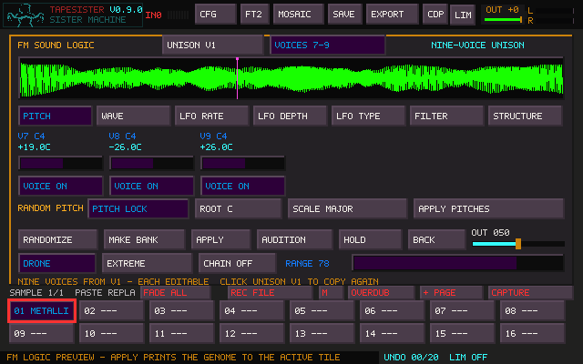

# Nine-voice Unison

Open FM Logic with **Shift+grave**. Set voice 1's pitch and waveform, then press
**UNISON V1**. The preset makes nine independent oscillators from that voice.
The existing ten FM structures still use their original six operators.

| Voice | Detune from the starting pitch |
| --- | --- |
| 1 | 0 cents |
| 2 / 3 | −7 / +7 cents |
| 4 / 5 | −12 / +12 cents |
| 6 / 7 | −19 / +19 cents |
| 8 / 9 | −26 / +26 cents |

Voice 1's waveform, LFO rate, depth and type are copied to every voice. Drone
and Pitch Lock turn on, Structure mutation turns off, and feedback, interaction
mix and transient amount start at zero. The global filter stays as set.
At the extreme ends of the pitch range, the center moves just far enough inward
to keep the complete detune spread in range.

For a supersaw, choose **SAW**, **LFO OFF**, a **6000 Hz** low-pass filter,
**20% resonance**, and zero filter envelope. Other source waveforms work too.

## Edit and record

**VOICES 1–6 / VOICES 7–9** switches the voice controls and on/off buttons.
The Pitch, Wave and three LFO pages follow the selected bank; Filter and Structure
always show their six global controls. The pitch display shows a note and signed
cents. The wheel moves a unison voice by a semitone; **Shift+wheel** moves it by
one cent. Use the slider for a wider pitch movement.

This is a one-time copy. Editing voice 1 afterward leaves your other voices
alone. Press **UNISON V1** again to rebuild the stack from its current settings;
voice 1 remains the center. All individual changes remain until that explicit
copy, another edit, or a permitted randomization.

Every enabled Unison voice is audible. Interaction type, modulation depth and
interaction mix are inactive and dimmed; index LFOs have no modulation index to
change. Feedback still changes the existing final output saturation. The filter
and output trim remain shared. Choosing an older Structure routing restores
six-operator FM; voices 7–9 then stop sounding, with their settings retained.

**APPLY** stores the rendered audio and editable patch in a tile, using the usual
Chain/Mosaic destination choices. Mosaic can layer these printed sounds with
its event volume, pan and fades. **Grave** visits Mosaic; **Shift+grave** visits FM.
A loop repeats the recorded detune beating; choose a steady section and a loop
crossfade for a smooth boundary.

## Saved projects and checks

New saves use **TSR28**, with genome version 5 and explicit fields for voices
7–9. TSR6–TSR27 projects remain readable. The six original operator values and
audio are retained. New TSR28 projects require this build or newer; older builds
cannot open the new format. Export WAVs when sharing audio with older builds.
The Portal prototype pack previously provided is still a TSR27 project.

The native tests check all nine frequencies at 44.1/48 kHz, each oscillator in
isolation, repeatable renders, cent edits, voice-bank mapping, and all nine saved
settings. Workspace tests cover the swapped shortcuts, parked FM previews,
Mosaic event ownership, dialogs and Sister window focus. To check an existing
six-voice project as well, pass its path to `tapesister_fm_unison_tests`.
