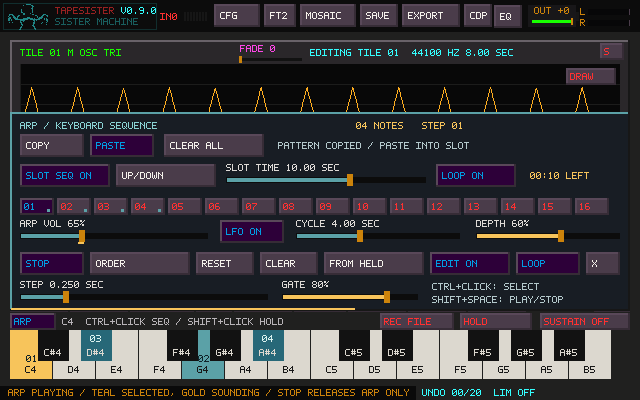
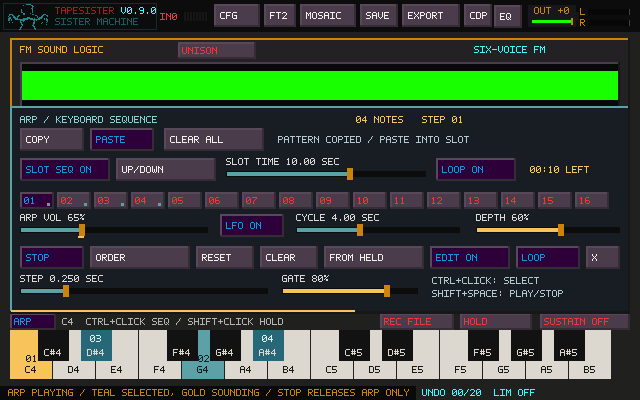

# Keyboard arpeggio and sequencing

Click **ARP** above the main or FM keyboard. With **EDIT ON**, click keys or press
the QWERTY note keys to add/remove pitches, then press **PLAY**. **Ctrl-click**
also changes the selection with the panel closed or EDIT off. Up to 24 pitches
can be selected across different octaves; changing the visible octave does not
transpose or lose them. Empty selections stay silent.

The **01–16** row holds 16 independent ARP sequences. Click a number, then choose
its notes and controls. Edits are retained automatically in that slot; no Store
button is needed. A teal dot marks a slot containing notes, and the highlighted
number is selected. Each slot remembers note selection/order, mode, Loop/Once,
Step, Gate, volume, and all volume-LFO settings. CLEAR empties only the selected
slot's notes.

While ARP is **playing**, click an **empty** slot to copy the current pattern,
including all settings, and turn **EDIT ON**. The sounding note, gate, LFO phase
and note clock continue without a restart. Change the new slot's notes or
controls to make a variation; the original slot remains intact. Clicking an
already populated slot recalls its own pattern from the first note with the
existing short fade. While stopped, a new empty slot opens with default settings
and stays silent. Existing patterns are always retained. Clicking the active
slot again leaves its clock alone; RESET explicitly restarts it.

**COPY** captures the highlighted slot's notes and all its pattern settings without
interrupting playback. Select a destination and **PASTE** to replace its pattern
and enable EDIT. During playback, PASTE targets the currently highlighted slot,
restarts its first note/LFO and outer hold with the existing short fade, and keeps
playing. When stopped, it stays stopped. Other slots and outer mode/time/Loop
settings are unchanged. Copying an empty slot is allowed; pasting it clears the
destination's notes. The clipboard is temporary, shared between main/FM views,
and is not saved in the project.

**CLEAR ALL** empties and resets all 16 patterns, selects 01, stops both ARP clocks
and switches SLOT SEQ OFF. Click its **CONFIRM** button within three seconds to
commit; using another ARP control cancels confirmation. Outer mode, Slot Time and
Loop are retained. Manual/MIDI notes, Sister Machine's held memory and the copied
pattern are untouched, so you can paste that pattern back after clearing the bank.
The lower **CLEAR** button still affects only the current slot's notes. Save the
project to retain pasted patterns or the cleared bank.

The top **SLOT SEQ ON/OFF** row sequences the patterns themselves. Turn it on,
choose a mode and **SLOT TIME**, then PLAY. Enabling it during playback starts
its clock immediately; turning it off leaves the current inner pattern playing.
Empty slots are skipped and never automatically filled by sequencing.

- **UP / DOWN:** increasing / decreasing slot number.
- **UP/DOWN:** increasing then decreasing, without repeating either endpoint.
- **ORDER:** the order in which slots first received notes. Clearing then filling
  a slot moves it to the end. Older projects begin with numerical order.
- **RANDOM:** shuffle the populated slots for each pass, visiting each once.

A pass begins at the manually selected slot and wraps through the chosen order.
**LOOP ON** repeats; **LOOP OFF** stops ARP after the last slot has held for its
full duration. The inner pattern's LOOP/ONCE is separate: an inner ONCE can finish
and wait silently until the next outer slot. STOP/Shift+Space stops both clocks
without releasing manual notes or Sister Machine's held memory. RESET restarts
the current pattern and a fresh outer pass. Manual slot selection starts a new
outer hold/pass from that slot; an empty live copy still preserves inner phase.

**SLOT TIME** is initially 10 seconds, with a default range of **50 ms–4 minutes**.
Drag/wheel to adjust, Shift-wheel for fine changes, right-click for 10 seconds.
Timing edits apply at the next slot; mode changes start a new pass from the
current slot. New/deleted slots enter the next pass; deleted references in the
current pass are skipped. The highlighted slot and live **LEFT** countdown follow
the audio clock even with the window hidden. ARMED means the outer sequence is
enabled but transport is stopped. PLAY starts it again.

To extend the fader to **20 minutes**, set this in `tapesister.ini`:

```ini
arp_slot_max_seconds=1200
arp_slot_min_full_pattern=0
```

The maximum configurable ceiling is 14400 seconds (four hours). A project with
a longer saved slot time keeps it even on a machine with a smaller local fader
range. These two preferences are retained by SAVE CONFIG; the pattern bank,
sequence mode, Loop and Slot Time are saved by the main project SAVE.

The two clocks are intentionally independent. With a 50 ms outer hold and
10-second inner notes, only the first note of each pattern sounds before the
next slot starts. This can create rapid pitch/timbre changes instead of complete
phrases. To ensure at least one full inner traversal per slot, set
`arp_slot_min_full_pattern=1`. The effective hold is then the greater of Slot Time
and note STEP multiplied by the inner cycle length (including the return leg of
UP/DOWN). Gate length does not shorten that cycle. The countdown shows the actual
hold. This minimum does not quantize longer holds to whole cycles. Editing notes,
mode or note timing under this policy extends the current deadline to allow a
full edited cycle; volume/gate/LFO edits do not postpone it.

For example, play G/B/D in slot 05. Click empty 06 while it plays: the phrase
continues into an editable copy. Change its gate and volume LFO; copy again into
07 and change the notes. Enable SLOT SEQ, UP, 10 seconds and LOOP ON to perform
05 → 06 → 07 repeatedly. Sister Machine can hold earlier material underneath.

Main **SAVE** retains all slots, their creation order, the last manually selected
slot and outer sequence settings in the `.tsr` project (v27). Loading restores
them **stopped**: no elapsed clock, sounding note, LFO phase or prepared source
resumes. Automatic slot changes never dirty the project or change its saved
manual selection. Older projects get the outer sequencer disabled; projects
without ARP data get an empty default bank. Edits trigger the unsaved warning.

**Shift+Space** starts/stops ARP, including with the panel closed or the tile
bank visible. It also works from FM, Mosaic, the EQ page, and Sister Machine.
Text fields, dialogs, Portal, and file preview retain their existing key handling.

Hover a button or slider for **600 ms** to see help and shortcuts in the bottom
status line. Moving away restores the operation message; fresh messages get
2.4 seconds before help returns over the same control. Dragging or typing into
a dialog suppresses help.



Selected keys are teal, and the current gated step is gold. Numbers show the
order in which keys were selected. A small pink/red mark identifies a selected
key that also has a manually played voice. Turn **EDIT OFF** to play normally
alongside the sequence, including HOLD, Shift-click chords, and MIDI.

| Control | Action |
| --- | --- |
| COPY / PASTE | Copy all pattern settings / replace the highlighted slot; stopped stays stopped |
| CLEAR ALL | Confirm within three seconds to empty all slots and stop ARP; clipboard retained |
| 01–16 | Recall a saved pattern, or copy into an empty slot during playback |
| SLOT SEQ / mode / SLOT TIME / LOOP | Sequence populated slots independently of their note patterns |
| PLAY / STOP | Start from the first step / release the sequencer's voices only |
| Shift+Space | The same ARP-only transport, even with its controls hidden |
| UP | Ascending pitch |
| DOWN | Descending pitch |
| UP/DOWN | Ascend then descend without repeating the end notes |
| ORDER | Follow the numbered key selection, like Prism's lens sequence |
| RANDOM | Pick a selected pitch each step; repeats are possible |
| RESET | Restart at the beginning while playing; stay silent if stopped |
| CLEAR | Empty this pattern; an active outer sequencer continues to the next populated slot |
| FROM HELD | Copy the active QWERTY chord, sorted by pitch; the original notes keep playing |
| ARP VOL | Independent sequence level: 0–200%, initially 100%; 0% mutes audio while the clock keeps running |
| LFO ON/OFF | Enable a sine volume LFO affecting only ARP; initially off |
| CYCLE | Duration of one LFO cycle, 50 ms to one hour; initially 4 seconds |
| DEPTH | How far the LFO lowers ARP below the volume fader; initially 50% |
| EDIT ON/OFF | Switch ordinary key clicks/QWERTY presses between sequence editing and live playing |
| LOOP / ONCE | Repeat, or stop after one traversal (one full up/down traversal in that mode) |
| X | Close the controls; playback continues |

Click the mode button to move forward, or right-click it to move backward.
Removing then re-adding a key moves it to the end of ORDER. This is an ordered
selection of unique pitches, rather than a grid of repeated notes or rests.
RANDOM with ONCE makes as many choices as there are selected pitches.

**STEP** is the interval between note starts: 30 ms to one hour, initially
250 ms. **GATE** is how much of that interval sounds: 5–100%, initially 80%.
For example, Step 1 second and Gate 50% gives half a second of sound followed by
half a second of silence. The note restarts from its source range on each step.
Saved loop modes, main LOOP, and keyboard HOLD determine whether that source
repeats during a long gate; otherwise a short sample can finish before the gate.

Drag either slider or use the wheel; Shift-wheel makes finer changes. Right-click
restores its default. Both controls update during playback. Step retains elapsed
time; shortening it past the elapsed duration advances once, without a burst of
missed notes. Editing the selected keys preserves the current pitch and phase if
it remains selected. Removing that pitch or changing mode starts a fresh step.

**ARP VOL** balances the pattern against manually held drones, MIDI notes and
other sources. It changes the sequence's audio level before it joins those
sources, without changing note velocity or retriggering the pattern. Shared
downstream effects and dynamics still respond to the combined signal. Drag or
wheel the fader; Shift-wheel changes it in 1% increments, and right-click restores
100%. At 200% the ARP is twice its original amplitude (about +6 dB).

The optional **LFO** creates volume swells or tremolo. The fader sets the peak:
at 50% depth the LFO moves between half that level and the full level; at 100%
depth it reaches silence. **CYCLE** is independent of note STEP time and continues
across note changes and while the panel is hidden. PLAY and RESET start the cycle
at its peak. STOP freezes it. Volume, depth, enable and phase-reset changes have
a short gain ramp (at most 5 ms for a full-range change). The gold marker under
the volume fader displays the current modulated gain, while the fader retains its
base position. Wheel/Shift-wheel and right-click defaults work on CYCLE and DEPTH.

For example: hold a low C drone, select C/G/E-flat/B-flat for ARP, switch EDIT off,
and set ARP VOL to 40%. Enable LFO with an 8-second cycle and 75% depth to let the
pattern rise from 10% to 40% of its original level over the steady drone.



The sequencer uses the current tile/Source choice, FM preview, or selected
tile/Sister ensemble. Sound and routing changes are prepared outside the audio
callback and swapped into playback. Existing manual notes retain their own
ownership. If the source becomes unavailable, sequencing stops instead of
continuing to trigger stale audio; press PLAY once a source is ready again.

Selecting another occupied tile keeps the selected pitches, order, current step,
and timing running while the sound follows the new tile. An active tile/Sister
ensemble keeps its group source. While ARP runs, a plain tile click selects its
source without adding a separate click-launched layer, even with PLAY ON SEL or
main LOOP enabled. Existing click-launched layers keep playing. Normal tile
launching resumes after ARP stops.

ARP STOP, Shift+Space, CLEAR, and the end of ONCE release only sequence voices.
CLEAR or inner ONCE leaves an active outer clock waiting for its next slot. They do not
release a manually held chord, same-pitch MIDI notes, or click-launched tiles.
Space/Stop retains its global stop behavior. A short 5 ms fade removes abrupt
sequence boundaries. An explicitly locked main loop retains its established
resume behavior after the sequence stops. Hiding the panel or moving to Sister
does not itself stop the sequence. Actions that normally stop audition, such as
closing FM, switching Sample pages, or clearing the active source, also stop ARP;
the selection remains ready for PLAY. Capture staging keeps its Shift-click controls.

Sequence audio follows the existing tile/FM buses through Sister, Prism, master
effects, and recording. Mosaic REC DRY includes it; FM's SYNTH tap includes FM
sequences. Normal source switches and monitoring still determine what is heard.
The sequence bank is saved with the project, independently of Prism presets and
the global SAVE CONFIG preferences. It does not snapshot tiles, FM patches or
processor settings. Portal and file-preview keyboards keep their existing
audition behavior.

## Verification

`tapesister_keyboard_sequence_tests` covers ordering, bounce endpoints, Random,
Once, stereo preservation, gates, live duration edits through one hour, removal
of the active/last key, 24-note limits, source loss, and one-shot retriggering.
It also checks volume ratios, exact mute, gain-ramp bounds, LFO extrema and depth,
rate changes, long cycles, live edits and malformed control values. The native
controller tests compare held-note samples with ARP muted, exercise the controls
in both main/FM panel positions, and check hidden-panel modulation continuity.
Slot tests cover live/stopped/empty selection, retained independent settings,
same-slot clock continuity and CLEAR isolation. Outer tests cover all five modes,
Loop/Once, manual copy continuity sample-for-sample, hidden-panel clocks, live
edits, empty slots, fractional timing, rate changes, 20-minute holds, short outer
versus hour-long inner steps, bounded waveform/gain transitions, and the optional
minimum-full-pattern policy. Project tests exercise the actual
Save/Open controller, all 16 slots, exact numeric round trips, unsaved-change
tracking, saving during playback, stopped reload, old/missing sidecars and
malformed input.
The native keyboard HOLD suite also renders the audio callback across tile, FM,
group, and Sister routes, checks the dry/FM recording buses, preserves manual
and MIDI voices on ARP Stop, changes octave and source during playback, checks
tile selection with ordinary/locked LOOP and PLAY ON SEL on/off, and verifies
Shift+Space ownership, key-repeat suppression, and playback with hidden controls.
Physical Windows listening remains part
of the release checklist.
