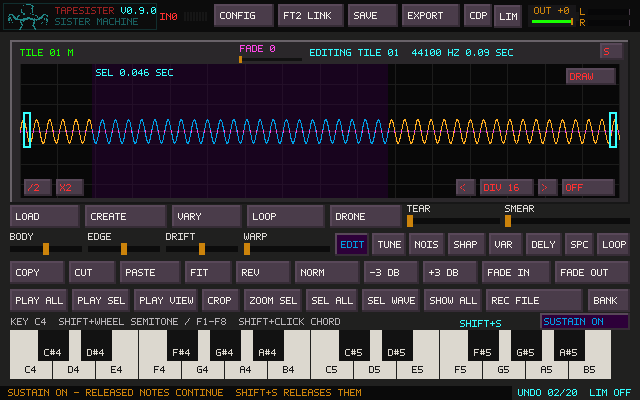
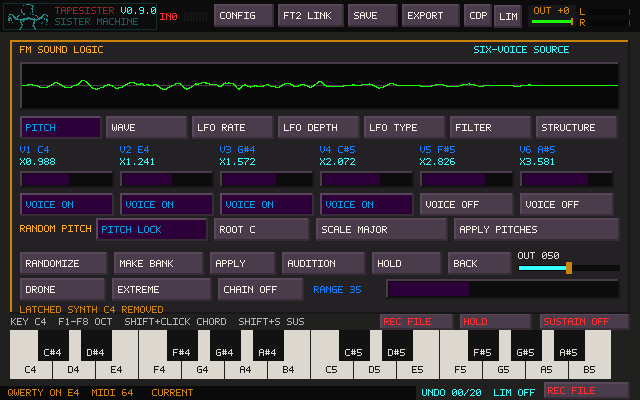

# Keyboard Sustain

**Shift+S** toggles one Sustain setting for QWERTY, onscreen keyboard notes, and
MIDI. Click **SUSTAIN ON/OFF** above the main keyboard, in file preview, or in
Sister Machine. Portal uses **SUS** beside Auto Preview. The active button color
shows that Sustain is enabled. FM uses the main keyboard's control.

**Tab** opens Sister Machine from the main canvas or FM. From Sister Machine,
Tab hides the window and returns to the main workspace, including desktop
fullscreen. Its tape processing and recording continue. Portal retains its
own Tab A/B shortcut; Sister preset text dialogs retain their field navigation.
Ctrl+Tab still switches to TapeHead.

Sustain starts **off** each session. It does not change the sample, loop points,
saved recipe, or tile. Text fields and destination/preset dialogs retain their
normal input; Shift+S does not interrupt typing.

| Sustain | Loop | After releasing a key |
|---|---|---|
| Off | Off | Stop the note |
| Off | On | Stop the looped note |
| On | Off | Let the sample finish |
| On | On | Keep repeating the loop |

Turning Sustain **off** releases notes whose keys are already up and keeps keys
still held sounding. A new press of the same key retriggers it normally. Sustain
does not add voices: QWERTY and FM/Portal/import preview retain the existing
five-note limit. MIDI tile playback retains its larger independent voice pool.

The earlier canvas behavior implicitly let non-looping samples finish while
releasing looped notes at key-up. The switch makes the release choice explicit.

**Tile and FM keyboards now share the same note policy.** An ordinary click,
QWERTY key or MIDI note never enables HOLD. With no loop, even a physically held
key plays the sample once. Sustain chooses whether key-up stops immediately or
lets that pass finish. FM no longer repeats every ordinary key automatically.

**HOLD** beside the virtual keyboard (also mirrored by FM's HOLD button) can be
armed before playing. It latches and repeats new notes and catches active notes.
Click it again to release the latched chord. Its label only changes when this
explicit switch changes; Shift-click does not turn it on. Space/Stop clears HOLD.
The Sister Machine transport's HOLD still controls writing to its tape buffer.

**Shift-click / Shift+QWERTY** toggles an individual chord note. Without a loop it
finishes once. With saved loop points, the main LOOP enabled, or HOLD enabled, it
repeats. Ordinary mouse notes now add/retrigger voices just like QWERTY/MIDI,
instead of clearing other chord notes first. Mouse/key release remains effective
when a dialog opens before release.

The main **LOOP** supplies selection/whole-sample looping to played notes when there are
no saved loop points. Starting notes takes over from the standalone audition;
changing the loop while a chord plays never adds a separate C4 note. Saved loop
points take priority. FM loops its rendered preview. Routed groups use each tile's
saved loop or whole sample. HOLD uses the same fallback when no loop is defined.
Changing FM parameters keeps the voice's latch/repeat state and preview ownership.

Zoom/pan normally has no effect on playback, including HOLD notes started while
zoomed in. Enable **PLAY VIEW** to make QWERTY, MIDI and onscreen canvas notes
follow the visible range instead. The highlighted button controls range, while
LOOP/HOLD controls repeat. **SEL VIEW** captures that range as a fixed selection
and turns PLAY VIEW off, so you can zoom elsewhere without moving the selection.
Saved loop points still take priority when PLAY VIEW is off.

Staged capture chords and click-launched tiles retain their own controls. Closing
or replacing preview audio detaches its notes. Stop leaves Sustain unchanged.
See [Playback and loop modes](PLAYBACK_LOOPS.md) for attack-first modes and exchange.

## MIDI in previews

CDP Portal now receives MIDI notes for the selected **Source** or **Result**,
including its audition selection and Loop setting. C4/MIDI 60 plays at original
pitch. Source/result and loop-range changes use the existing preview voice path.

File preview also accepts MIDI, preserving stereo. MIDI velocity and channel
identity are retained; channel panic stops that channel even with Sustain on.
Preview note-ons are blocked during text/destination editing; note-offs remain
routed and obey Sustain. File-list navigation and text entry remain separate.

## Tile loop preservation

**Set Loop → click the current tile** now stores the live editor before launching
it. The previous click path reloaded the older stored tile and could discard loop
points, selection metadata, and other unstored editor changes. Clicking the current
tile now preserves those edits and their Undo history; playback uses the updated
loop range. Switching away and back also retains it.

## SCRUB direction correction

Factory SCRUB's direction names were reversed. **0 is BOUNCE; 1 is FORWARD**.
Only the labels change: existing recipes keep their numeric values and sound.
Forward passes CDP's `-f` flag for one sweep and ignores the requested length.

## Verification

`make tapesister_keyboard_sustain_tests` builds the optional SDL controller harness.
Run `./tapesister_keyboard_sustain_tests` with SDL's dummy audio/video drivers
(the harness selects them). It checks:

- QWERTY and MIDI release behavior for tile, FM and preview voices, with and
  without loops; released versus physically held notes when Sustain is disabled.
- Repeated notes, explicit latches, natural one-shot completion, and panic.
- Actual FM/tile audio completing as one-shots, explicit HOLD before/after playing,
  pointer/QWERTY/MIDI release, additive chords, loop takeover without a C4 voice,
  preview replacement, and dialog-open-before-release.
- All START loop directions: stereo attack/loop output, group playback, standalone
  audition, fractional overshoot, live sync, Undo, project and WAV persistence.
- Empty/short/long Portal rename carets and connected waveform rendering.
- Main/FM MIDI routing and Portal Source/Result, selected ranges, pitch, channel
  panic, text focus, and stereo import-preview output.
- Shift+S auto-repeat protection, visible button click targets, and Sister's
  shortcut/preset-dialog behavior.
- Set Loop, clicking/launching the same tile, switching away/back, Clear Loop,
  and Undo/Redo without changing the audio hash.
- SCRUB's displayed values against the actual generated `-f` flag.

The accompanying Portal controller, live-loop, stereo voice, group/Sister,
canvas output-recording, bank, and core tests cover the surrounding workflows.
Windows compilation and physical QWERTY/MIDI listening remain user checks.
