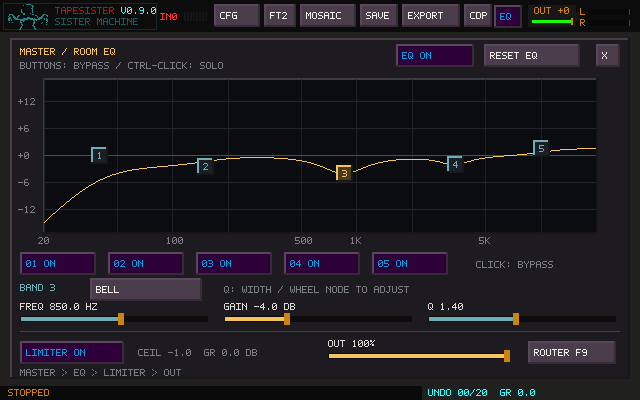
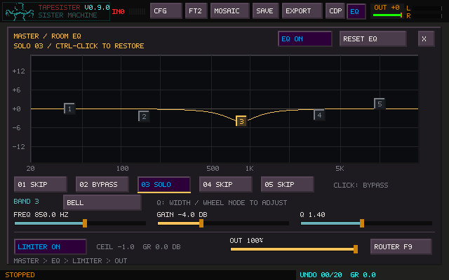

# Master Performance EQ

Master EQ adapts TapeSister to a room or sound system. Use it to remove excess low
end, roll off subsonic material, tame a resonance or harsh range, or make a broad
tonal adjustment. Click **EQ** in the main or Sister window to open the native
**Master / Room EQ** page. Opening the page does not change limiter state.

The compact **ROUTER F9** button beside OUT opens the serial macro-routing page. EQ, limiter and OUT
always remain after its movable stages. See the [Global Router controls](USER_MANUAL.md#global-router).

Hover a button, graph node, or slider for **600 ms** to see help and shortcuts
in the bottom status line. Moving away restores the operation message. Fresh
messages take priority for 2.4 seconds over help for the same control.

Band/type buttons use compact widths. Limiter, OUT and Router have separate hit
areas on the bottom row. File recording uses one REC label in the header and its
persistent footer; it does not draw REC over the input-channel count or logo.

## Signal order

**Master → EQ → Limiter → Output**

In the existing implementation this is the completed stereo master mix, including
Master FX and all live source routes, followed by five EQ bands, the existing
linked-stereo look-ahead limiter, and the existing smoothed OUT attenuation.
Hardware output, the final L/R meter, FILE OUT, and Mosaic's OUTPUT recording tap
observe this final result. Internal dry/SYNTH/tile captures, source taps, and sample
exports keep their existing earlier tap points: room correction is not baked into
source material. EQ does not feed back into Sister, Master FX, or Fallout memory.

The page offers the existing limiter toggle and OUT fader, with limiter ceiling
and gain-reduction readouts. Ceiling/look-ahead/release remain INI settings.
OUT still attenuates after the limiter; lowering it changes listening level, not
limiter drive. Keep levels sensible at the source and effect stages. Stacking
boosts or using resonant Q can increase gain beyond one band's ±12 dB range.

## Controls

| Control | Action |
| --- | --- |
| Numbered graph nodes | Select a band for editing |
| Five numbered band buttons | Toggle that band's bypass without changing the selected editor |
| Ctrl-click a band button | Solo that band's EQ; repeat to restore the previous bypass states |
| Drag a node | Horizontal: frequency; vertical: gain |
| Shift-drag a node | Fine frequency/gain changes |
| Wheel over a node | Change Q; Shift makes changes finer |
| Frequency / Gain / Q sliders | Set the selected band's value; exact value is displayed |
| Wheel over a slider | Fine value adjustment; Shift-wheel is finer |
| Right-click a slider | Restore that parameter's neutral default |
| Right-click a node | Set its gain to 0 dB |
| Middle-click a node | Bypass that band |
| Filter type button | Left-click forward; right-click backward |
| EQ ON / EQ BYPASS | Compare EQ with the original master; settings are retained |
| RESET EQ → CONFIRM RESET | Return all five bands to neutral bells and bypass EQ |
| X / Escape / EQ again | Close the page |
| Space | Existing global stop |

Frequency runs from 20 Hz to the lower of 20 kHz or 45% of the output sample rate.
Gain spans −12 to +12 dB; ordinary wheel steps are 0.5 dB and Shift-wheel steps are
0.1 dB. Q runs from 0.30 (broad) to 8.00 (narrow/resonant). Filter choices are Bell,
Low Shelf, High Shelf, High Pass, Low Pass, and Notch. Passes are fixed at
12 dB/octave. Gain does not apply to passes or notch; the UI shows `GAIN --`.

The buttons show `ON`, `BYPASS`, `SOLO`, or `SKIP` (temporarily excluded by solo).
Solo applies only the chosen band's EQ to the master, bypassing the other filters;
it does not isolate an audible frequency range. Solo can audition a bypassed band
without overwriting its saved bypass state. Ctrl-click another button to move solo,
or Ctrl-click the soloed button to restore the full EQ. A plain bypass click exits
solo and toggles that band's saved state; clicking the soloed band bypasses it.
The other bands retain their settings. Global EQ bypass still takes priority.

The amber curve combines all active bands, including the current solo choice. It displays approximately ±17 dB;
stronger cuts/boosts meet the graph boundary. Nodes show each band's frequency and
gain, rather than its contribution after the other bands. When EQ is bypassed,
the remembered curve dims and a flat amber line shows the active response.
There is no automatic loudness matching or makeup gain.

Reset requires two clicks; another mouse edit cancels confirmation. It does not
change the limiter, OUT, source settings, or effects. Physical QWERTY notes and the
arpeggiator/sequencer continue while editing. File dialogs and confirmations keep
ownership of input. The page uses TapeSister's existing pixel typography, panel
primitives, controls, and palette rather than a separate UI toolkit.

## MIDI learn and saved state

Open the page, then enter the existing MIDI-learn mode. Select a band and map its
Frequency, Gain, or Q slider. In learn mode the numbered row only selects the band,
so learning never toggles its sound. EQ bypass, limiter, and OUT also use existing learn.
Continuous parameters retain the existing controller pickup behavior. Target IDs
are `main.eq.band.N.0` (frequency), `.1` (gain), `.2` (Q), for N=1–5, plus
`main.eq.bypass` for the toggle. Frequency and Q mappings are logarithmic.

Projects save the enabled state and all five bands in `sister-state.ini`, schema
version 22. `MasterEq.SoloBand` stores 0 for no solo or 1–5 for the soloed band;
older files without it default to no solo. Reset clears solo too. Session settings
save the same explicit `MasterEq.*` keys in
`tapesister.ini`. Older projects/configurations without those fields start flat
and bypassed. EQ edits participate in the project's dirty-state check. Band states
are control data only; filter histories and ramps are never serialized. Sister,
Master FX, and Fallout sound presets preserve the current room correction.

## DSP and verification

Five stereo, double-precision biquads use the
[Audio EQ Cookbook equations](https://www.w3.org/TR/audio-eq-cookbook/).
Each band's old/new filters keep fixed stable coefficients and crossfade over
40 ms with smooth endpoints. Faster edits coalesce into the next transition.
Global bypass ramps over 20 ms while the wet filters stay warm. Coefficients are
calculated on the device-locked control thread; the sample callback performs no
allocation, coefficient trigonometry, file I/O, or new locks. EQ adds no buffering
or look-ahead latency. Existing limiter latency remains unchanged.

`test_master_eq.c` checks rendered and analytical responses for all six types at
8/44.1/48/96 kHz, exact flat/bypass output, stereo matching, rapid extreme edits,
transition continuity, finite output and silence decay, rate changes, solo/restore, limiter
protection, OUT mute, persistence, malformed state, and preset isolation.
The native controller tests cover page interaction/scaling, modal ownership,
MIDI pickup, band bypass/solo and independent selection, project dirtiness, all four QWERTY/ARP routes, global stop, and equality
between FILE OUT's queued frames and hardware output.

The screenshot is emitted by the native SDL controller fixture through the actual
`ts_ui_render` framebuffer, using modest room-correction settings. Regenerate it
with `TS_TEST_MASTER_EQ_PPM=/tmp/master-eq.ppm` when running
`tapesister_keyboard_hold_tests`, then convert the PPM to PNG without resizing. Set `TS_TEST_MASTER_EQ_SOLO_PPM` to
emit the solo example as well.

Real-world validation still needs Windows/WASAPI and physical MIDI hardware,
small-buffer device changes, sustained live manipulation, and listening on the
intended PA—especially low-frequency/high-Q transitions, bypass comparisons,
limiter drive, and long recordings.
