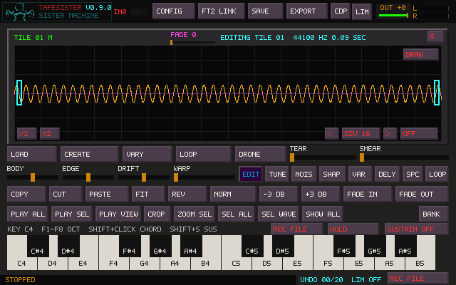

# Playback and loop modes

The MODE button on the LOOP tools page cycles through six choices. Set Loop
stores the selection as loop points. These choices affect played tile notes,
click-launched tiles, routed group notes, and PLAY LOOP.

| Mode | Initial playback | Repeating section |
| --- | --- | --- |
| FORWARD | At loop start | Forward through the loop |
| REVERSE | At loop end | Backward through the loop |
| PING-PONG | At loop start | Forward/backward through the loop |
| START FWD | From sample frame zero | Forward inside the loop |
| START REV | From frame zero, forward through the first loop pass | Backward inside the loop |
| START P-P | From frame zero, forward through the first loop pass | Forward/backward inside the loop |

The START modes retain the attack before the loop. START REV turns at the upper
edge after its first forward pass, so it does not jump from the attack directly
to the loop end. Every enabled loop stays within its bounds after that first pass.
Changing pitch changes traversal speed; stereo channels share the same position.
An ordinary PLAY ALL / PLAY SEL / PLAY VIEW remains a one-shot audition.

Sustain governs key release. With Sustain off, releasing an unlatched note stops
it; with Sustain on it continues. HOLD or Shift-click makes release explicit.
See [Keyboard Sustain](KEYBOARD_SUSTAIN.md) for the shared tile/FM controls.
The main LOOP control additionally lets a keyboard chord repeat the selection or
view without saving loop points. Starting notes takes over from its standalone
audition, and changing a live chord's selection does not create another voice.

## Saving and TapeHead

Projects, bank tiles and Undo retain the six modes. Earlier projects still load.
Older TapeSister builds cannot read a project containing the new mode values.
WAV exports keep ordinary `smpl` loop bounds and direction. An optional `tslp`
chunk lets TapeSister reopen the exact START choice; readers that ignore it still
receive a standard forward/reverse/alternating loop.

TapeHead's current WAV reader supports all three directions, including its
reverse-loop flag. Its mixer starts notes forward at the sample beginning and
then enters the loop. That supports these attack-first modes through the existing
folder exchange, with no TapeHead change. This was checked against TapeHead commit
`f053d96df3996a5fd3b26625f069888c3a7d24ab` in `src/smploaders/ft2_load_wav.c`,
`src/ft2_audio.c`, and `src/mixer/ft2_mix_macros.h`.

An experimental key-up exit from the loop into the sample tail is deferred.
TapeHead's `keyOff` releases volume/envelopes and does not change loop bounds to
play the tail. This release uses the requested compatible fallback: start at the
sample beginning and continue inside the loop. TapeSister crossfades and tracker
interpolation may sound different; this is compatible loop metadata/behavior,
not a claim of sample-identical playback between the two programs. TapeHead's XM
writer does not preserve its private reverse-loop flag; WAV exchange supports it.

## Waveform detail

The main waveform keeps its peak envelope and connects the actual boundary
samples of neighboring columns, removing the dotted gaps. At less than one
sample per pixel it draws a continuous line with linear interpolation between
sample values. This affects the display only, including stereo/left/right/mono
views; it does not resample or change the audio.

## Validation

The native controller tests render actual tile and FM voices and cover pointer,
QWERTY and MIDI release, explicit HOLD, Shift-click, live LOOP takeover, preview
replacement, modal release, stereo START traversal and bounds, group voices,
standalone audition, Undo, WAV/project round-trips, and rename carets. The WAV
checks also ignore the private chunk to verify the standard loop fallback.
Windows compilation and listening on physical hardware remain the user's checks.
