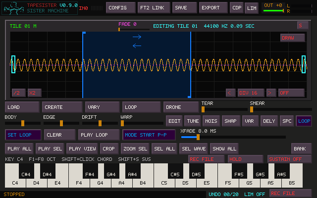
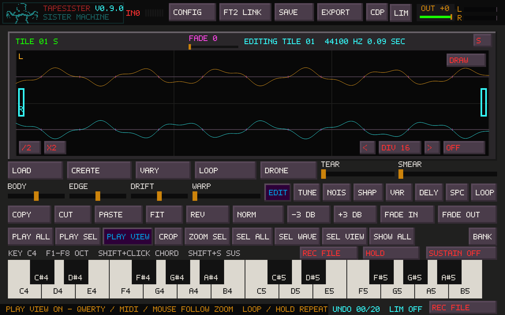
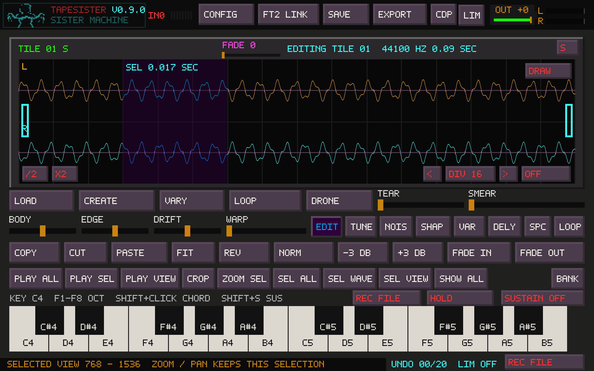
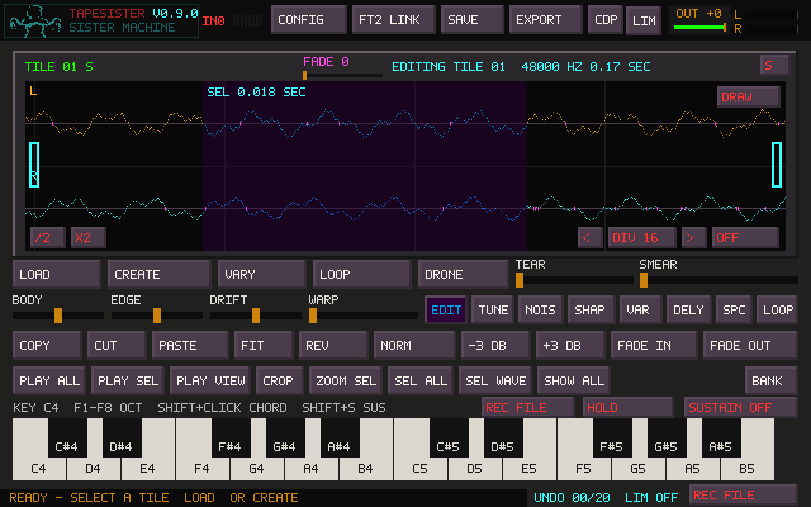
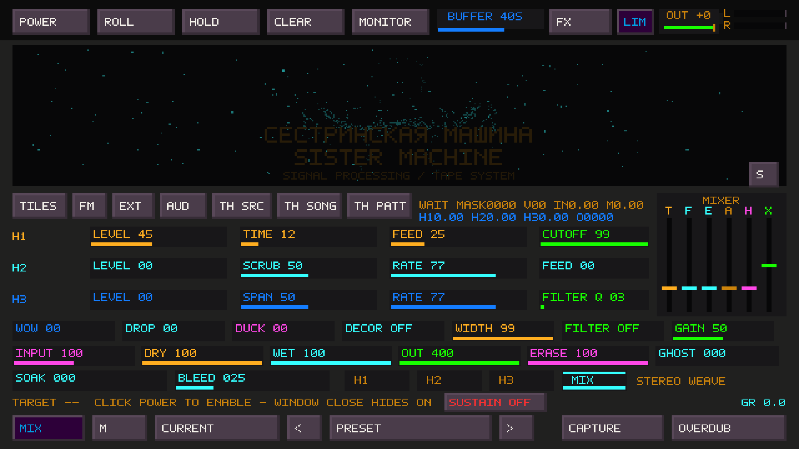

# Playback and loop modes

The MODE button on the LOOP tools page cycles through six choices. Set Loop
stores the selection as loop points. These choices affect played tile notes,
click-launched tiles, routed group notes, and PLAY LOOP.

| Mode | Initial playback | Repeating section |
| --- | --- | --- |
| FORWARD | At loop start | Forward through the loop |
| REVERSE | At loop end | Backward through the loop |
| PING-PONG | At loop start | Forward/backward through the loop |
| START FWD | From sample frame zero | Forward inside the loop |
| START REV | From frame zero, forward through the first loop pass | Backward inside the loop |
| START P-P | From frame zero, forward through the first loop pass | Forward/backward inside the loop |

The START modes retain the attack before the loop. START REV turns at the upper
edge after its first forward pass, so it does not jump from the attack directly
to the loop end. Every enabled loop stays within its bounds after that first pass.
Changing pitch changes traversal speed; stereo channels share the same position.
PLAY ALL and PLAY SEL remain one-shot auditions.

Sustain governs key release. With Sustain off, releasing an unlatched note stops
it; with Sustain on it continues. HOLD or Shift-click makes release explicit.
See [Keyboard Sustain](KEYBOARD_SUSTAIN.md) for the shared tile/FM controls.
The main LOOP control additionally lets a keyboard chord repeat the selection or
whole sample without saving loop points. Starting notes takes over from its standalone
audition, and changing a live chord's selection does not create another voice.

## Zoom and explicit view playback

Zooming and panning normally change only the display. LOOP and HOLD no longer
use the visible range implicitly, including when a note starts while zoomed in.
Played notes keep saved loop points when present; otherwise LOOP/HOLD repeats
the selection, or the whole sample when there is no selection. The standalone
main LOOP repeats the selection or whole sample independently of saved loop points.

**PLAY VIEW** is now a highlighted range toggle, off at startup. When enabled,
QWERTY, MIDI and the onscreen keyboard play the visible canvas range. Active
notes follow zoom/pan with their relative playback position preserved. LOOP,
HOLD and saved-loop enablement still determine whether notes repeat; Sustain
still determines key-release behavior. Turning on PLAY VIEW alone starts no
extra voice. Saved loop points are retained while the view overrides their
bounds. Direction is retained, with START modes using their ordinary direction
so playback stays inside the view.

**SEL VIEW** selects the visible region and turns PLAY VIEW off. This selection
stays fixed while zooming or panning elsewhere. Saved loop points still take
priority for played notes. In Source view, SEL VIEW selects the overlapping
portion of the current tile, without changing the Source view; an entirely
outside view leaves the selection intact.

PLAY ALL / PLAY SEL turn off PLAY VIEW and ordinary LOOP before auditioning
their fixed range once. A locked loop still requires Shift+LOOP to release.
With PLAY VIEW enabled, Space auditions a fixed snapshot of the visible range
once; press it again to stop. Stop keeps the PLAY VIEW toggle enabled.

This canvas setting does not change FM, Portal or file-preview ranges, or the
individual ranges of routed groups and click-launched tiles. It is session-only
and changes no audio, saved loop metadata or project format.

## Saving and TapeHead

Projects, bank tiles and Undo retain the six modes. Earlier projects still load.
Older TapeSister builds cannot read a project containing the new mode values.
WAV exports keep ordinary `smpl` loop bounds and direction. An optional `tslp`
chunk lets TapeSister reopen the exact START choice; readers that ignore it still
receive a standard forward/reverse/alternating loop.

TapeHead's current WAV reader supports all three directions, including its
reverse-loop flag. Its mixer starts notes forward at the sample beginning and
then enters the loop. That supports these attack-first modes through the existing
folder exchange, with no TapeHead change. This was checked against TapeHead commit
`f053d96df3996a5fd3b26625f069888c3a7d24ab` in `src/smploaders/ft2_load_wav.c`,
`src/ft2_audio.c`, and `src/mixer/ft2_mix_macros.h`.

An experimental key-up exit from the loop into the sample tail is deferred.
TapeHead's `keyOff` releases volume/envelopes and does not change loop bounds to
play the tail. This release uses the requested compatible fallback: start at the
sample beginning and continue inside the loop. TapeSister crossfades and tracker
interpolation may sound different; this is compatible loop metadata/behavior,
not a claim of sample-identical playback between the two programs. TapeHead's XM
writer does not preserve its private reverse-loop flag; WAV exchange supports it.

## Waveform detail

The main waveform now uses the actual output pixel dimensions. For example, a
2560-pixel-wide window analyzes 2400 waveform columns instead of enlarging the
old 600-column trace. Its thin, antialiased line keeps TapeSister's waveform
colors; controls, labels and loop handles retain their original pixel style.
The peak envelope is computed from the audio at that width and cached until the
source, view or output width changes. At sample zoom it draws the actual sample
values with linear interpolation between them. Selection and loop dragging use
the full pointer resolution too. Audio data and playback are unaffected.

Pink ticks indicate actual crossings in the displayed L/R channels. Editor
selection, playhead, loop boundaries and Alt+wheel selection resizing snap to
the nearest crossing in either channel, using one shared frame for both. A tick
on one lane does not mean the other channel is also silent there. The earlier
louder-channel rule could reject most crossings in phase-shifted stereo, while
the display incorrectly marked the L+R sum on both lanes. DSP processes retain
their existing boundary policy. At deep zoom a boundary is marked once at its
frame rather than repeated across that sample's pixels. If there is no crossing,
editor selection keeps the requested position. Grid ALL can still prioritize
musical grid positions.

The same rendering now covers the CDP Portal and FM preview. Sister Machine
also has a finer live envelope. See [waveform rendering and performance](WAVEFORM_DETAIL.md)
for screenshots, cache behavior, and the measured live-display cost.

Sister Machine fills the full width and height of its window. Maximizing it
enters desktop fullscreen, like the main canvas, covering the entire display.
F11 toggles back to a resizable window. Mouse buttons, drags and wheel targeting
use the same mapping, including high-DPI output. Exposing the window forces a
fresh redraw. Tab from Sister hides its window and returns to the main
workspace; Tab from the main canvas or FM opens it again. The tape engine,
effects and recording keep running while the window is hidden.

## Validation

`tests/test_canvas_play_view.inc` exercises the actual QWERTY, MIDI and mouse
controller routes. Stereo renders are compared with an unchanged reference
through zoom/pan, with LOOP/HOLD, selection/no selection, and all six saved loop
modes. It also checks PLAY VIEW takeover, fixed SEL VIEW, parent/crop coordinates,
explicit one-shot ranges, unchanged sample/Undo state, and native toolbar output.

The native controller tests render actual tile and FM voices and cover pointer,
QWERTY and MIDI release, explicit HOLD, Shift-click, live LOOP takeover, preview
replacement, modal release, stereo START traversal and bounds, group voices,
standalone audition, Undo, WAV/project round-trips, and rename carets. The WAV
checks also ignore the private chunk to verify the standard loop fallback.
The waveform follow-up also checks native output at 2560×1600, selection at
every visible crossing, analysis-cache reuse, and Sister window coverage and
pointer targeting at wide, tall and high-DPI sizes. Core and native controller
checks passed with address and undefined-behavior sanitizers; leak checking was
disabled. Windows compilation and listening on physical hardware remain the
user's checks.
