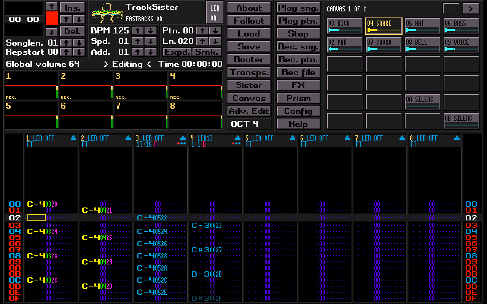
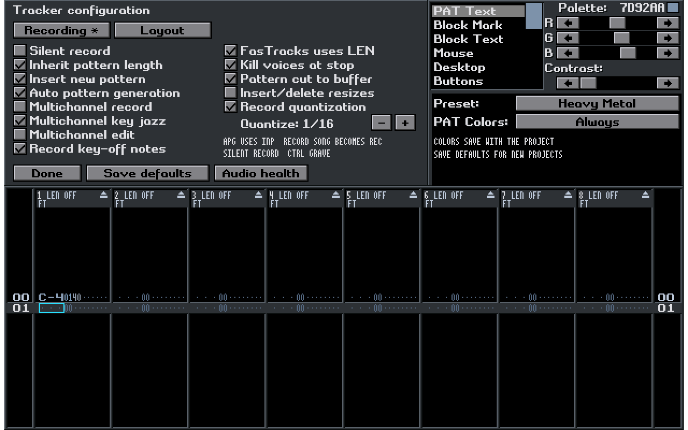
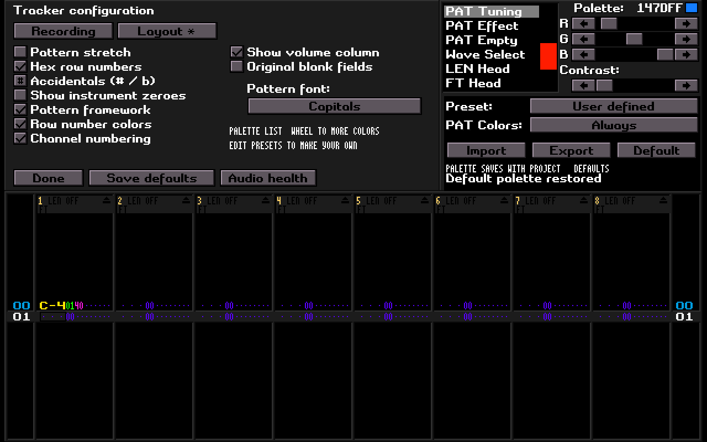

# PR124 functionality audit

Audited the open PR at `d8af148c9d7f17dfcb95bc1c70f4c8adb8c1eecf`
against the pinned TapeHead source, the earlier native tracker, the active host
event/audio paths and project persistence. The port included the original code,
but several useful features had become inaccessible or lost their settings.

## Findings and repairs

| Finding | Repair | Evidence |
| --- | --- | --- |
| Config opened host Audio Health, hiding musical preferences and palette editing | Restore Config with Recording/Layout pages and the original palette editor; retain a separate Audio health action | Actual Config/tab/checkbox/preset/RGB/field-color clicks through host SDL dispatch |
| Silent Record, IPL, INP and APG had no usable visible settings | Expose original callbacks, including the INP/APG dependency and REC+ caption | MIDI recording writes a note with silent monitoring; disabling Silent Record produces audio; new/copied patterns inherit seven rows; REC+ generates three-row patterns |
| Recording/layout preferences and custom colors did not survive project saves | Add validated portable preferences to STH2 projects and explicit Save defaults | Exact preference-byte roundtrip through defaults and full host projects; malformed/truncated data rejection; older STH1 import |
| Native Bounce disappeared in the transplant | Add Forward/Reverse/Bounce to the original private playheads and preserve native migration | Direction clicks and persistence; real callback visits 0,1,2,3,2,1,0,1; 5:1 emits every crossing; one-row loops remain at zero; Song Bounce crosses unequal patterns |
| FasTracks ratio wheel was missing; LEN could decrement when wheeled upward at its maximum | Restore ratio wheel, correct LEN clamping, retain modifier gestures and fractional wheel input | SDL wheel events in compact/full views, four quarter-detents, target changes, maximum LEN, Ctrl-clear and Shift-eight |
| Import could initialize private heads from the previous score's row | Reset private positions after applying the loaded song position | Callback starts from the newly loaded row, including the bounce traversal check |
| Old branding and an arbitrary shortcut list occupied useful screen area | TrackSister title; functional LEN badge; selectable mini canvas (expanded below) | Compact/expanded framebuffer inspection and shielded tile-panel wheel test |
| Buttons and alternate shortcuts could enter inappropriate standalone screens | Open/Save use host projects; sample/instrument/exchange/trim/capture entry points use host destinations | Source-level entry-point audit, action checks and existing workspace/focus integration assertions |

The source import remains reproducible against 271 original files. All local
vendored changes are included in `embedded.patch`; the upstream checkout is
unchanged. The separate pinned drawing import remains reproducible as well.

## Requested UI follow-up

- Replaced the instrument/sample lists and bank buttons with a selectable 4×6
  host-tile canvas, waveform previews and navigation across Sample pages. Stable aliases
  remain selected across sync; empty cells do not select phantom instruments.
- Added shared `.pal` Import/Export and Default controls. The supplied palette
  is compiled in and bundled as `assets/tracksister.pal`; saved project and
  user defaults retain precedence. Tracker RGB uses the upstream six-bit format.
- Removed the Extend button, placed Rec file below Rec. ptn., and put Load
  above Save. Load directly opens the normal host browser. The old bottom
  capture overlay and hidden click target no longer cover the pattern grid.
- Added a code-native TrackSister emblem using the Sister Machine silhouette
  and the supplied concept's colored tracker steps. The complete silhouette,
  including both arms and its right-facing profile, now fits the header without
  clipping. Shrunk LEN text to fit.
- Moved note interpolation to Ctrl+Shift+I, preserving Ctrl+Shift+M for host
  MIDI Learn. Escape cancels previews without leaving TrackSister. Tests cover
  preview, scale selection, acceptance, cancellation and original undo/redo.
  Hidden channels no longer swallow I/T; volume, effect and tuning previews
  also pass through real host keyboard dispatch.

The integration fixture exercises actual Load and palette browser actions,
malformed imports, shared-key roundtrips, mini-canvas note entry and cross-page
selection. Import/export retains extra host palette keys during that session;
STH2 project preferences persist tracker colors and contrasts.

## Directory navigation and tile layout follow-up

- Reproduced the reported path growth: a failed directory change committed the
  new path but kept the old listing, so retries appended the same child again.
  Navigation now rolls back the path on failure, preserving its matching listing.
- Fixed root-path joining (the old `/` case discarded the child's name), use
  native Windows separators for directory searches, and accept empty Windows
  directories. Host actions retain the filesystem error instead of masking it.
- Removed the metadata/song-title strip and aligned the panel with the adjacent
  controls. Six rows expose 24 tiles per view, spanning host Sample pages.
  Buttons use the configured button colors, bevels, waveform wells and a selected
  outline; their labels show the actual instrument aliases.
- Added regressions for repeated failed navigation and recovery, empty folders,
  spaces, root-path joins, cross-page selection in the extra rows, viewport
  navigation, inert gutters/empty cells and the removed song-title hit target.
  The full local Release build and all four targeted checks (core, embedded host,
  browser/preview and packaging) passed; the compact render was inspected.

## Interface

The compact workspace keeps the eight lanes and original editing controls.
Load/Save, Config and the existing FX/Prism/Sister/Fallout destinations have
distinct purposes. The old Triton badge is replaced; upstream copyright and
license notices remain in the source and distribution.

Recording options and palette controls are available together. Layout changes
and the custom palette save with the project. Save defaults is an explicit
action for later new/legacy scores; loading an existing project restores that
project's settings.

Wheel a FasTracks ratio to adjust it. Right-click it, or click its F/R/B badge,
to cycle direction. Shift-click the ratio or click its mode badge to cycle
Standard/Pattern/Song. LEN retains Shift-wheel and Ctrl-wheel gestures.
See the [playback guide](SISTERTRACKER_PLAYBACK.md) for the full control table.

## Initial feature-restoration verification and limits

- Complete local Release build, with assertions enabled, passed.
- All 29 selected native regression tests and the packaging guard passed.
- The expanded embedded host fixture passed ASan and UBSan. Leak scanning was
  disabled; the test checks the real editor/event/audio/codec integration.
- Compact, pattern-only and both Config pages were rendered and inspected.
- Original source checks and the patched import checks passed. Patch context
  retains upstream whitespace; source edits pass the whitespace check.

These are deterministic software checks, not a claim of complete musical or
hardware certification. The original clipboard, interpolation, commands,
clutches, randomization, Jog/Punch and other performance gestures remain in
the original source. Representative paths are tested, but every combination is
not individually exercised. Real device behavior and the X220 acceptance
checkpoint still require the user's hardware session. Windows/Linux CI results
and matching downloadable bundles are recorded on PR124 after each published
head is built.

The original REC+ generator can allocate a new pattern during replay. The host
mixing adapter uses fixed spans, but this inherited generator has not been
converted to an allocation-free real-time design.

Standalone XM/sample storage, a second sampler/device stack, Matrix/queuing,
Nibbles, per-lane hardware outputs and future buffer tiles remain outside the
agreed port boundary. The three previously reproduced full-suite baseline
failures remain documented in [the parity report](SISTERTRACKER_PARITY.md).
New STH2 scores should not be opened in older builds that only understand STH1.

PR124 remains open for hands-on testing before merge.
