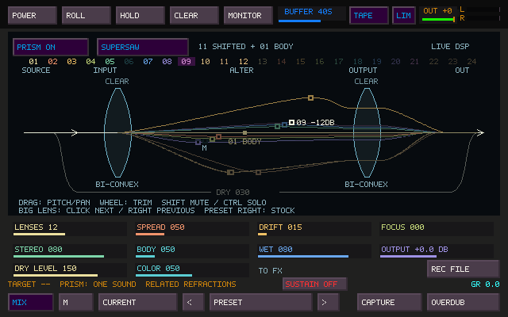
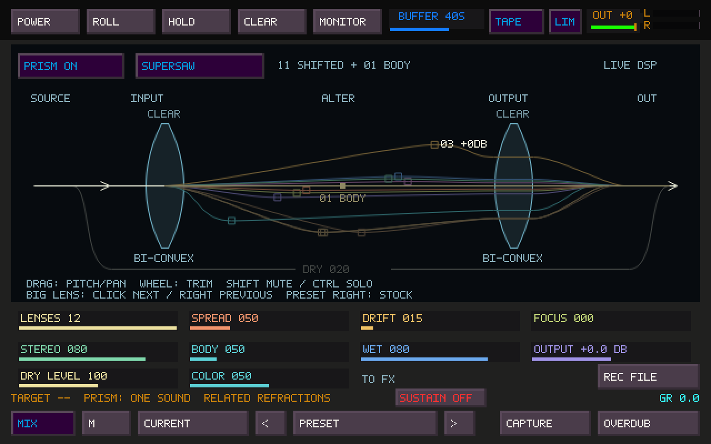
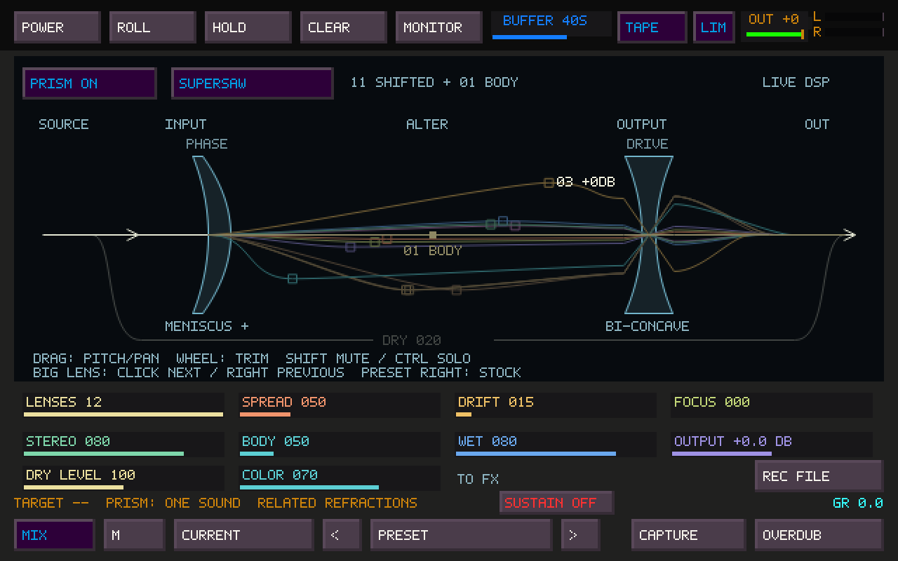
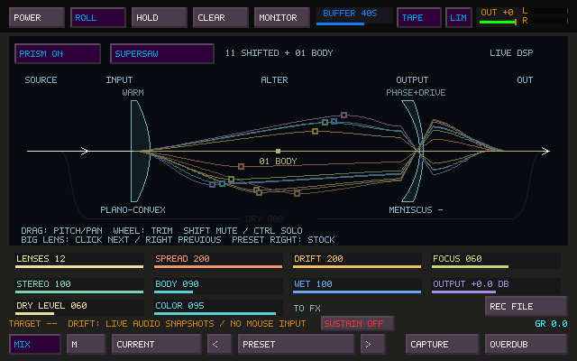
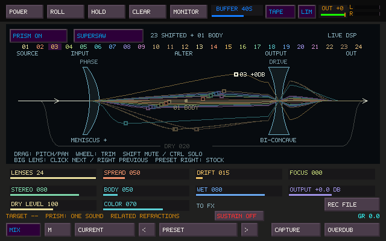
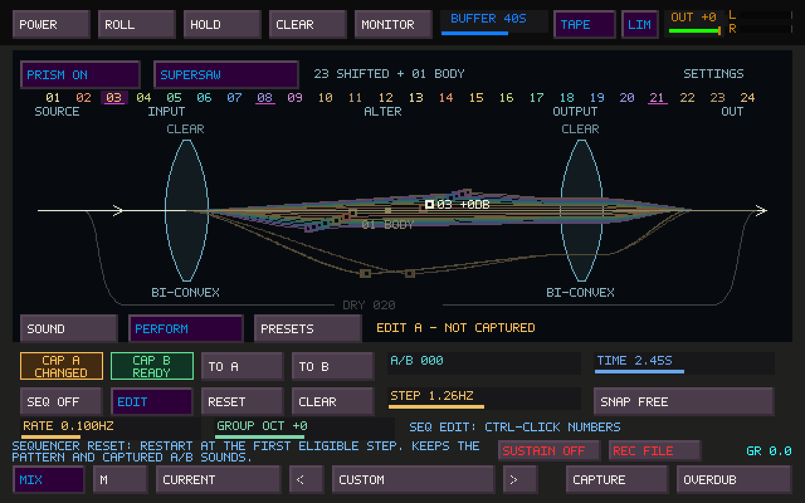
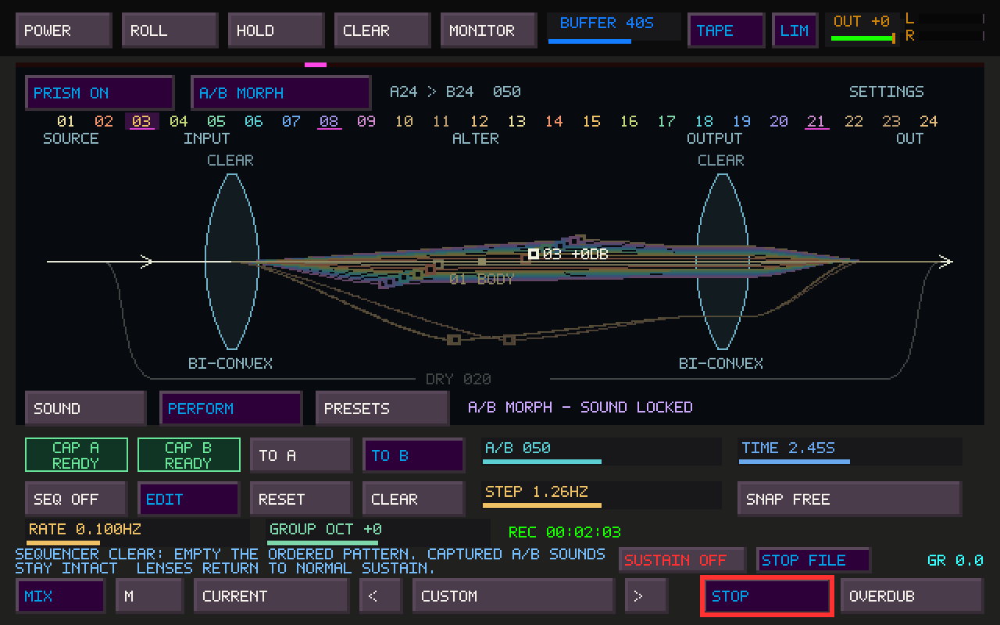
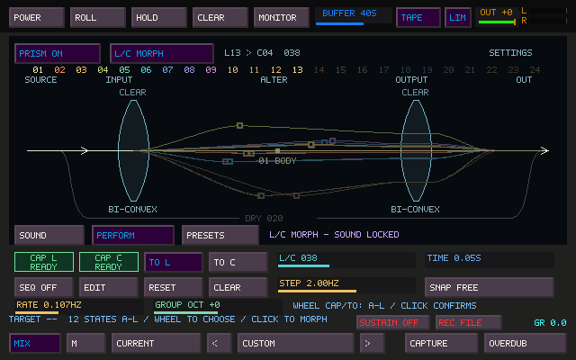

# Prism: real-time refraction

Prism turns live or recorded audio into **2–24 related voices** inside Sister Machine.
The cap is **23 shifted lenses plus lens 01, a clean wet body anchor**.
The default remains twelve, and existing patches retain their saved lens count.
The **DRY** lane is a separate copy of the original signal.
Supersaw and Ensemble are the first two geometries. No render job or CDP executable
is involved. The existing FM Unison remains available.


## Play it

1. Open Sister Machine with **Tab**. Its page button cycles **Tape → FX → Fallout → Prism → Tape**.
2. For a direct pedal, leave **POWER off**. Play a tile, FM, Mosaic or TapeHead, or
   enable the main window's external input monitor for a physical instrument.
   Prism runs before the existing ordinary FX/Fallout path.
3. Engage **PRISM ON**. Start with Supersaw, 12 lenses, Spread 50, Focus 0, Drift 15,
   Stereo 80, Body 50, Wet 80 and Output 0 dB. Output offers up to +12 dB if needed.
4. Press **REC FILE** on this page. It records the final stereo output, including
   Prism, subsequent effects, the safety limiter and OUT fader. The existing timer,
   stop control and recording state continue across page changes.

With **POWER on**, Sister owns the musical sources as before: select the sources
on its Tape page and enable Monitor. Prism precedes the PRE slots, tape input trim,
rolling write and heads. For direct instrument playing without delayed tape heads,
set Sister's **DRY 100 / WET 0**. Here DRY means the direct *Sister* input, which
already contains Prism; Prism's own WET controls refraction. PRE FX can process
that direct path. Raise Sister WET to hear the heads and their downstream effects.
Head-tap capture still selects the corresponding head; **REC FILE** uses final OUT.

## Controls and optical meaning

| Control | Audio | Diagram |
|---|---|---|
| Mode | Seven pitch layouts; click to cycle | Fan, harmonic/octave bands, cluster or microtonal steps |
| Lenses | 2–24, with fading entry/removal; wheel steps one lens | One ray per contributing lens; the numbered strip selects overlapping points |
| Spread | 0–200%; 50 reproduces the voicing table at Focus 0; the full fan reaches ±248 cents at 100 and ±1798 cents at 200 | Angular separation follows the actual smoothed pitches |
| Drift | Independent, deterministic pitch wandering, 0–200%; up to ±25 cents at 100 and ±190 cents at 200 before Focus; lower settings retain subtle movement | Rays wander with the audio; no separate animation clock |
| Focus | Contracts fine pitch, hand-drawn pitch offsets and added time toward zero | Rays converge; intentional octave relationships remain |
| Stereo | Per-lens stereo balance; body voices stay near center | The control points move laterally with the actual pan values |
| Body | 0–300%; stronger wet body anchor and stronger octave-body lenses | The corresponding rays become more prominent |
| Dry Level | 0–200% trim on the original branch, before the Wet crossfade; 100 is unity | Original beam brightness follows its smoothed gain |
| Wet | Original input versus normalized lens sum | Separate DRY lane fades as refracted rays brighten |
| Output | −12 to +12 dB on the refracted sum | Audio output trim; the existing OUT meters show final level |
| Input shape | Maps the mode/Spread intervals before hand edits and drift | Changes the incoming refraction fan |
| Output shape | Maps the edited intervals and stereo placement | Rays bend or cross inside the output glass before recombining |
| Color | 0–100% blend of each selected shape's tone on shifted voices | Tone labels above the glass identify the active profiles |

The incoming source, refraction, altered rays, recombination and output are always
connected. At zero Wet the rays remain faint as a settings guide and the original
path dominates. This is a parameter diagram, not an amplitude scope or frequency
analyzer. Pitch distances are expanded/compressed for readability; octave bands
are not a linear frequency scale. Vertical position represents pitch on a continuous compressed scale; horizontal
position represents pan. Neither axis represents physical distance or device latency.

The **01–24 numbered strip** selects individual lenses even when their points
overlap. Select a number, then drag its highlighted point; the selected point wins
an exact overlap. Shift/Ctrl-click, wheel trim and right-click reset also work
directly on the numbers. Numbers above the active count are dim; sequence-edit
Ctrl-click can still remove them from the stored pattern.

Grab a **hollow middle point** and drag **up/down for pitch**, **left/right for pan**.
Each shifted lens accepts an independent ±1 octave offset around its mode/Spread
pitch, so one ray can stay close while another goes wide. Focus contracts these
pitch offsets too; at Focus 100, lower Focus to bend pitches again. Horizontal
edits add to the automatic Stereo placement and stop at hard left/right. The
filled central point is labeled **01 BODY**. It belongs to the wet sum: Body,
its own wheel trim, mute/solo and Wet control its contribution. **Dry Level does
not control 01**; it controls the separate original lane around both optical
stages. At Wet 100 that lane is silent, while 01 can still provide clean body.
This distinction preserves existing patches and gives both paths independent gain.

**Shift-left-click mutes a lens**, **Ctrl-left-click solos it**. Solo is additive:
Ctrl-click several lenses to hear them together. Mute wins if both are set; solos
on lenses outside the current count do not silence the active lenses. The dry
branch remains independent. Mute/solo and wheel trim also work on the body
anchor, lens 01. Muted and solo-excluded rays stay faint and clickable; **M/S**
marks show explicit mute/solo states.

**Wheel over a point** trims it from −24 to +12 dB in 1 dB steps; Shift-wheel uses
0.1 dB steps. Brightness follows its actual smoothed level, and the selected lens
shows its trim. Trim and mute/solo sit after the nominal energy reference, so
changing one lens never makes normalization undo the fader or raise the others.

**Right-click a point to reset that lens** (pitch, pan, trim, mute and solo).
**Right-click the mode button or preset name** restores all lenses to stock:
zero offsets/trim and no mute/solo, keeping the global controls and current mode.
**Escape during a drag** restores its starting pitch/pan. Dragging outside the window holds at the edge. Lens identities
and edits survive count changes, modes, project saves and full Sister presets.
The selected ray shows its number; the status line shows its target pitch/pan.
Dry Level trims the original branch before the existing Wet crossfade: Wet 100
still excludes that branch, and disabling Prism restores unity dry output.





The renderer reads a coherent atomic snapshot of the audio-owned smoothed values.
It does not read audio buffers or run DSP. It uses Sister's existing maximum
30 fps refresh; hiding or minimizing the page does not affect sound. With no
running engine it displays a stationary **SETTINGS** diagram.

Other native states: [Ensemble](images/prism-ensemble.png),
[full Focus](images/prism-focus.png), [zero Wet](images/prism-dry.png).

## Play the glass shapes

**Left-click either large lens (or its name) to cycle forward; right-click to
cycle backward.** Input and output are independent, giving 36 combinations.
Both start at BI-CONVEX, which preserves PR100's pitch and tone. Color defaults
to 50; clear glass still adds no coloration. Set Color to zero to explore only
the pitch and stereo mappings, or raise it for the glass character.

| Shape | Interval map | Color character on each shifted voice |
|---|---|---|
| BI-CONVEX | Unchanged | Clear |
| PLANO-CONVEX | 65% of the interval | Warm low-pass filtering |
| MENISCUS + | Upper intervals ×1.25; lower ×0.75 | All-pass phase coloration |
| BI-CONCAVE | Invert around the original pitch | Soft saturation |
| PLANO-CONCAVE | Invert, then narrow to 65% | Hollow high-pass filtering |
| MENISCUS − | Invert; upper intervals ×0.75, lower ×1.25 | Phase coloration into saturation |

These are musical mappings inspired by optical shapes, not a physical simulation.
“Invert” means a downward octave becomes an upward octave; it does not reverse
playback or flip the audio waveform's polarity. Two BI-CONCAVE shapes restore
the base pitch organization, while their coloration still combines. Input acts
on the mode's intervals before manual pitch offsets and drift. Output acts on
the edited result and on stereo pan; middle handles show the state before that
output map, so dragging upward still raises the intermediate pitch even when
output glass inverts what is heard. Focus retains the shaped octave bands.

The pitch maps compose into one streaming reader per shifted voice. The input
and output **color** stages then run serially on each resulting voice, before
trim, pan and summation. Filter and phase frequencies differ by voice and stage;
no mono folding or cross-channel feed is added. Changes crossfade smoothly.
Both the separate dry lane and the 01 body anchor bypass these color stages.
There are no additional per-voice color selectors in this revision.



The optical curves use dense sampling with **solid native-pixel strokes**, matching
the rest of the instrument. The initial PR101 antialiasing made thin rays and
handles look blurred when enlarged; it has been removed. Sister explicitly uses
nearest-neighbor texture scaling. Hollow handles have their original stronger
borders, and the pitch diagram has 19% more vertical travel to expose subtle
Drift changes. The inverse drag mapping uses the same expanded coordinates.
All six glass silhouettes and sound mappings remain available.

Continuous ray movement comes from the audio snapshot, including during silence;
the optical rays themselves have no idle UI oscillator. At Drift zero or full Focus they settle.
A separate nebula field adds gentle ambient motion and an activation cue along those paths; this cue is
a visual metaphor and does not represent processing latency.
A 12-second native-frame sequence at Spread 200, Drift 200, Focus 60, Stereo 100,
PLANO-CONVEX input and MENISCUS − output demonstrates the reported settings
with all 24 lenses:



Prism's source is an amber/gold nebula; its output is related, transformed
blue/cyan/violet/magenta matter with a warm core. PRISM ON briefly coheres,
casts, refracts and recombines the field, then leaves subtle ambient motion.
Spread, Drift, Focus, Body, Color and Wet/Dry shape its appearance, including
during A–L and Matrix transitions. Every optical line, handle and label remains
in front of the atmosphere, with its existing interaction.

INI `[Prism]` → `prism_zoya_pose=nebula` is the default; `off` restores optics
without particles. Older `meditation` and `standing` values migrate to `nebula`.
Edit while closed, then relaunch. No ordinary humanoid pose is displayed.
See [Prism nebula fields](PRISM_ZOYA.md) for native previews, visibility behavior,
implementation and validation. This is entirely a UI layer.

The **24-lens cap** adds ten fine-detuned voices and two lower-octave voices.
The first twelve keep their original pitch, pan and weight definitions. New pan
positions interleave with the original fan; adding lenses does not reassign the
surviving voices. The added lenses share the existing audio history.



## Sound and architecture

The PR99 audit found two different source models: FM Unison creates oscillators;
Sister receives an arbitrary stereo stream. The reusable part is the voicing:
`0, −7, +7, −12, +12, −19, +19, −26, +26, −1200, −1207, −1193` cents.
FM uses these first twelve entries of the shared table and remains a twelve-voice
synth. Prism adds lenses 13–24 at
`−3, +3, −10, +10, −16, +16, −23, +23, −31, +31, −1203, −1197` cents.
In Supersaw, lenses 10–12 and 23–24 form the lower-octave body band. The original
fine fan still reaches ±208 cents at Spread 100 and ±1508 at 200. FM's oscillator,
editing and reversible Unison behavior are unchanged. A streaming reconstruction will have a
different texture from directly generated oscillators.

Prism has one preallocated 80 ms stereo history and bounded per-lens read state.
The original central lens stays direct. Other lenses use complementary Hann
windows over fractional stereo reads. A bounded shared period estimator runs at
about 47 Hz. On periodic sources it aligns the window span to an even number of
source periods, preventing the fixed-window pitch sidebands from displacing the
lower octave. A new span crossfades against the preceding read geometry for 40 ms;
the engine does not slide an entire delay window abruptly when a note changes.
On aperiodic input the last usable span remains in place.

Pitch, pan, added delay, level, Wet and output changes are smoothed. Mode changes
glide through the smoothed pitch targets. Lens identities survive count changes.
The seeded low-frequency trajectories are reproducible from a fresh start;
project recall restores controls, not the audio history or the exact middle of a
running drift cycle. The stream continues to prime during bypass. Once bypass or
Wet zero with Dry Level 100 settles, the output equals the original stereo input exactly, including
when Prism's Output trim is nonzero.

The callback performs no allocation, file I/O, GUI work or new locking. All
storage is allocated during device preparation. Period analysis uses fixed bounds
and no FFT. Left and right remain separate through the reads; there is no mono
folding in the signal path. The period detector observes whichever input channel
has more energy, so opposite-polarity stereo does not cancel its analysis input.

Gain divides each channel's weighted sum by the square root of its squared lens
weights, including the current pan and lens-count fades, before manual trim/mute/solo. This restores decorrelated
voice energy instead of averaging it away as the count grows. The direct body
and lower octave voices keep their original weights and are more audible because
the sum no longer loses 10–12 dB at twelve lenses. This is fixed energy compensation,
not an automatic loudness rider; correlated voices can add up more strongly. The
existing final stereo-linked limiter handles those peaks. Output now spans
−12 to +12 dB on the wet sum; Wet keeps its existing linear crossfade.

A matched 48 kHz test at 12 and 24 lenses, Spread 50, Drift 0, Focus 0, Stereo 80,
Body 50, Wet 100 and Output 0 dB measured RMS relative to bypass:

| Input / mode | First run, 12 lenses | Revised, 12 lenses | Revised, 24 lenses |
|---|---:|---:|---:|
| 110 Hz bass / Supersaw | −11.81 dB | −0.39 dB | −0.41 dB |
| 110 Hz bass / Ensemble | −11.73 dB | +0.26 dB | +0.02 dB |
| Actual FM 12-voice saw Unison / Supersaw | −10.48 dB | +0.95 dB | +1.36 dB |
| Actual FM 12-voice saw Unison / Ensemble | −12.35 dB | −0.40 dB | −0.70 dB |

The FM test uses the native FM renderer at 220 Hz. Measurements use the last
three seconds of four, before limiting, with the same input and settings in both
engines. Noise measures roughly −1.6 dB at twelve and −2.1 dB at 24 because
the windowed reads smooth its energy. Maximum Output, full Focus and abrupt lens
edits at 24 lenses produced internal peaks of 9.673; the existing limiter held both output channels to its −1 dB ceiling
(0.891 linear). No extra Prism limiter or compressor is added.

## Latency and performance

The dry path and the stock, untransposed central lens add **zero Prism buffering**. Other voices use
variable read ages: nominally a 40 ms window plus a 2 ms guard and small per-lens
offsets. Detected periods can change the window, bounded to 60 ms. The oldest
Ensemble read at 24 lenses is under approximately **78 ms** at normal audio rates; Supersaw
adds less offset. This is a blend of different read ages, not one fixed latency
that can be removed by delaying the dry signal. Device buffers and the existing
output limiter add their own latency. Lens count does not increase the window.

Measured with both color stages fully active (MENISCUS + into MENISCUS −,
Color 100) on a shared Linux AMD EPYC 9V74 host, C11 `-O2`, stereo 48 kHz,
256 frames (5,333 µs budget), 4,000 measured blocks after warmup:

| Lenses | Prism mean / block | Prism p99 | Prism share of block budget | Sister + Prism + limiter mean |
|---:|---:|---:|---:|---:|
| Bypass | 57.46 µs | 154.26 µs | 1.08% | 362.77 µs |
| 2 | 87.60 µs | 166.18 µs | 1.64% | 415.01 µs |
| 4 | 107.01 µs | 166.42 µs | 2.01% | 420.46 µs |
| 6 | 132.10 µs | 212.91 µs | 2.48% | 469.65 µs |
| 8 | 154.23 µs | 222.21 µs | 2.89% | 490.14 µs |
| 12 | 200.64 µs | 297.31 µs | 3.76% | 519.46 µs |
| 16 | 249.66 µs | 385.76 µs | 4.68% | 564.45 µs |
| 20 | 296.67 µs | 447.51 µs | 5.56% | 616.18 µs |
| 24 | 348.12 µs | 570.77 µs | 6.53% | 659.21 µs |

These are offline processing measurements after the 24-lens expansion, not
whole-application CPU percentages or hardware underrun certification. Shared-host
scheduling produced outliers: Prism alone reached 2.33 ms at 24 lenses, and the
full runtime reached 25.82 ms at eight. Full-runtime p99 stayed below 0.99 ms.
The shared-host stalls prevent using these measurements as a device deadline
guarantee. Physical Windows and Linux interface tests at 256 frames remain part
of live audition. Drawing the native 24-lens panel averaged **0.232 ms** over
1,000 frames, excluding SDL presentation and the desktop compositor.

## Presets and performance

The diagram stays visible while **SOUND**, **PERFORM**, and **PRESETS** switch the
controls below it. The renderer still uses crisp native pixels and live DSP motion.
Hover any control for blue, two-line help above the bottom capture controls.
The compact **SUSTAIN ON/OFF** and **REC FILE / STOP FILE** buttons sit together
beside the gain-reduction readout. File recording retains its timer and continues
across pages. The sequencer's **RESET** and **CLEAR** help explicitly identifies
their effect on the pattern; neither changes captured A–L sounds.





### Prism-only presets and dice

**PRESETS** has its own 32-slot bank in `prism-presets.ini`, beside `tapesister.ini`.
**SAVE NEW** stores the current refraction setup with a numbered mode/count name.
**Shift-click SAVE NEW** replaces the selected entry. Use the arrows to recall
sounds without replacing your current A–L bank; clicking the name auditions
that sound again. Browsing exits an active morph so the chosen sound can be captured.
**Shift-click an arrow or preset name** restores the full saved Prism setup,
including its A–L bank and selected pair, sequence, and parked morph position. These operations change
Prism only: Sister's tape, heads, routing and other effects keep their settings.
The existing bottom-row Sister preset bank still stores the complete Sister setup.

**NEW** starts a fresh configuration with usable unity trims and no inherited
mute/solo state. **VARY** makes small changes to the current configuration. Both
respect the six lock buttons: **PITCH** (geometry, Spread, Focus, pitch offsets,
individual/group octaves and snap), **MOTION** (Drift, Rate, Stereo and pan offsets),
**GLASS** (both shapes and Color), **MIX** (Body, Wet, Dry, output, trims, mute/solo),
**COUNT**, and **SEQ** (pattern and rate). Existing individual slider locks also
protect their values when using New/Vary. New clears an unlocked sequence; Vary
retains it. Captured A–L memories remain available until explicitly recaptured or cleared.
If you recalled a letter for editing, New/Vary and ordinary user-preset browsing
keep that endpoint selected for editing. Its button turns amber when the sound
changes; return to PERFORM and left-click its CAP button to save the auditioned sound.
Right-click the mode, Prism preset name, or bottom Sister preset name to restore
stock per-lens offsets, trims, octaves and mute/solo.

### Twelve captured states A–L and morph

On **PERFORM**, set up a sound and click **CAP A**, change it, then click **CAP B**.
A and B are the initial two ends of a twelve-state bank. Hover either **CAP** or
**TO** button and turn the mouse wheel to browse **A–L**. Browsing is silent:
an amber **CHOOSE** label previews a candidate without changing either end or
its audio. Escape cancels pending choices. The letter assigned to the other end
is skipped; each end uses a different state.

To add a state, browse to an empty letter, set up the live sound, and click **CAP**.
If a morph is active, **right-click the empty CAP** first to unlock editing.
The empty letter becomes the edit destination without capturing anything yet.
To use a saved state, browse to its letter on the **silent end**, then click that
**CAP** or **TO** button. The choice is confirmed and a timed morph begins.
For example: capture A and B, morph to B, browse the left end to C, and confirm
C. After arriving at C, browse the right end to D and confirm. The saved A and B
sounds remain in the bank. Selecting a new pair while both ends contribute is
held as a pending choice; finish the current morph or choose the silent end.
Right-click recall is always available when you want to switch directly into editing.

The fader label shows the assigned pair, such as **C/L**. **TO C / TO L** moves
from the current position over **TIME**, from 0.05 to 120 seconds. Clicking an
already assigned TO button can reverse the transition. Moving the fader takes
over from the timed move. Existing MIDI learn and pickup still control this same
fader; pickup follows the actual position during a timed move.

Morphing interpolates the resulting pitches, pans, delays, gains and glass colors.
Different modes and counts can occupy the endpoints: disappearing lenses fade,
and the rays follow the live interpolated sound. The original dry path is mixed
separately. Mutes and solos are included in each captured state. The sequencer
keeps its own pattern and clock while morphing.

While morphing, Sound controls display the blend and are protected from edits.
**Right-click CAP** to recall its displayed letter for editing. Audition a factory
mode, a user preset or New/Vary, then **left-click that CAP** to save your changes.
Other letters remain intact. Clicking an already assigned CAP saves the live
sound when editing is unlocked; clicking a pending saved letter confirms/morphs.
An empty TO cannot morph until its letter is captured.

**Middle-click CAP** empties only its displayed letter, selects that letter on
the clicked side, cancels pending wheel choices, and unlocks sound editing. This
also works for a browsed letter that was not part of the sounding pair. Its button
shows **EMPTY**, rather than staying amber with **CHOOSE**, and the top factory-mode
selector works immediately. Other stored states stay intact.

When clearing an assigned end during a morph, the surviving end becomes the live
sound. When clearing or right-clicking an empty browsed letter, editing starts
from the nearer end of the previous morph (the sounding state at 0% or 100%;
otherwise the end contributing more, with the right end chosen at 50%). This is
an explicit return to sound editing, not a capture of the interpolated blend.
Edit and click CAP to save into the empty letter. Clear both selected letters to
reset the pair; the rest of A–L stays stored until explicitly cleared or replaced.

Ordinary preset browsing and New/Vary preserve all twelve memories. **SAVE NEW**
stores the entire A–L bank, selected pair and parked fader position in a Prism
preset. **Shift-recall** restores that full setup; ordinary recall auditions only
the preset's live sound. Full Sister presets and projects also store the bank.
Older A/B files load with A and B selected and C–L empty.

| Button state | Meaning |
| --- | --- |
| Gray **EMPTY** | No sound saved under this letter; click CAP to capture |
| Green **READY** | Saved state available for performance |
| Blue **EDIT** | Right-click recalled this letter for editing |
| Amber **CHANGED** | Unsaved live edits; click its assigned CAP to save |
| Amber **CHOOSE** | Wheel candidate; click to confirm, or Escape to cancel |

The status beside the tabs identifies the letter being edited or selected, and
shows the assigned pair while morphing, for example **C/L MORPH - SOUND LOCKED**.
Sequence changes do not mark a sound state dirty. **MATRIX >** opens the
[64-step Morph Matrix](PRISM_MORPH_MATRIX.md), which sequences references to these
same A–L states, with live draft editing, Play, Stop/Reset, Loop and step timing.



### Small lens sequences over a drone

Click **EDIT** beside **SEQ** to enter sequence editing, then **Ctrl-click the
numbered strip** in the desired order. The status line lists the order; an
underline marks membership and a bright underline marks the sounding step.
Ctrl-click again removes a member, including a currently excluded lens.

Turn **SEQ ON** to step through just those lenses at **STEP**, from 0.05 to 32 steps
per second. Other lenses keep sustaining, subject to their own mute/solo controls.
For example, sequencing lenses 03, 08, and 05 leaves all other enabled lenses on.
**RESET** restarts at the first eligible step. **CLEAR** empties the pattern.
Reducing **LENSES** skips members above the count without erasing their positions;
raising it brings those members back. The rate is free-running and MIDI-learnable.
It is not tied to Mosaic transport. With EDIT off, Ctrl-click retains lens solo.

### Pitch layouts and precise editing

The button next to **PRISM ON/OFF** now selects **28 factory sounds**. Click
for the next sound or hover and wheel in either direction. The first seven
retain the original mode order and default voicings. An asterisk indicates
that the current sound has been edited. Right-click still resets individual
lens edits. Factory selection keeps the A–L captures, Matrix pattern, timing,
and sequence; capture the chosen sound into a letter when you want to keep it.
During a morph, recall an endpoint for editing first; Matrix drafts can use
factory sounds while their current transition continues.

| Family | Additional factory sounds |
| --- | --- |
| Supersaw | Supersaw Low, Supersaw High, Supersaw Wide |
| Ensemble | Ensemble Low, Ensemble High, Ensemble Wide |
| Harmonic | Harmonic Low, Harmonic High, Harmonic Open |
| Fifths | Fifths Low, Fifths High, Fifths Open |
| Octaves | Octaves Low, Octaves High, Octaves Open |
| Cluster | Cluster Low, Cluster High, Cluster Mist |
| 31-TET | 31-TET Low, 31-TET High, 31-TET Halo |

Low and High use group octave −1 and +1. Wide/Open/Mist/Halo stay at octave 0
and broaden the lens count and stereo field. The variants also change Focus,
Spread, Drift, drift rate, Body and wet level. Within a family, Low → Open/Wide
→ High makes a useful register progression. Harmonic, Fifths and Octaves keep
related interval bands; Cluster and 31-TET offer denser transitions. Results
depend on the source material, especially when layering different families.

**Group octave belongs to each captured A–L sound.** Right-click CAP to edit,
set GROUP OCT, then click CAP to save. Manual morphs and Matrix interpolate
between captured registers; the GROUP OCT readout now shows that changing
value, including fractional octaves during a transition. This was already
stored in presets/projects, so older captured octave settings remain usable.
Dry audio stays at its original pitch.

| Mode | Arrangement |
| --- | --- |
| Supersaw | Detuned fan with lower-octave body voices |
| Ensemble | Narrow detunes with staggered delays |
| Harmonic | Ascending/descending harmonic ratios |
| Fifths | Fifth and octave bands |
| Octaves | Positive and negative octave bands |
| Cluster | Closely spaced offsets, expanded by Spread |
| 31-TET | Steps of 1200/31 cents around the center |

Glass shape maps still affect these intervals. Intentional harmonic/octave bands
remain when Focus closes; fine detuning contracts. **SNAP** cycles Free, Semitone,
50 Cent and 31-TET for mouse dragging. Snapping uses the final pitch after glass
mapping and excludes the temporary Drift movement.

Select a numbered lens or drag a point, then use these keyboard steps:

| Modifier | Up / Down | Left / Right |
| --- | --- | --- |
| None | ±1 cent | ±0.01 pan |
| Shift | ±1 semitone (100 cents) | ±0.10 pan |
| Ctrl+Shift | ±1 octave, within ±3 octave steps | Hard left / hard right |

Pan is measured from −1 (left) to +1 (right). Keyboard steps target audible pitch
and pan through the glass maps: Up raises pitch and Right moves sound right even
with inverting glass. Explicit pan edits can reach the hard ends through narrowing
glass; a subsequent fine step responds immediately. Stock automatic Stereo keeps
its glass mapping. Cent/semitone tuning retains the existing fine-offset bounds
and requires Focus below 100%; octave transposition remains available at full Focus.
**GROUP OCT** adds ±3 octaves to the whole wet lens group. Octave transpositions
apply after the glass maps and survive Focus at 100%. Lens 01 is a clean wet body
anchor at stock settings; explicitly tuning/transposing it engages its pitch
reader. The separate dry lane remains at the original pitch.

**RATE** controls the independent Drift motion from 0.005 to 40 Hz on a logarithmic
scale. Each lens retains its own related rate and phase; the label is the common
rate control, not a promise that all lenses oscillate at the same frequency.
Slow movement opens out to rapid flutter and near-audio modulation at the top.
Changing rate preserves motion phase, and the diagram follows the audio clock.

## MIDI and saved projects

Use **Ctrl+Shift+M** to learn Prism On/Off, Mode and the fifteen sliders, including
A/B, Time, Step, Drift Rate and Group Octave. Count remains 2–24. Existing target
IDs retain their meaning; new targets are appended. Shape, capture and pattern
buttons are mouse actions. Arrow keys act only on a selected Prism lens in the
Prism window, outside modal editing and MIDI learn.

Sister project version **20**, Sister preset version **19**, and Prism bank
version **3** store the performance bank, Matrix pattern and parked blend alongside
all previous Prism settings. Matrix transport always reloads stopped. Old files initialize
Drift Rate at its original motion speed, with no sequence, octave offsets or A/B
morphing. Missing lens keys remain neutral and projects predating Prism start
with Prism off. The existing FX migration behavior is retained.

The main TSR format is now **TSR31**, adding recoverable amplitude-drawing source
references. Older TSR versions remain readable; new saves require this version
of TapeSister. This change does not alter FM's twelve-voice Unison or genome 7.

With 24 lenses, two colored glass stages, 40 Hz Drift Rate, A/B interpolation and
an eight-lens sequence, the shared-server 48 kHz / 256-frame probe measured about
**534 µs mean / 2,043 µs p99** for Prism, and **883 µs mean / 3,170 µs p99** including
Sister and its limiter. Run `prism_probe --bench performance` to reproduce the
configuration. Concurrent server work produced scheduling outliers; hardware
Windows testing remains necessary for real-time buffer reliability.

## Verification and remaining listening work

The earlier, pre-Matrix 79-test suite had 75 passes. The four existing failures remain
`test_sister_routes`, `test_sister_source_mask`, `test_sister_recursion`, and the
canvas grid assertion in `tapesister_canvas_tests`. Prism performance tests cover
morph endpoints and midpoints, timed moves and manual takeover, hidden sequence
members, octave/body transposition, fast Drift motion, deterministic New/Vary,
locks, invalid bank input and all three persistence paths. Native SDL tests cover
MIDI targets, gestures, sequence editing and Prism-only recall isolation. The
modified DSP/state and envelope-source code also passes AddressSanitizer and
UndefinedBehaviorSanitizer checks (leak detection disabled in this environment).


- Shape tests stream all 36 combinations with 24 lenses at 8 Hz (stability edge case), 44.1,
  48 and 96 kHz with maximum ranges through the real final limiter. A spectral
  test verifies that concave glass moves the sub-octave above the source. Noise
  checks verify low-pass energy reduction, all-pass energy retention and audible
  differences for all five colored profiles, with exact clean-anchor/dry comparisons.
- Core tests cover deterministic streaming, abrupt control/count/mode changes,
  stereo channel isolation, retained opposite-polarity stereo, finite output,
  energy compensation, final limiter ceilings, silent input, exact settled bypass,
  focus and control sanitizing. Gain regressions include bass, noise and the actual
  twelve-voice FM Unison at every even lens count from 2 through 24 in both modes.
- Test sources include sine, saw, triangle, pulse, noise, impulses and dynamically
  gated noisy tones at 44.1, 48 and 96 kHz. Spectral checks measure all 24
  intended pitches at 44.1 and 48 kHz, including the five lower voices.
- A callback-to-pixel motion regression covers both tape power states, playback
  and silence. At the reported wide-spread settings every sampled transition
  changes the diagram; Drift zero and full Focus produce stationary frames after
  settling. This checks the actual snapshot/model/render path without mouse events.
- The numbered strip is exercised at 1280×800 for all 24 lenses, including
  selection when points overlap, high-index mute/solo/trim/reset, dragging lens 24,
  inactive numbers and the MIDI/wheel count cap.
- Native application tests exercise page cycling, mouse hit regions, MIDI target
  resolution, knob changes, lens-count wheel steps, scaled-window point drags,
  Escape via workspace dispatch, out-of-window release, independent DSP changes
  and per-lens reset, muted-handle hit testing, modifier clicks, wheel trim,
  stock reset on both labels, cycling both glass shapes in both directions,
  intermediate/output snapshot differences, and the Dry Level and Color MIDI targets. Both tape power states
  capture 16,384 stereo frames through REC FILE and compare every recorded sample
  against the actual output callback, while changing pages during recording.
- Workspace regressions preserve held sample/FM notes through view changes,
  mix FM and Mosaic simultaneously, release old keys over Mosaic, and preserve
  FM latches and preview storage. Grave shortcuts return directly to the canvas;
  repeated Tab switches keep the main fullscreen window visible. Windows
  compositor appearance still needs a physical desktop check.
- Same-host output signatures match the pre-expansion engine exactly for sampled
  stereo streams at 2/4/6/8/10/12 lenses in both modes, with drift and both color
  stages active. This checks preservation of existing sounds independently of
  the 24-lens tests.
- Save/load tests cover every Prism setting, all 24 lens edits and high mute/solo
  bits, user presets, pre-expansion PR101 files, populated PR100 files
  without shape/Color keys, missing old settings
  and preservation of PR99's explicit FX slots. FM Unison and the other previously passing
  tests retain their results. Four existing failures are reproduced
  with an independently rebuilt, unchanged PR99 tree: Sister routes, source mask,
  recursion, and the canvas/grid assertion. The total is 74 passing / 78 tests.
- AddressSanitizer and UndefinedBehaviorSanitizer pass the new streaming/pitch/state
  tests with the Prism engine instrumented (LeakSanitizer disabled because this
  host cannot inspect process threads). Native screenshots were checked in
  Supersaw, Ensemble, fully focused, zero-Wet, custom-pitch, lens-mixer and
  all six glass-profile states.
- Native CDP executable integration was skipped because that runtime is absent
  in this checkout. Prism itself has no CDP dependency.

This is the first playable prototype. Listening with PIPE/breath, speech, field
recordings, actual tape, dirty hardware oscillators, complex polyphony and physical
stereo inputs remains a user audition task; synthetic coverage does not substitute
for those recordings. Granular texture and transient softening can still be
audible, especially with large hand-drawn intervals. Organ, Octaves, Cluster,
Cloud, a named Custom mode, independently selectable per-lens color profiles and a separate
quality mode are future work, not hidden options in this build.

Reproduce the focused checks and diagnostic image after configuring the normal build:

```sh
cmake --build build --target test_prism prism_probe tapesister_mosaic_controller_tests
ctest --test-dir build -R 'test_prism|tapesister_mosaic_controller_tests' --output-on-failure
build/prism_probe prism.ppm
build/prism_probe --bench
build/prism_probe --bench color
build/prism_probe --render-bench
build/prism_probe --motion
# Optional native PPM sequence (15 fps):
build/prism_probe --motion drift-frame 2 .6 24
build/prism_probe shapes.ppm 24 0 0 .8 custom 2 3 .7
# Compare output signatures with the previous revision on the same host:
build/prism_probe --signatures
```

On Windows the executables have `.exe` suffixes. The application adds no new
runtime dependency or packaging step.
