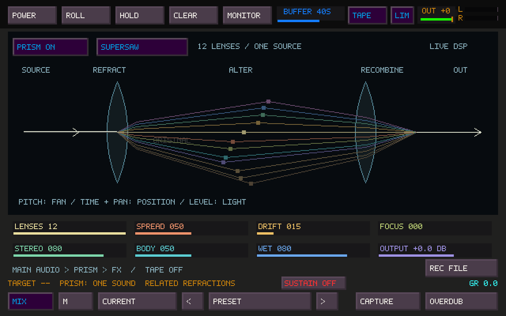

# Prism: real-time refraction

Prism turns live or recorded audio into 2–12 related voices inside Sister Machine.
Supersaw and Ensemble are the first two geometries. No render job or CDP executable
is involved. The existing FM Unison remains available.



## Play it

1. Open Sister Machine with **Tab**. Its page button cycles **Tape → FX → Fallout → Prism → Tape**.
2. For a direct pedal, leave **POWER off**. Play a tile, FM, Mosaic or TapeHead, or
   enable the main window's external input monitor for a physical instrument.
   Prism runs before the existing ordinary FX/Fallout path.
3. Engage **PRISM ON**. Start with Supersaw, 12 lenses, Spread 50, Focus 0, Drift 15,
   Stereo 80, Body 50, Wet 80 and Output 0 dB. Output offers up to +6 dB if needed.
4. Press **REC FILE** on this page. It records the final stereo output, including
   Prism, subsequent effects, the safety limiter and OUT fader. The existing timer,
   stop control and recording state continue across page changes.

With **POWER on**, Sister owns the musical sources as before: select the sources
on its Tape page and enable Monitor. Prism precedes the PRE slots, tape input trim,
rolling write and heads. For direct instrument playing without delayed tape heads,
set Sister's **DRY 100 / WET 0**. Here DRY means the direct *Sister* input, which
already contains Prism; Prism's own WET controls refraction. PRE FX can process
that direct path. Raise Sister WET to hear the heads and their downstream effects.
Head-tap capture still selects the corresponding head; **REC FILE** uses final OUT.

## Controls and optical meaning

| Control | Audio | Diagram |
|---|---|---|
| Mode | Supersaw or Ensemble; click to cycle | Wide fine-pitch fan plus octave body, or a tighter fan with more time displacement |
| Lenses | 2–12, with fading entry/removal; wheel steps one lens | One ray per contributing lens; coincident pitches can overlap |
| Spread | Fine detune scale; 50 reproduces the FM template offsets at Focus 0 | Angular separation follows the actual smoothed pitches |
| Drift | Independent, deterministic slow pitch wandering, up to ±5 cents before Focus | Rays wander with the audio; no separate animation clock |
| Focus | Contracts fine pitch and added time offsets toward zero | Rays converge; intentional octave relationships remain |
| Stereo | Per-lens stereo balance; body voices stay near center | The control points move laterally with the actual pan values |
| Body | Stronger original central lens and stronger low octave lenses | The corresponding rays become more prominent |
| Wet | Original input versus normalized lens sum | Original straight path fades as refracted rays brighten |
| Output | −12 to +6 dB on the refracted sum | Audio output trim; the existing OUT meters show final level |

The incoming source, refraction, altered rays, recombination and output are always
connected. At zero Wet the rays remain faint as a settings guide and the original
path dominates. This is a parameter diagram, not an amplitude scope or frequency
analyzer. Pitch distances are expanded/compressed for readability; octave bands
are not a linear frequency scale. Node position represents added delay and pan,
not physical distance or total device latency.

The renderer reads a coherent atomic snapshot of the audio-owned smoothed values.
It does not read audio buffers or run DSP. It uses Sister's existing maximum
30 fps refresh; hiding or minimizing the page does not affect sound. With no
running engine it displays a stationary **SETTINGS** diagram.

Other native states: [Ensemble](images/prism-ensemble.png),
[full Focus](images/prism-focus.png), [zero Wet](images/prism-dry.png).

## Sound and architecture

The PR99 audit found two different source models: FM Unison creates oscillators;
Sister receives an arbitrary stereo stream. The reusable part is the voicing:
`0, −7, +7, −12, +12, −19, +19, −26, +26, −1200, −1207, −1193` cents.
Both engines now use one shared table. FM's oscillator, editing and reversible
Unison behavior are otherwise unchanged. A streaming reconstruction will have a
different texture from directly generated oscillators.

Prism has one preallocated 80 ms stereo history and bounded per-lens read state.
The original central lens stays direct. Other lenses use complementary Hann
windows over fractional stereo reads. A bounded shared period estimator runs at
about 47 Hz. On periodic sources it aligns the window span to an even number of
source periods, preventing the fixed-window pitch sidebands from displacing the
lower octave. A new span crossfades against the preceding read geometry for 40 ms;
the engine does not slide an entire delay window abruptly when a note changes.
On aperiodic input the last usable span remains in place.

Pitch, pan, added delay, level, Wet and output changes are smoothed. Mode changes
glide through the smoothed pitch targets. Lens identities survive count changes.
The seeded low-frequency trajectories are reproducible from a fresh start;
project recall restores controls, not the audio history or the exact middle of a
running drift cycle. The stream continues to prime during bypass. Once bypass or
Wet zero settles, the output equals the original stereo input exactly, including
when Prism's Output trim is nonzero.

The callback performs no allocation, file I/O, GUI work or new locking. All
storage is allocated during device preparation. Period analysis uses fixed bounds
and no FFT. Left and right remain separate through the reads; there is no mono
folding in the signal path. The period detector observes whichever input channel
has more energy, so opposite-polarity stereo does not cancel its analysis input.

Gain uses a weighted mean, including lenses during their fades. At 0 dB Output,
bounded inputs cannot grow twelvefold through summing. This deliberately favors
predictable peaks over automatic loudness matching: decorrelated material can be
quieter. Body, Wet and Output provide adjustment. The existing final linked
limiter remains the output safety stage.

## Latency and performance

The dry path and central lens add **zero Prism buffering**. Other voices use
variable read ages: nominally a 40 ms window plus a 2 ms guard and small per-lens
offsets. Detected periods can change the window, bounded to 60 ms. The oldest
Ensemble read is under approximately **71 ms** at normal audio rates; Supersaw
adds less offset. This is a blend of different read ages, not one fixed latency
that can be removed by delaying the dry signal. Device buffers and the existing
output limiter add their own latency. Lens count does not increase the window.

Measured on a shared Linux AMD EPYC 9V74 host, C11 `-O2`, stereo 48 kHz,
256 frames (5,333 µs budget), 4,000 measured blocks after warmup:

| Lenses | Prism mean / block | Prism p99 | Prism share of block budget | Sister + Prism + limiter mean |
|---:|---:|---:|---:|---:|
| Bypass | 12.48 µs | 25.75 µs | 0.23% | 308.89 µs |
| 2 | 32.26 µs | 82.02 µs | 0.60% | 338.69 µs |
| 4 | 38.69 µs | 87.50 µs | 0.73% | 357.41 µs |
| 6 | 46.45 µs | 109.67 µs | 0.87% | 347.54 µs |
| 8 | 52.95 µs | 108.72 µs | 0.99% | 360.93 µs |
| 12 | 65.46 µs | 114.92 µs | 1.23% | 369.43 µs |

These are offline processing measurements, not whole-application CPU percentages
or a hardware underrun certification. The shared host had scheduling outliers:
the full runtime reached 23.72 ms at four lenses and 10.85 ms at eight. Full-runtime
p99 stayed below 0.59 ms in this run; at twelve lenses its maximum was 1.46 ms.
The nonmonotonic full-runtime numbers also reflect that noise. Physical Windows
and Linux interface tests at 256 frames remain necessary before a live set.

## MIDI and saved projects

Use the existing **Ctrl+Shift+M** MIDI learn flow. Prism On/Off and Mode are
trigger targets; all eight sliders, including Focus and lens count, use the
existing continuous mapping and pickup system. Lens count is rounded to 2–12.
The sliders participate in the existing parameter-lock system.

Project state version **13** and Sister user preset version **12** persist all
Prism controls. Old files initialize Prism **off**. The older FX-slot migrations
retain their original version cutoffs, so PR99 slots and locks are not migrated
again. The main TSR29 sample format is unchanged. Sister presets on this page
are the existing full Sister presets, not a second Prism-only preset bank.

## Verification and remaining listening work

- Core tests cover deterministic streaming, abrupt control/count/mode changes,
  stereo channel isolation, retained opposite-polarity stereo, finite output,
  bounded gain, silent input, exact settled bypass, focus and control sanitizing.
- Test sources include sine, saw, triangle, pulse, noise, impulses and dynamically
  gated noisy tones at 44.1, 48 and 96 kHz. Spectral checks measure all twelve
  intended pitches at 44.1 and 48 kHz, including the three lower voices.
- Native application tests exercise page cycling, mouse hit regions, MIDI target
  resolution, knob changes and lens-count wheel steps. Both tape power states
  capture 16,384 stereo frames through REC FILE and compare every recorded sample
  against the actual output callback, while changing pages during recording.
- Save/load tests cover every Prism setting, user presets, missing old settings
  and preservation of PR99's explicit FX slots. FM Unison and the other previously passing
  tests retain their results. Four existing failures are reproduced
  with an independently rebuilt, unchanged PR99 tree: Sister routes, source mask,
  recursion, and the canvas/grid assertion. The total is 74 passing / 78 tests.
- AddressSanitizer and UndefinedBehaviorSanitizer pass the new streaming/pitch/state
  tests with the Prism engine instrumented (LeakSanitizer disabled because this
  host cannot inspect process threads). Native screenshots were checked in
  Supersaw, Ensemble, fully focused and zero-Wet states.
- Native CDP executable integration was skipped because that runtime is absent
  in this checkout. Prism itself has no CDP dependency.

This is the first playable prototype. Listening with PIPE/breath, speech, field
recordings, actual tape, dirty hardware oscillators, complex polyphony and physical
stereo inputs remains a user audition task; synthetic coverage does not substitute
for those recordings. Granular texture and transient softening can still be
audible. Organ, Octaves, Cluster, Cloud, Custom, per-lens coloration and a separate
quality mode are future work, not hidden options in this build.

Reproduce the focused checks and diagnostic image after configuring the normal build:

```sh
cmake --build build --target test_prism prism_probe tapesister_mosaic_controller_tests
ctest --test-dir build -R 'test_prism|tapesister_mosaic_controller_tests' --output-on-failure
build/prism_probe prism.ppm
build/prism_probe --bench
```

On Windows the executables have `.exe` suffixes. The application adds no new
runtime dependency or packaging step.
