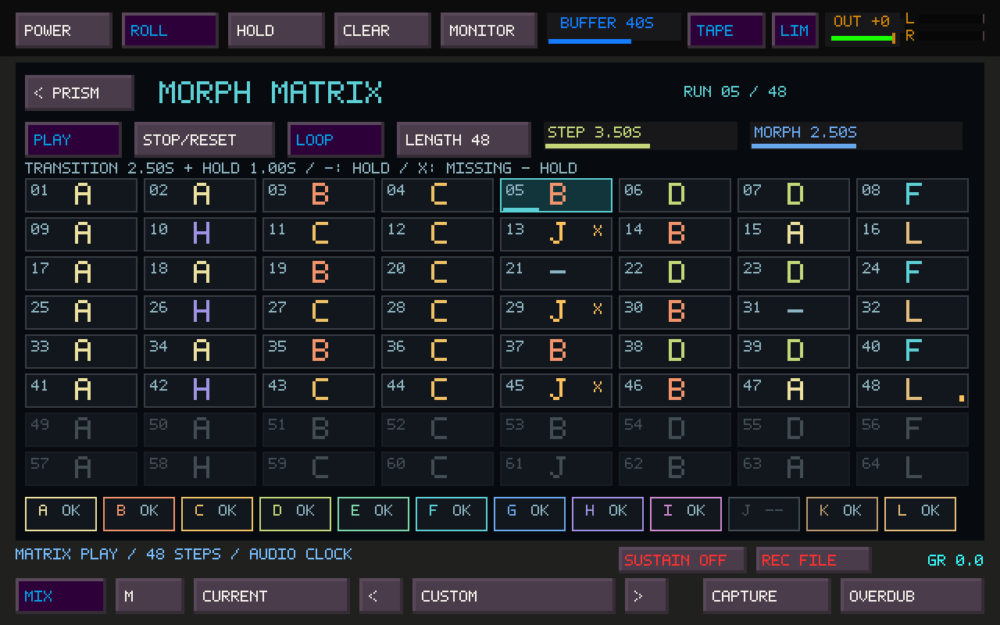

# Prism Morph Matrix

The Morph Matrix automates navigation through the existing twelve captured Prism
states. Open **MATRIX >** at the top right of Prism. Its 64 cells read left to
right, then top to bottom. Every cell references a bank letter, A–L; there are no
extra sound copies hidden inside cells. Ordinary manual morphing remains available
on PERFORM.



## Populate and play

Capture a few sounds on PERFORM, then open the Matrix. A new pattern has 16 active
steps, Loop on, and all cells set to HOLD. Each of the 64 cells remains editable,
including cells beyond the selected length.

| Control | Action |
| --- | --- |
| Cell wheel or left-click | Cycle HOLD → A → … → L → HOLD |
| Cell right-click | Cycle backwards |
| Cell middle-click | Clear this cell to HOLD; bank sound stays saved |
| Shift-left-click a cell | Set that cell as the sequence end |
| LENGTH | Wheel or left/right-click adjusts 1–64 steps |
| PLAY | Start again at step 01 |
| STOP/RESET | Hold the current blend; next PLAY starts at 01 |
| LOOP | Repeat the active sequence; off plays once and holds the final sound |
| STEP | Time per cell, 0.05–120 seconds; click or wheel, Shift-wheel for fine changes |
| MORPH | Existing Prism Morph Time; same slider/MIDI target and parameter lock |
| < PRISM | Return to the previous Prism page while the Matrix continues |

The cyan outline marks the current step; its underline shows elapsed step time.
The small amber marker identifies the sequence end. Cells after it are dimmed.
A dash is HOLD. An amber letter with **X** refers to an empty bank slot and also
holds the previous sound. Neither case recalls a default patch or silences notes.
An empty bank letter can be filled during playback.

## Timing and handoff

For each cell, effective transition time is **min(Morph Time, STEP)**. A shorter
Morph Time leaves a hold at the destination; equal times give continuous motion.
Longer Morph Time is capped for that Matrix transition without changing the saved
manual Time setting. The timing line displays that transition/hold relationship.
Changes to cell assignment or timing take effect on the next cell visit; an active
transition keeps its original destination and duration.

PLAY from a stopped endpoint or live sound begins morphing toward cell 01. If
already partway through a manual or Matrix blend, PLAY first completes the current
blend toward its nearer endpoint, then begins cell 01. The header says JOINING
until that lead-in finishes. PLAY is a restart, not pause/resume.

STOP keeps the exact two interpolation patches and their current blend amount for
manual takeover. The PERFORM fader, including MIDI, can immediately move that same
pair. No bank letter is overwritten. A temporary live endpoint is displayed as
**~**; wheel to a letter to store a live sound. Repeated visits may temporarily
produce a pair with the same letter on both ends, particularly when that letter
was edited between visits.

Manual CAP/TO actions, clear, ordinary preset recall and New/Vary outside a Matrix
draft take over from Matrix. A full setup recall stops transport. Opening another
page, playing QWERTY/MIDI notes, and using audio recording controls do not stop it.
The lens sequencer remains a separate, global performance control.

## Edit a bank sound while Matrix plays

1. Click a letter in the Matrix's A–L strip to open its **draft** on SOUND.
2. Adjust lenses, shapes or sound controls. PRESETS, New/Vary and locks also work
   on the draft. The diagram shows the draft; the audio continues through Matrix.
3. Click **SAVE D**, for example, beside the tabs. This captures the draft into D
   and returns to Matrix. The assigned CAP on PERFORM can also save that draft.

The change becomes audible on the **next visit to D**. It does not replace the
endpoints of a morph already in progress. An empty letter starts with the current
editor patch. Returning to Matrix without saving leaves the draft open; BACK
returns to it. Clicking a different bank letter replaces the unsaved draft.
For immediate audible audition, stop Matrix and use the existing manual editing
workflow. Prism On/Off and the lens sequencer remain global controls.

## Saving and compatibility

Prism presets, full Sister presets and project sidecars save the A–L bank, all 64
cell references, length, Loop, STEP, Morph Time and a parked current transition.
Transport loads **stopped**, never starts unexpectedly. Use Prism **Shift-recall**
to load an entire saved setup; normal Prism preset auditions preserve the current
bank and Matrix pattern. Unsaved drafts are not separate bank entries: SAVE the
letter before saving the performance.

New format versions: Prism bank 3, Sister preset 19, Sister project sidecar 20.
Older presets and projects remain readable, with a blank Matrix. Use this or a
newer build to reopen files saved with Matrix data. The TSR/audio format is
unchanged by this feature.

## Implementation and validation

The scheduler advances on Prism's existing 64-frame audio control tick. It feeds
the same interpolation, lens geometry and DSP path as manual morphing. It uses
fixed storage for two active patches; a future cell fetches the bank entry again
when visited. There are no allocations, file operations, locks or UI calls in the
scheduler. UI edits use the existing audio-device lock and bounded control copy.
The existing atomic routing snapshot publishes progress and current-step metadata;
the audio scheduler does not mutate the UI's runtime parameter store.

Core tests cover all 64 steps in order, loop and end, timing and hold, missing
states, same-letter recapture, an unchanged in-flight transition, initial blend
joining, immediate STOP, manual handoff, shared-DSP output comparison, and all
three persistence formats. Native SDL controller tests address every cell and
letter, check live draft editing/save, mode guards, Time locks, MIDI target
identity, recording hit areas, bank retention and atomic progress publication.

The Linux app and 20 of 21 selected regression targets pass. The remaining
`test_sister_routes` assertion at line 153 fails identically on a fresh build of
unchanged main (`7a4b8ad`); this PR does not change it. Other selected targets cover
Prism/Zoya, Sister runtime/FX/Fallout, presets/projects, MIDI/performance, FM,
Mosaic recording/ownership, sample pages, capture, external input and Portal
controller behavior. Controller fixtures use SDL dummy devices. Actual Windows
audio hardware, hardware MIDI input, and CDP processor listening are not certified
by these tests.

The screenshot is captured from the native application, using test-only scripted
SDL input and software rendering. The release binary has no screenshot driver.
The controller fixture can also render the page reproducibly:

```sh
TS_PRISM_MATRIX_SCREENSHOT=/tmp/prism-matrix.ppm \
  ctest --test-dir build -R '^tapesister_mosaic_controller_tests$' --output-on-failure
```

Before release, play the Matrix on Windows at the normal audio buffer size while
recording into Mosaic and REC FILE. Check subtle and extreme transitions, edit
and save a repeated letter, take over with a MIDI fader, stop during a blend,
reopen a saved setup, and confirm no dropouts or unexpected transport restart.
There is one pattern, with no tempo sync, probability, automation lanes or tracks.
