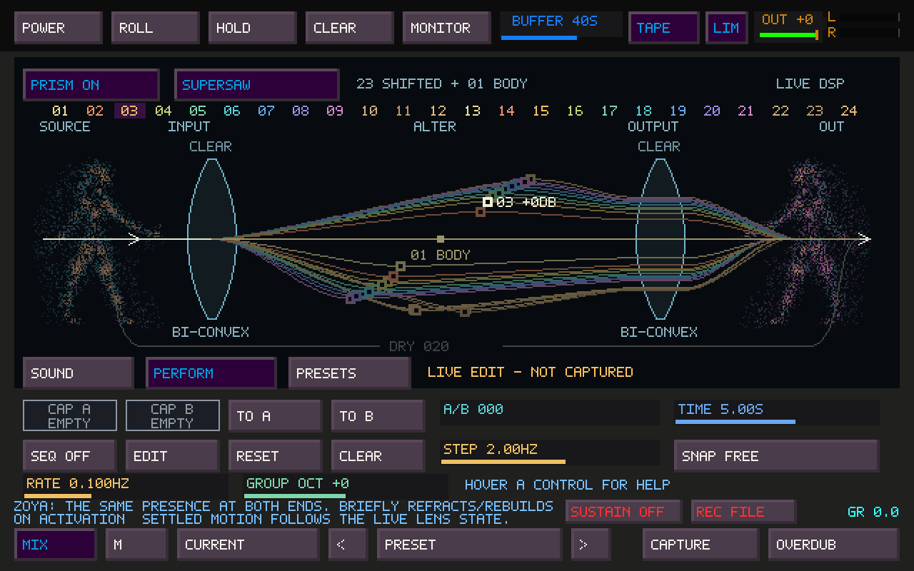

# Zoya inside Prism — meditation and standing poses

Zoya appears at SOURCE and OUT as two manifestations of **the same entity**:
one presence becomes many possibilities, then recombines. The mirrored figures
share one precomputed **field of particle density**. Denser regions suggest the
head, powerful shoulders, shaped waist and heavy legs; sparse matter diffuses
their edges into the surrounding space. There are no traced facial, garment,
muscle or body contours. By default, at SOURCE she sits upright with crossed legs and both
hands resting on her knees. At OUT the same seated posture is gently suspended,
ten native pixels higher. Suspension is a fixed placement, with the existing
sound-driven dispersion; it adds no independent bobbing or recurring animation.
They occupy the existing spaces at the two ends of the diagram. The lenses,
ray geometry, numbered strip, editing handles, labels and controls keep their
positions and behavior.


## Choose the pose in tapesister.ini

Both poses are included in the same build. Close TapeSister, edit the `[Prism]`
section of `tapesister.ini`, then restart:

```ini
[Prism]
prism_zoya_pose=meditation
```

| Value | Appearance |
| --- | --- |
| `meditation` (default) | Cross-legged, hands on knees at SOURCE; the same pose suspended slightly higher at OUT. |
| `standing` | The original diffuse standing/reaching figure at both ends. |

Change the value to `standing` to use the standing pose. An older INI with no
`prism_zoya_pose` entry uses meditation automatically. Normal configuration
saves preserve the choice. Values are lowercase; any other value reports an
invalid-pose configuration error. Edit while the application is closed so its
shutdown save does not overwrite your change.

This is an application appearance preference. Projects, Sister presets, Prism
presets, New/Vary and A/B transitions do not select or store a pose. Both poses
use the same introduction, particle treatment, sound-driven motion and controls.



## Activation and visibility

Switch **PRISM ON** while its page is visible. A brief, approximately 3.6-second
introduction forms source Zoya, lets parts of her depart toward the input lens,
sends a few packets along the existing refracted paths, and reconstructs output
Zoya. Both then settle into sparse figures. This is an activation metaphor,
not a measurement of signal travel time or processing latency.


The preview above loops for inspection. In the application the introduction runs
once per visible off-to-on transition. It does not repeat during ordinary
operation, A/B motion, note attacks, or changes between Sound/Perform/Presets.
Hiding/minimizing Sister, changing to another Sister page, or opening its preset
manager ends the introduction; returning to an already enabled Prism shows the
settled figures. Enabling Prism while it is hidden does not queue an introduction.
Sister's tape POWER is independent; **PRISM ON/OFF** controls this appearance.

## Reading the manifestations

| Prism state | Appearance |
| --- | --- |
| Spread | Up to two sparse, dim echoes around output Zoya |
| Drift | Output points lose registration using the live lenses' pitch wandering |
| Focus | Echoes and displacement converge; diffuse fringes dim around the denser body |
| Body | Body-anchor strength increases the retained point density |
| Color | Adds chromatic variation to the output's warm dense/cool diffuse matter |
| Wet / Dry | Changes the relative prominence of the transformed/original figures |
| Lens count | Determines the sampled paths; introduction packets use at most six rays |

The resting figure typically retains roughly two-thirds to four-fifths of its
candidate points. Those candidates already follow a varying density field,
with many more inside the body than in its fringe. High Focus and the brief
formation peaks retain more. Trim/mute
of the wet body anchor also influences the density derived from that anchor.
The original source remains comparatively stable. The output uses the live
smoothed lens snapshot, including during silence, for its wandering. A/B uses
the live morph position when combining the two stationary pitch centers.


This first version has no independent breathing, head turns, idle oscillator or
periodic communication animation. An unchanged DSP snapshot produces an unchanged
settled image. The figures are a parameter/state diagram, not an amplitude scope.
Hover either manifestation for a brief explanation.

## Implementation and cost

- Soft overlapping volumes and low-density wisps are sampled **offline** by
  `scripts/generate-prism-zoya.py` into `src/ts_prism_zoya_points.inc`: meditation
  has 2,329 points / 9,316 bytes, standing 2,468 points / 9,872 bytes. Both tables
  occupy 19,188 bytes of read-only position/density/region data; only the selected
  table is drawn. The accepted point data for each pose is preserved exactly.
  No contour samples remain.
  All field evaluation, erosion and sampling happen in the development generator;
  the application only transforms and draws the cached points.
- Crisp native single-pixel particles; no bitmap loading,
  filled character texture, blur, GPU particle engine, animation rig or simulation.
- Two decimated output echoes maximum. Introduction packets use at most six
  existing rays and two packets per ray; handles are drawn over them.
- Figures are clipped to the SOURCE/OUT margins and drawn behind the original
  signal lines. They do not add hit targets or intercept lens gestures.
- State lives in `TsSisterUiModel` and is updated on the event thread. The existing
  33 ms presentation limit applies. Hidden figures have no drawing or ongoing
  animation work. Settled figures have no running visual clock.
- **No audio callback, DSP algorithm, snapshot format, project/preset format,
  gain, routing or limiter changes.** This adds no work to the audio callback;
  UI rendering still consumes a small amount of shared CPU time.

On a shared Linux server (Intel Xeon Platinum 8573C), a release-with-debug-info
build measured the preceding meditation-only revision over 1,500 native framebuffer draws per case
after 50 warmup draws:

| Drawing case | Mean | p99 |
| --- | ---: | ---: |
| Existing optics, manifestations hidden | 0.323 ms | 0.681 ms |
| Settled manifestations, 24 lenses | 0.634 ms | 2.159 ms |
| Maximum Spread, Drift, Body and Color | 0.628 ms | 2.007 ms |
| Introduction sampled across its duration | 0.488 ms | 1.357 ms |

The settled comparison adds about 0.311 ms per frame, equivalent to roughly
0.93% of one CPU core at 30 FPS on that host. These are development drawing
measurements, excluding window presentation/compositor cost; physical
Windows/audio/MIDI audition remains needed.

## Reproduce and validate

Build `tapesister`, `test_prism_zoya`, `test_sister_ui_model` and the existing
Prism/controller checks. The focused test verifies activation edges, completion,
hidden cancellation, no queued replay, timer rollover, immutable render input,
unchanged controls/optics outside the figure margins, and motion from an actual
silent DSP stream. It also checks that a stationary snapshot cannot invent idle
animation.

The native application builds. `test_prism_zoya`, `tapesister_audio_config_tests` and
`test_sister_ui_model` pass locally for the combined build. The Zoya test checks
missing/legacy INI defaults, both values, normal save/load preservation, model
initialization and invalid-value rejection. It exercises both poses through
activation, protected regions, stationary snapshots and live DSP drift.
The audio-config test checks that audio/device saves retain the selected pose.
Generated point data reproduces exactly, and rendered frames for both poses
match the preceding standalone versions. The local SDL build used MIDI and CDP
bundling disabled;
physical Windows/audio/MIDI audition remains outstanding.

The earlier `test_prism` and `tapesister_mosaic_controller_tests` passes belong
to the original Zoya implementation. The complete suite and those broader
checks were not rerun for this appearance preference. The four previously
documented baseline failures remain outside this work; this is not a claim
that the whole suite or physical hardware validation is green.

```sh
./build/test_prism_zoya
./build/test_prism_zoya --bench
mkdir -p /tmp/prism-zoya-frames
./build/test_prism_zoya --frames /tmp/prism-zoya-frames
# The test renderer defaults to meditation; append --standing for the other pose.
mkdir -p /tmp/prism-zoya-standing
./build/test_prism_zoya --frames /tmp/prism-zoya-standing --standing
```

The frame command renders the actual application framebuffer at 30 FPS, followed
by settled, dispersed, focused and dry reference states. It does not record a
physical display, device or live audio session. More elaborate idle behaviors
remain outside this proof of concept and should follow visual/performance review.
