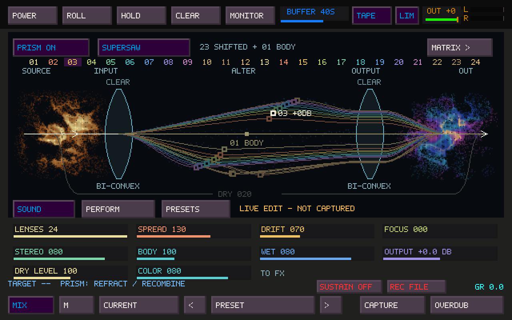
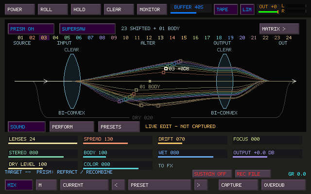

# Prism nebula fields

Prism now uses two related fields of particle matter: a coherent amber/gold
source, and a more dispersed blue/cyan/violet/magenta output with a warm core.
Their density, cavities and filaments suggest the same material transformed by
refraction. Standing and seated figures are no longer ordinary display modes.
The existing window layout, optics, numbered lenses, editing handles, labels and
controls retain their geometry and interaction.



## Activation and idle

Enabling **PRISM ON** while its page is visible starts one approximately
3.6-second introduction: source matter coheres, casts through the first lens,
travels along the existing refracted paths, and gathers into the output field.
It is a visual metaphor, not a measurement of audio latency or signal amplitude.
The settled fields have slow internal drift, density variation and chromatic
currents. Transfer now has twice the original mote density and a visible,
continuous source-to-output progression. A visual transit takes about 24 seconds;
this timing is independent of audio. The field remains behind the optical diagram.



The GIF loops for inspection. The application's introduction only runs on a
visible Prism off-to-on transition. A–L morphs, Matrix steps, note attacks,
Sound/Perform/Presets switching and Sister's tape POWER do not restart it.
Leaving Prism, opening Matrix or an overlay, hiding/minimizing Sister, or
turning Prism off stops the animation work. Returning shows settled matter,
without replaying or catching up hidden time. Enabling Prism while hidden does
not queue an introduction.


## Sound response

| Control | Field response |
| --- | --- |
| Spread | Expands the output cloud and disperses matter around optical paths. |
| Drift | Increases slow internal movement; the source remains more coherent. |
| Focus | Tightens the cloud and reduces diffuse motion and fringes. |
| Body | Increases visible matter and core presence. |
| Color | Expands the output's cyan, violet and magenta variation. |
| Wet / Dry Level | Balances output/source prominence without hiding either identity. |
| Lens count | Changes the sampled flow paths; at most six atmospheric lanes. |

The visual parameters follow the actual manual morph position or Matrix's
frozen active transition pair. Editing a different stored state cannot make the
field jump to that state's parameters during playback. These are visual reads;
they do not modify captures, presets or DSP behavior.

Zoya remains a rare, temporary suggestion within the output under unusually
coherent conditions. There is no normal pose selector or added UI control. The
appearance fades back into the field and cannot continuously repeat while the
settings remain unchanged. At its brief peak, interior particles gather around
the head, shoulders and hands on the knees while diffuse cloud matter recedes.
A small warm chest center and sparse spectral emanation borrow the reference's
radiance. The reveal stays seated and transient. [Native peak frame](images/prism-zoya-apparition.png).

## Appearance preference

Close TapeSister, edit its INI, and restart:

```ini
[Prism]
prism_zoya_pose=nebula
```

| Value | Behavior |
| --- | --- |
| `nebula` (default) | Both fields, their activation and ambient motion. |
| `off` | Original optics only; no particle rendering, clock or nebula hover help. Audio remains active. |
| `meditation` / `standing` | Legacy values accepted and migrated to `nebula` on save. |

The historical key is retained for compatibility. Missing entries select
`nebula`; invalid values report a configuration error. This preference belongs
to the application and remains independent of sound presets, projects and A–L.
Existing `off` preferences survive audio settings saves and relaunches.

## Implementation

- `scripts/generate-prism-nebula.py` evaluates cloud noise, filament ridges,
  cavities and sampling offline. The generated read-only data contains 4,253
  source points and 4,431 output points, 43,420 bytes total.
- Rendering uses cached positions/density/spectrum and a small set of shared
  motion coefficients. Four-tap subpixel deposition removes sampling gaps when
  fields stretch. There is no runtime noise evaluation, fluid simulation,
  convolution blur, texture allocation or GPU requirement.
- Flow particles follow the same cubic geometry as the existing optics, with
  at most six lanes of 132 points (792 total). All decoration draws before the glass, rays,
  handles and text. Additional clear rectangles protect handle/readout space.
- A UI-only clock updates at 33 ms granularity and pauses while hidden. Render
  input is immutable. No renderer work runs in the audio callback.
- The small existing meditation point table is used only for the transient
  output apparition (2,594 points / 10,376 bytes). Overlapping soft interior
  volumes improve posture readability without contour sampling. The spectral
  emanation adds at most 192 motes during the apparition only. Its timer requires
  sustained coherence, fades both ways,
  and must rearm before another appearance. No standing figure is drawn.
- DSP algorithms, audio routing, voice state, gain, recording and project/preset
  formats are unchanged. The event thread reads seven scalar parameters and
  the current Matrix pair while taking its existing audio snapshot.

## Validation and reproduction

`test_prism_zoya` checks configuration migration/persistence, visible activation,
hidden pause and rollover, bounded idle updates, manual/Matrix interpolation,
temporary apparition timing/rearming, deterministic immutable rendering, the
warm/cool/magenta palette, continuous transfer against a fixed audio snapshot,
and exact preservation of existing optical and label
pixels. `off` is compared against the full original optics-only framebuffer,
including forced stale animation flags.

```sh
./build/test_prism_zoya
./build/test_prism_zoya --bench
mkdir -p /tmp/prism-nebula-frames
./build/test_prism_zoya --frames /tmp/prism-nebula-frames
```

The frame command runs the actual native renderer, including a silent DSP stream,
at 30 FPS. It writes activation and continuous-transfer frames plus
settled/dispersed/focused/dry/peak-apparition states.
The supplied preview is rendered from this build; it is not a concept mockup or
a recording of physical audio hardware.

The original nebula implementation passed six targeted suites: `test_prism_zoya`,
`test_prism`, `test_sister_ui_model`, `tapesister_audio_config_tests`,
`tapesister_mosaic_controller_tests`, and `tapesister_keyboard_hold_tests`.
This refinement rebuilds the native application and passes the focused visual
suite, including AddressSanitizer/UndefinedBehaviorSanitizer
with leak detection disabled in this environment. Cached field generation
reproduces byte-for-byte.

On this shared Linux host, 1,500 native framebuffer draws per case after 50
warmups measured:

| Drawing case | Mean | p99 |
| --- | ---: | ---: |
| Existing optics only | 0.208 ms | 0.495 ms |
| Settled nebula, 24 lenses | 1.013 ms | 1.453 ms |
| Maximum Spread, Drift, Body and Color | 0.978 ms | 1.372 ms |
| Introduction sampled across its duration | 0.661 ms | 1.132 ms |
| Apparition at peak | 1.058 ms | 1.461 ms |

The settled field adds approximately 0.805 ms per frame, or 2.4% of one CPU core
at 30 FPS on this host. These are drawing measurements, excluding window
presentation and compositor cost. They are not a physical Windows/audio/MIDI
performance guarantee; audition at the normal device buffer remains necessary.
