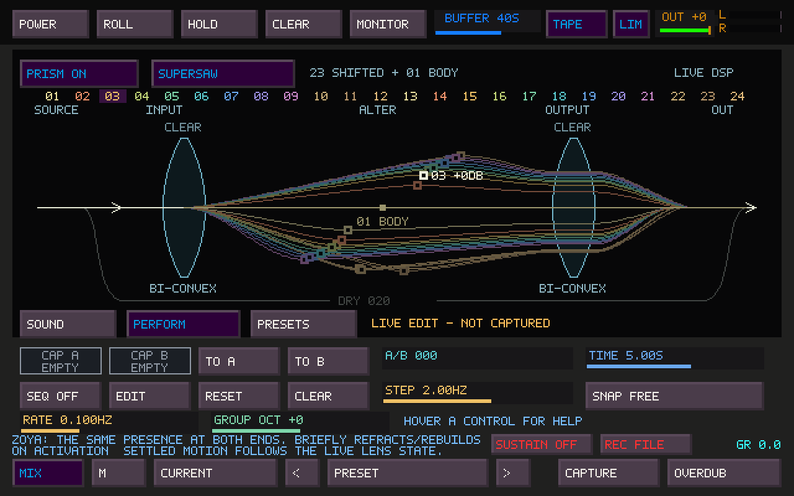
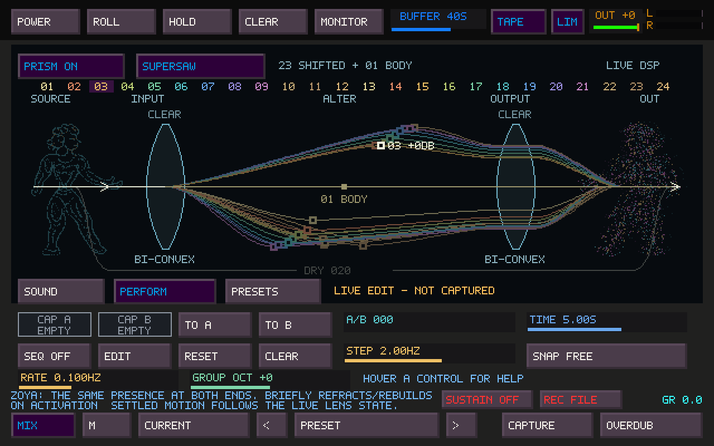
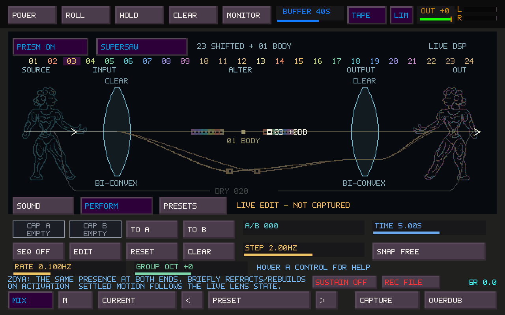

# Zoya inside Prism — visual proof of concept

Zoya appears at SOURCE and OUT as two manifestations of **the same entity**:
one presence becomes many possibilities, then recombines. The mirrored figures
share one precomputed cloud. Curled hair, a shaped waist, broad shoulders/arms,
and heavy thighs/calves carry TapeSister's character through the abstraction.
They occupy the existing spaces at the two ends of the diagram. The lenses,
ray geometry, numbered strip, editing handles, labels and controls keep their
positions and behavior.


## Activation and visibility

Switch **PRISM ON** while its page is visible. A brief, approximately 3.6-second
introduction forms source Zoya, lets parts of her depart toward the input lens,
sends a few packets along the existing refracted paths, and reconstructs output
Zoya. Both then settle into sparse figures. This is an activation metaphor,
not a measurement of signal travel time or processing latency.



The preview above loops for inspection. In the application the introduction runs
once per visible off-to-on transition. It does not repeat during ordinary
operation, A/B motion, note attacks, or changes between Sound/Perform/Presets.
Hiding/minimizing Sister, changing to another Sister page, or opening its preset
manager ends the introduction; returning to an already enabled Prism shows the
settled figures. Enabling Prism while it is hidden does not queue an introduction.
Sister's tape POWER is independent; **PRISM ON/OFF** controls this appearance.

## Reading the manifestations

| Prism state | Appearance |
| --- | --- |
| Spread | Up to two sparse, dim echoes around output Zoya |
| Drift | Output points lose registration using the live lenses' pitch wandering |
| Focus | Echoes and displacement converge; the figure becomes more coherent |
| Body | Body-anchor strength increases the retained point density |
| Color | More output points take on magenta/amber alongside cyan |
| Wet / Dry | Changes the relative prominence of the transformed/original figures |
| Lens count | Determines the sampled paths; introduction packets use at most six rays |

The resting figure typically retains roughly two-thirds to four-fifths of its
candidate points. High Focus and the brief formation peaks retain more. Trim/mute
of the wet body anchor also influences the density derived from that anchor.
The original source remains comparatively stable. The output uses the live
smoothed lens snapshot, including during silence, for its wandering. A/B uses
the live morph position when combining the two stationary pitch centers.





This first version has no independent breathing, head turns, idle oscillator or
periodic communication animation. An unchanged DSP snapshot produces an unchanged
settled image. The figures are a parameter/state diagram, not an amplitude scope.
Hover either manifestation for a brief explanation.

## Implementation and cost

- A hand-authored profile is baked by `scripts/generate-prism-zoya.py` into
  `src/ts_prism_zoya_points.inc`: 1,244 points, 4,976 bytes of read-only point data.
  The generator is a development tool, not a runtime dependency.
- Native point drawing and occasional two-pixel fragments; no bitmap loading,
  filled character texture, blur, GPU particle engine, animation rig or simulation.
- Two decimated output echoes maximum. Introduction packets use at most six
  existing rays and two packets per ray; handles are drawn over them.
- Figures are clipped to the SOURCE/OUT margins and drawn behind the original
  signal lines. They do not add hit targets or intercept lens gestures.
- State lives in `TsSisterUiModel` and is updated on the event thread. The existing
  33 ms presentation limit applies. Hidden figures have no drawing or ongoing
  animation work. Settled figures have no running visual clock.
- **No audio callback, DSP algorithm, snapshot format, project/preset format,
  gain, routing or limiter changes.** This adds no work to the audio callback;
  UI rendering still consumes a small amount of shared CPU time.

On a shared Linux server (Intel Xeon Platinum 8573C), a release-with-debug-info
build measured 1,500 native framebuffer draws per case after 50 warmup draws:

| Drawing case | Mean | p99 |
| --- | ---: | ---: |
| Existing optics, manifestations hidden | 0.332 ms | 0.791 ms |
| Settled manifestations, 24 lenses | 0.487 ms | 0.903 ms |
| Maximum Spread, Drift, Body and Color | 0.490 ms | 1.022 ms |
| Introduction sampled across its duration | 0.413 ms | 0.899 ms |

The settled comparison adds about 0.155 ms per frame, equivalent to roughly
0.47% of one CPU core at 30 FPS on that host. These are development drawing
measurements, excluding window presentation/compositor cost; physical
Windows/audio/MIDI audition remains needed.

## Reproduce and validate

Build `tapesister`, `test_prism_zoya`, `test_sister_ui_model` and the existing
Prism/controller checks. The focused test verifies activation edges, completion,
hidden cancellation, no queued replay, timer rollover, immutable render input,
unchanged controls/optics outside the figure margins, and motion from an actual
silent DSP stream. It also checks that a stationary snapshot cannot invent idle
animation.

The native application builds. `test_prism_zoya`, `test_prism`,
`test_sister_ui_model` and `tapesister_mosaic_controller_tests` pass locally;
the controller run used SDL's dummy video/audio drivers. The complete suite was
not rerun for this visual change. The four previously documented baseline
failures remain outside this work; this is not a claim that the whole suite or
physical hardware validation is green.

```sh
./build/test_prism_zoya
./build/test_prism_zoya --bench
mkdir -p /tmp/prism-zoya-frames
./build/test_prism_zoya --frames /tmp/prism-zoya-frames
```

The frame command renders the actual application framebuffer at 30 FPS, followed
by settled, dispersed, focused and dry reference states. It does not record a
physical display, device or live audio session. More elaborate idle behaviors
remain outside this proof of concept and should follow visual/performance review.
