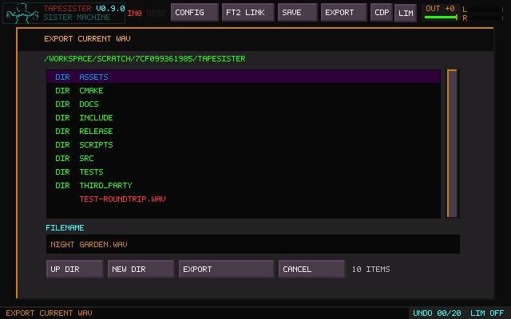
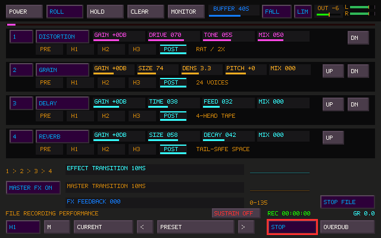

# TapeSister Quick Reference

For explanations and complete workflows, see the [User Manual](USER_MANUAL.md).

## Global navigation

| Control | Action |
| --- | --- |
| `Tab` | Visit Sister and return to the current workspace/event editor; Portal uses Tab for A-B audition |
| `Ctrl+Tab` | Move to a running Tapehead; press again there to return unchanged |
| `Shift+grave` | Open/close FM Logic; from Mosaic, return to Mosaic on the next press |
| grave (backtick) or `Ctrl+M` | Open Mosaic / return to the previous main or FM workspace |
| `1` | Show Sample Tiles; press again to cycle Sample pages |
| `Shift+1` | Open external REC BANK |
| `2` | Show performance keyboard |
| `3` | Show CDP; press again to cycle CDP pages |
| `Ctrl+Shift+P` | Reach CDP Portal from main, FM, Mosaic, or Sister |
| `4` | Show native DSP; press again to cycle DSP pages |
| `F1`–`F8` | Select keyboard octave |
| `Space` | Main: play/stop audition. Mosaic: play/pause arrangement |
| `Ctrl+Shift+M` | Enter or leave MIDI Learn in either window |
| `Escape` | Cancel active gesture/dialog first; event editor → Mosaic, Sister → main application, idle Mosaic → stop/rewind, ordinary main canvas → exit question |

From Sister, Shift+grave and grave bring FM and Mosaic forward even if already open
behind it. Active dialogs keep focus until resolved. Number-key lower-panel shortcuts
apply to the main canvas. Navigation and audition stop leave Mosaic playback running.

## Mosaic

Time runs downward in seconds; horizontal placement and width are visual. Drag an
occupied source onto the canvas. Sources arrows browse every numbered Sample bank
(including FM-created pages), then EVENTS pages with event audio versions. Browsing
does not switch the main bank. See the [Mosaic chapter](USER_MANUAL.md#mosaic).

| Action | Control |
| --- | --- |
| Select / edit | Click / double-click event |
| Box-select a group | Shift+left-drag on empty canvas |
| Move group / copy group | Drag a selected tile / hold Shift when starting that drag |
| Extend duration / change visual width | Drag bottom / right edge |
| Optional start, end, midpoint alignment | Alt during move or duration resize |
| Mute / solo selected events | M / S; excluded cards say SOLO OUT |
| Clear all solos, including offscreen cards | CLEAR SOLO in footer |
| Selection level / pan / fade-in / fade-out | LEVEL / PAN / IN / OUT in footer |
| Global tape speed | SPEED: 0.5× (−12 st), center 1×, 2× (+12 st) |
| Fine control / reset | Shift+wheel / right-click or double-click |
| Copy / paste last-clicked event at playhead | Ctrl+C / Ctrl+V; use Shift-drag for group copies |
| Delete selection | Delete or Backspace |
| Undo / redo arrangement edit | Ctrl+Z / Ctrl+Y or Ctrl+Shift+Z |
| Cancel move/copy drag | Escape |
| Play / pause | Space or PLAY/PAUSE |
| Stop and rewind | STOP or Escape when no gesture is active |
| Seek | Middle-click canvas or click time ruler |
| Return to beginning | Home |
| Scroll time / sideways / zoom | Wheel / Shift+wheel / Ctrl+wheel |
| Follow playhead / fit arrangement / repeat arrangement | FOLLOW / FIT ALL / REPEAT |
| Record final stereo output | Header or footer REC FILE; Ctrl+Shift+F |

Each event owns its one-to-five-note chord and **EVENT LOOP / EVENT ONCE** setting.
C5 plays twice as fast as C4; C3 takes twice as long. Extending a loop allows more
repetitions at the same pitches. One-shots play once, ending at their own completion
or the event's bottom. Shared source audio does not mean shared playback settings.

Double-click to edit; audio changes accumulate until returning to Mosaic:

| Exit choice | Result |
| --- | --- |
| CREATE TILE — Enter or N | Keep original; add a card and a regular Sample-bank source |
| UPDATE INSTANCE — U | Replace this card and add a new source |
| UPDATE ALL — A | Replace all cards using this source and update matching Sample-bank tiles |
| KEEP EDITING — Escape | Continue working without publishing the audio |

Speed changes pitch and arrangement timing together. Its wheel moves by semitones;
Shift+wheel uses tenths. Mix controls apply to the selection without editing audio.
Pan balances the original stereo channels; IN/OUT are linear fades in arrangement
seconds. Reset returns to 0 dB, center pan, zero fades, or 1× speed. Escape cancels
a drag; Undo/Redo includes the controls. CLEAR SOLO leaves mute switches intact.

No audio change means no question. Loop and chord changes are immediate and local
to the event. Background CDP results retain their requesting event. SAVE includes
the arrangement, level/pan/fades, global speed and shared audio versions; capacity is 128 events, five voices each.

**CFG → PALETTE → MOSAIC** offers HILITE and colors 1–5. Select a swatch and use
the existing RGB sliders or Tapehead eyedropper. SAVE SHARED stores them; CANCEL
restores the previous palette. HILITE defaults to bright red.

## CDP Portal

See the [Portal guide](CDP_PORTAL.md) for spectral processing and personal tools.

| Control | Action |
| --- | --- |
| ALL / SAVE / PINS | Browse processes, saved recipes, or user pins |
| Wheel over parameter labels | Scroll controls; footer shows the visible range. Wheel sliders/numbers for fine value changes |
| Family button below tabs | Cycle all families, waveset, spectral, time/tape, filter, grains, lo-fi/modulation, level, and delay; combines with search |
| Enter / PREVIEW | Render current settings; Preview cancels a running job |
| Space / Tab | Play-stop / source-result A-B |
| QWERTY note rows | Play selected Source/Result, up to five notes; release stops a note |
| F1–F8 | Set note octave; F5 selects C4 (original preview pitch) |
| Alt+wheel over selection | Expand/contract its hovered edge while the loop keeps playing |
| SAVE AS / PIN PROCESS TILE | Save settings to an empty recipe or chosen pin slot |
| MANAGE TOOLS | Rename, update, replace, or remove a numbered recipe/pin slot |
| Manager: CONFIRM / CANCEL | Commit the pending collection change / discard it |

Update preserves the destination's name and requires the same process. Replace
uses the whole working recipe and can fill an empty slot. Removing a pin leaves
its slot empty; other slots keep their numbers.

## QWERTY note keyboard

Lower row: `Z S X D C V G B H N J M`

Upper row: `Q 2 W 3 E R 5 T 6 Y 7 U`

MIDI note 60/C4 is unity for created FM material. MIDI velocity controls sample voice
level. MIDI All Notes Off is honored.

## MIDI Learn

1. Set MIDI input to **OMNI** when a controller sends different channels per
   control (the XVI-M factory pitch-bend layout uses channels 1–16).
2. Press `Ctrl+Shift+M`; every safe learnable control receives a translucent
   ice-cyan dither. The armed control is pale ice; mapped controls are electric blue.
3. Click a highlighted UI control, then move or press the hardware control.
4. Continue mapping, or press `Ctrl+Shift+M` again to leave Learn mode.

| Learn-mode action | Result |
| --- | --- |
| Click an unmapped control | Arm it for the next MIDI message |
| Click the armed control again | Cancel that pending learn |
| Click an already mapped control | Remove its mapping and save immediately |
| `Escape` | Cancel the pending learn |
| `Escape`, `Escape` within 500 ms | Leave Learn mode |

Mappings accept Note, 7-bit CC, and full 14-bit pitch bend, and are stored globally
in `tapesister.ini`. Pickup takeover is the default. Tile targets mean positions 1–16
on the active Sample page. The small LED beside the L/R meter flashes for every accepted
incoming MIDI message, whether mapped or not.

Tiles and switches learn Note or CC sources; continuous parameters learn CC or pitch
bend. This prevents pitch-bend fader jitter from claiming a button target. A learned CC
button may use either zero or a positive value for its press message.

For the Michigan Synth Works XVI-M, leave the 16 factory faders in 14-bit pitch-bend
mode and use **OMNI**. Configure the buttons as momentary CC messages for tile launch;
this avoids collisions with the playable note range.

## Project and editor shortcuts

| Shortcut | Action |
| --- | --- |
| `Ctrl+O` | Load audio, raw data, TSR, or TSP |
| `Ctrl+S` | Save active project / open Save browser |
| `Ctrl+E` | Export selected WAV or collection |
| `Ctrl+Z` / `Ctrl+Y` | Undo / Redo |
| `Ctrl+A` | Select all audio |
| `Ctrl+C` / `Ctrl+X` | Copy / Cut selection |
| `Ctrl+V` | Exact Paste |
| `Ctrl+Shift+V` | Fit Paste into selection |
| `Ctrl+R` | Reverse |
| `Ctrl+N` | Normalize |
| `Ctrl+I` / `Ctrl+U` | Fade in / Fade out |
| `Ctrl+Up` / `Ctrl+Down` | Gain +3 dB / -3 dB |
| `+` or `=` / `-` | Zoom in / out |
| `Left` / `Right` | Pan waveform |
| `0` | Show complete tile |

## Import preview

| Control | Action |
| --- | --- |
| Click waveform | Move the preview playhead |
| Drag waveform | Select a range, snap both edges to zero crossings, and place playhead at its start |
| Wheel / `Shift`+wheel | Pointer-anchored zoom / pan |
| `Alt`+wheel over selection | Expand (up) or contract (down) the edge on that half; active loop follows live |
| `Left` / `Right` | Pan the preview waveform |
| `0` | Show the complete file |
| Middle-click waveform | Clear selection and return playhead to the start |
| `Space` | Play/stop; after reaching the end, Space replays from the range start |
| QWERTY note keys / `F1`–`F8` | Play up to five preview notes / change octave; C4 is original pitch |
| `L` / **LOOP** | Repeat the selection, or the complete file when none is selected |
| `Enter` / **IMPORT ALL** | Import the complete decoded file |
| `Shift+Enter` / **IMPORT SELECTION** | Import only the zero-snapped preview selection |
| `Escape` in Preview | Return to the preserved file-browser tab |
| `Escape` in File Browser | Exit LOAD without changing the tile |
| `P` in File Browser | Return to the cached preview |
| `Shift`+click file / `Shift`+`Enter` | Decode and import recognized audio directly, bypassing Preview |
| `Ctrl+R` or **AUTO / RAW DATA** | Toggle automatic decoding and raw-byte interpretation |
| Raw `<` / `>` controls | Change encoding, sample rate, or byte offset |
| `Shift` while changing offset | Move the raw offset by 256 frames |

With LOOP playing, selection drags and Alt+wheel keep auditioning continuously.
The playhead is preserved inside the new range; clearing a selection keeps the
whole file looping. With playback stopped, selection editing stays silent.

Decoding runs in the background; `Escape` or **CANCEL** stops a long decode and returns
to the browser. Automatic decoding supports WAV, FLAC, MP3, and Ogg Vorbis, including
multichannel WAV downmixed to stereo. Raw mode accepts any
non-project file as unsigned/signed 8-bit, signed 16/24/32-bit integer, or 32-bit float
data with selectable endian order, mono/stereo layout, sample rate, offset, and
normalization.

## Waveform mouse gestures

| Gesture | Action |
| --- | --- |
| Click | Place edit playhead |
| Right-click | Play from pointer |
| Drag | Make selection |
| `Shift` + left drag inside selection | Copy and mix at destination |
| `Shift` + right drag inside selection | Copy and overwrite at destination |
| `Ctrl` + left drag inside selection | Move and mix; leave a gap at source |
| `Ctrl` + right drag inside selection | Move and overwrite; leave a gap at source |
| Wheel | Pointer-anchored zoom |
| `Shift+wheel` | Horizontal pan |
| `Ctrl+wheel` | Rotate through zero crossings |
| `Ctrl+Shift+wheel` | Fine zero-crossing rotation |
| `Alt+wheel` over selection | Expand/contract nearest selection endpoint |
| `Shift+Alt+wheel` | Tape-length change in semitones |
| `Ctrl+Shift+Alt+wheel` | Tape-length change in cents |
| Escape during gesture | Restore the pre-gesture audio |

Canvas gestures edit both stereo channels together, even while viewing only L,
R, or Sum. Move/Copy keeps paired frames, uses common crossfades and mix gain,
and extends the canvas when dragged beyond an edge. The ghost follows the
selected waveform display mode. Stereo snapping follows the louder channel at
each candidate boundary; opposite-polarity channels no longer cancel into false
silence. See [the stereo gesture audit](STEREO_CANVAS_GESTURES.md).

Ordinary sliders accept click/drag, wheel, and Left/Right while hovered. Shift makes
wheel/arrow adjustment finer in Sister Machine and coarser where the main interface
explicitly indicates it.

## Sample-bank tile interaction

| Gesture | Occupied tile | Empty tile |
| --- | --- | --- |
| Click | Select and audition | Select destination |
| Double-click | Select/audition | Create silent editable tape |
| Shift-click | Toggle Sister source membership | Copy active tile here |
| Plain click during performance | Launch/release layer | Select destination |

The active editing tile, current preview, Sister source membership, loop state, and
Capture destination use separate visual marks.

## Create and Variation

| Control | No selection | With selection |
| --- | --- | --- |
| Left-click CREATE | Fresh FM sound replaces selected tile | Fresh FM sound is fitted into range |
| VARY, Chain off | Replace current tile with related sound | Replace range with related sound |
| VARY, Chain on | Put relative in next empty tile | Stamp and advance same-width range |
| RANGE | Controls family distance | Controls variation distance |

Precise-duration recipe: double-click empty tile → select desired time → CREATE → VARY
as desired → CROP.

Right-click CREATE to roll a CDP variation of the retained clean waveform; repeated
rolls use that same clean source without stacking results. Middle-click cancels a
pending variation and restores the clean waveform. A right-click during processing
queues one more roll. See [CREATE and CDP variations](USER_MANUAL.md#create-and-cdp-variations).

## Main Capture

1. Select/double-click destination tile.
2. Choose M or S.
3. Press CAPTURE or enable OVERDUB.
4. Deliberately trigger a different tile, QWERTY/MIDI note, loop, or staged chord.
5. Press STOP/Space to keep; Escape to cancel.

| Format | Stored result |
| --- | --- |
| M | `0.5 × (L + R)` mono |
| S | independent stereo L/R |

The main and Sister M/S controls mirror one shared setting.

## REC BANK

| Control | Meaning |
| --- | --- |
| `Shift+1` | Open REC BANK |
| SRC EXT | Record configured physical input |
| SRC SYNTH | Record internal FM voices only |
| REC ARM | Wait for threshold / begin recorder workflow |
| MONITOR | Add dry external input to output; use headphones |
| CHAIN | Advance to next empty REC tile and rearm |
| KEEP | Copy all REC tiles into empty Sample slots, then clear REC BANK |

External input modes: MIX averages all channels; LEFT uses input 1; RIGHT uses input 2;
STEREO maps odd channels to L and even channels to R.

## Sister Machine transport and routing

| Control | Meaning |
| --- | --- |
| POWER | Allocate/release Sister engine and histories |
| ROLL | Move write head and accept writes |
| HOLD | Stop writing while playback heads continue |
| CLEAR | Safely clear rolling memory |
| MONITOR | Gate complete Sister DRY+WET return |
| BUFFER | Live 5–60 second rolling tape |
| TILES | Route Mosaic plus the page-specific Shift-click tile sources |
| FM | Route live FM Logic |
| EXT | Route external input |
| AUDITION | Route preview/audition bus |
| TH SRC | Route Tapehead's direct Live Link stereo bus; never changes transport |
| TH SONG | Toggle Tapehead Song Play/Stop; lit only while Song mode is playing |
| TH PATT | Toggle Tapehead Pattern Play/Stop; lit only while Pattern mode is playing |

A routed source leaves its ordinary direct speaker path and returns through Sister.
Power changes preserve shared pedalboard settings and transitions and Fallout's
modulation state. With Sister off, ordinary playback uses Fallout and POST slots.

## Sister heads and tape controls

| Area | Controls | Function |
| --- | --- | --- |
| H1 | Level, Time, Feed | anchored delay/feedback head |
| H2 | Level, Scrub, Rate, Feed | movable reverse/forward feedback head |
| H3 | Level, Span, Rate | independent movable head |
| Character | Wow, Drop, Duck, Decor, Width | movement, failure, dynamics, stereo shape |
| Filter | Type, Cutoff, Q, Gain | completed head-sum filter |
| Monitor/write | Input, Dry, Wet, Out, Erase, Ghost | gain staging, monitoring, memory retention |
| Stereo weave | Soak, Bleed, H1/H2/H3/Mix | changing delayed cross-channel transfer |

H2/H3 rates: `-2, -4/3, -1, -2/3, -1/2, 1/2, 2/3, 1, 4/3, 2`.

The T/F/E/A/X mixer trims Tiles, FM, External, Audition (0–400%), and effects return
(0–200%). Sister's internal OUT is 0–400% and does not change isolated head taps.

Shift-click an adjustable Sister/FX field to lock or unlock it.

## Sister Capture

| Selector | Choices |
| --- | --- |
| Tap | H1, H2, H3, MIX, raw TAPEHEAD; final MIX becomes OUT in FILE mode |
| Format | M or S |
| Destination | CURRENT, NEXT EMPTY, FILE |

FILE records until stopped, shows `REC hh:mm:ss`, and automatically upgrades WAV to RF64 when required. OUT
file recording remains available when Sister is powered off; H1/H2/H3 require Sister.

## FX pedalboard

Signal order is slot `1 → 2 → 3 → 4`. Each slot can be Empty, Reverb, Delay,
Distortion, or Grain; duplicates are allowed.

| Type | Parameters |
| --- | --- |
| Reverb | Gain, Size, Decay, Mix |
| Delay | Gain, Time, Feedback, Mix |
| Distortion | Gain, Drive, Tone, Mix |
| Grain | Gain, Size, Density, Pitch, Mix |

Placement is exactly one of:

| Placement | Position |
| --- | --- |
| PRE | new source before INPUT/write/Duck |
| H1/H2/H3 | after selected head read, before later head character/level |
| POST | after Sister MIX and Fallout |

Effect and Master transitions: 10 ms–60 min. Slot Gain: -12 to +12 dB. FX Feedback:
0–135%.

**MASTER FX** bypasses the live pedalboard and Fallout together, including Fallout's
feedback, over the Master transition time. It preserves settings and modulation
clocks. Bypass leaves dry playback audible and cannot remove effects printed into
Sister's tape. With Sister off, only POST slots process ordinary playback; PRE and
head placements require Sister.

## Fallout

Works with Sister powered on or off, before POST slots. Enable both its FALLOUT
switch and MASTER FX to hear it. Feedback returns to Sister's write when powered,
or through the bounded ordinary playback return when Sister is off.

| Section | Controls/function |
| --- | --- |
| Main | Mix, Feedback, Noise type/level |
| Drop | random amplitude failure and rate |
| Pan | smoothed random position and rate |
| Skip | buffer loop span and rate |
| Bit | sample hold, bit depth, rate |
| Pitch | discrete ratio, ramp, event rate |
| Transitions | Preset, Parts, Master; each 10 ms–60 min |
| LFO | sine, 1 cycle/hour–10 Hz, symmetric depth |
| Rise | Saw or 1-Shot, 1 second–4 hours |
| Retrigger | restart every Rise target together |

MOD targets: Mix, Feedback, Noise, Drop Rate, Pan Rate, Skip Span/Rate, Bit
Sample/Depth/Rate, Pitch Ratio/Ramp/Rate. `L` assigns LFO; `R` assigns Rise.

## Final output

Final order: mix → linked limiter → OUT fader → L/R meter and FILE OUT.

| Readout | Meaning |
| --- | --- |
| LIM | global limiter enabled |
| GR 0.0 | no current gain reduction |
| GR-x.x | limiter reducing by x.x dB |
| LIM OFF | limiter bypassed |

OUT is after the limiter. Lower pre-limiter stages to reduce gain reduction.

## Windows audio

| Setting/state | Meaning |
| --- | --- |
| Backend Auto | recommended; SDL chooses the Windows backend |
| Backend WASAPI | explicit Windows WASAPI; save and restart |
| Backend DirectSound | explicit compatibility backend; save and restart |
| Input/Output SYSTEM DEFAULT | deliberate use of the current system default |
| active | configured endpoint is open |
| closed capture | normal when EXT, external REC, and input monitoring are idle |
| lost / retry-pending | configured endpoint unavailable; no silent substitution |
| fallback-active | system-default output was explicitly approved for this session |

Capture loss leaves tiles, FM, audition, and internal Sister audio available. Output
loss leaves the application responsive. Reconnect the configured endpoint or select a
new one in CONFIG. TapeSister has no native ASIO backend; prefer WASAPI shared mode for
coexistence and validate REAPER/ASIO against the interface driver's own sharing rules.

## Files and folders

| Item | Contains | Portable rule |
| --- | --- | --- |
| `.tsr` | complete editable project/page state | keep inside its named project folder |
| `samples/` | extractable 16-bit PCM WAV copies | move with the project folder |
| `project-data/` | additional pages, REC BANK, and Mosaic | move with the project folder |
| `project-data/mosaic.tsm` | event layout, notes, regions, loop/mute/solo/repeat settings | move with the project folder |
| `project-data/mosaic-000.wav`, etc. | shared event audio versions, lossless 32-bit float | move with the project folder |
| `sister-state.ini` | Sister/Fallout project state | move with the project folder |
| `manifest.txt` | collection map | move with the project folder |
| `.tsp` | processing recipe, no audio | standalone |
| `.wav` | ordinary audio export/capture | standalone |
| `.flac`, `.mp3`, `.ogg` | automatically decoded import audio | standalone |
| any other non-project file | raw-data import source | standalone |
| `Captures/` | immutable 32-bit float performance archive | intentionally outside projects |

Saving `Name.tsr` creates the movable folder `Name/`. Share or back up that whole folder.

## File browser

| Control | Action |
| --- | --- |
| Up/Down | Move selection |
| Page Up/Page Down | Move by page |
| Home/End | First/last entry |
| Enter/double-click | Open/accept |
| Backspace | Parent directory when file list owns focus |
| Escape | Cancel current browser action |

Save and Export append the proper extension. Replacing a file requires a deliberate
confirmation.

**Export selected WAV** starts with the selected tile's name, including a custom
tile rename. It keeps a single `.wav` extension and substitutes filename-safe
characters where needed. You can edit the suggested name before saving.

## Safety

- Space controls the active audition; in Mosaic it plays/pauses the arrangement.
- Use Mosaic STOP or Escape in the idle arrangement to stop and rewind it.
- Escape cancels the active gesture or dialog.
- Keep LIM on during feedback and Extreme exploration.
- Lower Sister/FX/Fallout levels before the limiter when GR is excessive.
- Use headphones for microphone monitoring.
- Sister Capture refuses a destination that is also a live Sister source.

### Direct output recording

| Control | Action |
| --- | --- |
| **REC FILE** above the virtual keyboard | Record tile or FM playing; remains accessible with FM open |
| **REC FILE** in the bottom-right footer | Start/stop output recording from any main-window workspace, including Mosaic |
| **REC FILE** in the Mosaic header | Operate that same final stereo output recorder |
| **REC FILE** on the sample bank | Start a stereo output WAV immediately; no tile destination |
| **REC FILE** on the FX/pedalboard page | Record the final stereo master output, including effects; works with Sister power off |
| `Ctrl+Shift+F` in the main window | Start/stop the output file from any main-window panel |

Recording continues through workspace changes and event editing. Click the active
recording button again to finish the timestamped file in `Captures/`; Mosaic keeps
playing. Stop the arrangement first and record its effects tails if desired. The
file contains the final processing, limiter, and OUT level and requires no tile
destination or powered Sister engine.
| **STOP FILE** in the recording footer | Finish the WAV and keep playback running |
| QWERTY on the canvas | Up to five simultaneous notes; newest voice supplies the playhead |

Files go to `Captures/TAPESISTER-OUT_...wav`. The timer and recording border stay
visible when opening other main-window panels. Sister Machine and effects can
remain off; the recording follows the final audible output.

The FX page's dedicated button changes to **STOP FILE** while recording and
**FILE WAIT** while finishing. Its existing footer shows recording duration.
This button leaves the tap, mono/stereo and tile-destination selectors unchanged.

## Keyboard playback and loop modes

The virtual keyboard shares **HOLD** between tile and FM playing. Arm HOLD before
playing to latch/repeat notes; click again or press Space to release. Ordinary
clicks/QWERTY/MIDI never arm HOLD. Shift-click toggles one chord note. Sustain
controls key-up; LOOP or saved loop points control repetition.

The loop MODE button now also offers **START FWD**, **START REV**, and
**START P-P**: play from the sample beginning, then remain inside the saved loop.
[Playback and loop modes](PLAYBACK_LOOPS.md) explains all six choices and TapeHead
compatibility. Zoomed waveforms now connect adjacent sample columns; at high zoom
they draw a continuous line through the sample values.

### FM Unison

Open FM with **Shift+grave**, shape voice 1, then toggle **UNISON** on. Nine detuned
voices and three lower voices sound together. **VOICES 1–6 / 7–12** switches controls;
**Shift+wheel** adjusts pitch by one cent. Toggle off to restore the original source.
APPLY saves the active sound and original source with the tile.

### Mosaic volume lane

Left-drag in the right-side lane to draw volume. **R** resets, **S** smooths, the top
arrow matches start to end, **V** matches end to start, and **/** makes a ramp.
REPEAT links endpoint levels. The curve scales with the arrangement length.
Ctrl+Z / Ctrl+Y undo/redo; Escape cancels the current stroke.
