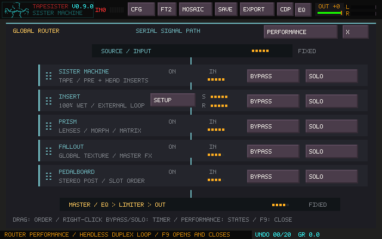
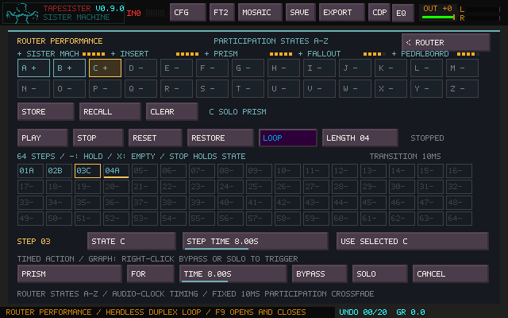
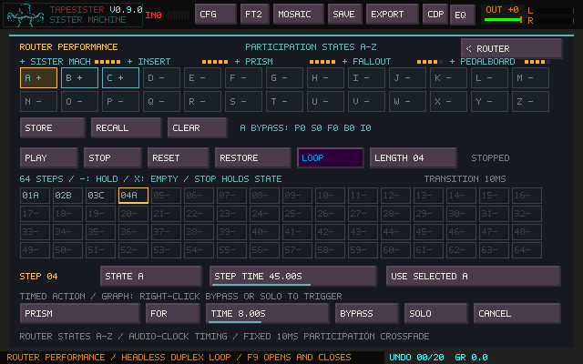
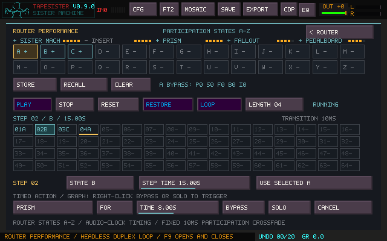
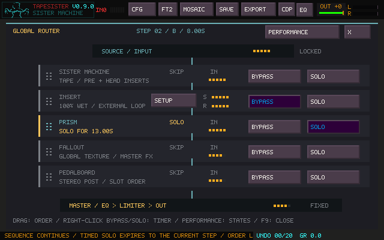

# Router Performance

Open **F9 → PERFORMANCE**. Router Performance controls when the existing macro
stages participate: PRISM, SISTER MACHINE, FALLOUT, PEDALBOARD and INSERT. It never
changes their settings, internal power, sources, or device assignments. Router
States A–Z are separate from Prism's states and Morph Matrix.

The normal Router still shows the complete path, effective Bypass/Solo and activity.
The performance view adds a compact path strip (`+` participating, `-` excluded,
`S` solo, `O` internal power off), state slots, sequence and timer controls.
**F9** closes/reopens either view without stopping clocks; Escape returns from
Performance to the Router. QWERTY note releases and existing ARP shortcuts retain
ownership. Space in the Router stops the existing audition transport and freezes
Router performance at its current effective state.

## States and sequencing

Select a letter, then **STORE** to capture the current effective bypass mask and
single-solo selection. STORE intentionally captures what the Router is doing,
including a temporary action if one is active. **RECALL** applies that state;
**CLEAR** empties the selected slot. A state's bypass mask remains meaningful under
solo: existing Router semantics make the soloed stage the only participating
stage, and retain the other bypasses for when solo ends. Internal module power
is unchanged. The small state summary uses P/S/F/B/I for Prism/Sister/Fallout/
Pedalboard/Insert, with 1 meaning bypassed.

The sequence supports **1–64 steps**, each containing a state reference and its own
**STEP TIME**. Click a grid cell to select it. Use its STATE field, the wheel over
a cell, or **USE SELECTED** to assign a state. Left-click advances the STATE field;
right-click goes backward; middle-click selects HOLD (`-`). Shift-click a grid
cell makes it the final step. LENGTH also changes the sequence length; shortened
steps are retained for later expansion. This initial editor uses length, state
assignment and individual times rather than a separate timeline/clipboard.

Click a time field to set its logarithmic value; wheel adjusts it, Shift-wheel
makes finer changes, and right-click resets it to eight seconds. Values range
from **0.05 seconds to one hour**. `RouterPerf.MaxSeconds` in configuration or
project settings can lower that ceiling; applying settings clamps stored times
to it. Zero, non-finite and malformed durations are rejected when loading.

An empty referenced slot is marked `X` in the grid and **EMPTY: HOLD** while
executing. It holds the last valid underlying participation for the whole step.
HOLD also carries forward a live manual override into that step. It never guesses
an undefined state or automatically enables Insert. A performance slot referencing
an unavailable processor ID loads empty. Other malformed configuration fails with
an error rather than partially applying it.

| Control | Behavior |
| --- | --- |
| PLAY | Start at Step 1 and remember the underlying manual state; existing timers continue. PLAY while running does nothing. |
| STOP | Stop advancing and commit the current underlying sequence/manual state. Existing timed overlays keep their countdowns. |
| RESET | Return to Step 1; continue if already running, otherwise recall Step 1 while stopped. Preserve the restore point. |
| RESTORE | Stop sequencing, cancel timers and live overrides, and restore the exact manual state captured before PLAY. Topology stays unchanged. |
| LOOP | Repeat from Step 1. With LOOP off, hold the final state when its full duration ends. |

Future step/slot edits are used on the next visit. The current step's captured
state and remaining duration do not restart when its definition changes. Length
and Loop edits take effect at the next boundary. The highlighted executing step,
programmed letter and countdown remain visible independently of any override.

## Manual intervention and timers

Manual **BYPASS**, **SOLO** and **RECALL** apply immediately while sequencing keeps
running. They cancel armed/running timers so an explicit gesture takes control
immediately, and show **LIVE OVERRIDE**. The next step clears that override and
applies its scheduled state. Stored slots, sequence definitions and the persistent
manual base are not edited. With sequencing stopped, manual actions edit the
manual base. Clicking a control during a timed action changes that displayed
control without baking other temporary actions into the manual base.

**Order is locked while the sequence runs.** Stop it to drag stages again. States
use stable stage IDs, so rearranging the stopped Router does not change which
processor a state addresses. Recall, timers and RESTORE never change topology.

Select a stage in the timer row, choose a time and **FOR** or **AFTER**, then press
BYPASS or SOLO. The same command can be triggered by right-clicking that stage's
Bypass/Solo button in the normal Router. Each stage remembers its own time/mode.

- **FOR:** apply the action now as a temporary overlay, then remove it. To have
  Sister return after 12 seconds, use Sister BYPASS FOR 12 seconds while its
  underlying state is participating.
- **AFTER:** wait, then set Bypass or Solo. While sequencing, this becomes a live
  override until the next step; when stopped, it updates the manual base.
- **CANCEL:** remove that stage's armed/running timer and reveal the current
  underlying state. It does not recall an old snapshot.
- Retriggering a stage replaces its previous timer and restarts its duration.
  Timers on other stages continue. The most recently triggered temporary action
  takes precedence where actions conflict. Solo and Bypass use the existing
  single-solo rules; a newer Bypass action exits an older Solo while active.

The display distinguishes **ARMED** (AFTER) and **RUNNING** (FOR), with a live
countdown. The normal diagram shows each timer under its stage name and displays
the effective participation, even while the sequence's requested state differs.

A 20-second temporary Solo can span several sequence steps. On expiration, it
reveals the step that is current *then*. Expiring an older action beneath a newer
one cannot resurrect a stale solo or bypass. RESTORE removes every temporary
layer. STOP retains the state under the timers so they can finish normally.

## MIDI learn

Use the existing **Ctrl+Shift+M** learn mode. In the Router, Bypass and Solo buttons
are learnable. In Performance, letter buttons learn **recall of that specific
letter**, and PLAY, STOP, RESET, RESTORE, LOOP, timed BYPASS/SOLO and CANCEL are
learnable. A timer mapping retains the stage selected when learned. These are
momentary commands accepting notes or CCs, with the existing zero-trigger option;
note releases are consumed without triggering. Store and Clear remain deliberate
mouse actions. Mappings persist through the existing MIDI configuration system.

Persistent target IDs are `router.stage.<stable-id>.bypass|solo`,
`router.state.<A-Z>.recall`, `router.play|stop|reset|restore|loop`, and
`router.timer.<stable-id>.bypass|solo|cancel`. Stage IDs are the existing Router
IDs, independent of row order. MIDI and mouse input call the same core commands.

## Audio, timing and persistence

There is one Router transport. Its bounded integer frame counters advance on the
audio clock, independently of repaint rate or window visibility. Fractional samples
carry between steps so rounding does not accumulate over long loops. A sample-rate
change preserves remaining seconds. If audio stops, these musical clocks pause;
there is no wall-clock catch-up burst of old commands after a device interruption.
The per-sample idle/sequence path is a counter check. State resolution only runs
on commands/boundaries; it does not reconstruct the DSP graph. No allocation,
file access or device queries are added to the audio callback. Existing device
exclusion guards control-thread edits; existing atomic snapshots publish display
status once per callback block.

The precedence is persistent manual base → current sequence state → live manual
override → ordered temporary timer overlays. Manual gestures explicitly cancel
timers before setting the live override. Coincident step/timer boundaries apply
the new step, then delayed actions in trigger order, then remaining overlays.

Every change uses the Router's existing approximately **10 ms** participation
crossfade. There is no adjustable long crossfade or Insert Mix control. Processors
retain their histories and continue ticking on silence when fully bypassed,
matching manual Router behavior. Their existing return/tail gating is unchanged.
Short switching suppression does not guarantee phase alignment between a delayed
external return and the dry path; physical listening remains necessary.

Insert stays 100%-wet when participating. An unavailable return remains silent;
sequencing does not hide it or substitute dry audio. Only an explicit Bypass state
selects the internal path. Backend streams, JACK clients/ports and device settings
stay open and unchanged across steps. Windows backend troubleshooting remains
separate from this feature.

Projects (v25 and later) and configuration persist state slots, all 64 step definitions, length,
Loop, timer defaults and the persistent manual base. Saving during sequence/timer
execution does not store an incidental solo, live override, countdown or run flag.
Reload starts stopped with no timers or restore point. Older projects/configs get
empty slots and a stopped default sequence while keeping their original Router
settings. Processor presets do not own this performance data.

FILE OUT and Mosaic REC OUT capture the final audible routed result. Sister MIX
retains its existing wet routed tap; individual heads, dry/EXT capture and other
upstream taps retain their existing positions. This feature changes participation,
not recording topology.

## Example

Arrange Sister → Insert/SunVox → Prism → Fallout → Pedalboard while stopped.
Store A with your intended stages participating, B with Insert bypassed, and C with
Prism soloed. Assign A / 30s, B / 15s, C / 8s, A / 45s. Turn LOOP on and PLAY.
During playback, trigger Prism SOLO FOR 20s, or manually bypass Insert. The timer
reveals the current scheduled state when it ends; the manual gesture lasts until
the next scheduled step. STOP holds the current underlying state; RESTORE returns
to the manual state captured before PLAY.

## Validation boundaries

The screenshots above use the native headless renderer, real controller/runtime
state and a simulated duplex loop. They are not physical-interface screenshots.
Automated tests cover state precedence/restoration, long/short durations, 64 steps,
live editing, persistence, stable identity, MIDI dispatch and source/recording
integration. The JACK workflow separately exercises a real dummy JACK server,
connecting native Send to Return and sequencing Insert through the production
Router/Insert engines without recreating clients. This is a virtual cable-loop
test, not a SunVox, PipeWire, MOTU or physical round-trip/listening test.
