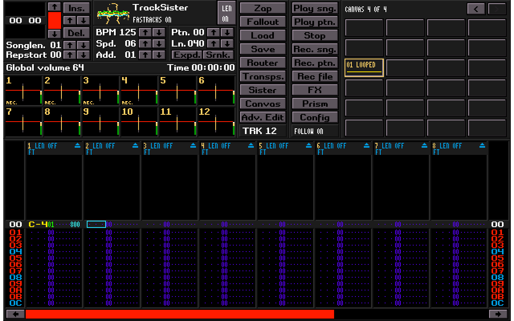
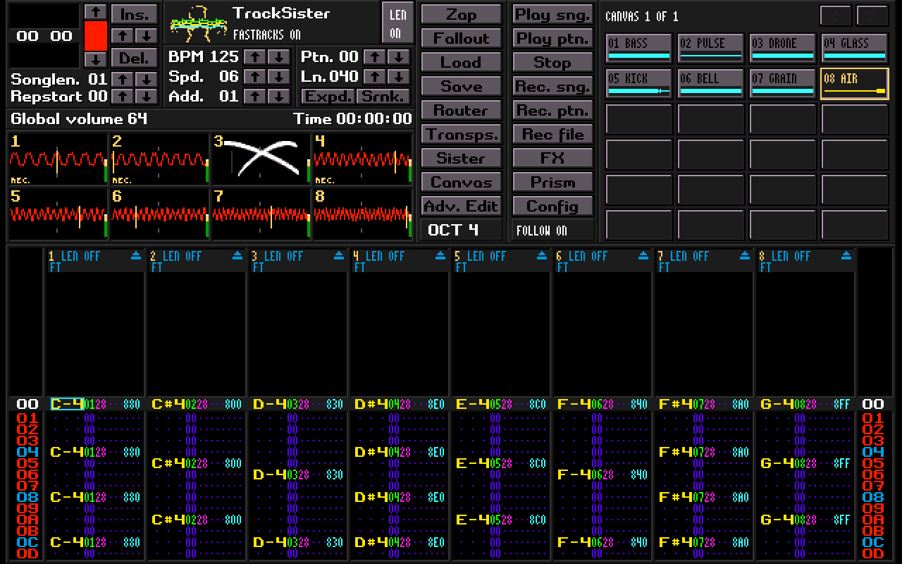
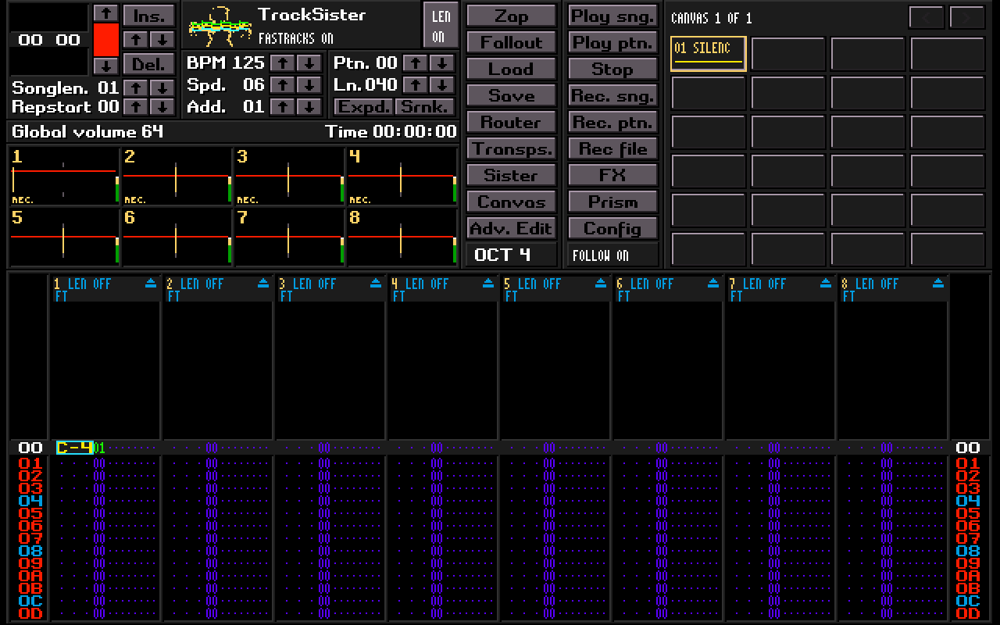

# SisterTracker: embedded TapeHead

F10 opens TapeHead's editor and replayer inside the TapeSister window. This is
compiled TapeHead application code, including its keyboard/mouse dispatch,
editing, clipboard, undo, interpolation, FastTracks and transport. The earlier
native recreation remains a legacy regression fixture; F10 uses the embedded
application.

TapeSister owns the window, audio device, MIDI connection, tiles, router and
project files. TapeHead does not open another process, window or audio device.
Its upstream repository is unchanged. The imported source is pinned to
`Ehule/FT2-Tapehead-Edition` commit
`f053d96df3996a5fd3b26625f069888c3a7d24ab`.

## First use

1. Select an occupied tile on the canvas, then press F10.
2. Enter notes with the original tracker keyboard. The selected tile is assigned
   a stable instrument alias. Click a populated mini-canvas tile to select another
   instrument; use its arrows or wheel to browse Sample pages.
3. Use **Play ptn.**, **Play sng.**, **Rec. ptn.** or **Rec. sng.**. **Follow**
   controls whether the editor follows playback; see live editing below.
4. F10, Escape or Canvas returns to the canvas. Playback continues when
   the workspace is hidden. F10 returns to the same score and transport.
5. F9 opens the existing Router. Enable TRACK as a Sister source to feed the
   tracker into the routed processing chain. F12 opens Audio Health.
6. Ctrl+S / Ctrl+O use TapeSister's project save/open flow.

**FX**, **Prism**, **Sister** and **Fallout** open the corresponding existing
Sister Machine pages. **Canvas** returns to the tile canvas. These buttons
release held manual notes while tracker transport continues; Escape in the
Sister window returns to the tracker.

**Load** opens the normal host load page (audio, raw, XM/MOD/IT, TSR or TSP); **Save**
opens a browser with **TSR Project** and **XM Song** tabs. **Config** opens tracker
preferences; **Router** and Config's **Audio health** open the host panels.
The 4×6 mini canvas replaces the instrument/sample lists and bank buttons.
Its 24 beveled tile buttons show instrument aliases, names and waveform previews;
the highlighted tile supplies the current instrument for note entry. Each view
spans host Sample pages as needed. The arrows and mouse wheel move through views
of 24 slots. Empty slots and the gutters do not change the instrument. The
metadata and song-title strip has been removed to give those rows to the tiles.
The title is **TrackSister** and the old badge is a functional **LEN ON/OFF**
bypass button. **Rec file**, below **Rec. ptn.**, starts/stops final-output recording.

**TRK 08**, beside Follow, displays the active track count and replaces OCT.
Left-click or wheel up adds two tracks; right-click or wheel down removes two,
from the right edge, within the native 2–32-track range. The scopes and pattern
columns resize immediately. Remaining tracks keep playing when the count changes.
Removed tracks retain their notes, routing, trim and LEN/CONTROL settings in TSR
projects and tracker scores; adding them back restores that data. Their voices
stop, and their LEN/CONTROL settings remain inactive until restored. XM exports
contain the active tracks only. F1–F6 still select keyboard octaves 0–5.

Each scope has a thin yellow **pan marker**, with small dim ticks marking
the center. It combines the track's live sample pan, pan commands, slides and
instrument pan envelope with **Pan / Out → Pan/Balance** in the routing window.
An explicit track route overrides the tile; **Routing: Tile** follows the last played
tile's route. Routing edits move the marker even while stopped or muted. Muting
dims the marker and holds the last source pan while routing can still change it.
The waveform, track number,
REC label, volume trim strip and mouse controls keep their existing behavior.
The marker uses the scope-number color, so custom palettes can change its yellow.

**Main Mix** also supports route pan; a **Direct: One Speaker** route shows a centered mono
marker. For a stereo pair, left/right are relative to that selected pair. This is
a pan/balance control indication, not a signal meter: width, source waveform,
clean level and independently positioned shared returns do not drive it. The
indicator uses the existing display sync queue and UI route state, with no added
audio processing or refresh timer.

Changing track 1’s routing Pan/Balance from left to center to right updates its
yellow marker immediately (native UI capture):

**Zap** replaces About and opens the tracker clearing choices:

- **Pattern** clears the pattern selected when Zap was opened, including hidden
  rows and every note, instrument, volume, tuning and effect column. Other
  patterns, pattern lengths, song order, tempo and LEN/CONTROL settings stay put.
- **PatData** clears every pattern's contents, including patterns outside the
  song order, while keeping pattern lengths, order and tempo. As in TapeHead,
  it also resets LEN/CONTROL metadata.
- **Song** resets all patterns to 64 rows, order to pattern 00, tempo to 125 BPM
  and speed to 6. It stops tracker playback and asks for confirmation because
  the song reset cannot be undone.
- **Cancel** or Escape closes the dialog without clearing anything.

Pattern and PatData support the normal Ctrl+Z / Ctrl+Y Undo/Redo, including
hidden rows. Every choice keeps TapeSister tiles and instrument aliases. The
standalone All/Instr. choices do not apply to the host-owned tile library.

## Tracker configuration

**Config** / Ctrl+C opens two pages with the palette editor always available:

- **Recording**: Silent Record, Inherit Pattern Length (IPL), Insert New Pattern
  (INP), Auto Pattern Generation (APG), multichannel recording/key jazz/editing,
  recorded key-offs, quantization, cut/insert/delete behavior, kill voices at
  stop and whether FasTracks uses LEN.
- **Layout**: track count (2–32, in pairs), pattern stretch, row numbering, sharps/flats, zeroes, framework,
  row colors, channel numbers, volume column, blank fields and pattern font.
- **Palette**: select a preset or edit RGB/contrast and individual field/head
  colors. Wheel the color list to reach additional entries. Editing a preset
  creates a User defined palette. Pattern color mode is separately selectable.
  **Import** and **Export** use the host file browser for shared `.pal` files.
  **Default** restores the supplied TapeHead palette, also bundled as
  `assets/tracksister.pal` and compiled in for first use. Saved project/default
  preferences take precedence. The original tracker stores RGB at six-bit
  precision, so imported/exported channels may round by up to two.
  Extra host palette keys survive an import/export session; the project stores
  the tracker colors and contrasts.

IPL gives new patterns the current pattern's length. INP inserts a new pattern
at the next order position using the **Ins.** button; Shift+Ins. copies the
current pattern. Enable INP before APG: **Rec. sng.** becomes **REC+**, creating
patterns as song recording reaches the end. Disabling INP also disables APG.
Silent Record still enters notes while suppressing live monitoring.

Projects retain these preferences and colors. **Save defaults** explicitly
stores defaults for future/legacy scores in `sistertracker.cfg` beside the host
configuration. **Done** or Escape closes Config and stays in the tracker.
New songs start with eight tracks. Wider songs scroll horizontally as the cursor
moves. Reducing the track count hides those columns; their notes remain in the
TSR project and return when the track count increases. Track count belongs to
the song and is not a global default.

## Importing tracker songs and saving XM

Choose an `.xm` file with **Load**, or drop it onto TapeSister. Import replaces
the tracker score, adds its samples to new Sample pages, and opens TrackSister
stopped. Existing tiles remain available on their pages. Each nonempty sample
becomes an editable tile. An instrument with several samples keeps its original
note-to-sample map, so its tiles share an instrument number instead of becoming
separate instruments. Volume/pan envelopes, sustain and loop points, fadeout,
automatic vibrato, sample tuning, panning, volume and forward/ping-pong loops
are retained. Sample edits are heard on the next note and included in later saves.

Standard XM versions 1.02–1.04, 8/16-bit mono samples, up to 32 tracks, 128
instruments, 16 samples per instrument and 256 patterns/orders are supported.
Linear and Amiga frequency tables retain their original setting. Odd track
counts gain one empty track to fit TapeHead's paired layout. TapeHead's tuning
columns and LEN/CONTROL extensions are also read. Unsupported stereo/ADPCM
extensions, excessive instrument/sample counts and malformed files report an
error before replacing the score; they are not silently truncated.

**MOD import** uses the bundled ProTracker/NoiseTracker converter, including
15-sample SoundTracker files, StarTrekker FLT4/FLT8 and common multichannel MODs.
Both `song.mod` and Amiga-style `MOD.song` names work. Patterns, order, effects,
sample names, tuning, volume and loops become a TrackSister score and tiles.
Playback uses the FT2 engine, so tracker-specific quirks may sound different.

**IT import is an approximate conversion**, intended for bringing samples and
editable patterns into TrackSister. It uses TapeHead's existing lossy IT loader;
it is not a faithful Impulse Tracker player. IT new-note actions/voice overlap,
filters, channel/global mixing defaults, pitch envelopes, some effect commands,
wide note ranges, envelope details and note remapping can change or be lost.
The browser and import status identify this limitation. Both sample mode and
instrument mode work, with mono 8/16-bit PCM or IT 2.14/2.15 compressed samples.
Files using tracks beyond 32, more than 128 instruments (or sample-mode samples),
more than 16 mapped samples per instrument, patterns beyond 256 rows, stereo
samples or unsupported encodings are rejected before changing the song. IT
sample-mode files must have at most 128 samples; instrument-mode files may refer
to a pool of up to 256. Converted songs can be saved as TSR projects or XM files.
MOD/IT export is not provided.

**Import as raw** is a checkbox below the Load file list (shortcut **R**). It is
off each time a new browser session opens. Check it before opening any file,
including XM, MOD, IT or an ordinary audio file, to interpret the entire file's
bytes as one sample. This preserves the experimental concatenated/noisy sound,
including the file headers and packed data; it does not render the song or
extract its instruments. The existing preview offers encoding, byte order,
mono/stereo, sample rate, byte offset, normalization, looping and selection.
Raw starts as signed 8-bit mono at 44.1 kHz, with normalization on. It always
opens the preview, including Shift+click, before importing into a tile. The
tracker score stays unchanged. Uncheck the box for normal song import;
drag-and-drop uses normal import. Damaged modules never silently fall back to
raw; the checkbox remains available when that is the intended result.

Click **Save → XM Song** to write the score and its currently bound samples as
an XM. **TSR Project** remains the complete project format. XM export writes
16-bit mono PCM, so it quantizes float tile audio. Stereo tiles, loop crossfade
and loop modes other than forward/ping-pong require TSR or rendered WAV output;
the exporter reports these instead of silently changing them. Host Router,
Sister, Prism, Fallout, Master processing and live FastTracks controls are not
baked into an XM. TapeHead's tuning and LEN/CONTROL extensions accompany it;
other trackers may ignore those extensions. Use final-output recording for the
processed performance. Exporting XM does not mark the TSR project as saved.

## Tiles and audio

Aliases 01–80 (hex; 128 instruments) refer to persistent TapeSister tile IDs, across
Sample pages. Moving a tile does not change its score references. Deleting a
tile leaves a missing reference; reusing its old slot does not retarget notes.
Ordinary instruments bind one tile; imported multisample instruments bind up to
16 tiles through their keymap. Selecting any of those tiles selects its instrument.
Selecting another tile on the canvas chooses its alias on return. Choosing an
alias inside the tracker stays selected until the canvas selection changes.

The adapter prepares immutable float snapshots on the control thread. Stereo
channels, tile tuning, all six loop modes and loop crossfade are preserved by
TapeSister's float reader. Sounding voices retain their previous snapshot while
the tile is edited; the next note uses the new generation. Reference 16-bit mono
data is used for TapeHead's scopes and sample metadata, not audible playback.

TapeHead's replayer executes note timing, song orders, volume/effect columns,
M/N tuning, FastTracks and its voice envelopes/panning/ramps. Its mixed stereo
output enters the existing **TRACK** bus. Sister processing, router order,
Master EQ, limiter, OUT gain and final-output recording remain host operations.
This version supplies one stereo tracker bus; per-lane hardware outputs are not
part of this transplant.

A centered tracker note at full volume (`40`) matches the level of the same
tile played directly at full velocity, after the short attack ramps settle.
TRACK omits TapeHead's standalone device attenuation and uses unity gain at
the center of its equal-power pan law. Note volume, Gxx global volume, envelopes
and panning still apply. Multiple lanes sum with float headroom before the host
mixer and Router; they are not individually normalized or clipped by the
embedded device-output routine. Existing scores receive this level correction
without changing their stored note or volume data.

## Where TrackSister enters the Router

TrackSister is a stereo source at the Router input. Its active lanes are mixed
by the embedded replayer before joining the host. Current source grouping is:

| Playback | Source group |
| --- | --- |
| Sample ARP, QWERTY/MIDI sample voices, tile launchers and Mosaic | TILES |
| FM ARP and FM keyboard voices | FM |
| All active TrackSister lanes (up to 32) | TRACK |
| Separate TapeHead application's Live Link | TAPEHEAD |

With Sister Machine POWER off, the ordinary program sums these playing sources,
clamps that program, applies its existing 0.8 gain, adds monitored external input,
and enters the shared Router. With POWER on, Sister's source switches and trims
select the input first; enabled source groups are normalized together and then
enter the same Router. TRACK must be enabled there to hear TrackSister. An
unselected source is silent while Sister owns the program, including when its
Router stage is bypassed. There is no per-source FX chain or per-lane Router send.

The default movable order is Prism → Sister Machine → Fallout → Pedalboard →
External Insert (Insert starts bypassed). F9 shows the saved order, which may
have been rearranged. Sister's PRE/head inserts stay local to its tape/head
processing; Pedalboard's global POST processing is the movable Router stage.

Sister's DRY monitor branches from its input (including effects preceding
Sister). It normally rejoins the routed wet result just before the fixed Master
endpoint, so effects after Sister ordinarily process the wet path. A configured
External Insert after Sister merges dry/wet before that external loop, even
while that Insert is bypassed, to avoid a parallel undelayed dry signal.

Master EQ → limiter → global OUT follows the shared result. Final-output file
recording observes that result. This explanation describes the existing audio
path; the full-logo correction does not change routing.

## Follow and live editing

**FOLLOW ON/OFF** sits below Config, beside the track-count control. **Ctrl+F** toggles
it in every pattern view, including Ctrl+Alt+Backspace's full-window view. Follow
starts on for new projects and saves with the project.

With Follow on, playback retains TapeHead's moving view and display-only pattern
body. Space stops playback; pressing it again enables editing while stopped.

With Follow off, the pattern stays centered on your edit cursor while the transport
and individual LEN/FasTrax heads keep running. Click a cell to position the cursor,
or use arrows, Tab, Home/End, Page Up/Down and the wheel. While playing, the first
Space enables **Live edit** without stopping; the second Space stops. Stop always
stops immediately. Note entry, MIDI, Delete, Backspace and undo/redo work at the edit
position, independently of the playback row. Rec pattern/song also use the edit
cursor while Follow is off. Turning Follow on returns the view to playback.

Clicking or dragging a highlight establishes its own anchor. **Alt+Arrows** expand
or contract that mouse selection from the clicked cell, even when the edit cursor
is elsewhere. Ordinary cursor movement leaves the highlight intact. Keyboard-only
block marking retains the original behavior when no mouse anchor is active.

## Controls

The tracker uses TapeHead's original controls. In particular, its clipboard
bindings differ from the earlier native editor's Ctrl+C/X/V shortcuts.

| Control | Action |
| --- | --- |
| F10 / Escape / Canvas | Return to canvas; transport continues |
| Play ptn. / Right Alt | Play the current pattern |
| Play sng. / Right Ctrl | Play the song orders |
| Rec. ptn. / Right Shift | Record into pattern playback |
| Follow / Ctrl+F | Toggle following playback or independent editing |
| Space, Follow on | Stop playback, then toggle idle/edit while stopped |
| Space, Follow off | While playing: enter live editing, then stop; stopped: toggle idle/edit |
| Stop | Stop immediately |
| Arrows / Tab | Move the original field/lane cursor |
| Alt+Arrows / mouse drag | Mark a block |
| Shift/Ctrl/Alt + F3/F4/F5 | Cut/copy/paste track, pattern, or block |
| Ctrl+Z / Ctrl+Y | Original undo/redo |
| F8 while stopped | Extract the marked block into a pattern |
| Ctrl+L | Start/stop literal block looping |
| Shift+Arrows during block looping | Resize at the next loop seam |
| F7 during block looping | Arm capture at the next seam; press again to end at a seam |
| F8 during block looping | Capture one live cycle of final audible output |
| F7 outside block looping | Start/stop final-output file recording |
| Shift/Ctrl/Alt + F1/F2 | Transpose track/pattern/block down/up |
| Shift/Ctrl/Alt + F7/F8 | Transpose only the current tile in that scope |
| Ctrl+Shift+I | Note interpolation preview; 1–0 selects scale/repeat, repeated key reverses direction |
| Ctrl+Shift+V/B/T | Original volume/FX/tuning interpolation previews |
| Enter / Escape during interpolation | Apply as one undo step / cancel while staying in TrackSister |
| Ctrl+Shift+M | Host MIDI Learn |
| Ctrl+Grave | Toggle Silent Record |
| Config / Ctrl+C | Tracker recording, layout and palette preferences |
| Grave / Shift+Grave | Increase/decrease STEP, wrapping 0–16 |
| STEP arrows / STEP wheel | Original edit step |
| TRK left click / wheel up | Add two tracks at the right, up to 32 |
| TRK right click / wheel down | Remove two tracks at the right, down to 2; retain their stored notes |
| F1–F6 | Select keyboard octave 0–5 |
| Backspace | Clear the current full cell, then move up; clamp at row zero |
| Shift+Backspace | Original structural row deletion |
| Ctrl+Alt+Backspace | Pattern-only view |
| Alt+Backspace | Original extended view |
| F9 / F12 | Host Router / Audio Health |

F10 reserves the host workspace toggle, so the original plain F10 row bookmark
is unavailable. Modified F10 bindings remain with TapeHead. Plain F7 belongs to
host capture. Ctrl+D opens host projects through Disk Op; Ctrl+E
returns to Canvas through the original extended sample editor command.

Backspace's clear-before-move order and the additional Ctrl+Alt+Backspace alias
are deliberate local adaptations. The original FT2 default clears after moving.

MIDI notes enter the original `recordNote` path while SisterTracker has focus.
Velocity becomes the original volume column. MIDI release, panic, window focus
loss and workspace switching release owned manual notes without stopping the
tracker transport or swallowing releases belonging to the canvas. Host dialogs,
Router, Audio Health and MIDI Learn retain input ownership.

## LEN and FastTracks

LEN and CONTROL are **song-wide**, following the pinned TapeHead source.
Standard, Pattern and Song modes, all 17 ratios, master toggle, direction,
selection, clutches, sync, randomization, Jog/Punch and Z-command behavior use
the original implementation. The logo toggles the FastTracks master; its
Ctrl/Ctrl+Shift actions remain available. Forward, Reverse and Bounce traversal
are available for private playheads, including Song mode across the order list.
Bounce reflects without repeating endpoint rows; a one-row loop stays put.

| Header gesture | Action |
| --- | --- |
| Wheel over FasTracks ratio | Previous/next of 17 ratios; enables a Pattern head if needed |
| Right-click ratio or click F/R/B badge | Cycle Forward, Reverse, Bounce |
| Shift-click ratio or click its mode badge | Cycle Standard, Pattern, Song |
| Wheel over LEN | Adjust length, clamped at 256 |
| Shift+wheel over LEN | Adjust by eight rows |
| Ctrl+wheel over LEN | Clear the length override |

These gestures follow the header in compact, extended and pattern-only views.
Precise wheels accumulate partial detents independently when moving between
controls. Original keyboard gestures remain available.

Literal Ctrl+L block transport ignores LEN/private clocks and auditions only
its marked rows and lanes. F7/F8 capture the live final host output at exact
loop seams, rather than running TapeHead's separate offline WAV renderer.

## Saving and compatibility

The host project owns both the stable pattern/tile model and a versioned score
extension. The extension retains original note/instrument/volume/effect/tuning
bytes, hidden rows, orders, song name, global volume, FastTracks state, mute/trim,
editor position, octave/STEP, recording/layout preferences, full custom palette,
Forward/Reverse/Bounce choices and expanded-view choice. Its `STH3` payload
adds all 32 stored columns, the active track count and the frequency table.
It also reads earlier `STH1`/`STH2` embedded scores; those retain their stored color mode
and LEN policy and receive defaults for newly stored preferences. It contains
no pointers, copied tile audio, active voices or running transport. Loading a
project starts stopped and clears the original clipboard and undo history.
Saved mutes replace the previous project's mutes in both the editor and audio
engine. Loading also clears temporary performance mutes, voices, effect memory,
scope history and the old order position. Eight-track legacy scores receive
default mute, trim and FastTracks settings on the remaining hidden lanes.

The surrounding version-3 score stores multisample instrument metadata and
stable tile IDs. Version-1 and version-2 eight-track scores still load through
the migration adapter. TapeHead's
native note range is C-0–B-7 (MIDI 12–107), its tempo range is 32–255 BPM, and its
instrument limit is 128. A legacy score outside those limits is rejected with
an explicit message before replacing the embedded score; it is not silently
clamped or discarded. Newly saved version-3 scores require this version of TapeSister.

Tile audio continues to use the existing host project sample format. The score
extension does not change that format or make project audio storage lossless.
Buffer tiles/external-input tile bindings are a later extension of the host
boundary and are not implemented here.

See the [PR124 audit](PR124_AUDIT.md), [source boundary and validation](SISTERTRACKER_PARITY.md) and
[reproducible import](../third_party/tapehead/application/README.md).
