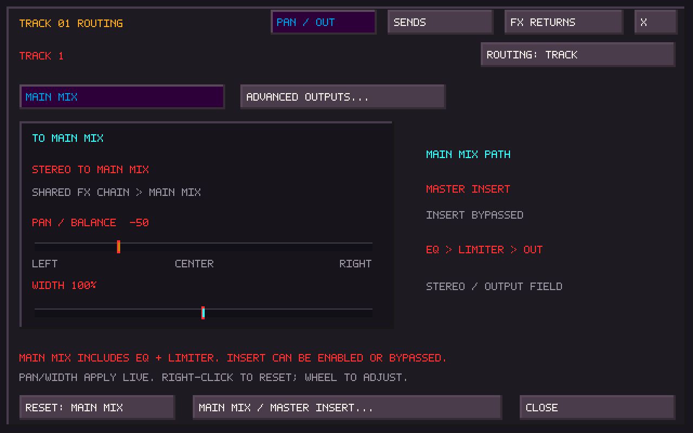
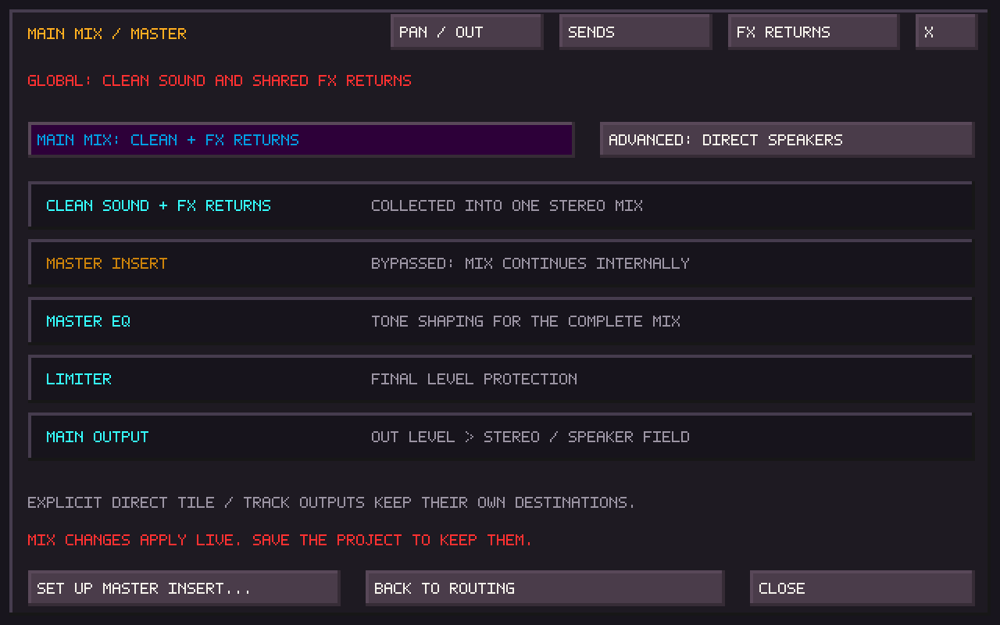
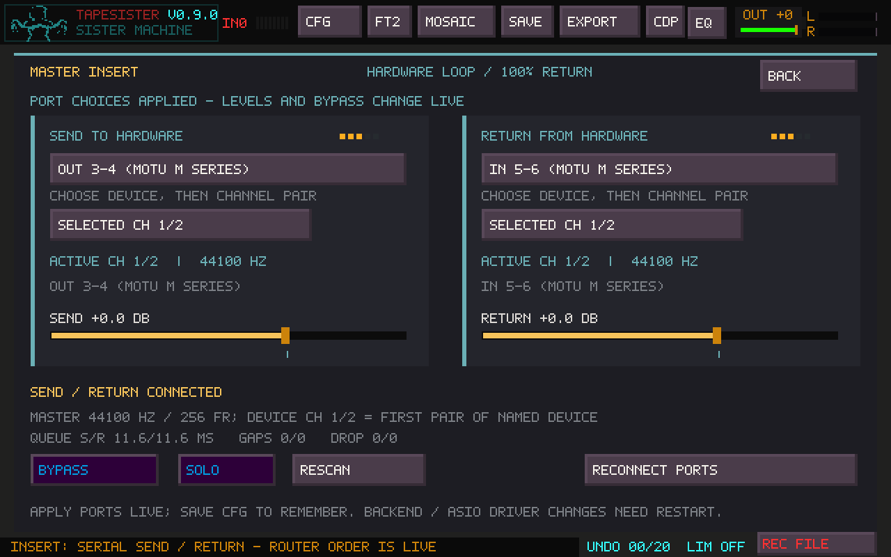

# Tile, track and main-mix routing

Right-click a tile or a TrackSister **track number** to open routing. Playback
continues while you edit. Middle-click a tile to rename it, or use **Rename Tile**
in its routing window. Shift-right-click retains the clear action.

## Start with the main mix

New tracks use **Routing: Track → Main Mix**. Pan and width are available here
without assigning hardware speakers. Track routing replaces the complete tile
route, including pan, width and sends. Thus the same tile can sound different on
two tracks. Tile routing still applies to direct tile playback; select
**Routing: Tile** on a track to follow each sounding tile instead.

A fresh application configuration uses the combined main mix:

**Track/tile sound + shared effect returns → Master Insert → Master EQ → limiter
→ OUT → stereo output / configured speaker field.**

The external insert starts bypassed, so no hardware is required to hear sound.
Enable it after setting up your processor's send and return. Its return then
replaces the whole main mix; bypass restores internal playback. Insert is shown
last in the Router in this mode, even when an older project stored a different
serial position. It runs once per sample.

**F9 → Main Mix…** opens the global overview. The same **Main Mix / Master
Insert…** button is available in every source/return window. This is where you
choose the shared mix's main or advanced direct path, and open Insert Setup.

Existing projects and existing configuration files retain their stored paths.
A file predating the combined main mix retains its original direct behavior.
To bring its clean sound and effect returns through the Vulture, choose
**F9 → Main Mix… → Main Mix: Clean + FX Returns**, then save the
project. Explicitly direct tile/track outputs remain direct until changed there.

## Pan, width and inheritance

Drag or wheel **Pan / Balance** and **Width**. Shift-wheel makes one-unit edits;
right-click resets pan to center or width to 100%. Pan attenuates the opposite
side with unity at center. Width runs from mono (0%) through original stereo
(100%) to wider stereo (200%). Main-path pan/width are applied before shared
chain processing. Effects can subsequently change the stereo image.

These controls follow tracker note/envelope panning. The yellow scope marker
combines note pan with the effective track or tile route pan, including Main
Mix. It updates while playing, stopped or muted. It indicates the control
position, not the measured balance after effects.

**Routing: Track** means a track override is active. **Routing: Tile** follows
that note's tile, including its sends and destination. Click the button to switch.
**Reset: Main Mix** resets this source to the shared chain, centered pan and
original width. Selecting Main Mix preserves pan/width and selects the shared-chain source path;
use Sends to choose independent effect amounts again. Changes apply to held
voices with short fades and do not require a restart.

New tracks are track-controlled. Saved routing choices are restored unchanged;
old scores predating routing retain their historical tile inheritance. Track
routing covers all 32 lanes and imported instruments with multiple tile bindings.

## Individual effect sends

The **Sends** page shows **Path: Shared Chain** initially. Click it to select
**Path: Effect Sends**, then set **Clean Sound**, Prism, Pedalboard and Fallout
amounts independently (0–100%). Clean Sound at zero creates effects-only audio.
The amounts need not total 100%. Disabling sends in main-mix mode returns the
source to the shared chain; it does not turn it into a direct hardware bypass.

A send taps after note/voice level and tracker panning, but before clean level,
route pan and width. Each effect's return has independent pan, width and level.
The source is not also duplicated into the shared chain.

Click **In Chain >** beside an effect to open its **FX Returns** setup. Each
processor has one global choice:

| Use | What happens |
| --- | --- |
| Shared Chain | Processes sources using the shared chain; individual source sends are inactive |
| Shared Send | Processes the sum of its tile/track sends once; shared-chain sources pass this stage unchanged |

Changing that choice affects all sources. There is one shared processor instance,
not one instance per track. Enable the processor itself to hear its return.
Prism must be on; Pedalboard and Fallout respect Master FX, and Fallout must be
on. Router bypass/solo, timers and sequences still apply. In send mode bypass
mutes the processed return without adding a dry copy.

| Example track | Clean | Pedalboard | Prism | Fallout |
| --- | ---: | ---: | ---: | ---: |
| Pedalboard only | 0% | 100% | 0% | 0% |
| Pedalboard plus Prism | 0% | 100% | 75% | 0% |
| Fallout only | 0% | 0% | 0% | 100% |

For Pedalboard sends, use POST slots. PRE/head placements remain inside Sister.
Processor Mix controls still affect the processed amount; explicit dry branches
are removed from shared returns. Empty or disabled processors add silence.
Return level/placement edits preserve Router automation. There are no
return-to-return sends or additional effect racks.

## Advanced speaker outputs

On **Pan / Out**, click **Advanced Outputs…** to reveal **Direct: Stereo Pair**
and **Direct: One Speaker**. Revealing these controls does not change the sound.
A direct source bypasses the master insert, Master EQ and master limiter. The
window states this explicitly. Global OUT and the final linked hardware peak
guard still apply.

Destination numbers are logical speakers from **Ctrl+F9 → Array**; labels show
the mapped hardware channels. Click/wheel the destination buttons to change
assignments, or right-click to step backward. Direct output bypasses the master
Ambisonics motion, decoding and per-speaker calibration. One Speaker folds
`(L + R) / 2`; opposite-polarity content may cancel.

For independent placement of shared effects, select the **Advanced: Direct Speakers** mode on the Main Mix overview. The clean/send mix
and each return now use their own speaker destinations, bypassing master
processing. Shared-chain sources retain their serial insert/EQ/limiter path.
Returning to Main Mix preserves speaker assignments for later recall but uses
the combined stereo reference mix. The interface does not claim that a stereo
hardware insert can preserve separate multichannel destinations.

A missing, duplicated or insert-reserved destination makes the whole affected
route fall back to hardware 1/2, with a warning. Other valid routes keep their
destinations. Route edits do not reopen audio devices.

## Insert setup: selected versus active

Insert Setup shows **Selected CH** separately from **Active CH** and the actual
open device. A pending banner says **Port choices not active yet — click Apply
Now**. Applying insert devices and pairs happens live; finish recording first.
Save configuration afterward to remember the setup.

Channel numbers are local to the selected device. For a stereo device named
“In 5–6,” select its local channels 1/2. A full multichannel ASIO driver exposes
physical input 5/6 as pair 5/6. The active stream and return meter help distinguish
a hardware return from audio actually reaching TapeSister.

Backend changes and ASIO driver/buffer changes currently require **Save Config +
Restart**. Configuration and Insert Setup both show that requirement while a
change is pending. Insert Apply will not reopen endpoints against an unapplied
backend. Other output/input device changes are applied by saving configuration;
insert ports use Apply Now. Pan, width, levels, source routes, effect roles,
main-mix selection and bypass apply immediately.

An enabled insert with a missing send/return is silent; it does not substitute
dry audio. The app's return meter must show activity, not just the interface's
hardware meter.

## Saving and recording

Routes follow tile identities and tracker lanes. Copying a tile copies its
route; moving or editing it retains that route. Project saves include routing,
shared effect roles and returns. New saves use TSR36 / SISTRK v6. Older files
retain their prior sound: dormant Main pan/width values are cleared on import.
Older builds cannot open these new saves; keep a separate copy when comparing
versions.

FILE OUT captures the stereo program, including the hardware return, EQ and
limiter in main-mix mode, plus a stereo reference of explicit direct routes.
It is not a discrete multichannel recording. Dry keyboard recording preserves
the source even at Clean Sound 0%. Internal Sister head/tape taps retain their
meanings. Mosaic cards, FM, external input and previews keep their existing
Main routing.

## Validation

Native tests exercise live main-path pan and scope movement, direct-output
selection, track/tile precedence, save/reopen, shared sends, single processor
passes, external return replacement, master EQ/limiter and stereo fallback.
Pending backend changes preserve active insert controls. Screenshots come from
the real SDL controller fixture. Hardware listening remains a separate check.
