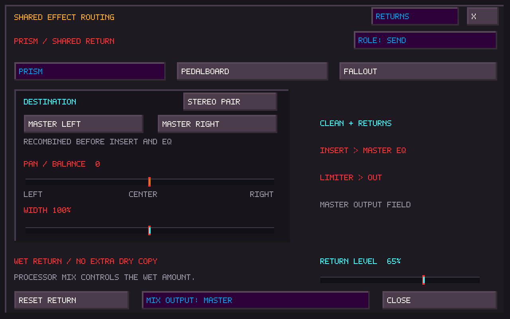
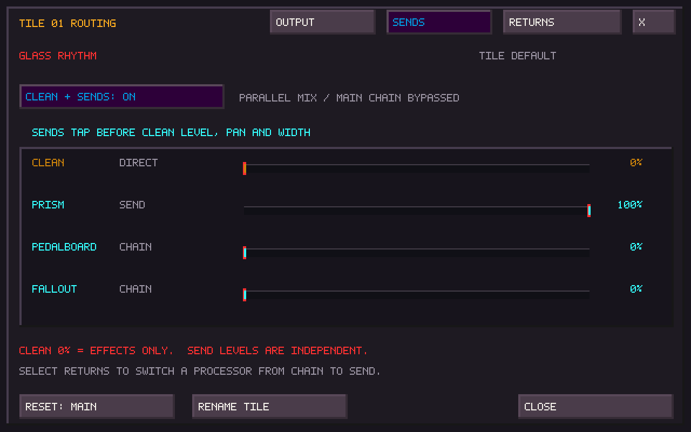
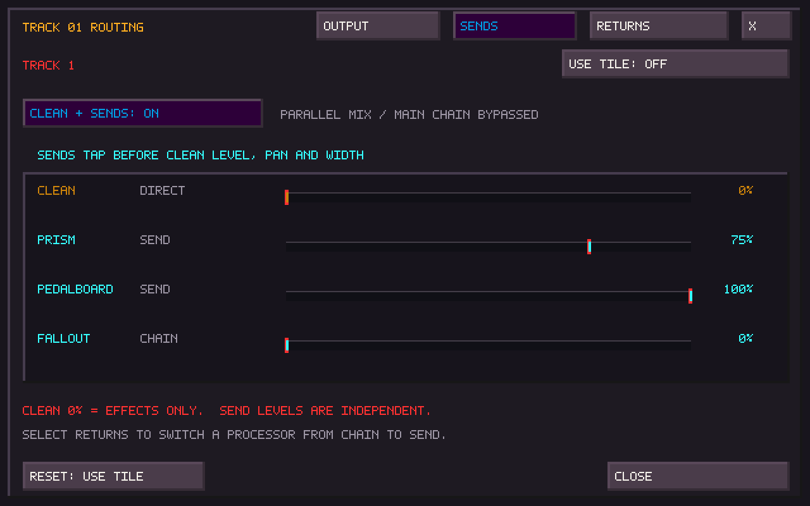
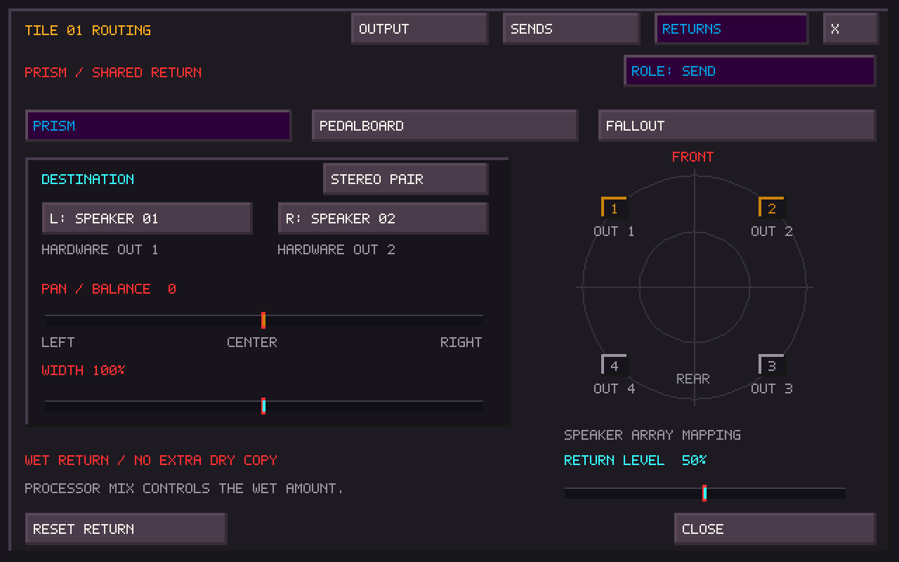
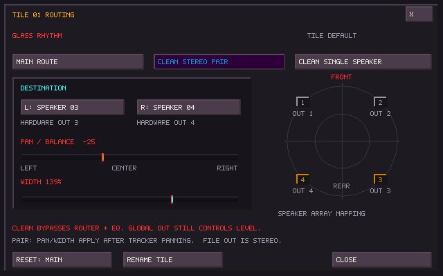
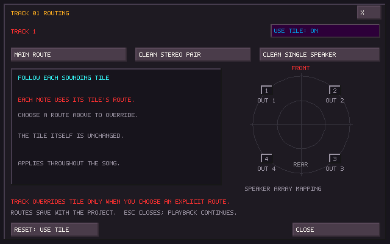
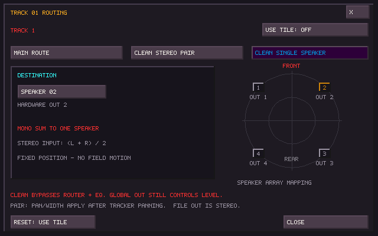

# Tile and track output routing

Right-click an occupied canvas tile to open its routing window. Middle-click
renames it. A Rename Tile button is also available in the routing window for
mice without a middle button. Shift-right-click retains the existing clear action.

In SisterTracker, right-click the **track number** above its pattern column.
The length and FastTracks controls retain their existing gestures. This window
is modeless: playback continues while you change a route, and Escape closes it.

| Setting | Result |
| --- | --- |
| Main Route | Existing shared Router, effects, Master EQ, limiter, OUT and Ambisonics/stereo output path |
| Clean Stereo Pair | The source's left and right channels go directly to two chosen logical speakers, with pan/balance and width |
| Clean Single Speaker | `(L + R) / 2` goes directly to one chosen logical speaker |
| Use Tile (tracks only) | Each note follows its tile's route; this is every track's default |

An explicit track route replaces the whole tile route, including its pan and
width. Choosing **Main Route** on a track overrides even a clean-routed tile.
The tile itself stays unchanged, so the same tile can have different destinations
on different tracks. Track routes apply throughout the song, including channels
9–32 and imported module instruments with multiple tile bindings.

For Clean + Sends sources, **Mix Output: Master** replaces direct speaker
placement with the complete stereo master path described below.

## Controls and output mapping

Click destination buttons to step forward, right-click to step backward, or use
the wheel. Drag or wheel Pan/Balance and Width; Shift-wheel gives one-unit steps;
right-click restores center or 100% width. The default pair preserves stereo
exactly. Pan attenuates the opposite side, with unity at center. Width ranges from
mono (0%) through original stereo (100%) to wider stereo (200%). These adjustments
follow any tracker note/envelope panning. A single-speaker route is a mono fold;
opposite-polarity material can cancel, as it would in an ordinary mono mix.

The speaker diagram uses the array configured under **Ctrl+F9 → Array**. Speaker
numbers are logical positions; the labels show their hardware output channels.
Clean output uses that mapping but bypasses Ambisonics motion/decoding and its
per-speaker calibration trim/delay. It also bypasses the creative effects and
Master EQ. The global OUT fader still controls it, and a final linked peak guard
protects the combined hardware output. There are no extra effect instances.

A missing channel, duplicate assignment, or channel reserved by the external
Insert makes that route unavailable. The **whole affected route** folds to
hardware outputs 1/2 and the window displays a warning. Other valid source routes
keep their destinations. No audio device needs to be reopened to edit a route.
Route edits interpolate over 5 ms; note/voice transitions retain short fades.

## Saving and recording

Routes belong to stable tile identities and tracker lanes. Copying a tile copies
its default route; moving it between slots/pages keeps the route. Replacement
and destructive edits retain the destination. Project dirty detection includes
routing. New projects save tile data as **TSR35** and tracker data as **SISTRK v5**.
Older projects open with Main on tiles and Use Tile on tracks. Older TapeSister
builds cannot open the new formats; save a separate project copy when comparing
this build with an older build.

FILE OUT, Mosaic OUTPUT recording and output meters include a **stereo reference
mix** of the clean routes plus Main, after OUT gain. They do not capture discrete
multichannel files or reproduce the array's physical placement/calibration.
Dry keyboard recording uses the source before routing, including effects-only notes with Clean at 0%. Existing internal H1/H2/H3
stem taps keep their meanings. Mosaic cards, FM, external inputs and browser
previews retain their existing Main routing; this release adds tile and embedded
tracker routes, not independent routes for those sources.

## Shared sends and effect returns

The routing window has **Output**, **Sends**, and **Returns** pages. **F9 → Send
Returns** opens the same shared return controls without selecting a tile.

On **Sends**, enable **Clean + Sends**. A Main or inherited route starts with a
clean stereo pair; an existing clean destination is kept. Set **Clean** and the
three send levels independently, from 0–100%. The sends do not need to total
100%. They are taken after the source's note/voice level and tracker panning,
but before its clean fader, output pan/balance, width and speaker assignment.
Turning Clean down therefore leaves the sends intact. Clean at 0% creates an
effects-only source. No copy of this source is also fed into the Main chain.
The **Output** page chooses where the clean contribution goes.

For example, enable the relevant shared processors' Send roles and set:

| Track | Clean | Pedalboard | Prism | Fallout |
| --- | ---: | ---: | ---: | ---: |
| 1: Pedalboard only | 0% | 100% | 0% | 0% |
| 2: Pedalboard and Prism | 0% | 100% | 75% | 0% |
| 3: Fallout only | 0% | 0% | 0% | 100% |

A track override replaces the tile's entire routing choice, including clean
level and all sends. **Use Tile** restores inheritance. A track can therefore
send the same tile to different processors without modifying the tile default.
Selecting **Main Route** disables that source's parallel mix.

### One shared instance, one role

Each processor has an explicit global **Chain / Send** role on **Returns**:

- **Chain** keeps it in the existing serial Router. Its source sends are inactive.
- **Send** removes that processor from the serial path and processes the sum of
  its tile/track sends once. Other Main sources pass that stage unchanged.
  Its processed return joins the final output at its own destination.

This is a global role change, so changing Prism to Send also removes Prism
from every source using Main. It does not make a second Prism. A brief fade
handles role changes without running two DSP histories. Router bypass, solo,
timers and sequenced participation continue to control the processor; bypass
mutes a send return instead of substituting dry audio. Moving a return's
position or level does not stop Router automation.

For the Pedalboard, the shared return is the existing **POST slot chain**.
PRE and H1/H2/H3 placements remain local Sister inserts. Set the desired slots
to POST to hear them on the shared send. No new per-tile or per-track racks
are allocated. Shared returns do not feed Sister's tape feedback loop.
Sister Machine keeps its serial role. External Insert is serial in Direct mode
and processes the recombined mix in Master mode.

### Clean/processed balance and placement

Returns remove each processor's explicit dry branch. Prism's Mix, the
Pedalboard slots' Mix controls, and Fallout's Mix still set the wet amount;
they do not add their dry branches to the shared return. An empty or disabled
processor contributes silence. Prism must be on; Pedalboard/Fallout still
respect Master FX, and Fallout must also be on. Effect tails continue when a
source send is reduced, subject to the processor's existing controls.

The Returns page offers a stereo pair or single logical speaker, pan/balance,
width and a **Return Level** for each processor. These settings are shared by
all sources feeding that processor. For example, keep a tile's clean signal
at the front while placing its Prism return behind you. A processed signal
may itself sound close to the source (especially neutral Prism/Fallout
settings); wet-only removes the explicit dry mix, not the source's musical
content.

**Mix Output**, at the bottom of Sends and Returns, selects one shared output
path for the parallel mix. It saves with the project and application config.

- **Master** recombines Clean + Sends sources and processed returns into stereo,
  preserving their pan/balance, width and levels. This joins the ordinary Main
  mix before **External Insert → Master EQ → limiter → OUT → master output
  field**. Insert runs once on that complete mix, regardless of its listed
  serial position; its return replaces the mix at 100% wet. This lets an external
  processor such as the Vulture process clean tracks and shared effects together.
  Bypass restores the combined mix, and the existing Send/Return port controls
  still apply. The return never feeds the sends again.
- **Direct** preserves independently assigned speakers for the clean sound and
  each return, bypassing the serial Insert, Master EQ and master field. Global
  OUT and the linked hardware peak guard still apply. Insert retains its movable
  serial position for ordinary Main sources.

Existing projects open with their previous Direct behavior. For **Threshold /
Embers**, open **F9 → Send Returns**, click **Mix Output: Master**, and save the
project. No track or send-level edits are needed. Speaker assignments are kept
for switching back to Direct; Master uses their stereo reference mix instead.
Ordinary clean routes with Clean + Sends disabled remain explicitly direct.

FILE OUT records the resulting stereo program, including the external return,
EQ and limiter in Master mode. Internal Sister head/tape taps keep their meanings.

This first matrix has source-to-processor sends and independent returns.
It has no return-to-return sends or arbitrary feedback connections. Older
projects load with every processor in Chain and source mixing disabled,
including TSR34/SISTRK v4 projects from the first routing build.

### Shared-send UI captures

## Native UI captures

These images were captured from the SDL framebuffer using the controller test,
with a four-output fixture and a valid four-speaker mapping.

## Validation

The source-route tests exercise matrix coefficients, independent send levels, wet-only returns, single DSP histories, inheritance, transitions,
output ownership and fallback, note/performance/ARP playback, tile cloning and
persistence. The native controller test drives the actual routing window and
main audio callback, including embedded tracker playback, live overrides,
embedded score save/reopen, dry recording's signal tap, and stereo fallback.
Existing core, tracker, keyboard, stereo voice and spatial regressions run with
them. The vendored application patch is checked against all 271 pinned source
hashes; the upstream TapeHead repository is unchanged.

For a listening check: play a sustained tile, switch Main → Clean Pair, sweep
pan/width, then sequence it on two tracks with different overrides. Repeat on a
stereo device and confirm the fallback warning. Physical interface behavior and
CPU headroom on the X220 still need that hardware check.
