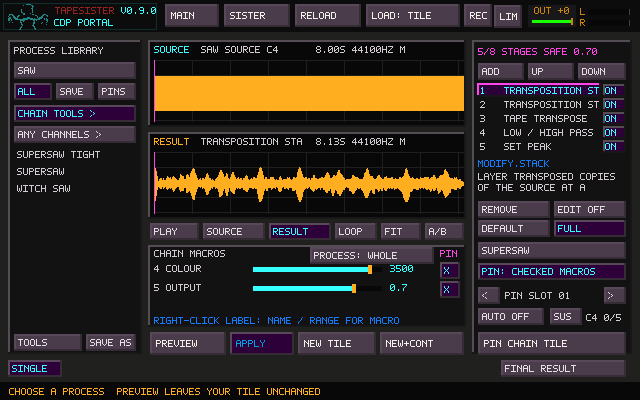

# Supersaw prototype

For nine oscillators directly in FM Logic, see [FM Unison](FM_UNISON.md).
The Portal chains below remain available for processing recorded tiles.



Open **CDP → CHAIN TOOLS**, or search **SAW** in ALL. Three ordinary saved
chains turn a sustained saw or FM tile into nine detuned layers:

| Preset | Spread about the source | Starting colour |
| --- | --- | --- |
| SUPERSAW TIGHT | −13 to +13 cents | Bright, close ensemble |
| SUPERSAW | −26 to +26 cents | Broad ensemble |
| WITCH SAW | −41.6 to +41.6 cents | Wider, darker ensemble |

**COLOUR** moves the low-pass passband edge from 400 to 6000 Hz.
**OUTPUT** sets the final peak from 0.1 to 0.85 (default 0.7).
The presets accept mono or stereo; mono sources remain mono. Use different
tiles and Mosaic's pan controls for stereo placement. A stereo source retains
its channel relationship through the processing.

Select a source, choose a voicing, audition, then Apply or New Tile. In a
Mosaic event's editor, the usual return prompt chooses UPDATE TILE or NEW TILE.
Each accepted waveform is ordinary recorded audio. Multiple copies can have
their own notes, loops, level, pan and fades without running live oscillator
banks. The recorded beating repeats with the loop.

## Make the source with FM LOGIC

Start with voice 1 enabled and voices 2–6 disabled. Set voice 1 to **SAW**,
its pitch ratio close to **1.0 / C4**, and **Drone** on. Set interaction **MIX**,
**FEEDBACK** and transient **ATTACK** to zero. Turn all LFO types off, use a
low-pass filter at **6000 Hz** with **20% resonance**, and set its envelope
amount to zero. Apply to a tile. The provided example project already has
this patch in **SAW SOURCE C4**, including its FM recipe.

For a loop, select a steady region inside the rendered sound, excluding its
attack and ending, and use a short loop crossfade. The audition pack uses
50 ms. Setting both endpoints to zero alone does not guarantee a smooth
transition between the phases of nine beating layers.

## What is stored

Each preset uses five existing stages: Transposition Stack, Transposition
Stack, Tape Transpose, Low / High Pass, and Set Peak. No DSP kernel, audio
callback, project format or Portal recipe format changes are required.

The middle voicing uses three copies at 0.07-semitone spacing, then three
copies at 0.19-semitone spacing, then −0.26 semitones of compensation. Its
offsets are −26, −19, −12, −7, 0, +7, +12, +19, +26 cents. The other voicings
scale all three values by 0.5 or 1.6. Equal stack weights avoid biasing one
side of the pitch cluster.

The prototype has fixed detuning in Macros. **FULL** exposes every stage;
if either interval or layer count changes, manually set the transpose to
`−((countA−1) × intervalA + (countB−1) × intervalB) / 2` semitones.
Keep both stack level ratios at 1 for equal weights. Bypassing or reordering
stages can also remove the centered tuning. Saved personal copies retain
those deliberate edits. Existing macros do not link multiple parameters.
Reload the named chain to restore its voicing; DEFAULT resets the selected
raw process stage to that process's own defaults.

Reapplying a preset stacks recordings again; some pitch offsets then coincide.
The number of distinct pitches therefore need not multiply by nine each time.
Resampling changes duration slightly; filter tails can extend it further.
Eight-second sources yield approximately 8.1–8.2 seconds at these defaults.

## Reproduce the audition pack

Build the optional `tapesister_render_supersaw` CMake or Make target, then run:

```sh
./build/tapesister_render_supersaw /path/to/cdp/bin /path/to/new/Supersaw-Prototype
```

Use a new output directory. It writes the exact FM source, three rendered WAVs,
a dry comparison, a Mosaic performance, a native Portal screenshot, an ordinary
recipe file and `Supersaw-Mosaic/Supersaw-Mosaic.tsr` with its project data.
The project opens on main after PR #98 and includes four bank tiles and an
arrangement using per-event pan/fades. Press grave to enter Mosaic, then
Play. The rendered sounds work without the new factory preset entries.

The standalone `.recipes` file contains only these three chains. It is a
reference/export, not an instruction to replace an existing personal library;
the new build adds the presets directly under CHAIN TOOLS. The WAVs can also
be imported into an existing project.

`TS_TEST_CDP_BIN=/path/to/cdp/bin ./build/tapesister_supersaw_tests` checks
actual rendered layer frequencies, repeatability, macro endpoints, stereo
correlation and a silent channel at 44.1/48 kHz. The Mosaic controller test
also runs the chain across an event switch and verifies that its original
owner receives the result while its level, pan and fades remain intact.
