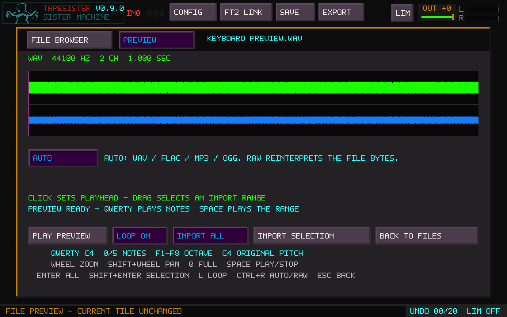
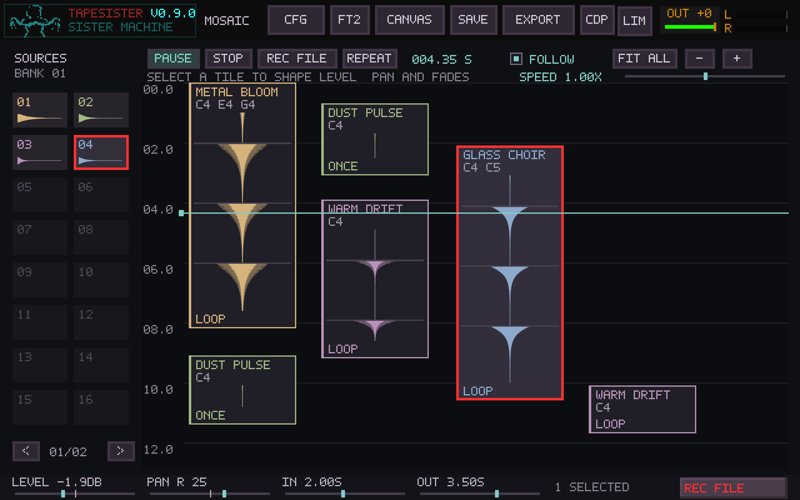
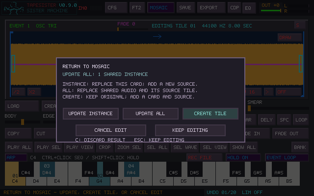
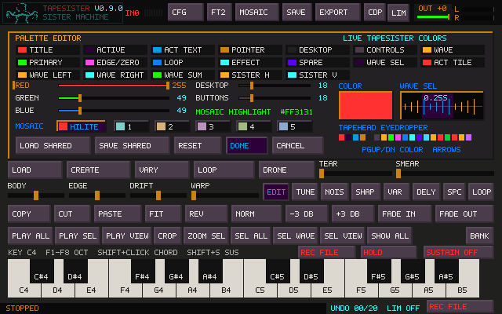
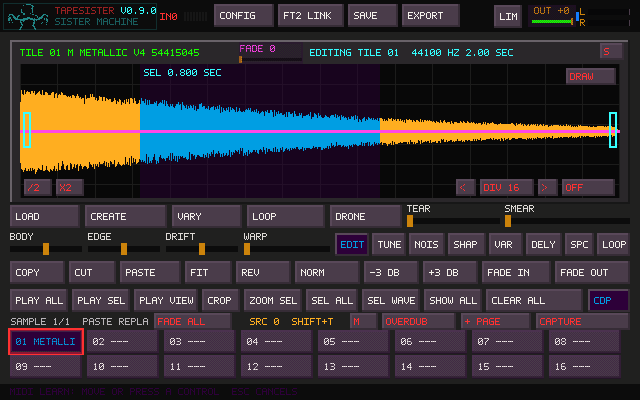
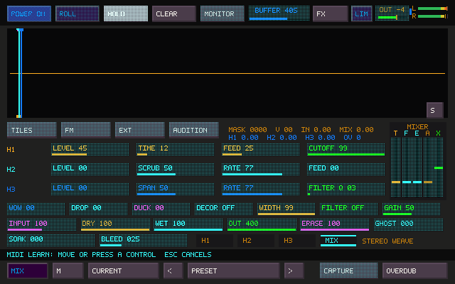

# TapeSister User Manual

TapeSister is a standalone sound-making, sample-sculpting, and performance instrument.
It can generate material, reshape imported recordings, build related sound families,
arrange events in Mosaic, capture live performances into new tiles, and send sound through Sister Machine,
Fallout, and a four-slot effects pedalboard. It is designed to make playable audio,
not to hide sound behind a project format: saved projects include ordinary WAV copies
of every occupied tile.

This manual describes the current instrument. MIDI notes and global MIDI Learn are
supported, along with Tapehead's direct [Live Link](LIVE_LINK.md). FT2 Link folder exchange is described
in [TapeSister and TapeHead exchange](#tapesister-and-tapehead-exchange).

For a compact list of keys, gestures, ranges, and file types, see the
[Quick Reference](QUICK_REFERENCE.md).

## Contents

- [The instrument at a glance](#the-instrument-at-a-glance)
- [First run](#first-run)
- [The main window](#the-main-window)
- [Tiles, pages, and projects](#tiles-pages-and-projects)
- [Creating a new sound](#creating-a-new-sound)
- [Variation and sound families](#variation-and-sound-families)
- [FM Logic](#fm-logic)
- [Editing and sculpting audio](#editing-and-sculpting-audio)
- [Mosaic](#mosaic)
- [Recording and capture](#recording-and-capture)
- [Sister Machine](#sister-machine)
- [The four-slot FX pedalboard](#the-four-slot-fx-pedalboard)
- [Fallout](#fallout)
- [Long transitions, LFOs, and compositional time](#long-transitions-lfos-and-compositional-time)
- [Master output, meter, and limiter](#master-output-meter-and-limiter)
- [Presets and parameter locks](#presets-and-parameter-locks)
- [Saving, moving, and extracting a project](#saving-moving-and-extracting-a-project)
- [Exporting and exchanging sounds](#exporting-and-exchanging-sounds)
- [Configuration](#configuration)
- [Performance safety and troubleshooting](#performance-safety-and-troubleshooting)
- [MIDI Learn and performance controllers](#midi-learn-and-performance-controllers)
- [Current boundaries](#current-boundaries)

## The instrument at a glance

TapeSister has four closely connected working areas.

1. **The main sample laboratory** holds independent sound tiles. This is where sounds
   are generated, imported, selected, edited, varied, looped, transformed, played,
   recorded, and saved.
2. **Mosaic** arranges freely placed events on a downward timeline. Each event plays
   its own pitched notes and loops through the shared effects and recording path.
3. **Sister Machine** is a live rolling-tape instrument with one moving write head,
   three playback heads, feedback, filtering, stereo weave, source routing, capture,
   and long-form recording.
4. **Fallout and the FX pedalboard** process the shared sound, with Sister powered on or off.
   Fallout produces unstable deterioration and generative change. The pedalboard holds
   four independently placed effects: Reverb, Delay, Distortion, or Grain.

The normal creative cycle is:

> Create or load material → shape it → make variations → perform it → capture the
> performance → use the capture as new material.

Nothing requires that exact order. Imported audio or raw data can be loaded and
immediately sent through Sister Machine; a blank tile can become a precisely timed
sound; a captured Sister performance can be cropped, varied, looped, and used as a new
Sister source.

## First run

1. Open **CONFIG** and choose the output device.
2. If you will record external sound, choose the input device and channel mode.
3. If you will play from MIDI, choose **AUTO FIRST**, a named MIDI input, or **OFF**,
   and choose **OMNI** or MIDI channel 1–16.
4. Save the configuration.
5. Confirm the global **OUT** fader is raised and the meter responds when a tile plays.
6. Leave **LIM** on while learning the instrument. The limiter protects the output
   before the final OUT fader.

TapeSister opens with usable defaults. Sister Machine is intentionally powered off at
startup; opening its window does not turn its audio engine on.

## The main window

### Header

The top row remains available across the main workspaces.

- **TAPESISTER / SISTER MACHINE** opens Sister Machine. `Tab` also opens it and moves
  keyboard focus between the two windows.
- `Ctrl+Tab` crosses to a running Tapehead and returns to whichever TapeSister window
  was last active. It leaves open panels, playback, routing, and recording untouched
  and works whether or not Live Link audio is enabled.
- **CONFIG** selects audio, input, MIDI, paths, palette, and performance defaults.
- **FT2 LINK** opens the current folder-based TapeSister/TapeHead exchange.
- **MOSAIC** or `Shift+grave` opens the arrangement; the shortcut returns to the
  previous main or FM workspace. `Ctrl+M` is an alternative. See
  [Mosaic workspace navigation](#mosaic-workspace-navigation).
- **CDP** or `Ctrl+Shift+P` opens the CDP Portal, also reachable from Mosaic, FM,
  and Sister Machine. Portal retains its own `Tab` source/result audition shortcut.
- **SAVE** saves the complete active project.
- **EXPORT** exports the selected tile or the complete sound collection.
- **LIM** enables or bypasses the global output limiter.
- **OUT** is the final speaker/file-output fader.
- The two meter lanes show the final left and right output.

### Waveform and editor

The large waveform is the active tile's editable audio. Its header reports tile number,
name, sample rate, duration, selection length, and other current state. The `S/L/R/M`
button cycles the display between Stereo, Left, Right, and Mono Sum without changing
the stored audio or the capture format.

Drag across the waveform to select. Click to move the edit playhead. Right-click to
play from the pointer. The wheel zooms around the pointer; `Shift+wheel` pans. The
selection and viewport belong to the tile and return when that tile is selected again.

The editor buttons beneath the waveform provide loading, creation, variation, looping,
Drone Maker, tuning, native DSP, CDP transforms, clipboard editing, gain, fades, crop,
selection, and playback operations. Most operations affect the selection when one is
present and the whole tile otherwise.

### Import preview and raw data

Click **LOAD** or press `Ctrl+O`, choose a file, and TapeSister opens an import preview
before it changes a tile. WAV, FLAC, MP3, and Ogg Vorbis are recognized from their file
contents and decoded automatically. The import dialog has **FILE BROWSER** and
**PREVIEW** tabs, and the preview shows the decoded waveform, format, sample rate,
channel count, duration, and frame count. Recorder-oriented extensible, RF64, and
multichannel WAV files use the general decoder when the sampler-metadata reader cannot
open them; multichannel material is downmixed to stereo.

QWERTY or MIDI plays the preview at different pitches, with up to five simultaneous
notes. C4 plays at the file's original pitch; `F1`–`F8` choose the keyboard octave.
With Sustain off, release a key to stop its note. With Sustain on, released
notes finish or keep looping. Use `Shift+S` or the **SUSTAIN** button; turning it
off releases notes whose keys are up. Held notes follow live loop-selection changes;
changing octave keeps their pitches and key releases working. `Space` stops all
preview voices. Going back to files, changing decoding mode, or importing clears
held preview notes before replacing their audio. File-list typing remains normal.

The preview behaves like TapeSister's canvas. Click the waveform to position its
playhead, or drag across it to select part of the file and return the playhead to the
selection start. Both selection edges snap to nearby zero crossings to avoid a
discontinuity at the imported boundaries. Use the wheel for pointer-anchored zoom,
Shift+wheel or `Left`/`Right` to pan, and `0` to restore the complete-file view.
Middle-click clears the selection and returns the playhead to the beginning.

Hold `Alt` and wheel over a selection to expand it (up) or contract it (down).
Hover its left half to move the left edge, or its right half to move the right
edge, using the same zero-crossing steps as the canvas. While LOOP is playing,
both wheel resizing and selection dragging change the audible range without
stopping playback. The playhead stays in place if it still lies inside the new
range; otherwise it moves to the new start. Clearing the selection while looping
continues through the whole file. Editing a stopped preview does not start it.

`Space` or **PLAY PREVIEW** starts at the playhead and stays inside the selection when
one exists. After playback reaches the end, the playhead returns to the beginning of
that range so Space immediately replays it. `L` or **LOOP** continuously repeats the
selection—or the complete file when there is no selection—with a short boundary
crossfade. `Enter` or **IMPORT ALL** commits the complete file; `Shift+Enter` or **IMPORT
SELECTION** commits only the selected range. A contained sampler loop is retained and
translated into the range; a loop cut by the selection is omitted.

Decoding happens in the background, so the window continues updating during a long
MP3. `Escape` or **CANCEL** stops the decode and returns to the browser. When no preview
or raw-data adjustment is needed, Shift-click a file (or use Shift+Enter/Shift+Open) to
decode recognized audio and install it directly into the selected tile. Unknown files
still open in Preview as raw data so their interpretation can be checked.

`Escape`, **BACK TO FILES**, or the
**FILE BROWSER** tab returns to the same directory and highlighted file without changing
the destination; the cached preview remains available in the **PREVIEW** tab. Use
`Escape` or **CANCEL** from the file browser to leave LOAD completely.

Any non-project file can also become sound as **RAW DATA**. This mode interprets its
bytes directly instead of requiring an audio container. Adjust the following while
watching and auditioning the preview:

- unsigned or signed 8-bit, signed 16/24/32-bit integer, or 32-bit float encoding;
- little- or big-endian byte order for multi-byte encodings;
- mono or interleaved stereo;
- sample rate from 8 kHz through 192 kHz;
- byte offset, with `Shift` selecting a larger step;
- optional peak normalization.

The source file and destination tile remain untouched while settings change. Different
interpretations can sound radically different: sample rate changes speed and pitch,
channel and offset choices change byte alignment, and encoding or byte order changes
the waveform itself. Click **AUTO** / **RAW DATA** or press `Ctrl+R` to switch modes when an
ordinary audio file should be deliberately reinterpreted as bytes. If a waveform
selection is active, accepting an import proceeds to the existing **PASTE / FIT /
CANCEL** choice instead of replacing the whole tile.

### Lower workspaces

In the main canvas, the number keys choose the lower area:

- `1` — Sample Tiles. Press `1` again to cycle through Sample pages.
- `Shift+1` — external REC BANK.
- `2` — performance keyboard.
- `3` — CDP processes. Press again to change CDP page.
- `4` — native DSP processes. Press again to change DSP page.

The bottom status line explains the most recent action. Undo depth and limiter gain
reduction appear at the right side of that line.

## Tiles, pages, and projects

Each Sample page contains 16 independent tiles. A tile owns all of the following:

- mono or stereo audio;
- name, tuning, loop, selection, playhead, and viewport;
- its FM genome when the current material still corresponds to it;
- processing state and edit timeline;
- a private 20-step Undo/Redo history;
- protection state and capture provenance.

Clicking an occupied tile selects and auditions it. Clicking an empty tile selects the
destination without playing. Double-clicking an empty tile creates editable silent tape.
Clearing a tile leaves that empty destination selected.

Use **+ PAGE** when more than 16 sounds are needed. Pressing `1` while Sample Tiles is
already visible cycles through the existing pages. The REC BANK is separate from this
page cycle.

These Sample banks also supply Mosaic's Sources browser. A placed Mosaic event owns
its playback settings and shares the source audio until an audio edit is accepted.
Changing one event never changes every use of that bank tile. See [Mosaic](#mosaic).

### Tile borders and marks

- The active editing tile has the main active outline.
- A tile being previewed receives its separate preview mark.
- Sister source membership uses its own split-color perimeter.
- A live Capture destination flashes with a recording outline.
- A loop marker appears on tiles that contain a loop.

### Protected tiles

Protection prevents an accidental overwrite or destructive family replacement. A
protected tile can still be played and can still participate as a Sister source. Unlock
it deliberately before replacing or clearing it.

## Creating a new sound

### Immediate Create

1. Click an empty tile.
2. Click **CREATE**.
3. TapeSister renders a fresh six-voice FM sound into that tile.
4. Audition it with Space, the tile, the onscreen keyboard, QWERTY, or MIDI.

Left-clicking Create always proposes a fresh FM source. It does not depend on another special Source
tile.

### CREATE and CDP variations

CREATE has two independent dice rolls and a way back to the clean sound:

| Gesture on CREATE | Result |
| --- | --- |
| Left-click | Generate a fresh FM sound |
| Right-click | Render a random CDP variation of the retained clean waveform |
| Middle-click | Cancel the pending CDP variation and restore the retained clean waveform |

Left-click until the FM sound interests you, then right-click to explore CDP versions.
Successive right-clicks start from the same clean waveform; they do not stack the last
CDP result. A right-click during a render queues one more roll. Middle-click restores
the clean version without rolling a new FM sound. A later manual edit or a different
source cannot be overwritten by an old restore operation.

Selection-based creation retains the surrounding audio. When working on a Mosaic
event, these audio edits join that event's working changes and use the destination
choice when you return to Mosaic. See [Editing a Mosaic event](#editing-a-mosaic-event)
and the [CREATE palette notes](CDP_EXPANSION.md).

### Create a sound at a precise length

This is one of TapeSister's most useful workflows.

1. Double-click an empty tile to create silent tape.
2. Resize the canvas if necessary.
3. Drag a selection whose readout matches the desired duration.
4. Click **CREATE**. The generated sound is fitted into that exact selected interval.
5. Click **VARY** as many times as desired; each variation answers the sound currently
   inside the selection and retains its duration.
6. When the result is ready, click **CROP** to remove the surrounding silence.

The crop is immediately written back to the selected tile, so re-clicking it cannot
restore the discarded silence or an old selection. Undo returns to the pre-crop canvas;
Redo restores the precise cropped sound.

### Silent tape and pasted timelines

With no clipboard timeline, a double-clicked empty tile starts as one second at
44.1 kHz. When the clipboard contains material copied from another timeline, the blank
canvas adopts that source duration and sample rate so **PASTE** can return the material
to its original position.

## Variation and sound families

**VARY** responds to the audible material that exists now.

- If a freshly created tile still exactly matches its FM genome, Vary can alter that
  structure directly.
- After Draw, Tune, Warp, Smear, Tear, Body, Edge, Drift, Paste, or another destructive
  edit, Vary derives its response from the resulting waveform.
- With a selection, Vary replaces only that interval with a duration-matched response.
- With no selection and **CHAIN OFF**, Vary replaces the active tile as one Undo step.
- With no selection and **CHAIN ON**, Vary places the response in the next empty tile
  and makes that new sound the next handoff.

**RANGE** controls how far a relative can move. Low values preserve recognizable family
traits. High values permit larger changes in spectrum, envelope, motion, pitch relations,
and structure. Zero produces an exact copy.

Family locks preserve duration, loop, pitch, or envelope while related sounds are made.
Trajectory/Path mode uses each new relative as the source for the next, allowing a bank
to drift over generations rather than repeatedly orbiting one original.

Selection Chain stamping is a different but related performance tool: a Vary stamp
advances the same-width selection to the right with a small crossfade, and the preceding
stamp becomes the next source.

## FM Logic

Press the grave/backquote key (`` ` ``) or open **FM LOGIC** from the Family area.
The workspace is a complete six-voice synthesizer and genome editor. Its preview is
temporary until **APPLY** is pressed.

`Shift+grave` visits Mosaic and returns to the same FM patch on the next press.
From Mosaic, plain grave opens FM and pressing it again returns to Mosaic. Visiting
Sister with `Tab` also preserves the current workspace and event being edited.

### Pages

FM Logic provides seven pages through the same compact control area:

- Pitch
- Wave
- LFO Rate
- LFO Depth
- LFO Type
- Filter
- Structure

Six **VOICE** buttons enable or disable voices. Permission buttons determine which
domains Randomize and later variations may change. The visible page is protected during
Randomize, which makes it possible to hold one aspect steady while exploring the rest.

### Pitch behavior

The Pitch page provides a pitch lock, pitch-class root, and scale. Available scales are
Chromatic, Major, Minor, Pentatonic, and Whole Tone. Pitch Lock preserves the six ratios.
With pitch open, varied ratios are snapped into the chosen tonal set. **APPLY PITCHES**
deliberately snaps enabled voices even when Pitch Lock is on.

MIDI note 60/C4 is the universal unity key for newly rendered FM material.

### Randomize, Apply, and Make Bank

- **RANDOMIZE** creates a new permitted genome and immediately updates the preview.
- **APPLY** prints the preview into the active tile. With Chain on, it uses the next
  empty tile.
- **MAKE BANK** places the exact patch in tile 01 and creates 15 relatives at the current
  Range. Chain off derives them from tile 01; Chain on makes a trajectory.

If the page is full, TapeSister asks whether to replace the page, create a new Sample
page, or cancel. A protected tile prevents destructive page replacement.

### Drone and Extreme

**DRONE** removes amplitude decay, filter attack/release, modulator decay, and the
transient layer, then trims the render to clean zero-valued boundaries. It is intended
for continuous tones rather than disguised one-shots.

**EXTREME** opens much wider ratios, depth, feedback, resonance, filter motion, and
per-voice LFO ranges. It does not disable safety: finite checks, DC rejection,
saturation, and bounded output remain active. Extreme is most useful when treated as
an invitation to find unstable material and then sculpt it into something playable.

QWERTY and MIDI can play the live FM preview. **HOLD** latches or releases the current
synth chord. FM can also be recorded directly through REC BANK **SRC SYNTH** without an
external input or operating-system loopback.

## Editing and sculpting audio

### Selection and playback

- Drag in the waveform to make a selection.
- Click to place the edit playhead.
- Right-click to play from the pointer.
- Space plays the selection when one exists; otherwise it plays from the edit playhead.
  Press Space again for an immediate stop.
- **PLAY ALL** and **PLAY SEL** audition the whole tile or selection once.
- **PLAY VIEW** toggles visible-range playback for QWERTY, MIDI and onscreen
  keyboard notes. Its highlighted state makes zoom/pan affect those notes;
  when off, zoom/pan only changes the display. LOOP/HOLD still controls repeat.
  With PLAY VIEW on, Space auditions the visible range once at its current bounds.
- **SEL VIEW** captures the visible region as a fixed selection and turns PLAY
  VIEW off. Subsequent zoom/pan leaves that selection in place. Saved loop points
  retain their normal priority for played notes.
- **ZOOM SEL** fills the display with the selection. **SHOW ALL** or `0` restores the
  complete tile.

All normal audition follows the tile's current tuning without rewriting its audio.
Changing ROOT/PITCH updates an audition that is already running.

### Core edits

The Edit page provides Copy, Cut, Paste, Fit, Reverse, Normalize, ±3 dB, Fade In,
Fade Out, selection tools, and Crop.

- **PASTE** keeps the copied sound's duration. Into a selected destination it replaces
  that range and may change the tile length. With no destination selection it returns
  to the clipboard's original timeline position and extends the canvas only if needed.
- **FIT** stretches or compresses the clipboard into the destination selection and
  keeps the canvas length fixed. Its pitch changes with its playback rate.
- **CUT** performs a ripple removal, smooths the join, and normally adds silence at the
  right so the canvas duration remains fixed.
- **CROP** keeps the selection as the complete tile.
- **NORM**, gain, and fades affect the selection when present.

Undo/Redo is tile-local and holds 20 steps. Switching tiles does not exchange histories.

### Canvas duration and grid

The `/2` and `X2` controls change the complete tape length. The left and right canvas
handles can also be dragged. Grid snapping cycles through Off, Zero-Crossing, and Time
Grid modes. Canvas resizing is one Undo step; Escape during the drag restores the
starting state.

### Draw

**DRAW** turns a left-drag into a mirrored amplitude-profile pencil:

- center line: silence/0×;
- half height: unchanged/1×;
- outer edge: 2× amplitude.

Tap Shift during a stroke to lock a point and continue as a straight polyline segment.
Release commits the complete stroke as one edit. Escape during drawing restores the
untouched audio; Escape while idle turns Draw off.

### Body, Edge, and Drift

These material macros reinterpret the current waveform rather than layering a hidden
effect over it. They are useful for quickly changing weight, transient character, and
motion before asking Vary to respond. `Ctrl+wheel` over a macro gives fine preview;
releasing Ctrl commits the full gesture as one edit.

### Warp, Smear, and Tear

Warp, Smear, and Tear are spring-loaded destructive gestures. They operate on the
selection when present and the tile otherwise. Their stereo implementation uses one
linked mapping or packet decision for both channels, preserving left/right identity.
Escape cancels a live gesture.

### Tape-length and zero-crossing gestures

While the pointer is over a selection:

- `Alt+wheel` expands or contracts the endpoint on that side of the selection center.
- `Shift+Alt+wheel` changes tape length by semitone steps around the playhead.
- `Ctrl+Shift+Alt+wheel` makes the same change in cent steps.
- `Ctrl+wheel` rotates the waveform through zero-crossing candidates.

The gesture remains a live preview until the modifiers are released, then becomes one
Undo step. Escape restores the original.

### Drone Maker

Select material and press **DRONE** to construct a purpose-built seamless loop. Drone
Maker finds a quiet overlap-safe crossing, rotates the selected halves, and crossfades
the internal seam. Preview Loop repeats the temporary result without changing the tile.

- **COPY NEW TILE** creates an independent loop tile.
- **REPLACE SELECTION** splices the drone into the source and selects the exact result.

The crossfade can be adjusted in the dialog with its handles or wheel. Both commit modes
support Undo/Redo.

### Native DSP and CDP

Press `4` for native DSP and `3` for CDP. Left-clicking a process tile applies its saved
settings immediately. Middle-click opens the detailed Transform workspace.

The Transform workspace keeps the source untouched while rendering. Audition the
temporary result, adjust controls and scope, then press **APPLY** to make one Undoable
edit. A canceled or failed render never alters the tile.

Native DSP is always available. CDP uses the bundled pinned CDP8 runtime in standard
release builds. The visible CDP catalog can be selected in `tapesister.ini`.

**CDP Portal** is a separate exploratory workbench: open it with **Ctrl+Shift+P**
or the CDP panel's **PORTAL** button. It has source/result waveforms, audition
loops, render history, and 64 processes across searchable waveset, spectral, time/tape, filter, grains, lo-fi/modulation, level, and delay families. Spectral
analysis and resynthesis happen automatically around the selected CDP process.
The original 32 curated instruments remain available.

The QWERTY note rows also work inside the Portal: play its selected Source or
Result at different pitches, or hold up to five notes as a chord. C4 is the
original pitch; F1–F8 choose octaves. Notes follow the audition selection and Loop
setting, and release when you let go. Typing in a text field does not play notes.

Save discoveries as recipes or pin them as personal process tiles. **MANAGE
TOOLS** lets you rename, update, replace, and remove numbered saved slots.
Update copies current settings while retaining the destination's name; Replace
can change the process too. Collection changes require confirmation and persist
separately from audio projects. See the illustrated [CDP Portal guide](CDP_PORTAL.md)
for the complete workflow and process-family controls.

**CHAIN TOOLS → SUPERSAW TIGHT / SUPERSAW / WITCH SAW** renders nine centered
unison layers from a saw, FM sound or other tile. Choose a fixed detune voicing,
adjust COLOUR and OUTPUT, then Apply or New Tile. The resulting audio works
with normal Mosaic notes, loops, volume, pan and fades. See the
[supersaw source recipe and audition project](SUPERSAW.md).

The Filter family adds Notch, Band Pass, Low Pass, High Pass, Sweeping Band, and
Phasing. Wheel over parameter labels to reach additional controls, including the
explicit decay tail. Smaller acuity values give narrower, more resonant filters;
frequency limits depend on the source rate. Sweeping Band moves automatically
between two frequencies, while Phasing adds fixed-delay coloration.

The Grains family adds Granular Pitch, Granular Time, Grain Scramble, and Grain
Density. These cut grains from any mono source, including sustained audio.
Granular Time uses input velocity (0.5 roughly doubles duration); Granular Pitch
changes pitch without tape-style time scaling. Scramble searches backward for
grain material; Density below one leaves gaps. These modes include native random
scatter, so saved settings can give different textures on successive renders.

Some operations are intentionally unavailable for linked stereo material until their
channel relationship can be preserved exactly. TapeSister reports that boundary rather
than silently folding the tile to mono.

## Mosaic

Mosaic turns the existing sample playback into an arrangement. Time runs from top
to bottom in seconds. Horizontal position and width provide visual space; neither
changes pan or pitch. Events playing at the same time sit side by side with a small
gap. Events may meet exactly end to end. There are no tracks or required beat grid.

### Your first arrangement

1. Open **MOSAIC** or press `Shift+grave` (Shift plus the backtick key).
2. Drag an occupied source from the left-hand browser onto the canvas. Its top
   edge sets the start time; a waveform ghost shows the proposed placement.
3. Double-click the event to open its editor. Choose notes on the keyboard and
   **EVENT LOOP** or **EVENT ONCE**, then return with **MOSAIC** or Escape.
4. Extend a loop by dragging its bottom edge. Drag another source alongside it
   to hear overlapping events. Press Space to play or pause.
5. Enable **FOLLOW** to keep the moving playhead visible. Middle-click to seek.
6. Click **REC FILE** to record the final output; click the recording button again
   to finish the file. Recording continues while you edit or visit Sister Machine.

### Sources and bank pages

Sources browses every Sample bank, including pages made in FM Logic or the main
canvas. **BANK 01**, **BANK 02**, and later banks keep their original numbers and
16 slot positions, including empty slots. The arrows below Sources move through
these banks and then **EVENTS** pages containing audio versions used by placed events.
An accepted event audio edit receives its own waveform preview there. **NEW TILE**
also saves a reusable copy in a free regular Sample-bank slot, creating a bank when
needed. It reveals the new event, highlights its source and names the bank/slot in
status. Existing sounds and the main editor's selection remain intact. **UPDATE TILE**
continues to change only the event. Arrangement Undo leaves reusable bank copies
available.

Browsing Sources does not change the main editor's active bank or Sister's routing.
Returning from FM shows its active bank with the correct bank number; the original
bank remains accessible. Click a source to highlight it, then drag it into place.

### Pitch, repetition, and one-shots

An event has one to five notes, each with its own playback phase. C4 is the reference
speed; C5 traverses the same fragment twice as fast and C3 takes twice as long.
A chord therefore creates different loop lengths as well as different pitches.
Octaves line up regularly; other intervals produce shifting relationships between
repetitions. Try C4, E4, and C5 on a short sound inside one long looping event.

Dragging the bottom edge extends the event's playback window. A looping voice gets
more repetitions at its existing speed; the sample is not time-stretched. Each
one-shot voice stops after one traversal or at the event's bottom, whichever comes
first. Making a one-shot event longer does not retrigger it. The waveform repeats
visually at the C4 reference speed, while the chord voices follow their own rates.

### Selecting, moving, and copying

| Action | Control |
| --- | --- |
| Select an event | Click its body; the highlight border is red by default |
| Select a group | Shift+left-drag a box on empty canvas |
| Move the selection | Drag any selected event body |
| Copy an event or selected group | Hold Shift when starting a drag on a tile |
| Extend duration / change visual width | Drag the bottom / right edge |
| Align starts, ends, or midpoints | Hold Alt during a move or duration resize |
| Mute / solo the selection | M / S |
| Copy / paste the last-clicked event at the playhead | Ctrl+C / Ctrl+V |
| Delete the selection | Delete or Backspace |
| Undo / redo arrangement changes | Ctrl+Z / Ctrl+Y or Ctrl+Shift+Z |
| Cancel a move or copy drag | Escape |
| Play / pause; stop and rewind | Space; STOP or Escape when no gesture is active |
| Seek / return to the beginning | Middle-click canvas or click time ruler / Home |
| Scroll time / scroll sideways / zoom | Wheel / Shift+wheel / Ctrl+wheel |
| Keep playhead visible / fit arrangement | FOLLOW / FIT ALL |
| Repeat the complete arrangement | REPEAT |

Group moves and copies keep relative timing and spacing. Collision handling shifts
the group sideways rather than changing its start times. A Shift-click without a
drag creates no copies; one Undo removes a copied group. Ctrl+C/Ctrl+V handles the
last-clicked event, so use Shift-drag for a whole group.

Muted events and events excluded by solo become dim. Multiple events can be soloed;
mute takes precedence. These switches fade briefly while the voice clocks continue,
so unmuting resumes at the current phases. Clicking an unselected tile returns to
a single selection. FOLLOW suspends scrolling during a drag.

### Live mix, fades, and global speed

Select an event or group and adjust the footer's **LEVEL**, **PAN**, **IN** and **OUT**.
Level spans silence to +6 dB with 0 dB at center. Pan balances the original channels,
with both preserved at center. IN/OUT are linear fades in arrangement seconds.
Overlapping fades scale proportionally to fit the event. These controls do not change
the source recording; voice phases keep running while you adjust them.

The **SPEED** slider above the canvas spans **0.5× to 2×**. Its center is **1×**, the
normal C4 reference. The endpoints are an octave down and up. Pitch, event timing,
fades and playhead speed change together; note intervals stay intact. Movement is
smoothed for performance, and the shared effects retain their own time settings.

Drag or wheel over a control. **Shift+wheel** gives fine adjustment. **Right-click or
double-click** resets to 0 dB, center pan, zero fade or 1× speed. **Escape during a drag**
restores the starting value. Undo/Redo and project saving include these settings;
older projects load at 1× with neutral pan and fades.

When any card is soloed, the footer shows **CLEAR SOLO**, even when that card is
outside the view. Excluded cards say **SOLO OUT**. Clear Solo restores those events
without changing deliberate mute switches.

### Editing a Mosaic event

Double-click an event to use the familiar main waveform editor. Click the onscreen
keys to add or remove persistent chord notes, up to five; at least one remains.
**EVENT LOOP / EVENT ONCE** changes this event's playback behavior. Existing loop
handles set the source region, direction, and crossfade. Without a defined loop,
the selection or complete source provides the region.

Loop/one-shot and chord changes apply to this event immediately. Copies retain their
own settings. Sample audio is shared until you make an actual audio edit. Draw,
Warp, Smear, CREATE, and CDP changes accumulate in this event's working editor;
Mosaic continues playing its published sources while you can audition the edits.
The original Sample bank and sibling events keep their audio.

When you return to Mosaic after changing the audio, one destination question appears:

| Choice | Result |
| --- | --- |
| **NEW TILE** — Enter or N | Keep the original, reveal the edited event, and store a regular Sample-bank copy |
| **UPDATE TILE** — U | Replace only this event's audio |
| **KEEP EDITING** — Escape | Keep the working edits open without publishing them |

The question appears on leaving the editor, not after every processing operation.
Leaving an unchanged event, or undoing all audio changes, needs no question. Saving,
opening another project, or closing the main window also resolves pending edits first.

A CDP render remembers the event that requested it even after you select another
event or window. Results cannot overwrite the event that merely happens to be open.
If its source has changed or its owner has disappeared, the result remains available
for review instead of replacing unrelated audio. The [Mosaic guide](MOSAIC.md#cdp-ownership)
describes the full background-render behavior.

### Mosaic workspace navigation

| Where you are | Key | Destination |
| --- | --- | --- |
| Main canvas | Shift+grave or Ctrl+M | Mosaic; press again to return |
| FM Logic | Shift+grave | Mosaic; press again to return to the same FM patch |
| Mosaic | Plain grave | FM Logic; press again to return to Mosaic |
| Main, FM, Mosaic, or event editor | Tab | Visit Sister and return without changing the edited event |
| Sister Machine | Shift+grave / plain grave | Bring Mosaic / FM forward, even if already open behind Sister |
| Sister Machine | Escape | Close its active subpanel first, otherwise restore the main application window |
| Event editor | Escape or MOSAIC | Return to Mosaic, resolving changed audio if needed |
| Main, FM, Mosaic, or Sister | Ctrl+Shift+P | Reach the CDP Portal |

Active dialogs retain focus until resolved. Portal uses Tab for source/result A-B
audition. Workspace navigation leaves the arrangement playing; the MOSAIC toolbar
button stays highlighted during background playback. Stopping an editor audition
can report **AUDITION STOPPED - MOSAIC CONTINUES**. Use Mosaic's STOP or Escape in
the arrangement to stop and rewind it.

### Shared effects, recording, and saving

Live effects are global. Mosaic supplies the **TILES** source to Sister when Sister
is powered; enable that source to hear the arrangement through its rolling tape.
With Sister off, Mosaic feeds the ordinary Fallout and POST pedalboard path.
PRE and head placements require Sister. Sister power changes preserve the shared
effect settings and transitions.

**MASTER FX** bypasses the pedalboard and Fallout together, including Fallout's
feedback return, over the configured Master transition. It leaves the dry source
audible and preserves individual settings and modulation clocks. Material already
recorded into Sister's buffer retains its printed sound. See
[FX transitions](#effect-and-master-transitions) and [Fallout](#fallout).

Mosaic's header and footer **REC FILE** buttons, and `Ctrl+Shift+F`, operate the
shared final stereo output recorder. It includes the live processing, limiter, and
OUT fader, continues across windows, and saves completed takes in `Captures/`.
Stopping the file does not stop the arrangement. See [Direct output recording](#direct-output-recording).

SAVE preserves the events, notes, source regions, loop modes, positions, durations,
mute/solo states, level/pan/fades, global speed, repeat setting, and shared source versions in the project folder.
Transport position and arrangement/editor undo history are session state. Older
projects without Mosaic open with an empty arrangement. Capacity is 128 events,
with up to five voices each; practical processing capacity depends on the computer.

The waveform display uses smooth edges and detailed peak/energy previews at the
window's actual resolution. Scrolling moves the waveform, labels and borders
together in single physical-pixel steps, preserving the tile's height and waveform
shape as the view moves. The five source colors and separate selection highlight
are editable in [CFG → PALETTE](#palette-and-mosaic-colors).
See the [dedicated Mosaic guide](MOSAIC.md) for additional details and listening checks.

## Recording and capture

TapeSister has four related recording paths. They share audio foundations but serve
different purposes.

| Path | Records | Destination | Archive prefix |
| --- | --- | --- | --- |
| Main **CAPTURE** | final performed TapeSister mix | blank/current tile | `CAPTURE_` |
| Main **OVERDUB** | final performance layered onto a tile | existing tile | `CAPTURE_` |
| REC BANK **SRC EXT** | configured physical input | REC tile | `INPUT_` |
| REC BANK **SRC SYNTH** | internal live FM voices only | REC tile | `SYNTH_` |
| Sister **CAPTURE/OVERDUB** | selected H1/H2/H3/MIX tap | current or next tile | `CAPTURE_` |
| Sister destination **FILE** | selected tap or final OUT | long WAV/RF64 file | `SISTER-` |

Completed real-time takes are archived as 32-bit float WAV files in `Captures/` before
the editable copy is installed. Ordinary edits and generated sounds are not archived.

### Capture a performance to a tile

1. Double-click an empty tile to create blank tape, or select an existing target for
   Overdub.
2. Choose **M** for mono or **S** for stereo beside Overdub.
3. Click **CAPTURE**. Existing playback stops and the destination remains armed.
4. Select and deliberately start a different source: click a tile, play a loop, use
   QWERTY/MIDI, or launch a staged chord.
5. Perform edits and layer additional sounds while recording.
6. Press **STOP** or Space to keep a shorter take. Escape cancels and restores the
   destination.

The first newly triggered source begins recording at frame zero, so an earlier sound
does not leak into the take and the onset is not clipped. A completed take becomes the
active tile. Undo removes the whole capture; Redo restores it.

With automatic resize enabled, the tile shrinks to the completed performance. With it
disabled, Capture retains the blank canvas duration.

### Mono and stereo capture

The **M/S** choice is one shared internal-capture setting. The button on the main page
and the button in Sister Machine always mirror one another.

- **M** stores `0.5 × (L + R)` and is the compatibility default.
- **S** stores independent left and right channels.

Overdub follows the target tile: mono is duplicated into a stereo target, while stereo
is folded into a mono target using the displayed mono sum.

### Keyboard Sustain

`Shift+S` toggles **SUSTAIN** across the canvas, FM, CDP Portal, import preview,
and Sister Machine. The main keyboard panel has a button; Portal uses the compact
**SUS** label. Active coloring shows when it is on. Typing in text fields does not
toggle it. The setting starts off each session and applies to QWERTY and MIDI.

| Sustain | Tile / preview Loop | After key release |
|---|---|---|
| Off | Off or On | Note stops |
| On | Off | One-shot finishes |
| On | On | Loop continues |

Turning Sustain off releases only notes whose keys have been released. Keys still
held keep playing. FM's looping preview follows the same rule. Existing explicit
Shift-click latches, staged capture chords, and mouse-launched tile layers keep
their own launch/stop behavior; Sustain does not change the tile's loop setting.

[Detailed behavior and checks](KEYBOARD_SUSTAIN.md).

### Multi-tile performance sources

Shift-click occupied tiles to build a source group. QWERTY and MIDI notes fan out across
the complete group. Shift-clicking a member during recording removes it from future
triggers without cutting off its current pass.

Plain-clicked tiles form a separate performance layer: one-shots overlap and end
naturally; loops fade in and fade out when clicked again. **FADE ALL** releases those
mouse-launched layers. Space remains the immediate panic stop.

Up to five onscreen keys can be Shift-clicked into a staged chord. Clicking one staged
key launches the entire chord sample-synchronously.

### Overdub

Overdub records the live mix onto an existing destination. Use it when the target audio
should remain as a base layer. Confirm the destination carefully; the complete overdub
is one Undoable action.

### External REC BANK

Press `Shift+1`, choose an empty REC tile, and select **SRC EXT** or **SRC SYNTH**.

**SRC EXT** waits for the configured threshold. It includes pre-roll, stops after the
configured silence and tail, and can optionally monitor dry input. Monitoring does not
control recording and does not enter TapeSister's internal Capture or effects path.
Use headphones when monitoring microphones.

**SRC SYNTH** records only internal FM performance. It requires no audio input device.

When **CHAIN** is on, a finished REC take advances to the next empty REC tile and rearms.
**KEEP** copies every occupied REC tile into the first empty Sample slots, creates
another page if required, and clears the REC BANK only after every copy succeeds.

### Direct output recording

**REC FILE** immediately records the final stereo output into a WAV without choosing
a destination tile. Use the button in the main footer, keyboard, Sample bank, Mosaic
header or footer, or Sister's FX page. `Ctrl+Shift+F` is the main-window shortcut,
including while Mosaic or FM is open. These controls operate the same recorder.

The file includes the global processing, limiter, and final OUT fader. Sister may
be powered off. Recording continues while you switch workspaces, edit an event, or
stop an audition. Click the active recording button again to finish the file; it
does not stop Mosaic playback. To capture the arrangement's effects tails, stop the
arrangement first, let the tails finish, and then stop the file.

Completed takes are timestamped 32-bit float WAVs in `Captures/`. Long recordings
automatically upgrade to RF64 if needed. This is separate from recording into an
editable tile with CAPTURE or using the external REC BANK.

### Sister capture and long-form file recording

In Sister Machine, choose the tap, channel format, and destination before recording:

- Tap: H1, H2, H3, MIX, or raw TAPEHEAD. In FILE mode, final MIX is labeled **OUT**.
- Format: M or S.
- Destination: CURRENT, NEXT EMPTY, or FILE.

CURRENT and NEXT EMPTY use tile Capture/Overdub. The TAPEHEAD tap records the raw linked
stereo stream before TapeSister trim or processing. FILE starts immediately, allocates no
tile, and continues until **STOP** is pressed. Long recordings begin as ordinary WAV
and automatically become RF64 in the same file when necessary. A dedicated
`REC hh:mm:ss` readout above CAPTURE shows the duration accepted into the file.

H1/H2/H3 file taps require Sister to be powered. OUT and raw TAPEHEAD remain available
with Sister off. OUT records the final sound reaching the output path, including
ordinary post effects, the global limiter, and the final OUT fader.

## Sister Machine

Sister Machine is a moving-memory instrument inspired by physical tape behavior. A
write head continuously places selected sources into a rolling 5–60 second stereo
buffer. Three playback heads read different ages and directions from that memory.

### Open, close, and power

Click the TapeSister/Sister Machine emblem or press `Tab` to open the second window.
Closing or hiding the window does not stop its audio. **POWER** is the actual engine
boundary. **ROLL**, **HOLD**, Capture, feedback, and head movement continue while the
window is hidden according to their current state.

Escape closes an active Sister subpanel first; otherwise it brings the main
application window back. It does not minimize the application to the desktop.

### Source routing

The five source switches are:

- **TILES** — the per-page Shift-click source group;
- **FM** — live FM Logic performance;
- **EXT** — configured external input;
- **AUDITION** — preview/audition audio;
- **TAPEHEAD** — Tapehead's direct stereo Live Link.

To connect it, leave TapeSister on the desired physical output and select
**TapeSister Live Link** in Tapehead's Audio output list. **WAIT** in Sister's source
strip changes to **LINK** when the producer is available. Either program may start
first, and an armed TAPEHEAD source fades back in after a restart. See the
[Live Link guide](LIVE_LINK.md).

**TH SRC** changes only Tapehead's Sister routing. The separate **TH SONG** and
**TH PATT** buttons send Song Play/Stop and Pattern Play/Stop, so source selection can
never accidentally change transport (or vice versa). TH SONG and TH PATT reflect
Tapehead's real playback mode and light only while that mode is actually playing.

`Ctrl+Tab` switches between the two running applications without entering or leaving
this audio route. TapeSister remembers whether the main window or Sister Machine was
active, including an open Fallout or pedalboard view; Tapehead preserves its own open
editor or Config panel. If the companion is not running, the command does nothing and
never launches it.

When a source is routed into Sister it is removed from its ordinary direct speaker path.
It returns through Sister's DRY/WET monitor section, like a real hardware insert. Sources
that are not routed retain ordinary monitoring.

Shift-click an occupied main-page tile to toggle its Sister source membership. The mask
is stored per Sample page. A routed source tile cannot simultaneously be a Sister
Capture destination; capture to another tile and then add that result as a source.

### Transport

- **POWER** allocates or releases the rolling engine and its effect histories.
- **ROLL** moves the write head and accepts new writes.
- **HOLD** prevents writing while playback heads continue moving.
- **CLEAR** safely fades, clears rolling memory, and fades back in.
- **MONITOR** gates Sister's complete DRY+WET return. Turning Monitor off does not stop
  rolling, feedback, or Capture.
- **BUFFER** changes the live tape duration from 5 to 60 seconds. Existing material is
  retained by age when possible.

### The three heads

**H1** is the anchored delay head. LEVEL sets its audible amount, TIME sets its delay,
and FEED returns its read into the rolling write.

**H2** is a free-moving scrub/rate head. SCRUB changes position, RATE chooses one of the
ordered reverse and forward tape speeds, and FEED returns it to the write.

**H3** is another free-moving head with SPAN and RATE. It has no direct feedback send,
which makes it useful as a more independent layer against the H1/H2 recurrence.

The rate choices for H2 and H3 are `-2, -4/3, -1, -2/3, -1/2, 1/2, 2/3, 1, 4/3, 2`.
Negative values reverse playback.

### Tape character

- **WOW** bends the moving reads.
- **DROP** produces dropouts on H2/H3.
- **DUCK** reduces the head sum in response to newly arriving input.
- **DECOR** adds stereo decorrelation.
- **WIDTH** controls stereo spread.
- **FILTER**, CUTOFF, FILTER Q, and GAIN shape the completed head sum.

### Input, monitoring, erase, and ghosts

- **INPUT** is the 0–200% pre-tape level. Use it to control how hard sources strike the
  write path and Duck detector.
- **DRY** is the routed source return after INPUT.
- **WET** is the Sister MIX return.
- Sister's internal **OUT** is a 0–400% wet MIX stage. It affects MIX Capture but not
  the isolated H1/H2/H3 taps.
- **ERASE** controls how much old material the write head removes. At 100%, the current
  cell is fully replaced. At 20%, 80% of the old cell remains on every pass.
- **GHOST** spectrally ages only the retained old material.

The small T/F/E/A/X mixer provides up to 400% trim for Tiles, FM, External, and
Audition, plus up to 200% for the effects-only return. These trims allow sources and
effects to be balanced before they become part of the tape recurrence.

### Soak and Bleed

Soak/Bleed lets the stereo tape strips permeate one another through short, changing
fractional delays.

- **SOAK** sets the transfer depth.
- **BLEED** controls motion from a cycle of about 333 seconds to about 0.333 seconds.
- H1/H2/H3 may be selected together as targets. MIX is exclusive: selecting MIX removes
  the head targets, and selecting a head removes MIX.

This is neither ordinary width nor ping-pong delay. At slow rates it creates gradual
stereo migration and blurred memory; at fast rates it produces a more animated weave.
Targeting a feedback head allows the woven result to become part of later tape passes.

### Getting the most from Sister Machine

Sister becomes most expressive when its controls are treated as relationships:

- Lower ERASE, add modest GHOST, and keep input sparse to build an aging palimpsest.
- Put H1 near a stable repeat, let H2 reverse or drift, and use H3 as a slow counterlayer.
- Route Soak/Bleed to H1 or H2 when stereo movement should enter feedback; use MIX when
  it should affect only the final wet object.
- Use HOLD to freeze the current tape while heads continue searching it.
- Capture an isolated head when its behavior is more interesting than the complete mix.
- Capture the result into another tile, reshape it, and return it as a new generation.

The instrument is deliberately recursive, but same-tile live capture is blocked. Each
generation remains explicit and recoverable.

## The four-slot FX pedalboard

Press the page button in Sister Machine until **FX** is visible. The pedalboard contains
four independent processor slots. Signal order is always `1 → 2 → 3 → 4`, but each
slot chooses where it enters Sister's graph.

### Slot controls

Each row provides:

- numbered power switch;
- effect type;
- effect-specific parameters;
- GAIN from -12 to +12 dB;
- MIX;
- one placement: PRE, H1, H2, H3, or POST;
- UP/DN controls for reordering.

Cycle a slot's type to choose Empty, Reverb, Delay, Distortion, or Grain. Types may be
duplicated: four reverbs, two delays around a grain processor, or any other four-slot
combination are valid. Every slot owns independent state and history.

| Processor | Controls | Useful range/character |
| --- | --- | --- |
| Reverb | Size, Decay, Mix, Gain | compact room through very large space; decay reaches approximately 120 seconds |
| Delay | Time, Feedback, Mix, Gain | four-head tape delay, about 8–2000 ms |
| Distortion | Drive, Tone, Mix, Gain | RAT-like nonlinear stage with 2× oversampling |
| Grain | Size, Density, Pitch, Mix, Gain | 8–1000 ms grains, 0.25–120 events/s, ±24 semitones, 24 voices |

### Placement

- **PRE** processes only newly arriving source material before INPUT, the write head,
  Duck, and feedback. Audio already stored on the tape is not processed again.
- **H1**, **H2**, or **H3** processes that head immediately after its read and before
  the head's later character/level path. On H1/H2, the processed result also participates
  in that head's feedback.
- **POST** processes the completed MIX after Fallout.

Only one placement is active for each slot. If several slots share a placement, their
slot numbers determine their order at that point.

With Sister powered off, ordinary playback, including Mosaic, still passes through
Fallout and enabled **POST** slots. PRE and head placements require the rolling
machine. Turning Sister on or off preserves the global pedalboard settings,
transitions, and tails, along with Fallout's modulation state.

### Effect and master transitions

**EFFECT TRANSITION** controls slot power changes and live topology morphs such as type,
placement, and reordering. **MASTER TRANSITION** independently controls the MASTER FX
gate. Both are logarithmic from 10 ms to 60 minutes.

**MASTER FX** governs the complete live pedalboard and Fallout, including Fallout's
feedback return, with Sister powered on or off. Once its bypass transition finishes,
those processors add no effect to the signal. Their individual settings and
modulation clocks remain intact for re-enabling the master switch.

Bypass leaves the dry source playing; it is not a transport stop. Processing already
printed into Sister's tape memory remains part of that recorded sound. A long Master
transition can also keep effects audible while the bypass fades toward completion.

Changing a slot during a long transition does not freeze the interface or stop audio.
The old and new structures are handed over smoothly. Reversing an on/off transition
continues from the current gain instead of jumping back to an endpoint.

### FX Feedback

FX FEEDBACK returns the pedalboard's completed effect contribution into Sister's rolling
write. Its visible range reaches 135%. It is intentionally capable of self-building
behavior, but the return is delayed by one sample, bounded, saturated, and processed by
the tape write safety path.

Start low. Feedback is cumulative: a quiet source can become dense after several buffer
passes, especially with long reverb, delay, low ERASE, or additional H1/H2 feedback.

### Pedalboard strategies

- Put Distortion at PRE to print harmonic density onto new tape while old memory remains
  unchanged.
- Put Grain on H2 and Delay on H1 so each recurrence develops differently.
- Place an early Reverb on H3 and a second Reverb at POST for nested space.
- Use a very slow effect transition to let an effect become part of the form rather than
  arriving as a switch event.
- Reorder two active processors over minutes to create a gradual topology transformation.
- Use duplicate delays at different placements instead of one exaggerated delay.

## Fallout

Fallout sits after Sister's completed MIX and before the POST pedalboard location. It is
a stereo deterioration and instability instrument with its own 20-second history.

It also works with Sister powered off, processing ordinary playback and Mosaic before
POST slots. Its own FALLOUT switch enables the insert, while **MASTER FX** controls
the combined Fallout/pedalboard bypass. Master FX bypass preserves Fallout's settings
and modulation phase; turning the FALLOUT insert itself off clears its history after
the transition so a later re-enable starts cleanly.

### Main controls

- **MIX** blends Fallout with its input.
- **FEEDBACK** returns Fallout's wet-only result to Sister's rolling write when powered,
  or through a bounded return in the ordinary playback path with Sister off.
- **NOISE** selects White, Pink, Brown, or Blue noise and controls its level.
- **DROP** creates random amplitude failures.
- **PAN** creates smoothed random equal-power positions.
- **SKIP** selects buffer-relative loop windows; SPAN controls their size.
- **BIT** combines sample hold, bit-depth reduction, and event rate.
- **PITCH** chooses from ratios `-3, -2, -1, -0.5, 0.5, 1, 2, 3`; RAMP controls the
  move and RATE controls how often a ratio is selected.

Drop, Pan, Skip, Bit, and Pitch each have a real master gate. Turning a component off
prevents remembered modulation assignments from continuing to act through it.

### Three transition clocks

Fallout gives different changes independent time scales:

- **PRESET** — complete preset changeover;
- **PARTS** — Drop/Pan/Skip/Bit/Pitch component switches;
- **MASTER** — the Fallout insert itself.

Each ranges logarithmically from 10 ms to 60 minutes. A preset recall fades the old
state to dry during the first half, installs the new state at the silent midpoint, and
fades the new state in during the second half. Master power is not stored in a preset,
so recall never unexpectedly engages Fallout.

### Fallout modulation

Click **MOD** to open the target matrix. Every target has independent **L** (LFO) and
**R** (Rise) assignments. One LFO and one Rise clock may each control several targets.

Available targets include Mix, Feedback, Noise, Drop Rate, Pan Rate, Skip Span/Rate,
Bit Sample/Depth/Rate, and Pitch Ratio/Ramp/Rate.

#### LFO

The sine LFO ranges from one cycle per hour through 10 Hz. DEPTH sets a symmetric
excursion around the saved slider value. A control near an edge receives a smaller
symmetrical range rather than flattening against its limit.

#### Rise

Rise ranges from 1 second through 4 hours. It moves a target from its saved value toward
the upper limit. **SAW** repeats; **1-SHOT** rises once, reaches the apex, and returns to
the saved value. The endpoint is protected by a short de-click ramp even though the
phase display resets immediately.

When LFO and Rise share a target, Rise moves the center while the sine continues around
that moving center. Neither modulator moves or overwrites the saved panel control.

**RETRIGGER** restarts all Rise targets together. Opening MOD or assigning a new target
does not restart the clock. Re-engaging Fallout restarts a one-shot.

### Getting the most from Fallout

Fallout is most interesting when events are allowed to interact instead of every amount
being pushed to maximum.

- Use low Drop and Skip rates with a 10–30 minute Rise to make deterioration accumulate
  across a set.
- Let a one-hour LFO slowly move Feedback or Pitch Rate while a shorter Rise changes Mix.
- Assign Rise to Mix, Feedback, and Noise for a single coordinated weather front.
- Use a fast LFO on Pan or Bit Rate for animation while a very slow clock controls the
  larger form.
- Set a long PRESET time to travel between two complete failure environments.
- Put a POST reverb after Fallout so dropouts and pitch fragments leave independent tails.
- Feed Fallout back with low ERASE and GHOST to make errors become remembered material.

Factory starting points include **APPROACHING TRAIN**, **DUST WEATHER**, and
**DEAD TRANSMISSION**. Treat them as starting structures and Save As a user preset before
building a performance-specific version.

## Long transitions, LFOs, and compositional time

TapeSister's long clocks are intentionally much wider than conventional effect controls.
They are designed for performances that unfold over minutes or hours.

| Clock | Range | Best understood as |
| --- | --- | --- |
| Pedalboard effect transition | 10 ms–60 min | arrival/departure of one effect or topology |
| Pedalboard master transition | 10 ms–60 min | arrival/departure of the complete FX structure |
| Fallout parts transition | 10 ms–60 min | entry/exit of one deterioration process |
| Fallout master transition | 10 ms–60 min | entry/exit of Fallout as an instrument |
| Fallout preset transition | 10 ms–60 min | journey between two complete Fallout states |
| Fallout LFO | 1 cycle/hour–10 Hz | recurring motion from form to modulation |
| Fallout Rise | 1 s–4 h | repeating ramp or one-shot performance arc |
| Soak/Bleed cycle | about 333 s–0.333 s | stereo permeability and migration |

At short values these controls prevent clicks. At long values they become structure.
For example, a 45-minute Fallout master transition can make deterioration almost
imperceptibly enter a one-hour performance. A 30-minute one-shot Rise can increase
Feedback and Noise toward a climax while a one-hour LFO slowly changes Pitch Rate.

Long clocks keep running while their window is hidden. Preset changes and project saves
store authored settings, not the current audio history or live phase. For repeatable
performance timing, recall the preset and use RETRIGGER at the intended formal boundary.

## Master output, meter, and limiter

The global output strip appears on every main and Sister page.

Signal order at the final boundary is:

> completed TapeSister mix → global limiter → final OUT fader → meter / FILE OUT

**LIM** toggles the linked-stereo look-ahead limiter. Its ceiling, look-ahead, and
release defaults are configured in `tapesister.ini`. Linked gain reduction preserves
stereo balance. `GR` in the footer shows gain reduction; `LIM OFF` confirms bypass.

The final **OUT** fader ranges from silence to unity and is smoothed. Because it follows
the limiter, lowering OUT cannot make the limiter work less; lower the levels feeding
the limiter when gain reduction is excessive. The L/R meter and Sister FILE/OUT capture
observe the post-fader signal.

The limiter is a safety boundary, not a substitute for gain staging. Watch INPUT,
Sister's internal OUT, slot GAIN/MIX, FX Feedback, Fallout Feedback, the final meter,
and the GR readout together.

## Presets and parameter locks

Sister Machine has a complete Sister+FX preset bank. Fallout has its own independent
preset bank. Use the footer arrows to browse and click the preset name to open the
manager.

User presets support Save As, Overwrite, Rename, and Delete. Factory presets are
recall-only but can be used as Save As sources. An asterisk marks a recalled preset that
has been edited.

Shift-click an adjustable Sister or FX parameter to lock it. Locked fields dim and
ignore click, drag, and wheel edits until Shift-clicked again. This is especially useful
when performing near extreme feedback or long-timer settings. Transport, source, target,
page, and Capture buttons remain ordinary controls.

Sister presets store sonic state and the lock mask. They do not store source-tile masks
or rolling tape audio. Fallout presets omit master power and live modulation phase.

## Saving, moving, and extracting a project

Saving `Terra Night.tsr` creates one movable folder named `Terra Night/`:

| Inside the project folder | Contents |
| --- | --- |
| `Terra Night.tsr` | Complete first Sample page |
| `manifest.txt` | Collection map |
| `sister-state.ini` | Sister Machine, pedalboard, and Fallout state |
| `project-data/` | Additional Sample pages and optional REC BANK state |
| `project-data/mosaic.tsm` | Mosaic event layout and playback settings |
| `project-data/mosaic-000.wav`, etc. | Shared Mosaic source versions, stored once each as lossless 32-bit float audio |
| `samples/page-01/`, `samples/page-02/`, etc. | Extractable Sample-bank WAV copies |
| `samples/rec-bank/` | Extractable REC BANK WAV copies |

Every occupied Sample and REC tile also appears under `samples/` as an ordinary 16-bit
PCM WAV. Those copies retain standard tuning and loop metadata and can be extracted by
the user or loaded into another sampler. The TSR and its accompanying project data
preserve the editable project; the 16-bit copies are for extraction and interchange.
Mosaic stores its event audio in `project-data/`, including versions that differ from
the original Sample banks. Transport position and Mosaic undo history are not saved.

Move, copy, share, or back up the complete named folder. Separating the TSR from its
associated folder members breaks the complete multi-page project. TapeSister writes and
validates a sibling staging folder before replacing an existing project, preventing a
failed save from publishing a mixed or partial generation.

`Ctrl+S` saves the active project. An existing destination requires overwrite
confirmation. A short SAVING overlay appears while the folder is built.

The long-lived `Captures/` archive intentionally remains outside project folders and is
never automatically deleted or rewritten.

## Exporting and exchanging sounds

`Ctrl+E` or **EXPORT** offers:

- **SELECTED WAV** — export the active tile as an ordinary WAV with compatible tuning
  and loop metadata;
- **COLLECTION** — export the occupied sound collection.

`.tsp` files are processing recipes. They do not contain audio and do not create project
folders. `.tsr` files are project state. WAV, FLAC, MP3, and Ogg Vorbis are directly
usable audio; any other non-project file can be auditioned and imported as raw data.

### TapeSister and TapeHead exchange

**FT2 LINK** uses an atomic exchange folder. TapeSister can send selected tiles or a
collection for TapeHead import and can receive a staged TapeHead transfer. The existing
exchange is file-based. For direct audio, select **TapeSister Live Link** as Tapehead's
output and enable the **TH SRC** input in Sister. See [Live Link](LIVE_LINK.md).

See [FT2 Exchange](FT2_EXCHANGE.md) for the exchange protocol and TapeHead receiver
requirements.

## Configuration

CONFIG exposes the settings most likely to vary by computer or performance:

- audio backend, output device, and buffer request;
- input device and channel mode;
- MIDI device and channel;
- sample, TapeHead, exchange, and optional CDP paths;
- capture duration and recording thresholds;
- Sister startup buffer, channel/display behavior, levels, and window placement;
- global limiter and master-output defaults;
- waveform gesture resolution;
- palette.

Saving CONFIG applies a new MIDI choice immediately. Output and input device changes
are applied on the control thread; a backend change applies after restart. Named
presets and saved projects preserve musical state separately from machine-specific
device choices.

### Palette and Mosaic colors

Open **CFG → PALETTE** to edit live interface colors. The compact **MOSAIC** strip
adds **HILITE** and five source-color swatches, **1–5**, to the existing palette.
Select a swatch, then adjust the existing RGB sliders or pick a color from the
Tapehead eyedropper. PgUp/PgDn cycles through the available palette entries.

HILITE controls the selection border and Sources highlight; its default is bright
red. The five source colors consistently color event waveforms and borders by source
identity. **SAVE SHARED** stores the six entries in `palette.pal`; **CANCEL** restores
the palette from before editing. Older palettes use defaults for omitted Mosaic
entries. See [Universal palette](UNIVERSAL_PALETTE.md).

### Windows backend and device policy

The persistent `audio_backend` choices are:

- **Auto** — default and recommended; SDL chooses its preferred Windows backend;
- **WASAPI** — recommended when deliberately standardizing TapeSister, TapeHead,
  REAPER, and VB-CABLE on Windows shared-mode audio;
- **DirectSound** — compatibility option for systems where WASAPI is unsuitable.

The backend is selected before SDL initializes audio. An invalid value resolves safely
to Auto and is reported in diagnostics. TapeSister does not expose ASIO because it does
not contain a native ASIO implementation. REAPER may use ASIO beside TapeSister, but
whether that works depends on the hardware driver's multi-client and exclusive-mode
behavior.

A blank output or input setting deliberately means **SYSTEM DEFAULT**. A nonblank name
means exactly that device. TapeSister never silently substitutes a default device for
an unavailable named device:

- named output failure offers Retry, temporary system default for this session,
  continued operation without physical output, or Exit;
- accepting a temporary output fallback does not rewrite the saved device;
- named capture failure leaves EXT, external recording, and input monitoring
  unavailable while tiles, FM, audition, and internal Sister sources continue;
- capture hardware remains closed until EXT, external recording, or input monitoring
  actually requests it;
- device-add events retry the configured device, while repeated removal events are
  harmless and cannot close the same handle twice.

CONFIG identifies each endpoint as closed, opening, active, lost, retry-pending, or
fallback-active. Closed capture is normal when no capture-dependent feature is active.
Startup and recovery diagnostics in stderr and `tapesister-diagnostic.log` distinguish
configured and active names and report the active SDL backend, real SDL IDs, negotiated
rate, sample format, channels, buffer size, fallback approval, and latest error.

For Windows release validation, follow [WINDOWS_AUDIO_VALIDATION.md](WINDOWS_AUDIO_VALIDATION.md).

### External input channel modes

- **MIX** averages every available hardware channel to mono.
- **LEFT** uses hardware input 1 as dual mono.
- **RIGHT** uses hardware input 2 as dual mono, falling back to input 1 on a mono device.
- **STEREO** averages inputs 1/3/5/7 to left and 2/4/6/8 to right. A normal two-channel
  interface therefore remains exact stereo.

The eight compact IN indicators distinguish unavailable channels, available silent
channels, and current activity.

## Performance safety and troubleshooting

### Immediate safety actions

- Space controls the current audition; in Mosaic it plays or pauses the arrangement.
- Mosaic's STOP or Escape stops and rewinds the arrangement when no gesture is active.
- Escape cancels an active gesture/dialog first. From an event editor it returns to
  Mosaic; from Sister it restores the main application window. The ordinary main
  canvas retains its exit confirmation.
- Lower the final OUT fader if speaker level is unsafe.
- Leave LIM enabled when exploring feedback and extreme synthesis.
- Use headphones for microphone monitoring.

### No sound from a Sister source

Check POWER, ROLL, the relevant source switch, source mask, MONITOR, DRY/WET, source
mixer trim, head levels, internal OUT, master FX, final OUT, and the audio device. A
source routed into Sister is intentionally removed from its ordinary direct path.

For Mosaic, check that the arrangement is playing, the events are not muted or
excluded by solo, and the **TILES** input is enabled when Sister is powered.

### Sound continues after stopping an audition or bypassing effects

Mosaic has its own transport. Changing windows, stopping an editor audition, or
closing Sister's window leaves it running. The MOSAIC toolbar button remains lit
during background playback. Use STOP in Mosaic to stop the arrangement.

MASTER FX bypass fades the live processors to dry; it does not mute playback or
erase processed sound already recorded into Sister's tape. Check the Master
transition time if the effect takes longer than expected to disappear. Sister's
heads and feedback can also continue reading its memory after a source stops.
The final OUT fader controls the combined listening and output-file level.

### Capture will not start

For main Capture, deliberately trigger a source after arming. For REC BANK SRC EXT,
check the selected device, channel mode, IN indicators, and threshold. For Sister tile
Capture, confirm the destination is not also a Sister source.

If CONFIG says capture is **retry-pending** or **lost**, internal playback remains
available. Reconnect the configured input or select another input and save CONFIG. A
named input will not be replaced with the system default unless you deliberately change
the setting to SYSTEM DEFAULT.

### Output is disconnected

TapeSister remains responsive when physical output disappears. Reconnect the configured
device to trigger a retry, or open CONFIG, choose an output, and save. A temporary
system-default fallback is used only after approval and is labeled fallback-active;
the configured device remains unchanged.

### External input is only two channels

On Linux, choose the interface's multichannel or Pro Audio profile before starting
TapeSister. If the system exposes only two channels, TapeSister cannot recover the hidden
hardware inputs.

### Excessive gain reduction or harsh feedback

Reduce the level before the global limiter: Sister INPUT/internal OUT, effect slot gain,
effect Mix, FX Feedback, Fallout Feedback, or source trims. The final OUT fader is after
the limiter and changes listening level, not limiter drive.

### A function is unavailable on stereo material

Some offline operations remain intentionally mono until they can preserve linked stereo
behavior. Use WARP, SMEAR, TEAR, performance, Sister, and supported channel-aware tools,
or make a deliberate mono version rather than expecting a silent automatic fold-down.

## MIDI Learn and performance controllers

TapeSister's MIDI Learn works across the main and Sister Machine windows. Press
`Ctrl+Shift+M` from either window to enter Learn mode. Safe performance controls are
covered with an ice-cyan dither. The armed control changes to pale ice, and completed
mappings change to electric blue. Clicks manage mappings and do not change audio or
operate the underlying control.

The mapping sequence is:

1. Open **CONFIG**, select the MIDI input, and choose **OMNI** or one channel.
2. Press `Ctrl+Shift+M`.
3. Click a highlighted tile, fader, switch, or performance action.
4. Move the desired fader or press the desired hardware button.
5. Repeat steps 3–4 for more controls. Learn remains open after each assignment.
6. Press `Ctrl+Shift+M` again, or press Escape twice within half a second, to leave.

One Escape cancels the currently armed control. Clicking that armed control again also
cancels it. Clicking an already mapped control removes its mapping immediately. This is
the fastest way to replace a mapping: remove it, click it again, then move the new
hardware control.

### MIDI messages and takeover

Learn accepts:

- Note On/Off pairs, normally used for momentary performance buttons;
- 7-bit Control Change values;
- full 14-bit pitch bend values on each MIDI channel.

Button-style targets such as tiles and switches learn Note or CC messages. Continuous
parameters learn CC or pitch bend, preventing small high-resolution fader movements
from claiming a tile while a hardware button is being pressed. For CC buttons,
TapeSister remembers whether the learned press message used zero or a positive value;
the opposite message is treated as release rather than a second activation.

Continuous controls use **Pickup** takeover by default. After loading TapeSister or
creating a mapping, a hardware fader must pass through the current software value before
it takes control. This prevents abrupt jumps during a set. Advanced users can change
`midi_learn_takeover=pickup` to `jump` in `tapesister.ini`.

Mapped Note messages are consumed by the mapping layer, so a tile-launch button does not
also play the note keyboard. Unmapped notes continue through the ordinary sample/FM
performance path. A tiny indicator beside the output L/R meter lights for roughly
140 ms for every accepted incoming message, including unmapped messages; it is a quick
check that TapeSister can see the controller.

### What can be mapped

- the 16 tile-launch positions on the active Sample page;
- main Master Out and Tile Fade;
- all continuous Sister tape, head, mixer, FX-pedalboard, Fallout, transition, timer,
  LFO, and Rise parameters visible on the current Sister page;
- safe live switches including Power, Roll, Hold, Monitor, Limiter, source routing,
  FX/slot enables, Fallout enables, Rise Retrigger, and Capture.

File operations, Clear, destructive waveform editing, preset management, effect type,
effect order, and placement are deliberately excluded. Mappings remain active when a
window or page is hidden. Tile mappings address slot positions, not particular sample
contents, so controller button 1 always addresses tile 1 on whichever Sample page is
active.

### XVI-M setup

The Michigan Synth Works XVI-M factory layout sends its sixteen 14-bit pitch-bend
faders on MIDI channels 1–16. Select **OMNI** in TapeSister so all sixteen arrive; no
conversion to 7-bit CC is required. Configure its sixteen buttons as distinct momentary
CC messages and map them to tiles 1–16. The factory-style `CC 80 / value 127` button
messages work directly. CC buttons avoid collisions with TapeSister's playable note
range and do not require MIDI output feedback.

Mappings are global and are saved immediately in the `[MIDI Learn]` section of
`tapesister.ini`; they are intentionally not embedded in `.tsr` projects. This first
implementation receives MIDI only and does not drive controller LEDs or motorized
faders.

## Current boundaries

- MIDI note input, velocity, channels, All Notes Off, sample polyphony, CC mapping,
  14-bit pitch bend, and global MIDI Learn are supported.
- MIDI output feedback to controller LEDs and motorized controls is not implemented.
- FT2 Link exchange and direct Tapehead-to-TapeSister Live Link audio are supported.
- Mosaic holds up to 128 events with five voices per event; these are storage limits,
  and available processing capacity depends on the computer and effects in use.
- Portable builds still need target-machine audio and interaction checks before
  release. See the [Windows audio validation guide](WINDOWS_AUDIO_VALIDATION.md).

These boundaries are stated here so the manual can describe the current instrument
without confusing planned features with controls that already exist.
