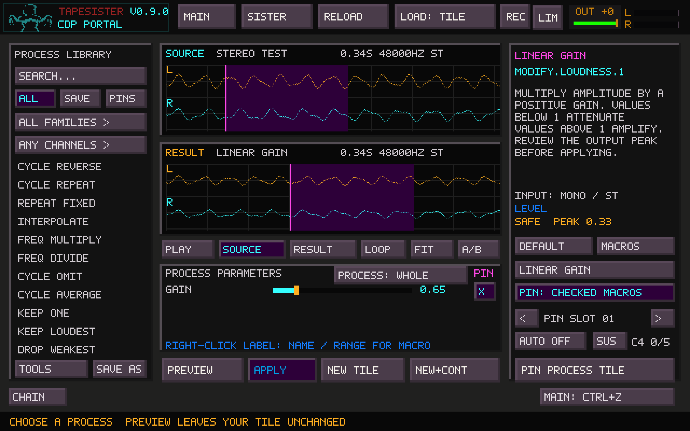
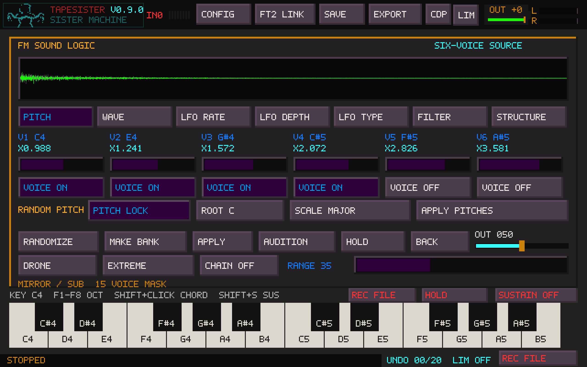
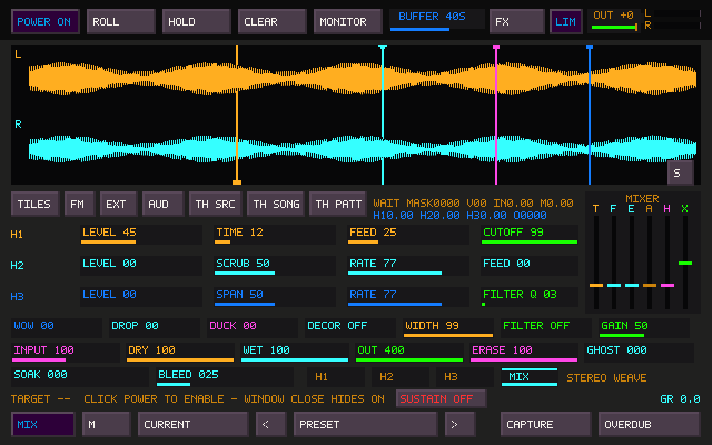

# Native waveform detail

The signal uses the window's actual output pixels. Controls, labels, keyboard,
playheads and other overlays keep TapeSister's 640×400 pixel style. Rendering
changes do not modify samples or processing settings.

At 2560×1600:

| View | Analyzed/drawn detail |
| --- | --- |
| Main canvas | 2,400 audio columns |
| CDP Portal | 1,240 audio columns in each of Source and Result |
| FM preview | 2,384 audio columns, retaining its green trace |
| Sister Machine | 4,096 fixed live envelope bins, reduced to 2,400 columns per stereo lane |

Portal retains independent source/result zoom, selection and audition. Its L/R
colors match the main canvas: amber and cyan. Pointer selection uses the full
window coordinates. Its existing free selection behavior remains unchanged;
the main canvas's pink zero-crossing ticks are not added to Portal.

FM keeps the same whole-preview view. It now caches both its ordinary and
native waveform analysis; playback, note highlights and control repainting
reuse the cache. Publishing another FM preview invalidates it. Portal caches
also distinguish same-address replacements, duration and channel changes.
Closing a view, clearing a result or opening a covering dialog prevents an old
waveform texture from appearing over the new content.

Sister draws an envelope of its live tape buffer. The audio thread publishes a
fixed-size summary using the existing bounded atomic snapshot mechanism. The
renderer does not read or lock the live sample buffer. Redraws retain the
existing 33 ms minimum interval and stop while Sister is hidden. A contended
snapshot retains the previous valid display. Reducing the summary to a smaller
window combines adjacent bins so narrow peaks remain visible.

Tab from Sister hides its fullscreen window before bringing the main workspace
forward. Tab from the main canvas or FM reopens it. Tape processing, effects and
recording continue while hidden. The FM and project-save shortcuts that bring
the main workspace forward use the same hide-before-focus path. Portal keeps
its own Tab A/B action, preset dialogs keep their field navigation, and Ctrl+Tab
still switches to TapeHead. F11 retains fullscreen/windowed switching.

## Performance measurements

Optimized Linux build, SDL software renderer, 2560×1600 output, 60 cached redraws
per view. These timings include base rendering, texture updates and composition,
without waiting for display refresh:

| View | Mean redraw |
| --- | --- |
| Portal | 5.22 ms |
| FM | 4.75 ms |
| Sister, ordinary framebuffer | 3.08 ms |
| Sister, native detail | 6.75 ms |

The initial native Sister path took 11.63 ms. Filling the fully covered part of
each vertical envelope directly reduced that cost while keeping its antialiased
end caps. Sister's native rendering remains within the existing 33 ms interval.

In three paired runs of the effects-heavy 48 kHz / 256-frame callback benchmark,
median mean callback time was 1.613 ms before and 1.624 ms after, a difference
below 1%; all output checksums matched. Runs included scheduling outliers, so
these are comparative cost measurements, not a guarantee against dropouts.
An isolated 5-second-buffer publisher check measured about 4.7 ns/frame before
and 5.1 ns/frame after; snapshot copying increased from about 0.2 to 3.8 us.

## Validation

Native SDL checks cover both Portal views, mono/stereo and duration changes,
same-address replacement, empty results, covering dialogs, full-resolution
pointer selection, FM cache reuse/replacement, and repeated fullscreen Tab
switching. Existing main-canvas crossing tests and keyboard playback tests also
pass. Sister snapshot resize/clear checks and small-window peak preservation
pass. Address and undefined-behavior sanitizers were used; leak checking was
disabled. Real-CDP controller regressions cover chains, macros, cancellation,
stereo selection splicing, Apply/Undo, New Tile and stage caches.

Native screenshots were inspected. An optimized vertical-envelope drawing path
was compared pixel-for-pixel against the original antialiased path in the main,
Portal, FM and Sister screenshots; all four were identical.

Windows compilation, actual desktop focus behavior and physical-hardware
listening remain the user's checks. Container benchmarks do not establish an
X220 or Windows real-time guarantee.
